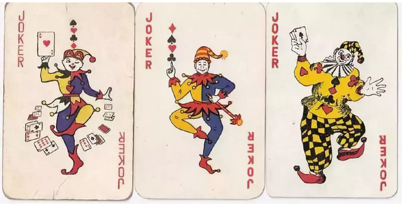
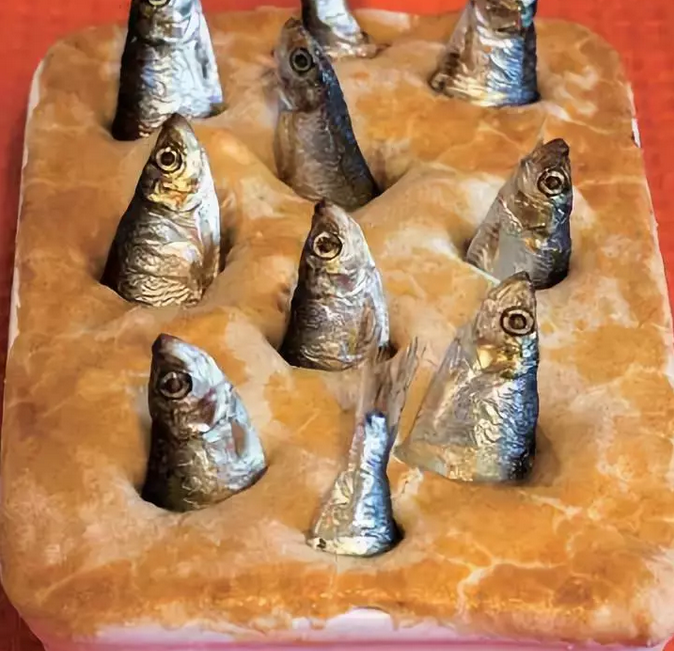
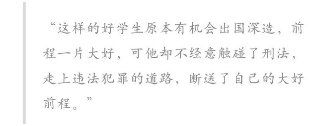
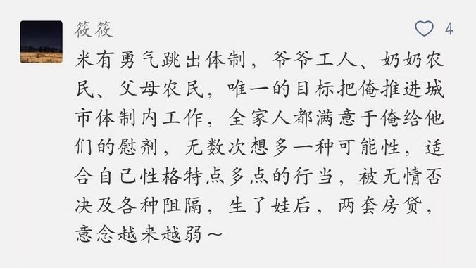
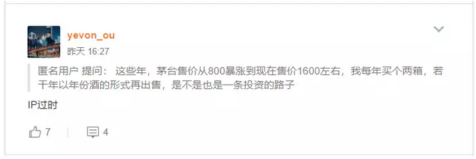

# 中产就是接盘侠 \#F1750

原创： yevon1ou [水库论坛](/) 2018-05-22

中产就是接盘侠 ~\#F1750~

 

中产转身慢

 

 

一）       海河计划

 

这二天，看了天津《[海河计划](http://mp.weixin.qq.com/s?__biz=MzAxNTMxMTc0MA==&mid=2651017719&idx=1&sn=589a8b25d7b3363aec9973ded5cbf382&chksm=807207e4b7058ef29bf81a8f5c52fe31a8b453af2cf5810f58127c4cded458a4639085b38124&scene=21#wechat_redirect)》的方案，还有芸姨写的《[时尚荟萃](http://mp.weixin.qq.com/s?__biz=MzAxNTMxMTc0MA==&mid=2651017633&idx=1&sn=899fed3972d4221125d8f6191da7773b&chksm=807207b2b7058ea48722c4c30058507668dd233e013b92f45657c972e72a2f82ce3bfc23b6bc&scene=21#wechat_redirect)》，若有所悟，突然想到了一些道理。

 

在我们这个世界，其实发生着一个怪圈。头尾相衔。

中产阶级，在努力地模仿着上流社会的一切。从衣着，到饮食，到兴趣爱好的一切。

而上流社会，则努力在"摆脱"模仿。追一步，逃一步。一追一逃。

 

（扑克牌中的大小怪，典型法国贵族的船鞋。目的就是绝不会有农夫穿它）

现代工业社会，生产力极度发达。这就导致普通的消费品，乃至于钢琴，骑马，登山，这些昂贵嗜好，都不再有消费门槛。白领咬咬牙一样能学。

LV包包前台人手一个。

米其林三星，花钱预订即可。

 

为了摆脱中产，"潮流"变更的速度在加快。从太阳王时期的一代人一变，到现在的一年半载就变。

 

 

但是另一方面，我们知道中产和富人是有差距的。

无论眼界，毅力，人脉，可以调用的资源，信息网络，智慧。穷人的弱，是全面的弱。富人的碾压，是全面的碾轧。

 

所以呢，这里面肯定是有点问题的。

并不是简单的"追逐---逃避"游戏这么纯白。

 

 

 

二）       知其然

 

精英了解更深规律

中产只能模仿，拷贝，皮相

 

每个人知识点不一样，每个人生命长度，行动牌数都不一样。 

精英要比中产强一截。这一节在于；

-   精英是"知其然，知其所以然"。

-   而中产是"知其然，不知其所以然"。

  

精英知道一件事。是知道它的来龙去脉。知道它的前置后置条件，知道它的应用场合。

 

譬如说，法国的"法式大餐"，享誉海外，全球1/3的米其林餐厅，位于法国。

但其实，法国的"大餐"地位，因为法国是西欧国家中，最早完成城市化，工业化的。

当时，英国工人还在雾都煤矿中，每周工作7天。吃炒豆子拌鱼骨屑。

而法国却早已进化出了宫廷，贵族社会，无止尽的假发舞会。

至于德国，德意志不存在的。

 

英国菜：《["大象"的舌尖之四：从美食之邦到黑暗料理](https://mp.weixin.qq.com/s?__biz=MjM5NzQwNjcyMQ==&mid=202721309&idx=1&sn=9cc179e596ae831982658bdc376009d3&mpshare=1&scene=21&srcid=05222qF5Ux39bSQARizIxaQA&pass_ticket=9uEp2eGZpbkGJNfwFy9AtkJQdNnfM10L6YDKrg%20vAZTSUs1t8XIQyh6EK6pDMXJC#wechat_redirect)》

但是，到了400年后的今天，法国"大餐"的地位，早已不如从前了。

吃过米其林的人都知道，"不怎么样"。

你今天还以蔚蓝海岸法餐高脂肪高奶油为荣，很Low的。

 

近年来，以澳洲，南非，美国为首的New World葡萄酒攻城掠池，法国意大利Old
World葡萄酒香水一败涂地。

大家都是蒸馏产品，有什么难学的。澳洲阳光更充沛。

 

 

再譬如说，你翻出19世纪的国际文献，几乎所有的外交协议，都是用法语签的。

俺语文课老师讲到此节时，解释是"法语是非常精确的语言，用于国际文书减少歧义"。

狗屁，你看看21cn的联合国档案，几乎所有的重大外交合同，都是用"粗鲁的"英语签的。

 

英语取代法语，其背后的实质，是美国世界霸主的地位。和法语国家相对的实力下降。 

参阅：《[中美《联合声明》一出，法国却委屈地哭了](https://mp.weixin.qq.com/s?__biz=MzA4OTk1MjA0MA==&mid=2674317634&idx=1&sn=8c3363b1356d5b782f5bf6bb062173d1&chksm=8a816305bdf6ea13faec3747f6a3d4f1c88384d60842afcdf6beb9a2820e8346ec363359c048&mpshare=1&scene=21&srcid=0522cMDGnX7QoNT9NJon82MQ&pass_ticket=9uEp2#wechat_redirect)》

 

 

近期朋友小孩读上外，法德日俄，四大语种选修一门。

传统意义上，欧美学生的"第二外语"都是首选法语。

我说别了，您修德语吧。

 

德语好啊，未来的30年中，欧盟主导者肯定是德国。德国是强盛的上升轨，法国是下降轨。

而中国精通德语的人口，特别少。至少远远低于中法交流。

未来如果中德贸易，技术进口，甚至考个德国合规证，律师证。在国内绝对就是稀缺资源。

 

参考阅读《德国为什么一直苦苦支撑着欧元？》

www.zhihu.com/question/28667070/answer/397934829

 

 

这些例子告诉我们什么呢。

-   富人知其然，可以抓住历史变化。

-   平庸的中产阶级，只会继续吃法餐。

 

 

 

三）       出国留学

 

前二天我朋友圈转了篇文章《[赌博网站的骚，闪瞎了我的腰。。。](https://mp.weixin.qq.com/s?__biz=MzU4ODAwNzUwMQ==&mid=2247484236&idx=1&sn=6a90a026d67342622889ab8af81a1662&chksm=fde2126eca959b787403204bd8398222bdc9d053c3b85e44c4ccdb90727118307b8bbc572ba6&mpshare=1&scene=21&srcid=052113Fh1IkMIPLrKQtlkxTd&pass_ticket=9uEp2#wechat_redirect)》

这其实是个"套中套"套路。因为我又转了一次，所以它又多了几千阅读。

而Casino的名字，依然可以从文中拼、搜出来的。

 

真让我觉得有趣的，是其中这段文字。

为什么，为什么三线城市依然把"出国深造"当成一条光明的前途呢。

我们来看一下，一个"中产阶级"家庭的典型套路。

1） 买学区房

2） 读本科，硕士，博士

3） 出国深造

4） 学习钢琴，小提琴，芭蕾

5） 进大公司做白领，以工薪收入为荣

6） 买世界名牌，武装自己

7） 大爱无疆，不生孩子

 

这一切所有的模仿，全部都是坑

 

一架钢琴，至少需要2200个零件。在19世纪，是一件超级昂贵的东西，同时也是富家小姐的象征。

可是在21cn，钢琴已经是中产阶级都能负担的小资物件。钢琴谈得好有什么价值，你想在火锅店门口伴奏么。

 

 

同样道理，1979年"高考"恢复的时候，大学生直接就是国家预备干部。存量稀少。

在粮食匮乏的年代，大学生不仅每月可以领到免费的米和油，而且很容易被提拔到县长镇长。

 

但是1999年"大学扩招"之后，大学生就不值钱了。

今天，硕士，博士，博士后更不值钱。

你父母一心一意让你读学历，也是一个无敌深坑。

 

我们今天的新手村经验，全部都基于父母一辈。

一个人从懵懂到20岁，他是没有时间刷"经验包"的。

他的所有谋生技能，所有世界观，路径依赖，都是传授于他的父母。而你父母国企打工一辈子，坐井就观天。

 

 

作为一个中产阶级，你永远都只可以"窥见"上流社会的生活方式。你其实并不明白，上流社会是怎样运转的。

-   根据你父母的观察，当年的国企领导都是大学生。

-   根据你父母的观察，80年代"洋人"显贵无比。"假洋人"跟着沾光。

-   根据你父母的观察，贵族小姐都是谈钢琴的。

-   根据你父母的观察，外国人都靠炒股票发财。

 

中产阶级只擅长模仿，并不了解事务本质。

他们的技能点数，仅止于此。

 

 

 

四）       接盘侠

 

好了，若我们的文章只写到这里，那还仅仅是对中产阶级的吐槽。和浓浓的"[精英---屌丝](http://mp.weixin.qq.com/s?__biz=MzAxNTMxMTc0MA==&mid=2651017224&idx=1&sn=5ecd7749fc8ca722569950f3189b104c&chksm=8072061bb7058f0d25b632d55021cd2a103ed6c05078db7d06b4c2b59e51057aed509635b7a8&scene=21#wechat_redirect)"鄙视感。

我们想说的是，在某些设计下，中产可以成为"自然而然"的接盘侠。

 

 

举个例子，比如说"邮票"。

邮币卡市场，已经完全崩溃。不仅成交量稀少，而且SOV（Share of
Voice）在主流媒体上也不见踪影。

按照水库专业术语的说法，叫做"[IP已经过时](http://mp.weixin.qq.com/s?__biz=MzAxNTMxMTc0MA==&mid=2651016196&idx=1&sn=ecdfe9c838fdb924d9d095dd2c686f48&chksm=80721a17b7059301ffa24a916e89fceb7e62eff37b18bd617a5af77cc33e4e34d4e9f9e5412c&scene=21#wechat_redirect)"。

 

不管你曾经猴票，一张是卖100元，500元，1000元。

现在不是价格的问题，是根本出不了货。除非几个庄家对倒。否则整版整版的猴票，谁会花100万元买你一些纸片。

 

但是如果你把时针拨回十年，十五年。在"散货"阶段，的确是有大量中产阶级"接盘侠"的。

有的中年眼镜男，工厂里的师傅，留下给孩子，铁饭盒二盒邮票。都是省吃俭用攒下来的。

 

同样的例子，还有红木，茅台，鼻烟壶，蜜蜡，甚至钻石。

然后你再想想，争夺了一辈子，国营厂里的科长职位，文征明的字画，乡镇中心的老房子............

 

 

当一个时代改变时，中产并未改变。

他们依然拙劣地模仿着旧贵族的生活，于是就成了接盘侠。

当他们终于买得起贵族用的"身份品"时，他们就成了接盘侠。

贵族们已经撤了，把土地田契留给你。

Samsung的市值，第一次超过SONY时，你不应该说，"三星是什么东西，索尼帝国如日中天时，他还是个棒子"。

中产阶级的惯性，使你延读了昔日的尊卑秩序，并接盘SONY股票。

今天，三星的市值，已超过SONY五倍。

 

和田玉价格崩盘时，你千万不要说，"哇，以前是贵族用品哎"。

你冲进去，几万元买块玉。现在就是接盘侠。

 

当然，价格崩盘最严重的，还是这位老兄。据说4.5元/斤，肉食价值丰富。

  

 

五）       收割中产

 

我们研究整个投资游戏的收割规律，有点象小时候玩的游戏，"老鹰捉小鸡"。

老鹰捉小鸡，大家还记得怎么玩么。关键是甩尾。

先向左边跑，跑跑跑，形成一个\@圈。

再猛地向右边跑，\@尾巴后几个小朋友，来不及转头，于是就被抓住。

 

在我们真实的世界，中产学富人，中产抄富人。

富人买什么，中产就买什么。富人投资什么，中产就投资什么。

 

赚钱的秘诀，是"猛转身"。

时代变了，红木一文不值，钻石一文不值，迈克尔·乔丹的签名一文不值。

 

当精英阶层抛弃某一类Taste时，中产阶级只会模仿。

来不及变轨，猝不及防，模仿者就成了接盘侠。

 

-   "这块和田玉，以前卖30W的，我特价8W就买到了"。

-   "哎呀，Coach打对折，赶快去抢呀"。

-   "哎呀，天津户口，高考不要太划算哟"。

-   "茅台是瓶好酒，以后可以传一辈子的"。

 

"惯性"和模仿，使得中产阶级是理想的对手盘。

中产天生就是接盘侠。

 

 

（yevon\_ou\@163.com，2018年5月22日午）
