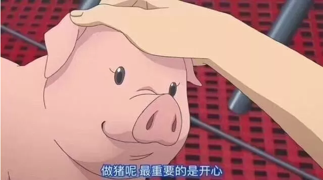
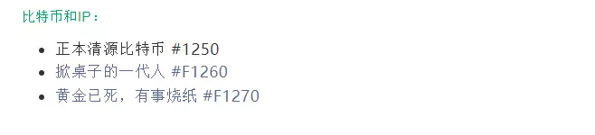
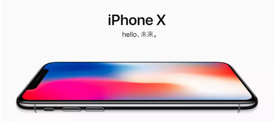

# 怎样判断最后一棒 \#F1760

原创： yevon\_ou [水库论坛](/) 2018-05-25

怎样判断最后一棒 ~\#F1760~

 

〔股市段子〕我还真不明白了，一抛就涨，一买就跌。

那么多股市大鳄，国际基金，你们盯着我手里三五万元干什么呀。

 

 

一）       攻守

 

前天写了一篇焦虑文《[中产就是接盘侠](http://mp.weixin.qq.com/s?__biz=MzAxNTMxMTc0MA==&mid=2651017768&idx=1&sn=742956f39223f9e8d5f112124541e062&chksm=8072043bb7058d2d65adfb2fef3feb7b270938f080f5858b54f3291ef4c03f0118293ee164ed&scene=21#wechat_redirect)》，因为偶然获得一点心得：富人掌握潮流，中产只够模仿。

因此就形成了"接盘"现象。当潮流急剧变化时，中产是来不及转向的。是理想的最后一棒。

 

留言中，愤怒的"接盘中产"骂声一片，群众们纷纷反映："说出了现象，没解决方案"。

如果仅仅吐槽中产的话，近年来的酸文还少么。

 

 

按照顺序，周五的这篇，应该是写"怎样避免成为接盘侠"。会教你一些消费方法，避开商家的营销陷阱，高溢价坑。

你以为水库会这样写么。

错了，大错特错，以上全错。

 

这样写就Low了。关于省钱，掀桌子的一代人，早在"IP系列"，已经写得很清楚了。

 

教你省钱，始终是一种"守"。哪怕你吝啬到一分钱也不花，绝不让商家赚任何便宜。

浑身淘宝货，没有任何挥霍。

这样朴素的人生，活着又有什么意义。

 

当水库意识到"接盘侠"时，我们脑海中闪出的第一个念头，是"怎样赚他们钱"。怎样利用接盘效应，牟取利润。

换言之，想到的是"攻"。

只有想办法赚钱，才能成为A8A9.

 

 

 

二）       品牌

 

为了让大家了解这整套逻辑，我先举个例子。

 

大家都知道，哥哥当年是Marketing出身。MKT的正牌，是品牌经理。

负责一整个品牌的开发，维护，退出过程。

 

对于品牌来说，它是每年都需要"广告费"的。

无论再庞大的品牌，再IB的科技，酒香还是怕巷子深。

 

 

"可口可乐"算NB了吧，家喻户晓。可乐要请周杰伦拍广告，电视轰炸，雪碧晶晶亮透心凉。

Apple大牌公司吧，高科技企业。iPhone
X如果不投铺天盖地投广告，他敢上街卖么。不怕第一天来个冷场吗。

哪怕某些"天生"卖流量的公司，他也需要买流量。例如Baidu。

2016年，百度在电视媒体和写字楼电梯的广告投放，超过120亿。

 

品牌是需要维护的

 

不管你的商誉多大，多有名，多大牌。

你还是需要持续地"维护"。

 

人类的大脑，天生存在一种"遗忘"淡忘功能。广告需要刷存在感。

同时，人口的更迭，20岁生\~70岁死，每年也要替换2%

仅仅是想"维持"住你现有的知名度。你也需要投放大量的广告+新闻。

 

 

中国人从计划经济走来。传统的"计划经济"思维模式，重硬件而轻软件。

重购买而轻维护。

中国人是不明白，哪怕不为了开拓市场，仅仅为了"维持"+刷新，你也需要投放广告。

 

\* 这一段的详细解释，在《广告学原理》\#1640

不过这篇没有电子版。是磨铁出版，为了卖新书《如何获得真正的财富》专供的。item.jd.com/12348516.html

 

 

一般来说，企业的品牌策略，分"进取""维护""退出"三种。

如果你是一个成熟品牌，仅仅想维持的话，这笔钱不用很多。销售额的2\~3%即可。

每年搞一二场活动，制造一二个热点。

 

 

有趣的事，甚至对于某些品牌，你的战略是"退出"。逐渐把品牌做死掉，把剩余价值全部收割（常见于被收购品牌）。

这个时候，你依然需要做广告。部分时候，甚至还要"打反击"。

 

因为你完全不投广告的话，品牌的销量，会呈现"断崖式下跌"。

如果你一分钱广告也不出，只想捞钱和收割，同时也不搞促销和新闻。最多二三年，消费者就会彻底把你忘记。

 

而如果你适当地加以小幅投入，"有秩序地撤退"。你可以把"品牌的榨干"延长到十几年。收益最大化。

品牌的建设和榨干，是一件很专业的事。需要十几年的时间，才能精雕细琢。

 

 

 

三）       小业主

 

我们讲的第二个道理，"小业主"是绝对不会出品牌"维护费用"的。

 

近年来上海房价暴涨。很多楼盘，从100W暴涨到1100W，房东净赚1000W。

你赚了这么多钱，您做一点首谋远虑的事吧。

很多"千万豪宅"，连5元/㎡的物业费都收不齐。

 

你跟物业说一声，花点钱，把外墙刷一下。破损的大理石台阶，稍微修补一下。电梯换新玻璃，新灯。

这些事情都不贵。每幢楼就十几万元。摊到涨幅九牛一毛。

 

而只要你Renew，就会极大地提高你的房屋品质。一跃成为"高档小区"，对于房价估值的提升，何止百万。

 

业委会会干么。如果你和物业经理建议此事，他估计胆都吓破了。

"维修基金"任何超过10000元的费用，使用都阻力重重。

有一群愚蠢的老人，霸占了业委会。甚至还会得意洋洋地说"帮你省钱"了。而这样的人群中，可能包括你妈。

 

 

好了，你再进一步。你要求每家每户，每年掏出10W元钱。占房价1%

不是买硬件，不是物业费，也不是维修基金。

而是拿了这笔钱，到市场上"宣传"本小区。

 

说本小区地段高档，环境优雅，交通便利，尊享豪荣。没事刊二期"新民晚报"全屏，庆祝交房500周天。

雇一堆的网络水军，刷屏点赞编故事。歌颂俺们高档典雅，是上海数一数二的小区，论豪宅必榜上有名。

 

你说，这样"户均10W元/年"的议案提出来，有没有可能执行。

别人是当你疯子呢，还是当你傻子。

 

品牌维护只有KFS能做，散户不能做。

 

这就是我们提出的第二个bug：

-   产品到了小业主手里，就会停止品牌的维护。

-   品牌一旦停止维护，商誉就会断崖式下跌。

 

"汤臣一品"为什么现在还在刷屏。因为它还没有卖完呢。

 

 

 

四）       资产的实质

 

我们再看第三个领悟点："资产是什么"。

 

我们今天买的一切"资产"。归根到底，都可以拆解成：实用价值+IP。

例如：

-   红木=椅子+红木信仰

-   燕窝=粉丝+燕窝信仰

-   房子=土屋+地段信仰

-   Birkin=蛇皮袋+包包信仰

 

如果刨开最基本的"实用需求"，今天我们花出去的钱，我们所购买的资产，很大一块都是"IP溢价"。

 

 

钻石，如果没有杂七杂八套在上面的"附加值"，它就是一块石头。而且还太小，不便使用。唯一的用途是划玻璃。

 

出国留学，University别称"由你玩四年"。英澳大学也学不到什么真材实料。最主要收获是一张"文凭"。海龟值多少钱，见仁见智。

 

 

当我们进行投资，当我们支出金钱，并祈求升值回报。

对于那种买进卖出博差价的东西，原理十分简单，它蕴含的IP是否增加了。

你可以把IP想象成"品牌管理"，这二者之间的道理，其实是相通的！

 

-   品牌一定要有人维护，否则就贬值。

-   资产一定要有"庄"，否则就走下坡路。

 

 

当你去买房子时，"开盘"那一天，是件大事。彩旗飘扬，锣鼓喧天。请二个韩国女团在门口跳舞。规格高一点的，甚至会有范冰冰。

这些都是要钱的。很多钱。

 

一手房开盘疯抢，当你把这些房子买回家以后。你会惊讶地发现，KFS所谓"稀缺地段，万众瞩目"，开盘时的千人疯抢，猛地都不见踪影了。

二手房市场高高举杠铃。无人问津。

为什么。

 

-   大业主才会维护IP

-   小业主绝不掏钱

-   因此二手房，永远卖不出一手的疯抢

 

有500套房子待售，人家才会卖力地搞一场"开盘"大型活动。

从你入住那天，整个小区的"商誉"，就开始走下坡路。

小业主各位，有花过一分一毫，维护小区的品牌么。

 

百事可乐如果裁撤"市场部"。他还会是最受欢迎的饮料么。

百事的销量和知名度，可以死撑多少年？

 

 

 

五）       资产升值

 

虽然我们举了一个"一手房开盘"的例子，但是道理都是相通的。你也可以推演出去，扩散到各种资产类别。

 

包括但不限于：

-   子女学弹钢琴

-   海龟文凭

-   国企铁饭碗

-   书法，字画，唱歌等能力

-   钻石，红木，黄金

-   古董

-   限量版手办

-   手表

-   茅台

-   乔丹的签名

 

"钢琴"这项才艺，如果要能升值，必需要有一个人，不遗余力地在中央电视台，各大新闻媒体，再三推销强调"钢琴是贵族的代言品，论学钢琴的重要性"。

在流量如此昂贵的今天，谁肯出流量费，保你女儿矜贵，这是一个大问题。

 

"海贼王"的限量版手办，能不能升值。关键看"海贼王"的漫画电视，在中国能不能放映。会不会极大增加粉丝基础。

在眼球争夺激烈的今天，很难。

 

至于什么"奥运纪念金银币""航天纪念币"。人家造出来，就是为了卖的。卖了以后，逃得比兔子还快。

指望以后有后续的"宣传""推广"，使得纪念币知名度大增，让你手中货物出名升值。

想也不要想啊。

 

也是有免费流量的。下周水库会免费为"饭统戴老板"写一篇软文，度身定做。

起因么，哥哥打斗地主连输八把。脸上纸条都快贴满了。戴老板牌技厉害。

 

 

 

六）       结语

 

只有极少数的资产，当产权转为你，商家还会再提供"宣传""推广"。

这简直就是为你抬轿子，活雷锋。

 

这种资产，要极度小心，精挑细选，偶尔才能遇到。

绝大多数资产，当你买进时，就是最后一棒。

 

 

这就回答了地产界，知乎上的一个千古难题：房价何时会跌。

答：房子在KFS手中时，它永远涨。当它转入你名下，就开始跌了。

 

 

 

（yevon\_ou\@163.com，2018年5月25日丑）

 

 

我知道你们一定会追问，现在房子算不算"最后一棒"。

周日来参加北京功夫财经的财智会，我告诉你啊。
