# 几类投资市场的分析　\#F1770

原创： yevon\_ou [水库论坛](/) 2018-05-29

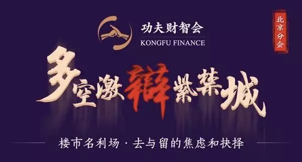

几类投资市场的分析　~\#F1770~

 

根据2018.05.27《楼市名利场·巅峰紫禁城》演讲稿改写。

约4400字。有删减。

 

 

一）       投资市场大类

 

延续《[中产就是接盘侠](http://mp.weixin.qq.com/s?__biz=MzAxNTMxMTc0MA==&mid=2651017768&idx=1&sn=742956f39223f9e8d5f112124541e062&chksm=8072043bb7058d2d65adfb2fef3feb7b270938f080f5858b54f3291ef4c03f0118293ee164ed&scene=21#wechat_redirect)》\#F1750

《[怎样判断最后一棒](http://mp.weixin.qq.com/s?__biz=MzAxNTMxMTc0MA==&mid=2651017792&idx=1&sn=72724952d7e8b7125cc9c9da941b1794&chksm=80720453b7058d4594b10c948929b896f39057bc6a22f28e421f1e7746ee660bb7b13982fe04&scene=21#wechat_redirect)》\#F1760

 

上周刷了二篇100000+，讲了一个"[IP](http://mp.weixin.qq.com/s?__biz=MzAxNTMxMTc0MA==&mid=2651016196&idx=1&sn=ecdfe9c838fdb924d9d095dd2c686f48&chksm=80721a17b7059301ffa24a916e89fceb7e62eff37b18bd617a5af77cc33e4e34d4e9f9e5412c&scene=21#wechat_redirect)"的道理。

我们买卖资产，绝大多数时期，都是"超出"使用价值的。例如你掏几百万元买一张古画，其欣赏价值，或许还不如色彩斑斓的仿制品。

 

在这样的情况下，你希望你的"附加值"能够保值升值，你就必需要使得艺术品的"名气"越来越大。

 

例如，单纯以艺术成就论，明代的画家，唐寅或许还不如沈周，仇英。

"唐伯虎"之所以如此出名，和评书传记《唐伯虎点秋香》在民间流传，是分不开的。

1993周星驰作品《唐伯虎点秋香》，则更将这个IP推向了一个高潮。影响了整整一代人。

只要我们这代人，还没有死去。"唐伯虎"始终是一个金字招牌。

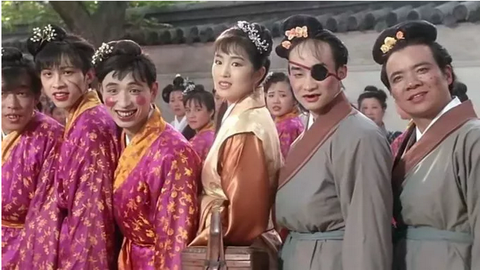

等我们死绝了，没有我们"文化"的继承人。相应我们喜欢的纪念，我们珍藏的艺术品，也都没有了价值。

多年以后，还有谁记得"詹姆斯·迪恩"一个签名，竟要卖1.8万英镑呢。

 

 

今天我们非常有幸，有几百位观众来到《[功夫财经](https://mp.weixin.qq.com/s?__biz=MzIzOTA3NTA5Mg==&mid=2652454086&idx=2&sn=c84f35258dc9b60c4af8b8fda81812fb&chksm=f2c236bdc5b5bfab7fe1c74dfdd50282fb09f84a3213d700734a509d446b1058f5e27803c41d&mpshare=1&scene=21&srcid=0528dgpC90R3ieobMEu2mR8S&pass_ticket=mCoH%20TyW10hjfAR59I/9nxXvRei04JPE9e0PGQluKP9NXTfHuQroLeul1iBOwyDN#wechat_redirect)》的现场，听俺们磕叨。

在门口，有yevon\_ou签名版的新书，供各位抽奖。

 

在将来的岁月中，如果yevon\_ou越来越有名，渐渐成了大师。

则各位手里的"签名本"也会保值增值，溢价上涨。

所以，各位一定要多多宣传、推广"水库论坛"哦。

 

言归正传，我们来讲讲，有哪几个"资产类"市场，资产的名气是长青的。是有人抬轿子的。

-   钻石

-   红木

-   蜜蜡，手串，沉香

-   地段

-   学历

-   公务员的身份

-   属羊

 

 

 

二）       大力水手和科学怪人 

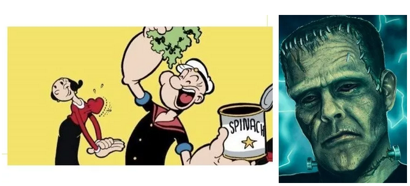

在欧美市场，曾经有一些非常"流行"的时尚元素。

典型如弗兰肯斯坦在1818年写的《科学怪人》，讲的是一个"碎肉"拼起来的生物，被科学家赋予了生命。

 

这个IP是如此地受欢迎。以至于它和吸血鬼，狼人，科学怪人，一起构成了"三大魔幻"。甚至有人专门拍了驱魔人电影《范海辛》。

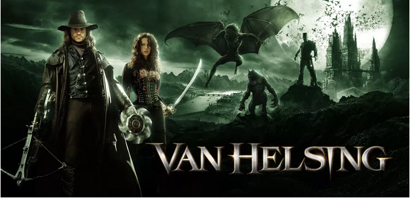

但是，1818年的"著作权"，早已过期。

现在的大企业，迪斯尼和漫威，还有兴趣继续推广"科学怪人"么。没有。他们宁可推自己的"复仇者联盟"。

 

哪怕拍"吸血鬼电影"，也要打造自己的英雄IP"范海辛"。是范阿姨，不是所有的吸血鬼。

 

如果没有大型主力，仅靠民间自发。是不会产生持续的IP繁荣的。

 

更典型的例子，是这个。

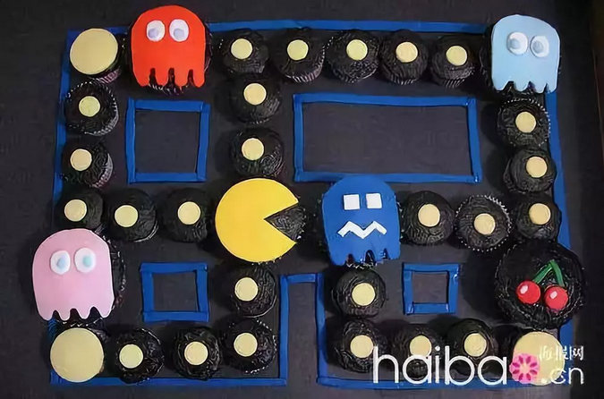

作为最早的 "风靡全球"电子游戏，PACMAC是如此地成功，如此地深入人心。

几乎每个乡村俱乐部，都有一台游戏街机。

 

它的粉丝，自发地组成了"全美游戏联盟""全美PACMAC巡回赛"。赛事持续了三十几年。

哪怕有数百万人口，深入人心的喜悦。

纪念品会升值么，衍生品会升值么。

PACMAC世界官军，会象F1拿数亿奖金么。

不会。

 

-   组织才是力量。

-   没有组织，就没有力量。

-   离开了组织，就是一盘散沙。

商业是严格的组织化。要以Marketing为核心，有针对地运营。

几万溃兵，打不过建制二个团。

 

 

 

三）       佛系比特币

 

好了，现在我们来讲第一个实战案例：BTC

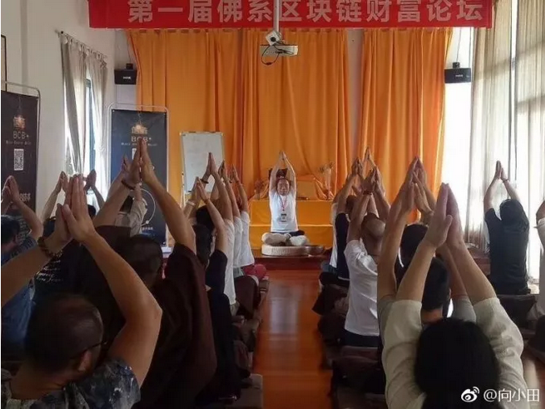

比特币一冒出来。有过Marketing经验，市场部品牌经理，立刻就觉得不对了"这玩意绝对无法成功"。

 

经营一个IP，和经营一个品牌，原理是一样的。

哪怕神仙水，八星八剑，小罐茶，你要Buy In一个概念，一定是需要宣传的。

 

你想让全国人民，都不买象牙制品。

你就一定要在地铁火车站，铺天盖地地投李冰冰的广告。

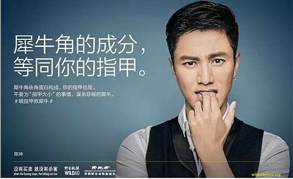

(水库严格反对环保广告，文化侵略。见[\#F1150](https://mp.weixin.qq.com/s?__biz=MzIyMjc0OTMzMQ==&mid=2247484005&idx=1&sn=1c47e4c2a008dd836e20075d7ffbb997&pass_ticket=mCoH%20TyW10hjfAR59I/9nxXvRei04JPE9e0PGQluKP9NXTfHuQroLeul1iBOwyDN&scene=21#wechat_redirect))

 

做市场营销的，最重要是Marketing/Sales二个方面。

-   Marketing是总部层面的。

-   Sales是落地分销。

 

例如知乎上的小白，纷纷总是说"小米"是世界上最好的手机，跑分遥遥领先，性价比高。

而OPPO/Vivo高价低配，落后好几个身位，大学生颇为不屑。

 

但事实情况是，2017年科技界[一件大事](https://mp.weixin.qq.com/s?__biz=MzIyMDE5OTYyMw==&mid=2651048504&idx=1&sn=cc3819c54157b768d4f3dd561f3dba1e&chksm=8c38c590bb4f4c864cef20bdf7aa4579d22f6ab486f146fe6cddadf9d12ecfce5e506f0b10f6&mpshare=1&scene=21&srcid=0528nNUIptKAnRyTMROoWGMt&pass_ticket=mCoHPechat_redirect#wechat_redirect)，Oppo/Vivo销量远超过小米。不仅销量超过，每台单机利润，更是暴利/微利。

段永平才是"手机业"大佬，才是真正的经营之神。

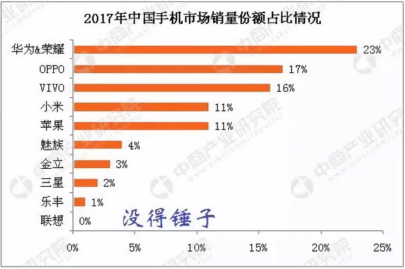

那么，O/V赢在哪里呢。

赢在"地铺"。

 

不管是三四五六七线，一个个城市铺过去，一家家步行街铺过去。

到每一个娄底，思茅，个旧，这些你完全叫不出名字的城市，

招商，找当地经销商。找铺子，谈租约。找师傅装修专卖店，然后还要派巡视专员，定期考核服务品质。

 

这些细水磨合的工作，都是加在"手机售价"之外的。

你买手机的时候，是绝对不会想到，还付了商铺店租的。

 

 

好了，现在问题来了。BTC面市的时候，中本聪的理想，是构建一个"去中心化"，完全用户平摊，没得所有人的制度。

在这样的"去中心化"，谁来付市场推广费用呢。

 

-   谁来包下地铁广告，请李冰冰做代言

-   谁在CCAV竞标标王，承担电视广告。

-   谁搞无数次"研讨会"，请专家教授组，专程去海南度假呢。

 

 

马云爸爸刚开始推"支付宝""微信支付"时，力度不可谓不大。

滴滴促销全免费，都搞了几轮。

支付宝买单，动辄满99减50，优惠券派到手软。"请杭州人民卡拉OK"都喊出来了。

 

"第三方支付"能有这么大的市场份额。和前期天价海量的推广费用，是分不开的。

光"接单"促销员，就招收了几万名。连煎饼果子的大妈，摊口都有一个"打印"平整的收款二维码。特制胶皮，防水，防晒，你注意到没有。

 

"桌边付"量身定做，铺了几万家餐饮店。

这些都是靠"阿里小哥"一家家谈过去的。背个蓝色小包，手把手教会老板娘使用收款码。一张张贴纸，手牌，还有繁琐的客服。

 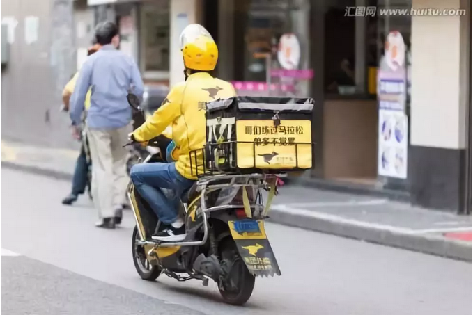

而你"BTC pay"什么时候才会成熟。

我们悲观地认为，不会有商家接受比特币作为货币。BTC永远不会触及几千万人。

搞个几十家店，都算新闻了。

 

因为"市场推广"这笔费用，是没有人支付的。

大家都是小股东，何苦为别人做嫁衣。

比特币注定不会有电视广告，培训研讨会，地接地推。

 

也就是区块链，以及一切的"去中心化"货币，注定是失败的。

 

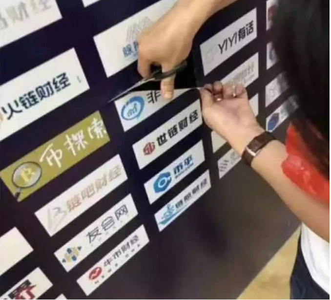

昨天"博鳌区块链事件"搞得轩然大波。

但是大家仔细观察，现在所有的"业内份子"，讲的都是区块链了。再也没人讲"比特币"了。

 

为什么，我不想给你抬轿子啊。

搞这样一场区块链大会，成本高昂。又是租借场地，又是迎送接待。到场一千人，人均五千成本都打不住。

 

既然这样，"研讨会"到最后，肯定是卖自己的"山寨币"。

怎么可能卖你的币呢。

每一个展示位都是钱好不好。

 

你又不会斗地主连输八把

 

比特币是注定完蛋的。没有人会帮你抬轿子。

连佛门，都开始搞"佛系区块链"。

 

 

 

四）       楼市

 

第二个例子，我们举楼市。

各位付费来听《功夫财经》的课，当然是希望我们讲房子的。

 

 

对于房地产市场，天天有人问，"房子在KFS手里不跌，屌丝买了就跌"。

那现在算不算最后一棒呢，楼市怎样判断。

www.zhihu.com/question/276591262/answer/400281815

 

很简单，我们看一下目前的政策与导向： 

-   租售并举

-   共有产权房

-   二次房改

 

中国从1995年中期，开始"房改"化进程。大规模地商品化。

可是"商品化"搞了几十年，**有人**觉得吃亏了。

 

"通货膨胀"就是从全社会抢钱，所有用纸币计价的资产，无差别贬值。

偏有人靠着"不动产"，躲过了通胀的洗劫。居然有人想逃。

有关部门看见民间财富增长，"房子"升值几十倍，**眼睛都绿了。**

 

 

现在的政策指向呢，"土地是好东西，我不卖"。

象土财主一样，裹得严严实实的。恨不得你完全去租，那就是0%的产权。

要不就是"共有产权"，你拿一半50%。

 

以"雄安新区"为例。雄安出台之夜，不是清理"过时"的管制法规，创造"创新"法制的自由社会。

"雄安"的第一条命令，居然是冻结一切房地产交易。

 

哎哟我的地主老财啊。

"雄安"是不是想要永久性的放弃房地产？绝不是。

正好相反，雄安是[非常非常]乐意"土地财政"的。

 

只不过，要等雄安的CBD都建成，各项配套炒作宣传到位。

等他一开盘时，第一手就是100000+/m.

吃尽了所有剩余价值之后，再卖给你。

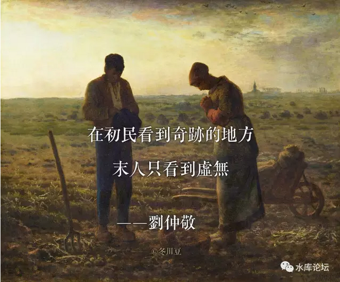
 

做投资，要看大势。

现在的大势，是不是ZF已经把所有的土地都卖完。然后急着剥夺土地上的附加价值，剥夺学籍和户籍特权么。

不，正好相反。

 

现在处于紧缩供地，zf拼命收回筹码的阶段。

 

这种阶段，怎么还会有人看不清。

-   大涨前夜

-   大庄家吸筹，洗筹，拉升。

 

哥哥洗杯子去了。下面是"水库2019"备份号。各位一定要多关注备份号。防失联哦。

本文篇幅较长，估计约4400字。

大家可以先看一段视频。休息一下。

+------------------------------------------------------------------------+
| v.qq.com/iframe/player.html?vid=t06676udwe8                            |
|                                                                        |
| } |
+------------------------------------------------------------------------+

 

五）       学区房

 

"始妾事其父，时为将，身所奉饭饮而进食者以十数④，所友者以百数，大王及宗室所赏赐者尽以予军吏士大夫，受命之日，不问家事。今括一旦为将，东向而朝，军吏无敢仰视之者，王所赐金帛，归藏于家，而日视便利田宅可买者买之。王以为何如其父？父子异心，愿王勿遣。"

 

这段话，是讲"长平之战"赵括的。

 

当时，赵王听了秦王的反间计。派赵括为大将。

赵括他Mum听了，连忙去皇宫找赵王，说"赵括不可为将"。

 

理由是，以前Father赵奢当大将时，爱兵如子。朝廷有什么赏赐，都是尽量分给将士，自己留下很少。所以将士齐心。

而"赵括"这个人，是个小气鬼。喜欢"独吞"。王赏赐的金银，一个人藏回家，吃独食。怎么可能不失败呢。

 

（赵王不允，但赐赵母免株连，免死）

 

 

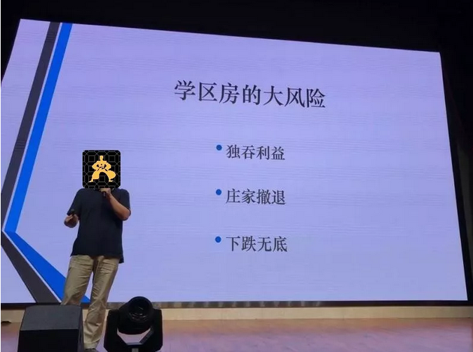

我们这个世界，我了解得越多，越觉得时事艰辛。

一家店铺，绝不是你小菜烧得好，餐饮就可以赚钱的。

工商，税务，卫生，消防，环保，街道警察，一定得方方面面都摆平了。生意才能做下去。

 

做任何事情，一定要记得"将士分享"。

利益均沾的事情，才会有人帮你抬轿。胸襟越是宽广，生意才能做得越大。

 

买了学区房，妄图它长期升值，是极端愚蠢的人

 

如果你在北京西城区，30㎡1200w，买了一套"知名"学区房。

你指望学区房继续升值，1000，1200，1500，1800，躺在那里睡大觉，有人乖乖奉上劳动血汗，供你升值。

你独吞了所有的利益。

 

老师，学校，教委，城建，甚至税收交易所，其他人分到钱了没有。

没有。

你独吞了所有的利益。

 

 

老师辛辛苦苦提高"教学质量"，爱莘如子。把一班顽劣不堪的孩子，培养成好苗子。把中产孩子培养出眼界。

老师赚钱了没有，加工资了没有。没有。

 

学校赚钱了没有，涨学费了没有。没有。

 

教委赚钱了没有。卖择校名额了没有。没有。

 

你象美国人一样，交高额的"学区税"，养地方城建了没有。没有。

甚至连频繁的交易性税收，营业税+契税，也没有。

你连物业费都没交。

 

教师+学校+教委+工商城建+税收财政，所有人都没有拿到好处。

那注定是什么结果呢。大家一起来掀桌子。

 

 

IP没有庄家，别说抬轿子的人，就连"看守"轿子的人都不足。

三岁小娃，持百金行走于市。结果会怎样，会有人"抢"你。

 

-   今年，北京西城区"重新划片"呼声出来了。

-   海淀区西二旗"码农子女"崛起了。硬生生把一个平民小组，升级刷到了重点小学。

-   对于有钱人，他们更喜欢读国际学校，私立民办。也没什么兴趣接盘"1200w，30㎡"

 

就"学区房"小业主们本身，他们的组织呼声也是分散的。

甚至都不愿意每年拿出1%的资产，组成游说，组成行业协会集团。

 

 

势如累卵，势如累卵啊。

 

怎么看，都象是最后一棒

 

只要"学区"政策稍微一调整。不再和户籍，学籍挂钩。又或者民营办学更放松一点。

甚至哪怕什么都不做，"西二旗"码农再多几年时间。

西城区的学区房，分分钟崩溃。下跌无底啊。

 

 

象这种30㎡，1200w的房子。如果刨去了"学区"的概念，谁会去住污水臭虫旧破房子，盲流民工么。

单纯卖"房子"，北京瓦房老破小，能值多少钱。50W，还是100W。

 

学区房有跌去－90%的风险。

上升下跌，风险完全不对称。

 

\* 本人不持有任何北京学区房。子女就读国际学校。

 

 

 

六）       结语

 

今天逻辑有点难，篇幅有点长。

 

感谢各位陪我听到现在。感谢《功夫财经》，感谢主办方。感谢祖国，感谢领导，感谢人民。谢谢。

 

 

 

（yevon\_ou\@163.com，2018年5月28日晚）
