# 团结起来，反抗邪恶的头条 \#F1780

原创： yevon\_ou [水库论坛](/) 2018-05-31

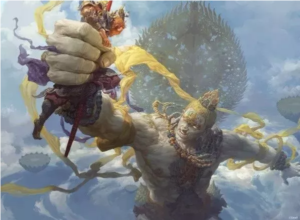

团结起来，反抗邪恶的头条 ~\#F1780~

 

 

-   抖音的小姐姐，可以赚钱么

-   《今日头条》会成为高质量发布平台么

-   媒体平台，价值都是平等的么。

 

基因决定命运，平台并不相同。

 

 

 

一）       署名权

 

近期，哥哥的朋友圈，转载了大量的"抖音""微信""微博"商业模式的分析。

若有所悟，写下此篇。

如果想看yevon\_ou朋友圈有哪些文章，请关注备份号："水库2019".

 

世间熙熙，皆为利来，世间攘攘，皆为利往 \-\-\-- 《孟子》

 

 

首先，我给大家举个例子。

假设你是一名青年作家。写了一篇短篇小说，给出版社投稿。

-   一家出版社A说，"稿费3000，署你的名字"。

-   一家出版社B说，"稿费3000，不可以署名"。

请问，身为"青年作家"，你会选择哪家出版社。

 

很显然，除非你脑子被枪打了。否则99%的正常人，都会选择A。无论如何，要把自己的名字写上去。

 

 

为什么，因为"名"就是利。名气大了，利润也会高。

出版社给你的回报，其实是二部分："名"+"利"。

-   金钱的回报，是3000元。

-   名气的回报，是署名权。

 

只要你不断地在杂志上发表刊物，你就会渐渐地变得更"有名"。

不仅家乡父老，会认识你，扬眉吐气。而且在学校评职称，提干部，也是大大好处。

"名气"大了以后，甚至稿费都会水涨船高。例如象王蒙，铁凝这样的作家。一篇文章，就可以卖很多很多钱。

 

 

如此浅显的道理，如果把"水"稍微搅浑一点。许多人就不认识了。

来源：[画生的八字空间](https://mp.weixin.qq.com/s?__biz=MzIzMzE5OTYyOA==&mid=2654653994&idx=2&sn=6832bd04c8d4e3369859eb2df4fd19f8&chksm=f3472f49c430a65f2817bc49b6db1dc6286880f7b19e80deeb042bf55aa41ae87f40069fd330&mpshare=1&scene=21&srcid=0413O2uuWDB2cqlEITV7NNX1#wechat_redirect)

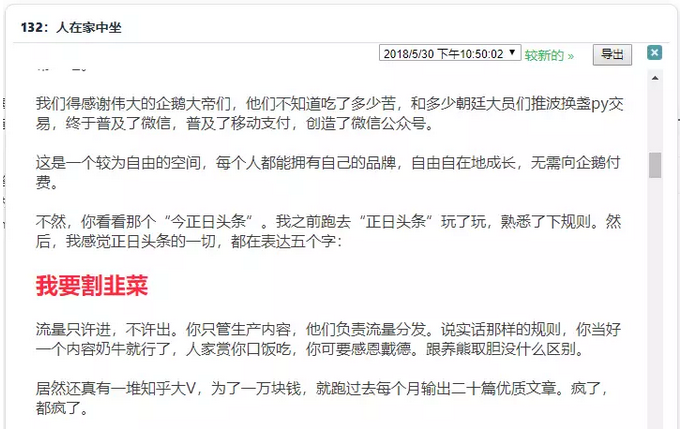

  

"头条系"是个帝国。

-   你以为你有署名权。

-   其实你并没有署名权。

-   一切的流量，都在老板张一鸣手里。

 

 

 

二）       饭统戴老板

 

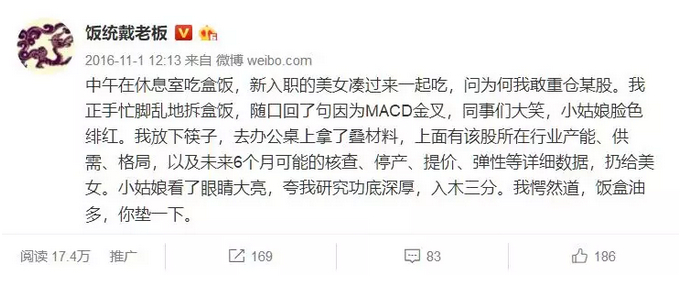

如果你去青岛撸串，你千万要关注饭店老板。

在他微疏的地中海顶下，藏着或是深不可测，扫地僧的实力。

 

戴老板姓代，祠堂里丁甲却是"戴"。老人也说不清楚哪个Dai

他曾经想注册"军统戴老板"。

大智慧却改成了"饭统戴老板"。

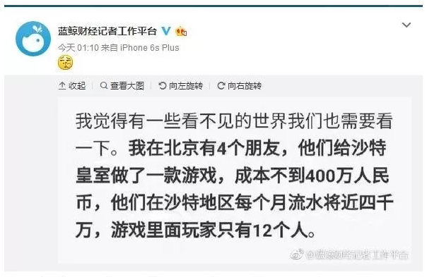

戴老板是一个作家。薪水很高。在他的鼎峰时期，粉丝数甚至达到了前无古人的：

9人。

因为戴老板的本职工作，是基金公司研究员。

而任何一份《行业研究报告》，阅读数都不可能超过二位数的。 

 

（有钱人的世界，你永远都不会懂）

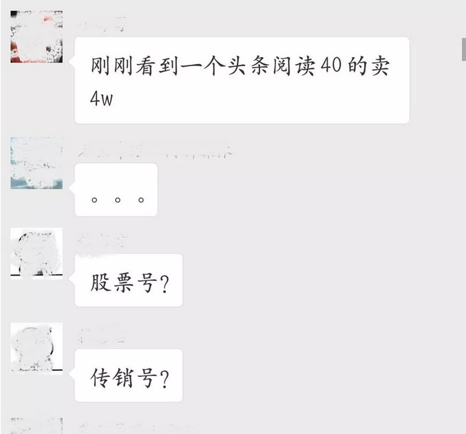

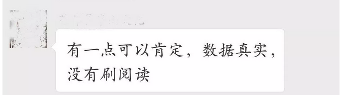

 

有一次，戴老板和人打赌。

对方羞辱他，说他一辈子的阅读数，都不可能超过碗里的米。

 

戴老板火了，是时候展现真正的技术了。

于是他写了篇《[内存的战争](https://mp.weixin.qq.com/s?__biz=MzI3MjYxNDcxNA==&mid=2247483686&idx=1&sn=51e388a0d0e3cbc842df27955df266e1&chksm=eb2e9573dc591c65e5d126693aad09d7c211ac95ef02db1dde89468b719eb9af4f5967fa2598&mpshare=1&scene=21&srcid=0530bAHp9sVJNrhu0sjUJZHi&pass_ticket=2vvwY#wechat_redirect)》

从3000粉丝的"冷启动"状态，一口气刷了200000+阅读。

 

O大，你第一个2W粉，用了多少时间。

O大，你第一篇100000+，用了多少时间。

yevon\_ou冷漠不语，默默往脸上贴了一张纸条。

 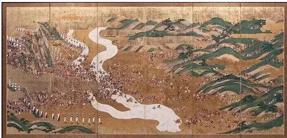

此后，戴老板一发不可收拾，一口气写到了\#38

卅八篇文章，卅八篇100000+

他在2017-10-21才开的新号，不到半年，就冲入中国一百强。篇篇精华，篇篇刷屏。

 

《[悍匪与巨富：香港风云四十年](https://mp.weixin.qq.com/s?__biz=MzI3MjYxNDcxNA==&mid=2247484023&idx=1&sn=36fdd1e8d7a59b56cfd7c21a5204a380&chksm=eb2e9622dc591f3425d7f88bfc710dc4ee4c4611b4cd5cf5d34fb38a57656baf1a1eb64c3324&mpshare=1&scene=21&srcid=0531Gmo7ZVPCZH4CNfVUCYhy&pass_ticket=2vvwY#wechat_redirect)》

《[砖家防打脸指南](https://mp.weixin.qq.com/s?__biz=MzI3MjYxNDcxNA==&mid=2247484040&idx=1&sn=0323894fc3050e017f67bec575f3e3c8&chksm=eb2e96dddc591fcb0c8225e8ec9ade63c6ea5cebad040fef362bcab03aa9865a1836a38103fc&mpshare=1&scene=21&srcid=05315AhlBHHFKrvSNOKRd53c&pass_ticket=2vvwY#wechat_redirect)》

《[漫威英雄的复印者联盟](https://mp.weixin.qq.com/s?__biz=MzI3MjYxNDcxNA==&mid=2247484070&idx=1&sn=58c44f7272d883bd5faae0e9ae07ec65&chksm=eb2e96f3dc591fe57fb7525faba74fc61906cb950fb871fa358c5778bd7c8ee36d0e9a2de825&mpshare=1&scene=21&srcid=0531nRJvCo586rwDMWL2fl9X&pass_ticket=2vvwY#wechat_redirect)》

 

有一次戴老板，拉着哥哥去"佛系撸串"。

上到小番茄（圣女果）时，戴老板和哥哥都哭了。

"拿下，拿下，这堂堂日月，朗朗乾坤，怎么还要吃人参果呢\-\--阿弥陀佛"。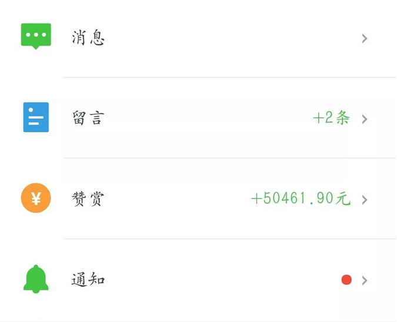

这件事，懂的自然懂。

做自媒体的，如今最怕就是这个小红点子。戴老板平均每隔十分钟，要看一下手机。神经质到脖子都拧了。

你知道，"包邮区"的兽爷么。

"知道啊，怎么了"。

"唉，别提了，心脏病发。抢救"。

 

"什么情况"。

"说是有一个小V，不知道发什么神经。把每一篇文章，都给兽爷开白名单。求转发"。

"于是兽爷的系统通知，就不停地闪"。

"前前后后，一共闪了254次"

 

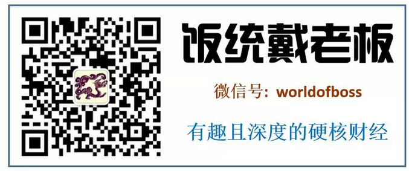

 

象"饭统戴老板"这样账号，精才绝艳，

放在"头条系"，却是要被剥削虐死的。

 

 

 

三）       头条系

 

粉丝喜欢一个作者，是因为作者优秀。

粉丝追随优秀的作者，可以节约搜索时间，获取优质内容，降低噪音成本。

 

为什么要"署名"。"署名"相当于一种商标。

"饭统戴老板出品，必属精品"。

"认准这个胖子，他一定很有才"。

 

 

我们设想一下，假如一个出版社，完全"禁止"作者署名。

不管你再好的文章，只能留"出版社"的名字。

就好比博导、教授剥削研究生，手下的人拼命地干活。但最终的论文，全部都是老教授的名字。

 

-   你让我写署名文章，3000元够了。

-   你让我写不署名文章，10000元才够。

出版社剥削了作者，把"名气"，由"追随作者"改成了"追随出版社"。

 

 

名就是利。在这个江湖上，控制了名，就控制了利。

"今日头条"这个生态，用户们是冲着"头条"去的。

 

每一天，头条推送的质量，会有起伏。有可能推送的，并不是"第一流"的作品，而仅仅是"第二流"的。

 

用户会有感受么。会有的。

但这个感受的降成，会很轻微。大致就是100分，降到90分的样子。

忍一忍，还是可以过的。

 

 

但是另一面，《今日头条》的老太婆，就可以用高八度的音调，指着戴老板的鼻子说：

"你凭什么要10万/月的酬劳，学其他屌丝，拿2000元/月稿费知足吧"。

 

如果你当年没有追逐"名"。

一个无名人士，当然只能接受无名人士的待遇。

"今日头条"回报，是所有平台中最低的。每一万阅读只有十几元，有道理的。

 

 

 

四）       大怪兽沃尔玛

 

我们举一个美国的例子。"今日头条"的市场模式，在美国早已有之。Marketing出身人士一看便知，这玩意不能碰。

 

在美国，和《今日头条》最类似的，是Walmart。

Walmart是零售业，销售额巅峰期，占美国零售总额的1/3，超市遍布美国大小城市。

 

 

超市这一行，有一个特征。

当用户冲进超市，他是来买"洗衣粉"的。洗衣粉是一个很强的冲动，否则就没法洗衣服了。

 

但是，客户买哪个牌子，哪种型号的洗衣粉。差别并不大。

美宝莲和夏士莲，不都是莲么。

不管哪个牌子，最终都是卖了2公升。

 

 

超市业不在乎，可是对于制造商，就是生与死的区别。

你把超市里所有的雕牌，一夜之间换成纳爱斯。超市利润最多差几万元。但肥皂"区域总"，公司几百号人，就可以去跳楼了。

 

也就是"超市业"是绝对甲方。他想让谁上，就让谁上。

想让谁完蛋，就让谁破产。

Walmart随便来一个底层科员，俺们"全球副总裁"都要到电梯口迎接的。

 

 

因为Walmart掌握了流量，掌握了绝对入口。

Walmart对于制造商的压迫，也是十分惊人的。

 

它每天虐你千百遍，动不动就是撤柜。搞到最后，整个轻工业"制造业"，净利润无限接近于零。

甚至美国人喊出了"放弃制造业""制造不如流通"的口号。

 

是Walmart，榨干了美国轻工业最后一滴血。

 

 

《[抖音盛宴：收割一个新流量帝国 \|
深氪](https://mp.weixin.qq.com/s?__biz=MzI2NDk5NzA0Mw==&mid=2247511615&idx=1&sn=ff76d389a03e0feb0acc71815ac8aac3&chksm=eaa6ffe3ddd176f506363e893531419829a02c6adde8c25e753d1e7c88d97b8766903359c423&mpshare=1&scene=21&srcid=0528qUl2rS9hs9WB1HaLGkOK&pass_ticket=2vvwY#wechat_redirect)》

《[95后美女经纪揭秘网红江湖，真的有人月入百万！](https://mp.weixin.qq.com/s?__biz=MzU5MjQxOTM3NQ==&mid=2247485899&idx=1&sn=d0f4516a081ffbc588f53f3f798a711a&chksm=fe21468bc956cf9d377d4e7e79baf47ccb201beb92e8870a8b7518ba6e5604626ed095b3dc8d&mpshare=1&scene=21&srcid=0529DRMECs7RWeaQ0lp7KYh9&pass_ticket=2vvwY#wechat_redirect)》

 

同样道理，"抖音"中的小姐姐，别看你现在增粉捞钱，折腾很欢。

这是因为"抖音"急剧成长期，野蛮生长，跑马圈地。

等到太平冷静时，看不摁死你。

 

因为"抖音"的模式，和Walmart高度类似，"一切流量归于平台"。

等到张一鸣腾出手来，收拾你时，一众大V，是完全没有抵抗能力的。

 

哪怕彭十六elf名气再大，老板一个指令，保证你再也刷不出来，如泡沫一般消失。

而你的反抗，甚至不能使系统运行，降低一点点。

 

这个时候，请问收入的分成。

您认为是70：30%合理呢

还是10：90%合理昵

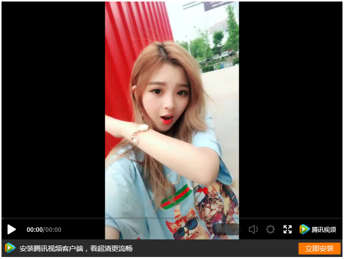
五）       业界的反抗

 

美国业界对Walmart的反抗，主要提现在二点：

1）扶植其他的平台卖场对抗。例如Carrefour，Amazon

2）开设专卖店

 

换算成中国的语态，总算"微信自媒体"还活着。

如果微信不要整天no zuo no die乱删帖的话。戴老板的脖子都扭了。

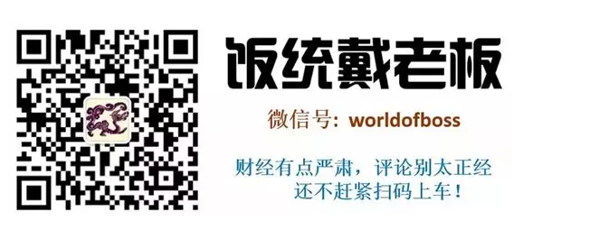

 

中国所有的家电零售企业中，只有格力GREE坚持走"专卖店"模式，不愿意过度依赖大卖场。还有小米。

按照董大姐的说法，别看现在省事省力，小心到时候拉清单。

 

当一个品牌过度依赖国美，京东时，它的末日也就到了。

 

 

 

六）       结语

 

我想很多号，[低估了"头条号"的真实代价。]

如果你不能控制"流量"，不能控制"时间线"，那么相当于你没有署名权。

目前头条的稿酬，是不值得你去卖命的。

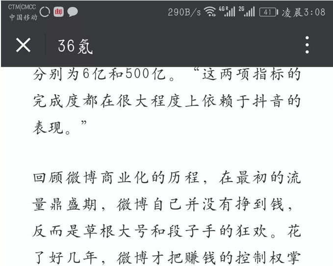

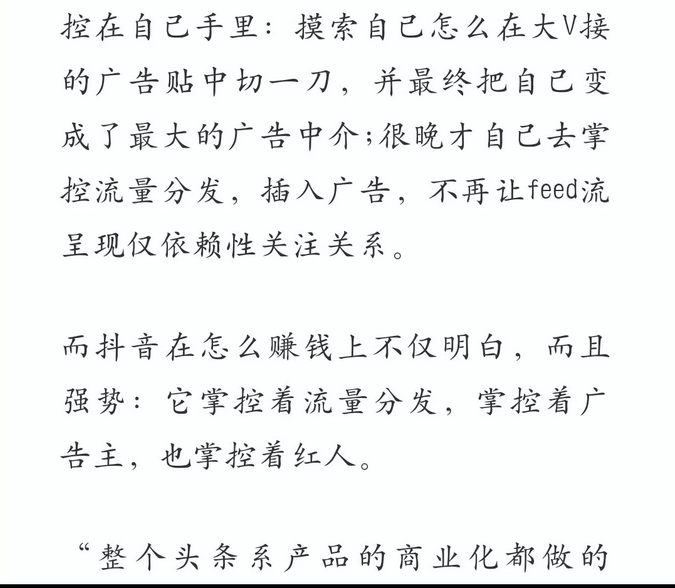

 

越来越多的App，例如微博、知乎，他们都放弃了"时间线"。而采取"干扰算法"。

这意味着这些公司，都要从"流量排序"中赚钱。出版社盖过了作者。

 

以"微信自媒体"和"今日头条"为二端。整个业态中，偏向"干扰算法"企业控制的越来越多。

意味着"内容创作者"处境，越来越不利。

 

或许，是时候期冀新的平台，或者开个专卖店了。

 

 

 

（yevon\_ou\@163.com，2018年5月31日丑）
