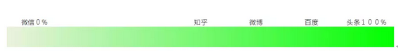
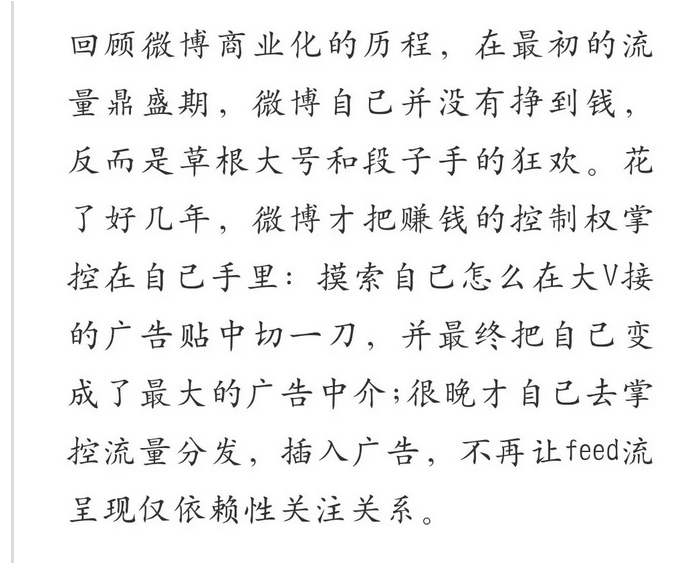
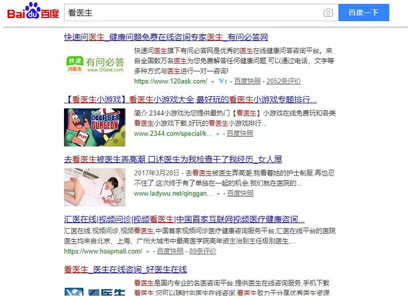
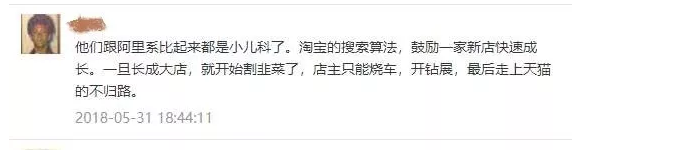
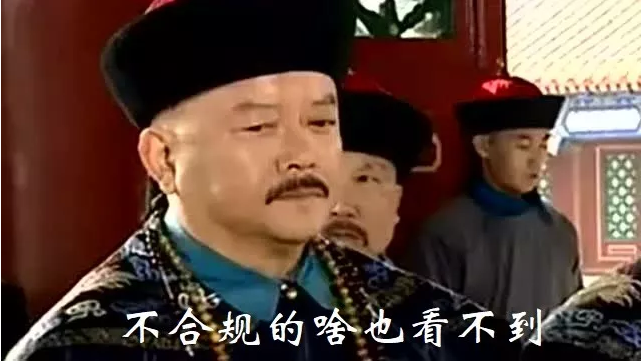
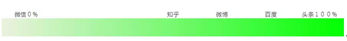
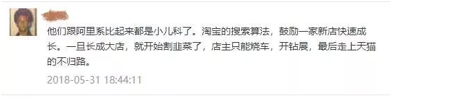
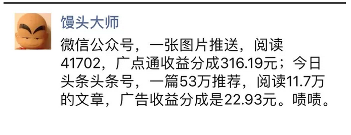
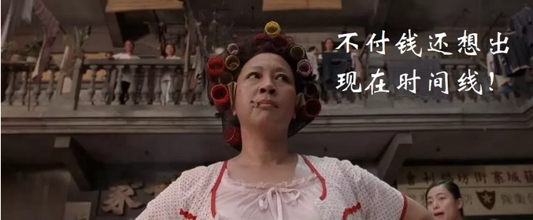

# 恶的土壤，结不出善的头条 \#F1790

原创： yevon\_ou [水库论坛](/) 2018-06-04

恶的土壤，结不出善的头条 ~\#F1790~

 

  [中产就是接盘侠 \#F1750](http://mp.weixin.qq.com/s?__biz=MzAxNTMxMTc0MA==&mid=2651017768&idx=1&sn=742956f39223f9e8d5f112124541e062&chksm=8072043bb7058d2d65adfb2fef3feb7b270938f080f5858b54f3291ef4c03f0118293ee164ed&scene=21#wechat_redirect)        [团结起来，反抗邪恶的头条 \#F1780](http://mp.weixin.qq.com/s?__biz=MzAxNTMxMTc0MA==&mid=2651017877&idx=1&sn=4936ea4dc98127fc83f7e97ee5a7062e&chksm=80720486b7058d90a70e2a1d468b5c9e90c2a28e755052b2c6064164fbdf9917eb02f791899c&scene=21#wechat_redirect)
  ------------------------------------------------------------------------------------------------------------------------------------------------------------------------------------------------------------------------------------------------------ -----------------------------------------------------------------------------------------------------------------------------------------------------------------------------------------------------------------------------------------------------------
  [怎样判断最后一棒 \#F1760](http://mp.weixin.qq.com/s?__biz=MzAxNTMxMTc0MA==&mid=2651017792&idx=1&sn=72724952d7e8b7125cc9c9da941b1794&chksm=80720453b7058d4594b10c948929b896f39057bc6a22f28e421f1e7746ee660bb7b13982fe04&scene=21#wechat_redirect)      [恶的土壤，结不出善的头条 \#F1790](http://mp.weixin.qq.com/s?__biz=MzAxNTMxMTc0MA==&mid=2651017877&idx=1&sn=4936ea4dc98127fc83f7e97ee5a7062e&chksm=80720486b7058d90a70e2a1d468b5c9e90c2a28e755052b2c6064164fbdf9917eb02f791899c&scene=21#wechat_redirect)
  [几类投资市场的分析　\#F1770](http://mp.weixin.qq.com/s?__biz=MzAxNTMxMTc0MA==&mid=2651017855&idx=1&sn=9f9aa277e3c3fb7d2706c686a928d5b8&chksm=8072046cb7058d7aae78d6db660d368fbcc621f647e6586e1313f777a15b1c5a3d962df119e1&scene=21#wechat_redirect)   

连写五篇Marketing，写完要消停一阵了。

 

 

 

一）       手法

 

 

有些事，我们一开始不明白。

但是，哥哥是做Marketing出身的。又是极聪明的人。

有些事，当我们一旦想明白了。顿时如怒火中烧，再也无法遏止。

上图，是国内几家最著名互联网平台的"流量干扰"图。

其中，微信最干净，是0%（或许5%），感谢张小龙，感谢其高尚情操。提供了几亿中国人一个平台。

头条最不干净，是100%

另外一些平台，诸如微博，知乎，介于二者之间。

 

 

微博一直在堕落。出于"赢利"和华尔街的压力。

微博从刚面世的时候0%，逐渐堕落到今天的约60%

 

如果一个用户，打开手机，想随便看点东西。

如果他看到的东西，全部都是"真实"的。全都是自由的，自己关注的。我们把"污染度"称为0%

如果他看到的东西，全部都是"机器算法"。全部都是系统想好的，硬塞给你。类似于电视机，单向接受。北朝鲜甚至锁死了，只有十几个频道。

则我们称它的污染度为"100%"。

 

 

普通用户或许不明白这其中的道理。那我们举一个最最直观的例子：

（百度发布声明称，传闻为谣言，已向公安机关报案。据悉，百度找的是网上排名第一的警局，目前案件已经进行到了给王警官汇款的阶段）

 

 

这个是什么，这个是大名鼎鼎的"莆田度"。

大家都知道，在百度上面搜索"看病""就诊""疑难杂症"，那是万万不可的。

同样的，搜索"买保险""买理财""买基金"，也全部都是李鬼骗子。

就连"搬家公司"，前三页甚至没一个官网。

 

而百度的赢利模式，就来自于"流量干扰"。

具体来说，是搜索排名。谁给的钱多，谁的排名就在前面。

消费者根本找不到自己想要的东西。

 

 

"第一代互联网"以1994年的Yahoo！为例。

Yahoo的赢利模式，主要是广告。杨致远被誉为天才。有了流量，就有了眼球。

 

可是"第一代互联网"，混得并不如意。

2000年中国"门户网站"三巨头，新浪，网易，搜狐，惨淡登陆Nasdaq。虽然有一点流量和广告收入。但是远远养不活成百上千的编辑。

 

 

而第二代互联网，赢利模式以Google为例。

Google不卖广告，其主页异常地干净。和Sina.com形成鲜明对比。

Google卖的是"搜索排名"。

 

或者说，是流量扭曲，流量干扰。

这一个战术，极其极其成功。为Google奠定了天价的利润和声誉。

Google六大事业部，五个严重亏损。纯靠"付费排名"的利润，才支撑起谷歌小资情怀的各种科幻实验。

 

 

这一招，阿里后来也学会了。

Taobao.com，如果你上去注册一个C店，是完全不要钱的。

马云爸爸，购买了那么多服务器，简直就是活雷锋为你卖命的。

 

淘宝印钞机，它是怎么为Jack赚钱的。

靠"流量干扰"。你如果不付钱的话，消费者是无论无论如何，接触不到你小店的。

 

搜索的时候，每一个"关键字"，每一个展示位，都是要钱的。

不客气地说，不给钱，连"低价排名"都未必轮得到你。

 

有了这些基础知识，你再回过头去看：

今日头条，微博，知乎，目前正在做的事；

他们就在复制Google排名啊。

 

 

 

二）       广告机

 

在所有的公司中，Google是比较有"节操"的。做事也比较有底线。

Baidu是比较没有节操的。为了钱，可以出卖很多东西。

这也是Baidu比较挨骂的原因。

 

作为用户，消费者肯定希望更好，更精准的服务。

消费者最希望的是，我搜什么，就跳出来最最精准的结果。一点点商家的广告都不要有。污染度最好为0%

 

百度之所以挨骂，是因为他捞钱，捞得有点过了。

你能想象搜索看了前三屏，全部都是广告，标注"官网"的其实是骗子。真正的官网，因为没续费，所以根本搜不出来么。 

（顺便说一下，有一个李鬼网站，叫做"水库luntan"。它就是靠买断了"百度推广"，付了大量广告费。百度同流合污）

 

 

那么，我们看回"今日头条"。今日头条能给我们高风亮节，给我们足够的信赖和信心么？没信心啊，亲。

 

**今日头条被质疑用麦克风窃用户隐私**

时间：18年1月3日

近日，有关今日头条窃取用户隐私的截图在网上流传。有网友反映，在和朋友讨论西餐厅哪家好时，今日头条会马上推送与西餐相关的广告和资讯，重要的是，他此前从未在其它
APP 或者浏览器上做任何搜索！

还有网友称，之前曾问朋友元旦去的哪个温泉，结果今日头条马上推荐温泉酒店。

 

**今日头条虚假广告专攻二三线城市，欺骗消费者。**

时间：2018年3月29日

3月29日，央视财经《经济半小时》栏目报道称，今日头条虚假广告避开一线城市，通过"智能"推荐的方式专攻二三线城市，欺骗消费者。

 

 

我打心底里不喜欢"流量干扰"的模式。

随着一个个App，越来越因为商业利益驱动，人为扭曲"给你看什么"。

这些平台，也就失去了"自媒体"的本意。

丧失了平台本身的价值。

 

这种Syndicate的模式发展到极致，当张老板捞钱捞到极致，你打开"今日头条"，简直就象一个从头到尾的广告机。

 

然后再发一道文，禁止google进入中国，只允许使用Baidu一家机构。

不寒而栗，不寒而栗啊。 

三）       劣质化

 

头条的第三个问题，是"头条"注定锁死了自身，注定是一个"三四线底层"，是屌丝&民工使用的App。这辈子也无法翻身。

何出此言？

我们还是来关注"头条系"对应的商业参照物，美国的Walmart。

 

 

Sam Walton是一个伟人。就好像张一鸣也是一个伟人。这一点毋庸置疑。

Walmart刚出现时，是以"奇迹爆发"式的速度增长。沃尔玛几乎每周开一家店。把所有的"传统"业态，打得溃不成军。

业界极度恐慌。

 

但幸好是，Walmart的市场份额升得虽然快，但终究也是有尽头的。

不算汽车等耐用消费品，Walmart占到了全美零售额20%，但此后，就停在了这个位置。开始放缓。

 

 

因为很简单的问题，你想买一个LV。

你去Walmart大卖场，去找LV。你找得到么，你永远也找不到。

 

不仅仅没有Gucc Gucci，Prada
Prada，稍微有一点名气的，卖小资情调的。诸如L\'Occitane，BodyShop，无印良品，在Walmart店内，一样也找不到。

 

 

Walmart卖的，永远都是"皮直，厚实"，经久耐用。虽然没什么品牌。但一看就是质量保证，结实耐操的商品。

为什么。

 

我曾经看过几部Sam Walton的访谈录，还有国内一些书籍分析，归因于Sam
Walton的基督教信仰，WASP的朴素情怀。

大错特错了。

 

Walmart卖的东西，侧重于"皮厚，实用"，而非"新潮，创意"。

因为Walmart本身就是一个"流量主"。它是控制着供货商生死的。

见上一篇《[团结起来，反抗邪恶的头条](http://mp.weixin.qq.com/s?__biz=MzAxNTMxMTc0MA==&mid=2651017877&idx=1&sn=4936ea4dc98127fc83f7e97ee5a7062e&chksm=80720486b7058d90a70e2a1d468b5c9e90c2a28e755052b2c6064164fbdf9917eb02f791899c&scene=21#wechat_redirect)》\#F1780

 

 

消费者跑到店里面买"洗衣粉"。洗衣粉这个需求是强烈的。而"洗衣粉品牌"这个需求是不强烈的。

无论碧浪，汰渍，货架上有哪种货，消费者就买哪种货。干扰能力巨大。

 

-   推介碧浪，还是汰渍，对Walmart的影响，不会差到1%

-   而对于商家，就是生与死的区别。

这种情况下，Walmart一定会尽量压榨供应商。并且把供应商的毛利，压迫到接近于零。

 

"生态"是一个复杂的系统。"博弈和反抗"是一个二阶反馈。

这句话反过来说，供应商不愿意为Walmart打造优质，有品牌的商品与服务。

 

 

 

举个例子，假设你组建一个100人的公司。立志做"最有质量"的大场面视频。飞车爆炸，特技明星。

大制作，大成本，拉斯维加斯直升机航拍。

 

这样的"精品视频"，在Youtube上就是爆款。

但是拿到"抖音"上呢。

万一头条不给你推介怎么办。万一算法给你过滤怎么办。万一"头条系"问你索取高昂的通道费怎么办。

 

 

你有了先期广告投入，大资本，大成本，你就是上了"贼船"了。

LV拿到Walmart卖，万一沃尔玛问你要几个亿展示费。你是撤柜呢，还是撤柜呢，还是不撤柜呢。

LV是一定要建设自己的"专卖店"的。

 

任何一类商品，只要有了品牌，有了附加值，有了高毛利，他就一定不能在头条/Walmart卖的。

"抖音"永远只能做短视频，这辈子都做不成长视频的。

 

 

从经济学角度讲，"露脸权"其实也是一种产权。

只有在完善"产权保护"的地方，繁荣才能得以发展。

象腾讯"自媒体"，公众号就是公众号。号写得好，流量就是你的。

 

在"产权保护"的前提下，经营者才有动力，把质量做好，把品质提高，追加投入。目前的"精品"原创文章，几乎全都集中在微信平台。

因为微信的"露脸权"，有产权保护。内容创造者，可以拿到他们的回报。

 

 

你千万别以为"原创"是很便宜的事。目前一个标准"公众号"，每月维护至少要二十万，四个人的团队。见《[自媒体那些小事
\#F1610](http://mp.weixin.qq.com/s?__biz=MzAxNTMxMTc0MA==&mid=2651017066&idx=1&sn=27708bdbe96e64ee2b4797ee60a68a29&chksm=80721979b705906fddfb7f4e163280d4161f79c88fbc6d5449dae72d3f92a1ea1e776a4a6562&scene=21#wechat_redirect)》

平均每一篇"原创"爆款，成本至少要五六万。

而对于"今日头条"系列平台，流量全部被系统掠走，权益都归了张老板。这样的生态，怎么养得出"精品"作品呢。

只有低成本制作的视频，和胡拼乱凑的洗稿文，才能承受每篇文章20元吧。

 

Walmart几乎一辈子卖低档品，逐渐沦为了穷人超市。

而"今日头条"的血统，决定了他只能刊登低成本，甚至负成本的文章。

那是什么。

"养生三策"重要知识，最后推荐你去买脑白金啊。

 

（yevon\_ou\@163.com，2018年6月3日暮）
