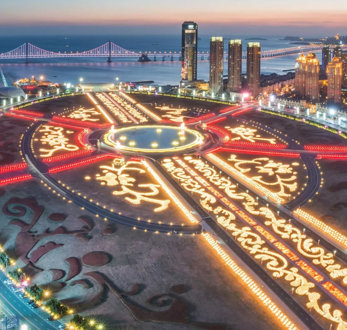

# 世上本应没有税 \#F1800
----------------------

原创： yevon\_ou [[水库论坛]](/) 2018-06-06

世上本应没有税 ~\#F1800~
====================================================================================================================

 

本篇为经济学

 

 

一）       热点

 

人生最痛苦的事，莫过于早上9:30要推送交稿。晚上0:30却还没开始写。

你，见过凌晨四点的北京么。

 

通常而言，没东西写的时候，你就追时尚热点。

近期的热点，主要是崔冰斗，还有今天的深圳"新政"。

 

问题是，FBB的题材，芸姨拿去用了。说是知道些内幕，放在了周六的稿箱。

 

另外一方面，"深圳新政"的题材，我周六有一场活动，在天津观澜。关键是茅老也会来，不敢怠慢。只能拿出十二分精神，干货周六讲。

而且还有一个"[[神秘嘉宾]](https://mp.weixin.qq.com/s?__biz=MzUxNzg2NDA5NA==&mid=2247483723&idx=1&sn=cb8085d86686685b0acca1771aea4b83&scene=21#wechat_redirect)"，仔细看看，是不是没我帅。

《[[钱不够多却单挑欧神，特邀嘉宾到底何方神圣？]](https://mp.weixin.qq.com/s?__biz=MzUxNzg2NDA5NA==&mid=2247483723&idx=1&sn=cb8085d86686685b0acca1771aea4b83&scene=21#wechat_redirect)》 

所以呢，真心没题材写了。

今天这篇凑凑数，滑到哪里算哪里。

 

 

 

二）       富人

 

-   富人是不是占了社会的便宜。

-   富人是否应该多交税

-   富人是否有义务帮助穷人。

 

关于"富人和穷人"的关系，汗牛充栋，不知道写满了多少论文Paper.

对于此类硬货，我只问你一句话。一句话可以判断你的三观和人格：

 

"你认为全社会的财富中，多少比例是富人生产的"

 

这个问题的回答，可能是覆盖0\~99%（当然我估计没什么人回答99%的）。

如果落到一些"马哲"的手里，类似于知乎大棍"马前卒"。他会毫不犹豫回答0%，或者0.1%。相当于富人在人口中占的比例。

在"马前卒"眼里，所有人消耗的劳动，以卡路里计算，大体都是差不多的。

 

-   很可惜，本案的答案是：99%

-   富人创造了全人类财富的99%

 

可能有人会惊呼。这怎么可能。富人一共才几个人，1000号人，你说他们的产出，比1000000人还多。

这么多钢铁，水泥，你倒是让富人生产呀。看一千号人，怎么生产得出来。

 

嗯，这个问题，我们要换一个提法。

假设有一家工厂，有1000个员工。每一年的钢产量，是100万吨。

人均钢产量1000吨。换个温饱。

 

现在，给你加个工程师，带来先进科技。改善工艺流程。

改善工法后，每年的钢产量，可以上升到200万吨。请问，这个工程师值多少钱。

 

200-100=100

 

答案是100吨。"一个工程师的贡献，和全场1000个员工相等"。

那么问题来了，如果我要花钱请这个工程师，你愿意付多少钱。

 

 

在中国长期漫长的工业化历史中，"知识分子"不值钱。哪怕你是院士，教授，同样也是开96元的工资。相当于普通工人的二三倍。

但事实的真相，并不是这样的。

一个精英的作用，可以使得产能翻倍。

 

如果你不愿意支付给一个个人。那么，假设对方是一个机构呢，是一家公司呢。也需要投入大量的研发管理成本呢。

如果你"外购"，购买使得生产力提高一倍的设备，你愿意出多少钱。

 

如果没有牛顿，非洲人还爬在树上呢

 

而这个，仅仅是最简单的例子。

更深入一层讲，如果"精英"的作用，并不是增加2倍，而是增加100倍呢。

 

 

和你们讲"99：1%"一般人难以理解。中国人难掩小家子气的习气。

可是如果我和你讲，"产量增加100倍"呢。

 

这有什么难的，人类由农耕社会，跨入工业革命。也无非很小一批人主导。

从手工锻铁，到蒸汽机。从人力挖煤，到大型机械煤矿。

山西的煤炭产量，比清时代提高了多少倍？

 

以目前的人类生产力，假设有一个超级科学家，他发明了"可控核聚变"。

这就意味着人类获得了无穷无尽的能源，足够跨入太空世纪。

全人类GDP，在目前基础上，翻个三倍五倍，不成问题。

请问，你愿意付给这位"科学家"多少钱。

 

 

越是复杂的系统，"精英"的加成作用越是重。如果仅仅是山野野人，农耕樵夫，那你加个研究生助理，几乎没有任何效果。

但是对于5000W，1亿，10亿级别的大型文明体，乃至于"未来科技"100亿，1000亿人口的人类文明。

越是庞大的"社会"，精英加成作用越是巨大。

 

以前有一句老话，"大海航行靠舵手"。

从1978\~2018，改革开放四十周年，中国名义GDP增长了１０００倍。

以俺拍马屁的眼光来看，其中９００倍要"归属于"太宗。

剩余的十三亿人民，辛苦工作，获得了１００倍。

 

 

 

三）       税制

 

税制并不公平。

不公平之处在于，富人拿得太少，穷人拿得太多。

而不是相反。

 

 

你别听什么，"全球顶尖１％富人，拿走了40%的分配"。这是不对的。

正确的说法应该是"全球1%的精英，创造了99%的生产力，却只拿到了40%"。

 

为什么你死活不相信，是富人创造了财富的99%呢。

为什么你死活不相信，人与人的区别，比人与猩猩的区别还大呢。

人类的文明，从来都是一小撮人，带着一大群人奔跑。

 

 

例子实在太多了。当你仅是一个低级文员，整天工作word和ppt时，你和同僚差别不大。

可是你越往上走，权限越重要，区别越大。主任\--经理\--总监。

 

到了CEO这一个层面，一个差的CEO，会导致公司破产。好的CEO，可以打出整条新路。

区别实在太大了。动辄就是赚几百亿，亏几百亿的正负。

 

 

 

那么，什么才是"公平"的税制呢。

在真正的奥地利经济学派中，应该是完全没有"税"的。

看清楚，再仔细看一遍。"唯死亡和纳税无可避免"富兰克林这句话是错的。 

一个真正公平的社会，应该只有费，没有税。

 

 

那么，"费"和"税"有什么区别呢。

"费"指的是服务。用你多少服务，交多少钱。

好比到北京燃气，买了500立方的天然气。那你就付500立方的"费"。

 

-   "无代表不纳税"这句话，本身是错误的。因为你根本就不需要代表。

-   "纳税是为了购买政府的服务"，这句话也是错的。

 

正确的说法应该是，"按需付费"。使用多少服务，就买多少费。哪怕501立方，都不需要。

 

 

如果你三观被洗得极为干净的话，你来看待崔冰恋这件事，逻辑是非常清晰的。

假设范冰冰要交3000W的费，请问范冰冰享受到了政府什么"3000W"的服务。

 

如果她的福利和你我一样，都是每个月领一千八退休社保的话。

那她就没理由交3000W的费。这纯粹是对范小姐的抢劫和剥削。

 

 

-   在所有税务之中，最不公平的是遗产税。

-   其次是所得税。

-   再其次是契税。

 

因为政府只需要简单的文书处理。换本产证，几十元的工本费。却收取了上百万元的"税费"。

 

 

 

四）       税与费的区别

 

税的本质是qianGjiE

 

"政府是纳税人的政府""政府是提供服务的"云云。

如果真的是"服务型"政府，那它就完全不需要"税"。它只需要"费"就够了。

干多少活，收多少钱。成本费用都摊进去好了。

 

 

而税是什么呢。

"我没有欠税，只不过你们印了一张单子，告诉我要付多少钱而已"\-\-\-\-- 谭叔

  

税是强制性的，同样也是无理由的。

你可能坐在家里，什么事也没有做。什么人也没有伤害。但是你就收到了大额税单，要求你把财产分一部分出去给他人。

这个才叫税。

 

希望年轻人，可以把"税"和"费"分辨清楚。

 

 

 

五）       税务的本质

 

税务的本质是血酬。

 

-   经济学第二定律是"R\>T"，抢劫所到之处，生产不复存在。

-   市场不可以包容暴利。市场唯一不能创造的，是市场的生存。

 

凡事，只要把"暴力"血酬包含进去。逻辑就变了。

 

 

理论上来说，如果一个国家的人民，全部都是"君子"。仁义而且自强不息。

则这个国家，只需要"费"就够了。买多少服务，付多少钱，象自来水一样哗哗哗。

 

而这个国家，如果不全是君子。也包括地痞流氓等等坏势力。

坏人容易挥舞着拳头，要求"掀桌子"。

在这种情况下，你才需要"税"。

 

 

税就是一种抢劫，就是强制性地"抢劫"富人财产，然后再分配给穷人的。

这背后，并没有大义的名分。

唯一的理由就是，暴力和自由一样，永远都不会熄灭。

 

 

\* 国家应该尽量消除暴力行为，消除"税"。暴力越多，国家越穷。

 

 

（yevon\_ou\@163.com，2018年6月6日丑）
