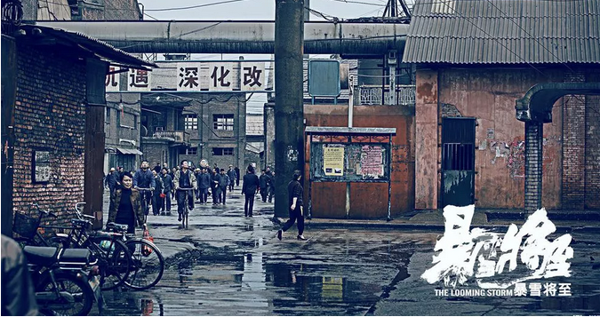
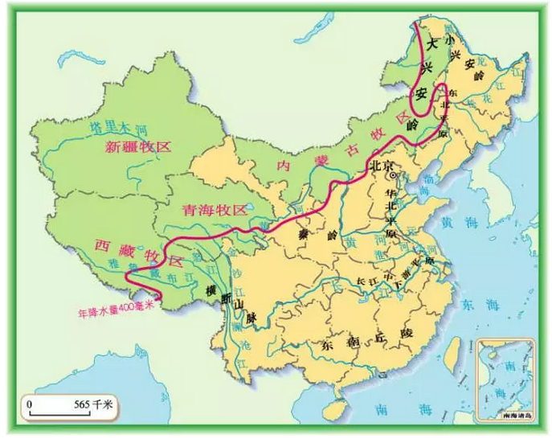
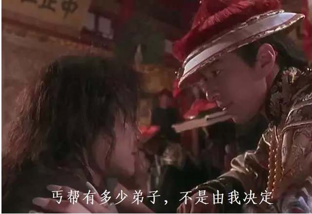
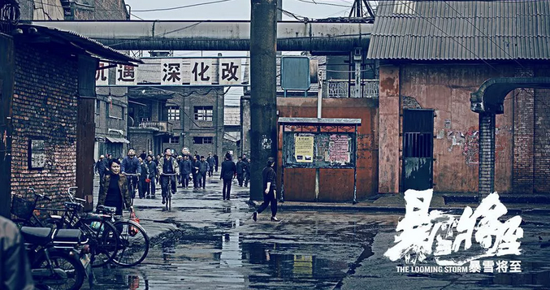
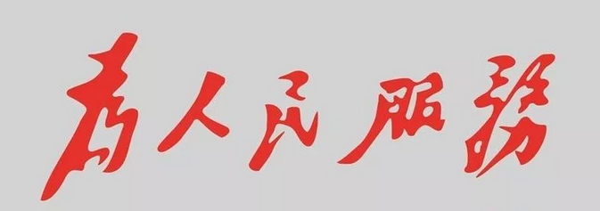

# 真正的铁饭碗 \#F1870

原创： yevon\_ou [[水库论坛]](/) 2018-08-01

真正的铁饭碗 ~\#F1870~

 

本篇弯弯绕绕，其实是情感。

 

 

 

一）       失业现象

 

公元1380年，洪武十三年，大明朝的"宰相们"发现他们失业了。

 

这一年，朱元璋发布宣言，废除持续二千多年的"宰相"制度。

从今以后，朱元璋直接面对六部百官。没有中间人赚差价。

 

大明朝的宰相们，有没有惴惴不安。有没有伸冤上坊，好像也没有。

大明朝的宰相们撇撇嘴，"you can u up"。

 

 

没有了宰相们的预审，朱元璋每天工作14个小时。

朱棣勉强还撑了一撑。到了第三代就不行了。

明朝偷偷恢复了宰相制度。只不过不叫"丞相"，叫"内阁大学士"。权力比以前更大。

 

"宰相制度"不能废除的原因，是因为每天工作14小时。

皇帝负担不起（俺是来当皇帝的，不是来当牲畜的）

总得要请个助理。于是便一定会有宰相制度。

 

换言之，"宰相存在的土壤"是文牍繁重。

只要土壤存在，就一定会产出宰相。

 

 

 

二）       草原

 

中华文明二千年，一直在和草原游牧民族搏斗。

匈奴，柔然，突厥，回鹘，契丹，室韦，女真......中原王朝取得了无数胜利，燕然碣石，亡胭脂山都好几回。

可是始终无法将游牧民族根除。 

因为中原/匈奴的势力分界线，物理上就是400ml降水线。

也是农耕与牧区的分界线。

 

出了张家口，就是草原。无法耕作，养不活农民。人口自然习惯骑马生活。

生产力不改善，中原王朝是不会对草原有向心力的。

 

 

而后来的故事呢，后来很简单。鸦片战争一声炮响，给中国送来了工业革命。

1900年有了铁路科技后，铁路可以一直造到库伦（而且造了）。

有了铁路做经纬网，草原上再也没有任何威胁。

 

是游牧民族不如祖先猛勇么，不是的。

是时代变了，草原轻骑兵的土壤，不复存在。 

你不需要废除单于，单于也自动地从历史长河中消失了。

 

 

1840年时，另有一股势力大得吓死人。足足有几十万人，而且素质精良，组织严密。不亚太平天国。

这就是漕帮。 

满清政府，也对漕帮极为忌惮。几次三番想要瓦解，控制。

有效果么，真的是一点效果都没有。

漕帮还是那么多的人，而且自发而成，围绕着几个"龙头"形成紧密堂口。

 

哪怕朝廷控制了上层人物，下层却是控制不了的。

死忠粉永远跟着几个包工头走。小香主才是KOL。

 

 

但是这么大的组织，到了1870年之后，居然完全烟消云散。

昔日无论如何斩杀不尽的八歧大蛇，一夜之间，失去了所有的鲜血。灰飞烟灭。

 

发生了什么事。技术发展，"大轮船"发明了。

从江南到北京，走海运，更省钱。

"京杭大运河"一经荒废，便不能再复起。

运河都没了，漕帮自然也就散了。

 

 

 

三）       司空

 

世人对于力量，往往缺乏真正的了解。

"虚名"和"实利"分辨不清。

"宰相头衔"和"构成宰相的力量"分辨不清。

  

"宰相"无非一句虚衔。封谁做宰相，也仅仅是皇帝的一句话。

宰相也完全可能被架空。有时候一些很高很高的职位，却有可能一点权力都没有。

如太傅，太师，司空。

如北洋政府封冯玉祥为"检阅使"。

 

 

另外一方面，宰相又有可能是非常强势的。

曾国藩只身入北京。功高而不震主，六十一岁善终。这背后，不是慈禧的心慈手软，而是因为有整个"湘军"集团。

湘军既然没解散，谁敢动曾半根毫毛。还要分七八个巡抚给湖南人做。

 

在政怡游戏规则中，每一个省，每一类人群，都要给你固定份额的官做。

即使某次高层全部落马，也要加速提拔中层干部，保证其人口做官比例。

 

当宰相代表是他身后的势力，则宰相就是无敌的。

台面人物可以换。但土壤是永恒的，树大根深。

 

 

 

四）       真正的铁饭碗

 

你以为本篇是写历史和政怡么，那你就错了。

封号啊，拽然而至。

小有小打，本篇讲的是"职场和情感"。

 

 

什么是"铁饭碗"。

很多人把"铁饭碗"理解为文凭和职位，这其实是一个很大误解。

 

譬如说，你家里的老派父母，一定会教育你。最理想的人生，肯定是：

-   读个大学，拿一个不错的文凭。

-   找一家承认你文凭的公司，找一个好工作

-   公司里混个头衔，社会有面子

-   在公司里拉帮结伙，人事斗争，尽量把根扎下去

 

 

如果把你们父母作为"原型"，观察他们人生轨迹的话。则父母一代的"办公室政治"，已经到了十分可怕的地步。

一个眼神，一个语速，都可以研究十七八次。

 

人老成精。你父母在单位里，真的是"树大根深"。

再好的名医，都难以把他们这些"精致的利己主义者"剔除出去。

  

然后呢，然后他们就下岗了。

公司就倒闭了，就下岗了，就象《小人物》\#F1540一样，明天通知你不用上班了。

他们扎根宿主一辈子的寄生虫囊，整间工厂，被人一锅端了。

 

那是怎么回事呢，因为他们混淆了一个概念。

他们追求的是"宰相的名头"，而不是"宰相背后的力量"。

无源之水，无本之木。

 

他们费尽心机，花了一辈子追求的"科长，副处长，办公室主任"。

这种"抬头"，其实是没有力量的。

当然，他们也踏空了房价。

 

 

真正的力量是什么，真正的力量，某人早就说过了： 

长期的计划经济，掩盖了一个事实。甚至整整一代人，罔顾这个事实：

我们生存在一个剧烈竞争的环境中。

 

竞争无所不在，只不过被掩盖了27年。

改革开放之后，竞争就再也没有停过。

 

 

因为竞争，所以所有的系统，都要竭尽全力增加产出，削减成本，迸发创新。

整条Supply Chain上面，每一个环节，都需要打磨，打磨，再打磨。

 

因为对效率的追求，使得对链条上每一个"臃肿腐败"的环节，都不可以忍受。

德不配位，是不可以接受的。

 

 

 

1990年代，外资企业进入中国。

在外资公司手里，搞出了一个惊天动地的"40岁裁员"。中国人为之震惊。

 

什么，你辛辛苦苦熬了十几年，好不容易凭资历混到了中级经理。

接下来，不是让你无所事事，混吃混喝欺负女同事。

反而是35\~40岁，一纸裁令。请您到市场上另找工作吧

 

外资企业奉行Up or Out，除了少数高管，几乎很少见到35岁以上的员工。

"科长，部门经理"绝不是一个令人羡慕的目标。

甚至不是让人停下，歇歇脚的凉亭。

 

 

怎么会这样呢，就是因为你搞错了"宰相的名位"和"宰相背后的力量"。

-   你的一切价值，来自于你是一个高素质人才。

-   你可以为公司创造价值，而且持续地创造越来越多的价值。

-   这才是你可以领取工资，获取高薪，升职加薪的原因。

-   而不是因为你是总监。

 

 

有了草原，才有单于。

有了乡党，才有晋帮。

"虚名"一文不值，土壤才是力量。

只有一个人，或者一群人，能持续地赚到钱，这才是铁饭碗。

 

你有撸钱的能力，这才是铁饭碗

 

 

因此，真正的"铁饭碗"，是你要找到一个位置，一个角度。

在这个位置上，你可以持续地为公司提供产出。

你的土壤"基本盘"越不容易受攻击，则你的台前，也越不容易受攻击。

 

例如：

-   专门负责和税局打交道的人

-   专门负责和监管打交道的人

-   专门负责和难缠大客户打交道的人

-   地级市的区域经理

 

 

我以前见过几个中层销售经理，无论公司"政怡斗争"如何变化，他自如闲庭漫步。日子也过得不错。

 

其秘诀，就在于他是"韶关"的销售经理。

韶关，湛江，梅州这种地方，销售经理都是固定的。总部再怎么内斗，也不会派轮岗来这种地方。

安家落户，娶妻买房。轮岗不易。

显然，在公司的"生态位"中，他就占据了一个非常有利的位置。

 

（历史国体不能写，文章是越写越小了）

 

 

 

五）       结语

 

明天桃军师会发一篇《捞妹的飞行坠落》\#X57，讲女性如何捆住男人。

-   某些花神妙的粉丝捞女，把全部希望寄托在一纸"婚书"。期冀男人只要下定，就一辈子吸你血。

-   水库说，这样是不对的。

 

男人真正需要的，是情感需求，生活需求，服务需求。这些都是细水长流的事。

但是在捞女眼里，却成了一锤子买卖的"契约"。

一旦你上了贼船，就不让你下船。否则就骂你渣男。

 

这种"一锤子钓鱼"，然后完全没有后续服务，叫什么呢。

叫《[[男人是张信用卡]](http://mp.weixin.qq.com/s?__biz=MzAxNTMxMTc0MA==&mid=2651016771&idx=1&sn=d4427c6ea8efb09377ac6135c5901ac1&chksm=80721850b7059146773f81ba25899d13fb610263f88fa35613a879dd3308521e1354584984a2&scene=21#wechat_redirect)》\#F1470

 

 

我看了以后，说军师文章挺好，但是写得太难了。超出了屌丝的理解力。

要不，我写一篇帮你铺垫一下吧。

 

 

 

（yevon\_ou\@163.com，2018年8月1日丑）
