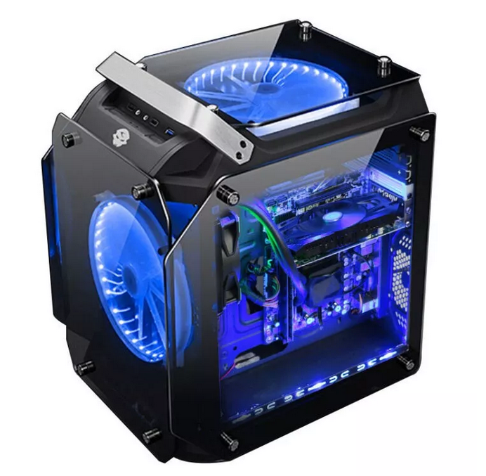
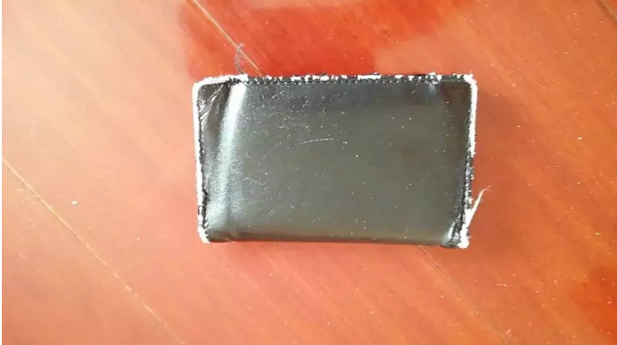

# A9消费观 \#F1890

原创： yevon\_ou [水库论坛](/) 2018-08-09

**A9消费观 ~\#F1890~**

 

杂文。根据水库内部培训文档《什么才是A9生活观》\#A10改写

 

 

 

一）电脑

 

前二天把电脑砸了，于是又买了一部新电脑。

一个象哥哥这样的人，从事每篇80000+阅读的重要写作。我会买一部怎样的电脑？

 

对于"月薪8000的小编教导月薪3000的穷人月薪30000的金领该如何生活"。在文科生小编的脑海里，哥哥应该买怎么样的电脑。

 

 

上次我见一个女孩子，她买的是三面屏幕，曲面屏的显示器。近50寸，足足撑满了一张书桌。而键盘则是Cherry的，泛发着五颜六色的光芒。敲打上去会噼噼啪啪作响。

 

 

哥哥买的，是这一款。

（专业人士行为，请勿模仿） 

嗯，你没有看错零。只要869元，积分还抵扣了10元。

没有怪兽级巨无霸，没有吃鸡的显卡。仅仅只有2G内存，32G硬盘。

 

32G硬盘什么概念，MS Windows本身，就要占用10\~15G。

也就是这部电脑，不仅仅不能装任何游戏。甚至连大一点的软件，它都装不上。

 

它只有2G的内存，几乎不能运行任何大型的App。

嗯，很好。因为它完美地符合了我的需求："只要能用Word"。

 

 

 

许多人会说，哪怕你主要用Word写文章。您也可以买一部好一点的电脑啊，哥哥你这么有钱，花1万元，2万元，哦，3万元，买部顶配超级本么。

 

前二天不是有人看见你，在西九龙101F，一顿饭就吃了一万二么。

 

嗯，提这种问题的人，并没有抓住核心。

 

 

 

二）专注

 

我要买"超级低配"电脑的原因，就是因为它只有2G内存。

除了码码字，其他什么事情都做不了。

也不能吃鸡。也不能玩"冰气时代"。

 

 

因为我们都有这样的经历，极大的恐惧。

当你写作写到一半的时候，你脑子里空了。抓狂了，疯了。突然之间卡壳了，什么也写不出。

 

这个时候，你会干什么呢。

症状轻一点的人，会起来泡杯咖啡，泡杯茶。

症状重一点的人，会摸出手机，打二盘"王者荣耀"。或者"盖达尔传说"吧。

 

要不，刷刷知乎，刷刷微博，刷刷抖音。

抬起头一看，二个小时过去了。你还是一个字没有写出来。

 

 

这个一个极其可怕的症状。这些"时间碎片"折磨得你疲惫不堪，精神也完全没有恢复。

而你，完全没有生产力。对自己充满了自哀自怨。

 

 

我买电脑，只有一个要求："这部电脑，只能码字"。

除了码字，它连大一点的软件，都安装不上。最好内存再小一点，多开二个Chrome窗口就卡得要命。

这样，我才能集中精力。一心一意只做好本行。

 

 

 

三）拗相公

 

北宋熙宁二年，出了一名"超级宰相"，也就是著名的"王安石"变法。

王安石，不仅留下了争议极大的青苗法，均输法，保马法；

而且在他身后，留下了长达百年的"新党/旧党"之争。

此后几任宰相：吕惠卿，曾布，蔡京，都是他的门生。

 

 

这样一位"宗师级"的人物，吃什么东西，穿什么品牌的衣服？

答案是"富贵≠品牌"，拗相公做到了一品大员，观文殿大学士，司空太傅。

可是他的吃穿，或许还没有一个七品县令好。

 

当县官们争破了头，往往还要祖宗烧高香，才能小升一级。

县官们有没有想过，他们的上上上上级，其实也就是每天吃酱萝卜。

 

 

 

拗相公有一次和下属吃饭，摆在他面前的是一盆鹿肉。于是拗相公专心吃肉，竟然把一整盘鹿肉，吃得干干净净。

下属看在眼里，喜在心里，"原来王丞相喜欢吃鹿"。

揣摩上意，大肆张罗，四处寻找鹿食。

 

消息传到王安石太太耳里，一品浩命夫人笑着说，"他哪懂什么鹿肉，他只是专心吃眼前一盆菜罢了。你便是摆一盆酱萝卜在他跟前，照样吃得清光"

 

 

 

穷人对于富人，有很多误解。

就如同《西虹市首富》中，富人的标志，刻画为手里捧着一个大龙虾，天天啃龙虾肉。

这里面的误解，简直和"皇帝吃100个馒头"无异。

 

真正的富人，过的是什么生活呢。

-   说富人天天吃龙虾，固然是误解。

-   说富人吃青菜白粥，也完全是曲解。

-   真正的富人，应该是"不关心"。

 

 

就好比拗相公，你摆一盆鹿肉在他面前，吃光。你摆一盆鱼翅，吃光。你摆一盆酱萝卜，照样还是吃光。

王安石只吃眼前第一盆菜。

你以为他在吃饭，其实他并没有在吃饭。

他虽然看似在吃饭，嘴巴在嚼动。但其实他的心思，早不知飞哪里去了。

  

拗相公想的是：

-   青苗法执行效果，不知反馈。

-   政抵御史大夫，今早上了奏折攻击。

-   皇帝下朝早走了，不知是否身体欠恙。

-   小一辈中，提拔曾布还是蔡殊做三司使。

-   今年的秋粮，不知道收成怎样。

 

这其中的每一件事，都比你的鹿肉，珍贵百倍。

哪怕你面前摆的是一盆珍珠肉，也不见得能使拗相公分心。

 

（如果你不理解，想想小时候你爸妈叫你吃饭，而你却挂记着屋里的游戏。排位赛五缺一）

 

 

 

我们的现代社会，有很多广告。包括"有气质的男人"。

一个男人喝什么咖啡，穿什么衣服，能否识别07年的限量款，都成了"精致"的象征。

 

其实从本意上说，娘炮就已经很Low了。

这样的男人，充其量只能到A8，或者是一个富二代，纨绔子弟。

电视剧里的花样美男，在真正的上流社会，完全是不入流的角色。

 

（少年娘则国家娘）

 

因为真正的有钱人，他们都很"忙"。

有钱人都忙于争权夺利。哪怕象马云&马化腾这样的超级富豪，Ali和Tencent还打得死去活来。几乎在每一个战场，都刺刀见红，充满了正面交锋。

 

马爸爸每一天都殚思竭虑，为了支付宝的流量少一个百分点，足以几天睡不好觉。

你说，他有什么理由，关注领带是什么牌子？

 

 

 

Montblanc一粒纽扣2500元，香港的"时尚杂志"花了大量的篇幅，长达二十几年的消费者教育：

"肯花几千元买件衬衫，不算是有钱人。肯花二千元补一粒纽扣，才是对生活讲究到极致"。

 

好了，那么你告诉我，每天花一个小时，在玻璃镜前扭来扭去，欣赏自己的样子骚不骚。

这样的男人，算不算成功人士。算不算商界精英。

 

在真正的人杰面前，他们算个屁啊。

 

 

 

四）钱包

 

我有一个钱包。 

几乎所有人看到这个钱包，第一反应就是，这一定是你"妈妈/女友/前女友"送的。

为什么，因为实在太破了。

整个四周，已经全磨皮了。这里面一定蕴含着一段悲伤而久远的故事，使得你不忍舍弃，光这个钱包，就可以写一部书。

 

 

而事实的真相呢，这个钱包，就是淘宝货买来的。原价17元。

一模一样的，我一共买了4个。另外三个，依然在库房的某一个角落里睡大觉，待找出来。

 

在俺的手中，也不乏"名牌"数千元的皮夹。类似Armani，Zegna，miumiu，我只要上三楼的纸箱中，把它们拆出来就行了。

可俺就是懒得做。

 

 

我就是懒得懒得，花上十分钟，去三楼找东西。

如果阿姨帮我换好了，俺也就随手用。

如果没有，就这样一直破钱包用下去。俺也不在乎。

 

 

因为我实在实在实在"太忙了"。

一个居于行业顶峰的人，他一定是"全神贯注"的。他一定是把他全部的热情，心力，赌注，都倾注于做得更好，做成第一。

众生平等，竞争无处不在。挑战者这么多，你只有超级努力，才能看起来毫不努力。

 

而对于"专注"伤害最大的，莫过于"分心"。

 

如果我现在放下手头的工作，放弃写到一半的文章，放弃打电话跟进的三笔单子，悠闲奢侈地跑到楼上库房去挑选钱包。

 

这是何等的懒散啊！

 

 

 

一个人在"紧张"和"懒散"之间切换，他是注定做不好事的。

也就是说，如果你花心思在"挑选钱包"。你也就是个二流人物了。

注定做不到极度精锐。

哪怕分心几分钟，你也负担不起。

 

 

 

五）结语

 

写了这么多，想说明什么呢。

拗相公如果没有人管着，多半会因为营养不良而饿死。

A9如果没有狐狸精，生活质量想必惨不忍睹。

 

富一代实在太忙了。忙到了没有办法"精致地生活"。

因此女孩子需要深入了解"A9消费观"。

然后帮A9花钱去。Over

 

 

 

（yevon\_ou\@163.com，2018年8月9日丑）
