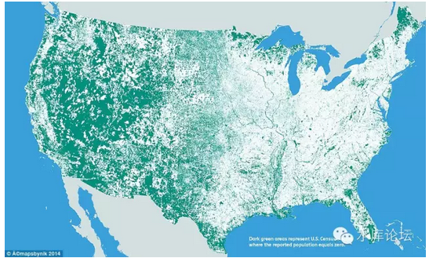

# 三代之治7 \-\-\-\--番外篇 民族性国家的形成 \#F190

yevon\_ou [水库论坛](/) 2016-06-28

【历史】三代之治7 \-\-\-\-- 番外篇 民族性国家的形成 \#F190

一）没有家，没有国\
\
在平势隆郎的《从城市国家到中华：殷周春秋战国》一书中，他主要表达了这样一个观点：\
商周二代，根本就不能算是朝代。至少极大区别于以后中国的"王朝"。\
\
他的这个观点是正确的。\
且不说商代的疆域，仅只有河南中部小小的一块盆地。而晋齐楚秦等地，大多数也不是姬家的后裔。95%的血统，更多的还是当地土人。\
\
晋国，虽然说王室是周叔九虞。但"晋人"，却不是姬人。而是"山西人"。\
山西人，在身份认同上，他们并不是姬发的后代。而是山西本乡本土，太行山大地上成长起来的民族。\
\
\
打个比方。南美洲，基本上是西班牙殖民者打下来的。1519麦哲伦环绕地球之后，西班牙航海家开始了扩张之旅。\
其中，皮萨罗和Cortes二次征服。灭亡了印加帝国和阿兹特克，将整个南美洲纳入了西葡手中。\
\
如今时至2014年，南美洲主要的人口分布，是Hispanic，占到了50%以上。其次是其他白人黑人移民约25%，印第安人土著25%\
可以说，如果以西班牙为母亲的话，整个南美洲都是孩子。\
\
\
\
可是，如果你要问南美洲12个国家，是否承认西班牙为"宗主国"，承认周天子的权威。哪恐怕就要荒谬大吉了。\
南美洲国家人的身份认同，乌拉圭人认为他们是乌拉圭人，委内瑞拉人认为他们是委内瑞拉人，厄瓜多尔认为他们是厄瓜多尔人，巴西认为他们是巴西人。\
\
对于乌拉圭来说，他们是从这块土地上长大的。一方水土养一方人。既没受到你西班牙什么恩泽，也没有紧密援助的联系。\
从周天子"分封制"的那一天开始，就决定了这样的下场。\
因为他们都是"移民团"，到一个蛮荒地方，建筑城堡，然后陷入和野蛮人的长期漫战。在这期间，有通婚，有融合，有国人和野人的转换。最终大家都是山西人，而不是周人。\
\
\
\
如果有一个强人，把整个南美洲再征服一遍。把12个国家都灭掉，和西班牙统一成一个国家呢。\
没错，这就是"秦始皇"。\
所以秦始皇之伟大，东周后期的各个国家，其实他们并不是"周人"。也不是周天子名义下的联盟子民。\
他们其实是几十个国家。是今天United
Nations上一百多面国旗。而秦始皇把他们都灭了。所以始皇帝觉得自己功盖三皇五帝。\
\
\
\
\
\
二）以德服人\
\
平势隆郎的第二个观点。朝代既不是朝代，当时的"国家"也不是国家。\
晋国不是国家，秦国不是国家，楚国不是国家。\
\
当时的晋国，版图相当于整个山西省。面积和整个希腊差不多。\
而希腊文明的早期历史，我们知道得很清楚，是"城邦制"。\
\
城邦因赶集而产生。最早的城邦都很小。譬如罗马建城的时候，也就1500人。\
但是，随着西周初年的过度，姬发分封各国安定。到了后期，各国实力都逐渐增长。\
\
但是，晋国的首都是"绛"。他仍然是一个城的概念。没有发展到一个国的概念。\
国家的产生，随着城邦的征服。具体而言，就是绛城开始攻击周边一个又一个小邦，强行把他们纳入自己的管理范围。\
最终形成了一个绛城首都，周边十几个卫星城的格局。\
\
\
\
\
这个过程，古文中叫做"以德服人"。\
"德"最早的含义，是拳头。\
\
Ｑ："你听说过俺们晋昭侯的威德没有"。\
Ａ："没有"\
Ｑ："那就让你见识见识，砰！"\
\
所以，我每次回想起邱淑贞，李连杰拍的《洪熙官》，就忍不住喷笑。\
\
\
\
\
\
三）汉字的普及\
\
当晋国，秦国，楚国，由一个城邦逐渐发展成一个"国家"时。社会管理机构不可避免地发生了剧烈变化。\
首先，是汉字的产生。\
\
汉字的产生有几千年的历史。教科书上总是说汉字最早实见于甲骨文。\
但教科书没告诉你的是，一直到东周初期，汉字几乎没怎么使用。\
\
汉字最早的用途，用于镌刻在青铜器上，叫做"金文"。\
这是一项高科技的技术。最早只有商纣王拥有。姬发灭商之后，捕获了一些匠人才拥有。而其他任何诸侯，都是不会写字的！\
\
只有周天子王室，才会写字。\
当时汉字的主要用途，是刻在鼎上，然后分赐给诸侯。其撰写的内容，无外乎吾王如何的伟大，吾王如何上应天意，王的威德服人。\
\
这样的鼎，诸侯叩头收下了。但实在没什么兴趣研究，一般也就扔仓库里。\
而且诸侯只能读，不能写。没有"金文"技术。\
一项不能应用的技术，自然也没什么人学习，更没人研究了。\
一城之内，通讯基本靠吼。\
汉字的普及，要等到"城邦"扩展成了"国家"之后。\
\
中国对地县的征服，我初略估计，要到南北朝齐梁之后。在这之前，晋国所谓的"拥有"山西省，其实是对几个大城市的拥有，以及交通线。\
而超过交通线二侧20KM之后，就全是蛮荒之地了。\
\
当时晋国坐拥首府曲沃和十几座城市，然后就是200KM长一条一条的交通线。\
晋国君最关心的，是消息的传递。远方的城市有没有遭受攻击，需不需要援军。\
秋收和粮食库存如何，这个月税赋如何。\
这些都需要行政体系，和文书的往来。所以汉字在春秋诸侯扩张之后，才逐渐被使用。并最终形成了中国文化圈。\
\
汉字为什么这么重要。所谓"书同文，车同轨"。\
这我也不太清楚。\
不过当初普鲁士俾斯麦扩张时，"德国的边界是所有讲德语的人"。\
\
\
\
\
四）周边省份融入中国\
\
商纣末期，中国只拥有"河南"一省\
姬发伐纣，带来了陕西。\
\
姬涌把他弟弟封在了晋国。最初只有南部，经过了曲沃战争，扩展到了中南部。\
三家分晋时，最后一战赵襄子死守。当时他可以选择邯郸，还是太原。\
邯郸是巨大粮仓，而赵襄子却选择了太原。\
他解释说，邯郸粮多，说明我们横征暴敛。民心叛离。而太原粮少，对人民有恩德，反而可以坚守。\
这战说明太原已经被足够开发，第一次登上了历史舞台。\
\
再到战国末期，"李牧之死"时，赵国已经扩展到了雁门关，并和胡人展开了大规模冲突。\
\
\
\
齐国是山东省。但齐国是"五京制"。或者说，如果你打《三国志9》的话，齐国在地图上显示就为五座城市。\
这五京是：临淄、高唐、平陆、即墨、阿。\
\
所以说，中国的教科书，真是集谬误之大成。\
当时"火牛阵"这一章节，说燕国有史以来第一次象个男人作战。乐毅伐齐，全国都灭了，只剩下最后的"即墨，阿"二个小城。\
\
\
其实远不是这么回事。即墨和阿都是五都，相当于齐国2/5的国土还在手中。比当年圣女贞德还多一点。\
乐毅伐齐，在边境乘齐国大意打了二场胜仗。然后攻入王都临淄。但是2/5实在是灭不掉了，兵力不够啊。\
\
\
\
\
说完了河南，山西，陕西，山东四省。楚国是湖北。\
相对于楚国来说，洞庭湖是一个内湖。所以他很容易地扩张到了岳阳。并最终扩展到了长沙。\
\
但是，整个湖南省，真正开发的只有长沙一地。别以为地图上有湖南，中华民族就拥有了整个湖南省。\
湖南，在战国时代，真正意义就是长沙一座城池。而到了几百年后的三国，则是长沙，常德（武陵）二座城池。\
\
\
\
再过一千二百年后的五代十国，马殷南楚国强盛一时。但其实南楚一共就三座城池；长沙，常德，桂林。\
所有的故事，都围绕这三座城池展开。所有的内战，无法哪个王子占三城中的哪一座。十分好记。\
\
\
\
"吴太伯认亲"之后，吴国，越国，进入了中原各国的视线。其中吴国是江苏，越国是浙江。\
\
\
\
\
五）边缘省份\
\
\
巴国和蜀国，是历史悠久的漫长古国。传说都可以上溯千年以上。几乎可以认为，是和中原文明并列的二大文明。其中巴国是"大蛇国"，蜀国是"人鱼国"。\
而巴蜀的融入，十分意外。蜀国巴国的实力都很强，人口众多，地势险要。\
哪怕战国七雄的某强倾力来攻，倾全国之力，都不一定能灭了。更何况还要受中原战场牵制。\
\
\
一直到BC316年，蜀国发生一场内乱。当时蜀王有一个弟弟，有篡位的风险。\
于是蜀王就把弟弟封在汉中，希望他和世仇巴国打打仗，二败俱伤。\
\
\
结果蜀王这个弟弟萓侯反过来和巴国联手，和蜀王大战。\
双方打得筋疲力尽，萓侯巴国联盟一方，向秦军求助。\
当时秦国正在中原大战，根本腾不出手来。可是将军司马错一定要求参与，再加上一个大野心家张仪。\
\
\
事情的结果是戏剧性的。\
秦国加入后，终于大败了蜀王。攻下了成都。\
可在饭桌庆功宴上，张仪突然翻脸。刀斧手抓住了萓侯，巴侯。\
\
\
这一战，一下子灭掉了蜀国，巴国，汉中。秦国赚得盆满钵满。\
而且蜀国，巴国，都是当时天下第一等的粮仓。秦国因为有了四川粮食，才飞跃性的完成实力大冒进。打赢了长平之战。\
\
\
这件事的阴谋程度。简直可以和"卡哈马卡战役"相媲美。都是几百人的精锐特攻部队，征服了几十万平方公里，人口百万的庞大文明古国。\
张仪一辈子合纵连横。其实他做的最NB的事，还是灭蜀灭巴。\
\
\
\[注1\]
蜀国并未完全征服。如此不体面的胜利，导致蜀国之后至少还有三场独立战争\
\[注2\] 古蜀国之兴亡简史：http://bbs.tianya.cn/post-no05-146996-1.shtml\
\
\
\
\
蜀国并未完全臣服，蜀国人也不服气。有一支的蜀国人，和商太子武庚一样，开始逃亡。\
他们穿过密集的丛林，最终到达越南北部。在交趾建立了城市，王国延续一百多年。\
\
\
秦始皇统一六国。之后他的军队一分为二，一支北上，"亡秦者，胡也"。所以拼命地讨伐胡人，拓地千里。打下了内蒙古。\
一支南下，穿过了长沙，继续向南，到达了广州。赵佗后来建立"南越王国"。\
再沿海南下，最终打下了交趾城。所以越南北部，并入中国。\
\
\
\
\
之后的故事，就要从汉武帝开始了。我们从不知道，汉武帝原来灭了那么多国家。\
汉武帝进攻了夜郎国，"夜郎自大"。进一步打下滇国。于是有了贵州和云南二省。\
在东方，汉武帝灭掉了"东越王国""闵越王国"。打下了福建。\
在东北，汉武帝灭掉了"萁子朝鲜"，辽东半岛和北韩。\
你看，秦始皇统一宇内。其实国内还有这么多国家。\
\
\
\
在西北，他开拓西域走廊。打下了甘肃。再到了新疆。\
但是要翻过祁连山，达到青海，还得许多百年以后。\
\
\
安徽在历史上，主要是"寿春"。袁术的老巢。楚国最后一个首都。\
寿春在中国历史上，大概是"大战"最多的一个城市。双方投入兵力50万以上，能数的就有近10次。其他任何一个城市都无法相比。\
寿春是南北对峙的交叉点。中国教科书不讲寿春，简直是耻辱。\
\
\
广西在历史上，长期只有一个城市，桂林。\
桂林最早是作为一个军镇出现的。去过桂林的人，都会惊讶于"桂林山水甲天下"，这句话得多无耻才能说得出来。因为桂林实在没什么自然景观可看的。\
\
\
桂林起源于湖南人口的扩散。而不是沿海扩散。\
到了唐朝中晚期，桂林开始成为一个重要的城市。"静江战区"也是南方数一数二的大兵营。\
谁抢到了桂林，谁就每个回合都有大量兵源产生。至于桂林山水，那是安慰老表，骗你来特训的。\
\
\
桂林长期以来都是广西的省会，根本不是一个旅游城市。\
而南宁，解放前只有四万人口。强塞成省会的。\
\
\
\
\
六）广度与深度的扩散\
\
\
"中国"这个概念，并不是自古以来就有的。中国本土18省，全境31省，也不是一生下来就是中国领土。\
而是随着历史的推进，吴越，巴蜀，贵滇，都是逐步并入到中国版图内的。\
\
\
要说"中国"的形成，他包括二个概念。一个是版图的扩展，一个是细化的深入。\
譬如说湖南省。早在战国楚国，秦始皇统一中国时期，他就已经是中国的一部分。二千年来从未脱幅。\
\
\
但是，当时的湖南省，其实只是长沙一座城池。然后加上一根细绵的交通线。从武汉\--长沙\--广州。也是今天"京广线"的路线。这条南北大通道，二千年来从未改变。\
而从南北朝，齐梁时代，"荆州蛮""武陵蛮"的记录，突然大量出现史书。甚至说他们"漫山遍野，无以胜数"。\
\
\
这是为什么呢。难道经过了沉静的一千几百年，野蛮人突然大规模反扑，开始反攻文明世界了？\
答案当然不是这样的。史书的解释是，汉民族经过了最主要的河谷和肥沃平原，开始向内陆地区渗入。\
\
\
湖南的第一座城池是长沙，第二座是常德。第三座可能是郴州（桂阳）。这些城市的特点，是处于交通干线，水草丰富。平原的面积足够大。\
但之后，文明总是要逐渐向内陆扩散。\
\
\
在扩散的过程中，你就不可避免地与土著发生冲突。于是才有见著于史书的大量"荆州蛮""洞庭蛮"。\
中华民族是一开始仅仅拥有几个省会城市。然后才拥有地级市。最后才把毛细血管铺入到数以千万计的乡村的。中华民族也不是一天之内，就把中华大地铺满的。\
\
\
\
有一张地图，是好事之徒，将美国分成1110万个小块。如果小块里没人居住，则涂上绿色，形成下面这张图。\
结果看到，美国有三亿人，但全国有47%的地方没有人居住。\

\
http://t.cn/8slNLo1\
 \
\
\
可见，我们传统上拿张世界地图。看到偌大的一块红色是中国，偌大的一块蓝色是美国。\
我们以为这么大一块，全部都是中国美国。其实大错特错。\
\
\
国家的概念，是要分广度深度的。\
广度的含义，是你960万平方公里的国土面积。\
深度的含义，是这些小绿点的密度。\
\
\
\
\
\[注3\]：本篇多为说明与数据，故仅列为番外篇。\
\
\
（yevon\_ou\@163.com，2014年6月8日晚）
