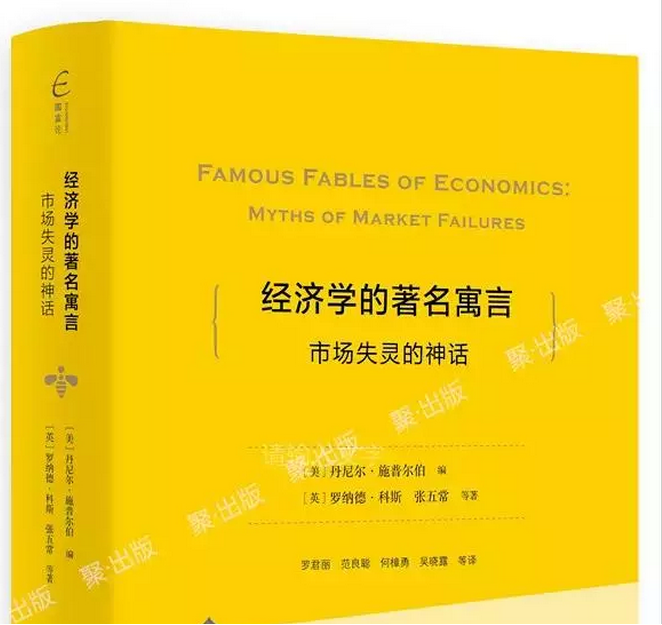
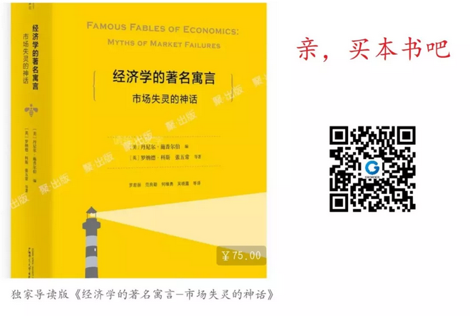

# 经济学中的"搭便车"现象 \#F1900

原创： yevon\_ou [水库论坛](/) 2018-08-15

**经济学中的"搭便车"现象 ~\#F1900~**

 

"公共产品"这个补丁，并不需要。

 

 

一）前言

 

前二天"米宅米宅"被封了，水库兔死狐悲。惶惶不可终日。

看这架势，"干死地产大号"真没法活了。黑五类

 

可是呢，小伙伴们仔细研究了一下"米宅"的这张图。提了一个问题：

水库去哪里了？

  

水库每天的访问量，都超过100000+，一周累计超过80W。

地产类的榜单，绝不可能没有水库的。

 

小伙伴们研究了半天，才发现原来水库被归类于《投资理财》。于是抱头痛哭。有一股韩国电影《紧急措施19号》的既视感。

 

 

事已至此，小伙伴们继续追问，"要不，咱也去买二斤雪花膏，涂在脸上"。

从今以后，水库冒充情感八卦号好了。

 

情感八卦号，动辄1000W粉丝。

水库这种小虾米混在里面，连前100都排不进。

小伙伴于是又大哭，把脸上的妆都弄黑了。

 

 

说起来，水库也是一个很奇葩的号。因为你从没见过任何Popular的号，象水库这么热衷于"讲科学"。

水库不仅花了很大的篇幅，讲经济学基本原理。

而且很少追社会热点。现象级100000+的役苗，药神，虐童，我们都不怎么跟。

 

娱乐至死的年代，水库讨论的却是《[[公路的彻底收费化]](http://mp.weixin.qq.com/s?__biz=MzAxNTMxMTc0MA==&mid=2651017219&idx=1&sn=2fbd2c5c75f8febe082d985ffb4546d2&chksm=80720610b7058f065c103bc24eebfcc0e284d7b76123403249d72dbcb985f4fce714d028fc79&scene=21#wechat_redirect)》《[[携程提价，该不该谴责]](http://mp.weixin.qq.com/s?__biz=MzAxNTMxMTc0MA==&mid=2651017475&idx=1&sn=1000ae0fdb76a806813921103e6d26c2&chksm=80720710b7058e06039e9c1bbfc6b5c39e28d7ee8a8039d22fd4b0b1d5b5fcc60136282b0250&scene=21#wechat_redirect)》

 

要不，咱们今天继续写篇经济学。

 

 

 

二）灯塔

 

这二天在看书，看一本很厚的书。奥派书籍《市场失灵的神话》 

[item.jd.com/28482568897.html]

 

书很厚，而且很枯燥。害得我更新都少了。

我运气不好，从中间开始翻的。一开始看费雪通用的收购案，洛克菲勒的敲诈案，iMac和VHS标准的陈年往事。

虽然很精彩，但不足以写篇文章。

 

一直看到第三章：19世纪的美国收费公路。

第二章：苏格兰海岸的灯塔。

忍不住拍手击掌，哈哈大笑。

 

 

 

这二篇故事，讲了一个"公共产品"的典故。待我慢慢道来。

 

在古典经济学中，有一个"公共产品"的概念。指的是，某项东西，具有太大的外部性效应。收费又太艰难。因此不可能由私人来提供。

每个人都可以"搭便车"的话，就收不到钱。

 

"公共产品"是古典经济学重要概念。

证明政府之不可或缺。某些时候，没有政府，就没有人治理黄河，修建水坝，研究水稻良种。

 

 

 

英国经济学家，为了说明"公共产品"的概念。引用得最多的例子，一般是灯塔。

（外海灯塔）

 

18世纪的英国，非常依赖海洋贸易。船运业，几乎是整个英伦的经济命脉和物资来源。

但是古代水文条件很差。航海技术也很差。

水中密布礁石，没有精确的航图，就很容易触礁。船货二失。

 

因此英国海运，非常依赖"灯塔"。

灯塔在茫茫大海中，提供了一个坐标。极大地纠正了航线，也减少了海盗。

 

 

问题是，灯塔是一个非常典型的"公共产品"。

因为你几乎没法，对来往过路的船只收费。

你根本不知道有多少艘船，享受了你的服务。也无法屏蔽掉某一艘船，不为它服务。

 

顺理成章的推论则是，灯塔这样的"公众产品"：

-   只能由政府提供。

-   为了"公共产品"，政府是必需的，不可或缺的。

古往今来，几乎所有的出版社，都是这样解释，这样印刷的。

  

然后呢，奥派贴上了四个大字：

以上全错 

 

 

哈哈哈哈哈，书上说，18世纪的时候，2/3的"灯塔"是由私人运营的。

只有不到1/3的灯塔，是由"领港工会"国营的。

 

"灯塔"原来是私营企业。

那是怎么回事呢？

 

 

 

三）收费制度

 

如果"灯塔"是私营的。那它怎么收费呢。

如果存在"搭便车"现象，那它怎么收费呢。

  

答案是，收"进港税"，每艘船几个便士。

因为大海其实吃水很深的。真正要有"礁石"，往往已经到了浅海。

灯塔到港口的距离，说近不近，说远也不远。一般就在10，20，40英里数量级。

 

你既然已经开到如此靠近港口的地方，那我收你几便士的"进港税"，那也是合理的。没有问题。

 

 

-   那么，过路的船只呢。

-   海盗和渔民的船只呢。

-   去下一个港口或者去外国船只呢。

 

那\~就\~不\~收\~了！

 

哈哈哈哈，哥哥看到此处，仰天大笑，把书扔了出去。

经济学千古之谜，又解决了一个。

 

 

 

四）完美

 

为什么，因为凡是讨论"公共产品"的人，都犯了一个错误。一个无可救药的错误。

完美主义的错误。

 

古典经济学，讨论"搭便车"现象，主要集中在"无法穷举收费"，总有人逃票，总有人漏网。

 

 

但这是不对的。这在逻辑上犯了一个bug。

"我为什么要对100%的人口收费"？？？

 

事实情况是，你并不需要对100%的"受益人"收费。你只要收85%就够了。某些情况下，50%也够了。

 

对于"英国灯塔"这个例子。它每艘船只收几便士的费用，任何人都可以承受。收费率也不高，毛估最多50%。

 

但是这些"收入"，已经足以它建设"公海灯塔"。

灯塔还是造起来了。

这就成了。

 

 

在现实世界中，这种"不完美"情况比比皆是。

Windows永远收不到每一个盗版的费用，许多人电脑里用的，都是"未激活"版本。

"拜拜甜甜圈珍珠奶茶方便面"，满世界都在传唱。而《火箭少女》也永远收不齐版权费。 

卡路里火箭少女101 - 卡路里

 

SO WHAT！我们的世界，依然在向前前进。

灯塔造起来了。

Windows开发出来了。

唱片界依然繁荣。杨超越拜拜。

 

\* 对之前"药神"事件，也作出了完美解答。你不需要100%收费率。

 

 

五）不完美的世界

 

以下部分，不是书的内容，是我的原创。

 

或许有人问，那么，为什么不能杜绝"搭便车"现象呢。

搭便车是否严重损伤了我们的生产力。

 

譬如说，你说英国灯塔的"收费率"是50%，可是它为什么不是100%呢。

如果是100%，岂不是可以造更多的灯塔。

 

如果MS Windows收齐每一份盗版费用，岂不是可以开发出更好的软件。

如果《知识产权》得到完美的保护，那么我们的生产力，一定可以大大地再向前一步。

 

 

这段话逻辑的错误，更早在《[["信息不对称"是伪科学]](http://mp.weixin.qq.com/s?__biz=MzAxNTMxMTc0MA==&mid=2651015322&idx=3&sn=458b83fb16bc48016e763526e1d60205&chksm=80721e89b705979ff1c3a3189cec1c172c59b251a1416c08bb9940bb5fbcaf16cf10e8bd2bd7&scene=21#wechat_redirect)》\#F750一文，已经完美地辩解了。

 

"田园教派"总是希望我们这个世界是透明的。所有的商家和消费者，可以拥有同等数量、质量、无死角、无隐藏的信息。

如果可以做到"信息全明"，一定可以大大推进我们的生产力。

 

但当年水库说，这是不对的。

"地图"不是明的。"开地图"是要钱的。

"信息"本身是一种商品。是一种付费制造的商品。

  

 

当一个品牌经理，准备推出一款新的牙膏。他心中惴惴不安，有二个选择。

1）花40W元，做一场严尽的市场调查。

2）不花钱，闭着眼睛推向市场。

 

你选择市场调研，你就亏了40W元。

有时候你闭着眼睛往前冲，反而赚得更多。

"市场调研"和"制造成本"，同样都是成本。\
\
对于企业老总来说。只有一笔经费。应该改善品质，市场调研，还是降低价格，这三件事是完全等价的。

企业的竞争，是各个维度上的竞争。

 

 

 

同样道理，"收费科技"也不是与生俱来。天生刷满100%的。

新手村可能就30%，然后也需要你Upgrade，逐渐提高科技树。

 

譬如说，第三章讲，原来"高速公路收费"，居然不是中国人想出来的。

早在1820年，全美国98%的公路，都是收费的。美国佬玩烂掉的东西。

只不过当年，路上跑的是："马车"。

 

和今天财源滚滚不同，1820年美国的"收费公路"业，巨额亏损。最后不得不全面取消。

因为当时都是泥路。马车很容易在最后1KM跳下泥垦，跳到玉米田里，然后逃之夭夭。

 

 

而今天的"高速收费公路"呢。

今天的中国Hwy，二边都有彩钢板。是全封闭道路。

还有24H不间断摄像头。做坏事马上就可以抓到。

更高科技的是，车牌业主，瞬间识别。

因此收费率几乎100%，没什么逃票的。

 

有人问，二侧的"彩钢板"能不能省下来，摄像头能不能省下。

单造一条公路的话，岂不是成本更低。可以多造几里。

 

答案是不能省。"安保设施"本身也是产品的一部分。

企业建造的并不是公路，而是一体化产品。

 

 

 

六）搭便车

 

人类的"收费科技"一直在进步。

在改善产品的同时，人类也在绞尽脑汁，如何抓逃票。这同样都是"升级科技树"。

 

"灯塔"问题放在今天，天上或许就有无人机在巡逻。

更先进一点，能有卫星导航。在天上盯着，每一艘船都不放过。

不付费的后果，灯塔扫到你的瞬间，我能把光遮掉。

 

 

 

一些传统意义认为"搭便车"无法处理问题。其实都是可以计算的。

例如大气污染。在一个污染地块周围，我完全可以竖一圈脉冲激光阵列。

从该地块逸散的二氧化碳，每一个摩尔都可以统计。

 

如果你真的想治理黄河，就一定有人，能想出问黄河居民收费的办法。

 

这些"搭便车"行为，之所以没有去管，不是因为做不到，而是因为"不划算"。

就好比18世纪爱丁堡，你让他研发一款"无人机"监灯塔收费，成本将是天文数目。

与其这样，马马虎虎收50%够了。

 

 

 

对于某些圣母心来说，她们渴望"收费率"达到100%，完全杜绝"搭便车"现象。

如果没有搭便车，我们的世界会变得多么之美好。

 

她们的错误在于，企业点亮"收费科技树"，一样要研发的。需要40W经费。

企业主一样在衡量，是继续增加品质，降低价格，还是多雇几个人抓逃票。

 

 

我们的世界，天生就是残缺，不完美的。经济学不追求完美。

某些事物，因为"收费模式"研发不成功。那他就不应该被发明出来。

如果市场真需要这东西，企业家一定能绞尽脑汁发明"收费模式"的！

 

 

 

七）结语

 

-   "公共产品"是伪科学

-   "搭便车"也是伪科学。

-   政府在经济领域的角色，并不是必需的。

-   公共产品这个补丁，在经济学中，根本就不需要存在。

 

结语十分简单，只有一句话：

 

市场创造一切

 

 

 

（yevon\_ou\@163.com，2018年8月14日丑）
