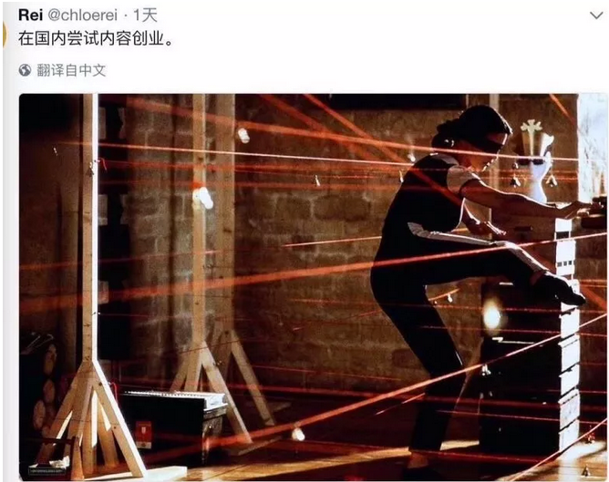
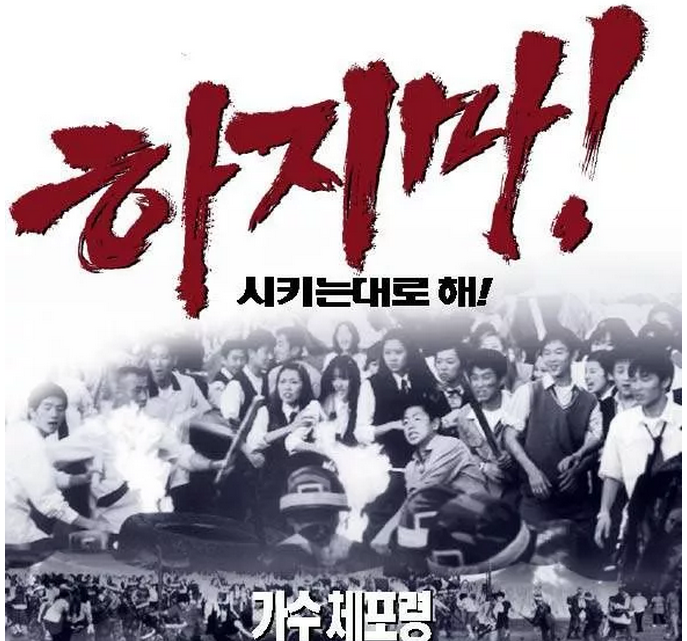
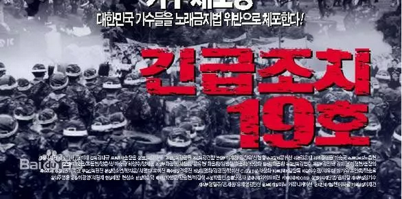
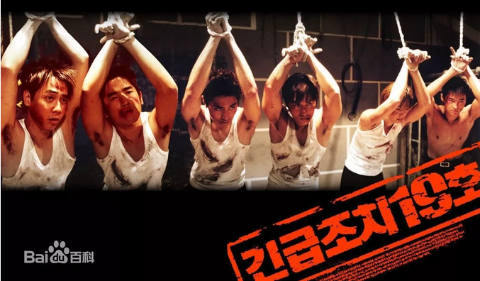
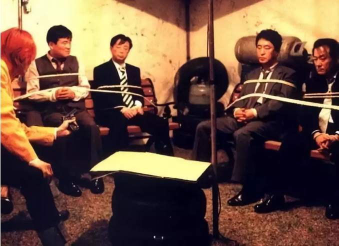

# 《紧急措施19号》 \#F1910
------------------------

原创： yevon1ou [[水库论坛]](/) 2018-08-17

**《紧急措施19号》 ~\#F1910~**
==============================

！！！

一）前言

 

唉，你让我说什么呢。你让我能说什么呢，你让我还能说什么呢。

 

各位，我发现想要为读者们提供"优质的服务"越来越难了。这个成本逐渐上升，最终升到了水库无力承担。

 

虽然哥哥上知天文，下知地理。

从宇宙到量子全都能扯，处处都有精彩智慧。

可是"合规性"之后，我除了唱红歌，真的没东西写了。

 

各位读者常常抱怨"没有干货"。你们啊，是身在福中不知福。

放眼整个互联网世界，还在坚持输出"干货"的号，还剩几个？

 

目前"讲真话"的成本，已经升到了非常非常之高。高到水库无法承受。

宛如风中之烛，随时可能熄灭。

 

等到哪一天真的被封号了，你们又不关注备用号。

找不到就找不到吧，反正你们也不用唤醒。沉睡着最舒服。

水库尽一切努力，为读者提供"有价值"的内容。

特殊时期，我们不是"地产自媒体"。

我们是"情感八卦号"。

 

今天我们不写正文，我们写影评。韩国电影《紧急措施19号》

 

 

 

二）电影

 

在上一篇《[[经济学中的"搭便车"现象]](http://mp.weixin.qq.com/s?__biz=MzAxNTMxMTc0MA==&mid=2651018534&idx=1&sn=173dd9a100282e4787299ea7e36ba1a4&chksm=80720335b7058a23cf4db8a02c3c497368178e97932cc5c9170f08eff1c750f9659829ebff37&scene=21#wechat_redirect)》，我们提了一句韩国电影《紧急措施19号》。

这是一部很古老的电影，上映年限2002年。

 

我估计整个水库网络世界，也没几个人，看过这部片子。哪怕是\#F1900特意提了以后。

 

 

这是一部荒诞喜剧片。

讲的是迈克尔杰克逊，当选美掴总统之后。有一个韩国歌手，竞选国会议员，并意外获得了成功。 

 

"秘书长"眉飞色舞地向韩国总统报告了这个盛况。说歌手包下了一个5万人的体育馆。演唱会举行的时候，万人空巷，水泄不通。票子要加钱才能买到。

某些女粉丝，因为太激动，昏倒在楼梯入口。\
\
秘书长一边说着，却没有注意到韩国总统的眉头，越皱越紧，越来越难看。\
最后，总统打断了秘书长的喋喋不休，并且说：

"看来，我们得颁布一条法令，紧急措施19条"。

 

 

该条法令宣布：

-   歌手，被视为罪犯。

-   全韩国范围内的所有歌手，立即逮捕

 

法令一出，顿时鸡飞蛋打。

有的歌手，被演唱会现场逮捕。有的歌手，从被窝里拖出来。有的歌手，在声乐学校被捕。"唱歌"被视为非法行为。

 

面对逮捕令，歌手们也纷纷跪逃。有的歌手去做了整形手术，变声手术。有的歌手，宣布放弃演艺事业。还有的歌手，忙着揭发平日同事。

 

 

 

片中的男一男二，叫做金章勋和洪京敏。二个人趁着混乱的歌迷见面会，爬桌子底逃进了下水道。一连在下水道躲了好几天。

 

当他们又饥又饿，快要绝望的时候，他们遇见了安七炫。

作为地产公众号，安七炫也被通缉中。三个人在下水道偶遇，忍不住抱头痛哭。

 

没想到刚哭了一会，安七炫的手机响了。是他女朋友打来的。

安女朋友告诉他，他可以出来了，没事了。"因为政府认为他是Rap，而不是歌手"。

 

金洪安三个人面面相觑。忍不住又大哭一场。

故事的结局，秘书长为了抓捕金章勋和洪京敏，在电台电视台宣布这二人是强奸犯。会对民众造成极大的威胁。

 

而勇敢的男主人公，则试图潜入电视台。发表声明自己的无辜。

结局毫不意外，他们被聪明的警察：抓\~住\~了。

 

 

秘书长得意洋洋地押解着男一男二，向总统汇报，全国最后二个歌手也被抓住了。以后全韩国，保证再也没有人唱歌。

总统坐在黑暗里，面朝里皮具沙发。冷冷地说：

 

"不用了，把他们都放了吧"

"第十九号禁令取消"\
"哪怕在最最危急时刻，这些歌手也没有显示一丝一毫的政怡影响力。也没有试图反抗"。

"因此，第十九号紧急措施是不需要的"。

 

 

 

三）歌唱业

 

韩国面积10万平方公里，人口5100W。

单纯以国土和人口论，和浙江省差不多。

 

韩国的六大支柱产业，依次是电子，钢铁，汽车，造船，房地产，石化。

著名的"韩流"，文化产业占GDP约2.5%

 

 

 

在虚构的电影中，"韩国总统"一旦知道"歌手"对他不构成威胁。立刻就撤销了19号禁令。

 

如果你脑洞大开，你设想一下，总统"坚持"把19号禁令执行下去，会发生什么。

答案是，他真的是可以把"歌唱业"连根拔除的。

 

通过宣布"唱歌"为非法，在公开场合禁止一切的唱歌跳舞行为。

即使在黑市仍有部分留存，但份额一定是大大减少。

"韩流"的GDP，绝对可以从现在2.5%，降到0.025%

 

 

 

但问题是，何必呢。

电影中的韩国总统，头脑非常清楚。国家和民族的竞争，是非常残酷的。每一个产业，就意味着一分国力。

拼了命地把产业做活都来不及。

 

以"文化产业"为例，虽然不如电子、汽车这么高精尖，但是依然养活了几百万人口，贡献了数以亿计的韩元税收，2.5%的GDP。还大大提升了人民的快乐。

 

如果没有了"韩流"，则意味着韩国人引以为傲的歌舞，MTV，美妆，美甲，电影、电视，化妆品，女装，全都失去了竞争优势。

 

本质上来说，总统和"歌唱业"没有仇。他也绝不想连根拔掉歌唱业。

 

 

 

老派的人士往往认为，产业分高低。例如"电子，汽车"，就比"建筑业，歌舞业"要更高档一点。

 

但是现代经济学研究则认为，"边际效益"惩罚是非常严重的。堆再多的人去搞石化，也不能提高产量。反而因为失去了娱乐业，会让人民百姓很不高兴。

 

例如，象杨超越这样的人，你让她当一个化工工程师，还不如去杀鱼。 

 

在电影中，"秘书长"并不具备这样的大局观。

他纯粹为了一己私利，为了剿灭而剿灭。到最后，甚至都忘了"初心"。

等他高高兴兴抓捕最后二个歌手时，他已经完全忘了，当初为什么要围剿"歌唱业"。

 

-   非得把"歌唱业"逼死，何必呢。

-   非得把"歌手"都抓走，何苦呢。

 

没事你非得把自己一个个支柱产业，全部都敲断掉。回到1960s。

您干嘛呢。

 

四）私心

 

我们继续脑洞大开一下。在《紧急措施19号》隔壁，还有一个排档，是卖"弹球小钢珠"的。

 

在最初的时候，小钢珠的生意很好，少男少女下课后，都喜欢去玩二把。零花钱也就渐渐地流入了老板的腰包。

可是"弹球小钢珠"的老板，舒服了十几年之后，他渐渐地发觉生意不行了。

新一代的85后，90后，他们不喜欢玩"弹球小钢珠"这么单调无聊的游戏，而是喜欢去演唱会，听《东方神起》的劲歌劲舞。

 

小钢珠的老板们，不去反省自己的产品线陈旧，玩法单一，总是让人亏钱。而且老千频出。

不知道从什么时候起，在"小弹主老板群"里，甚至传出了一个说法："股市和楼市是跷跷板"。

 

 

"弹球小钢珠"老板们，天真地以为，只要把听演唱会的艺人都赶尽杀绝，把Super
Junior解散，那些追韩哈韩的用户，就会继续回来，玩他们的小弹珠。

 

而且最近几年，弹珠市场越发地不景气。盘点了一下昨天营业额，居然只有2705.19元。

小弹珠老板们急了，还有那么多机器等着喝水。于是，他们成了"抓捕艺人"喊得最凶的人群。

你说，这种事能得逞么。病急也不能乱投医啊。

说唱艺人哭丧着脸说："大哥，95后在玩一个东西，称作'币圈'"。

"这玩意，才是股市的同生态竞争品。完美地抢走了你所有生意"。

"95后哪还有人炒股啊"。

五）结语

 

打死房地产，对任何人都没有好处。

国家一根根支柱产业，都打瘸了，最终只能国力衰退。

 

每一个行业，都有其从业人员。

我们衡量物业的好坏，评估板块的前景。赚的是专业的饭碗。

天庭的事情，我们并不关心，也不违抗。最多躲进下水道里。

 

股市有其自身的痼瘤所在。和楼市真不是"跷跷板效应"。

日益繁复的监管，越发不公的老千。"币圈"才是股市的同生态位竞争品。股市真应好好考虑，95后用户流失的问题了。

 

这锅，楼市不背。

 

（yevon\_ou\@163.com，2018年7月17日寅）

 

 

唉，广告都没了。日子没法过了。

广告投放，请联系助理微信：ZM19654321
