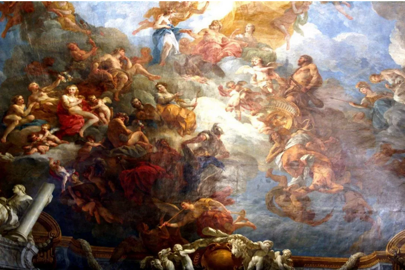
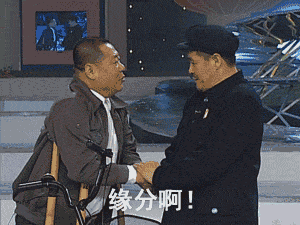

# 做慈善和真慈善 \#F1920

原创： yevon1ou [水库论坛](/) 2018-08-22

**做慈善和真慈善 ~\#F1920~**

 

你需要一双鞋子么

 

 

一）慈善

 

晚上去听演讲了。清华科技园。

象哥哥这样的人，你让我正襟危坐二个小时，听一场演讲。自然非同小可。

没错，听的是任侄强，任大炮。

 

演讲的主题是：《[企业家精神和社会公益](http://mp.weixin.qq.com/s?__biz=MjM5MTYwNzYwOQ==&mid=2655585500&idx=1&sn=c964ddebd62058170b043e25fd7d549c&chksm=bd0f5a8a8a78d39ce91b6fd7fdf1477bdca9d579732bba1764eed2aeead276c0f87b9b1fde9b&scene=21#wechat_redirect)》

这个话题实在是有趣极了。正来反去，可以颠倒好几层。

 

 

 

在整个歧视链的最底层，是圣母和部分左翼人士。

他们的意思是：慈善是好的，商业是不好的。

 

具体说起来，他们的诉求，归纳为："你拎着二袋大米到我家来，白送给我，这是好事。大大的好人"。

"可是如果问我收钱，哪怕打折销售，你也是坏人。万恶的奸商！"

 

圣母和左翼渣滓的诉求，其实就是"我要福利，但不给钱"。 

（不要犹豫，你跺你也疼）

 

不要犹豫，你跺你也疼。

当哥哥还是小孩子的时候，我也有类似的想法。最好天上能掉"馅饼"。

原始人对利益的算计，就是只看眼前三寸。给钱就是娘。

 

小孩子终究要长大。

成年人的世界，需要意识到馅饼从哪里来。因此就进入了第二阶段。

 

 

 

二）商业

 

成年人的第二阶段，默认"付费合理"，但是......

 

他们认为：

我们整个世界，还是要以商业为主导。辅以部分的慈善行为。

 

人类的动作行为，90%基于买卖支付。

但是在政府税收之余，挪出部分财政资金，补贴孤寡老人。有些有良心的大商人，主动地拿出财产做慈善。

 

世界的运行，依赖商业。坐吃山空，是不行的。

也就是某些人常说的"既要......也要......"。

 

这一类的想法，构成了目前世界的主流。也一手导致了，现今民主社会下，失控的福利政策。

 

 

今天任老的演讲，大致处于2.5的阶段。

其核心思想是：

-   慈善是必须的。是缓和社会矛盾的爱。

-   政府主导的慈善，是低效率，浪费的。

-   企业家主导的慈善，能获得更高的效率。这也是企业家的责任。

 

任老花了大量的篇幅，来讲述"爱"。说当社会贫富差距很大时，社会是不稳定的。

 

 

任老接着说，"政府慈善"的反作用力。

譬如说，目前的基层干部，已经禁止对同一户家庭，一年之内进行"二次"贫困审查了。

 

因为你第一次审查，鉴定他为贫困户。

半年后第二次审查，他把政府送的牛宰了。村子里还多了三个40岁中年妇女，特意不上班。

 

为什么，上班了他就"脱贫"了。就拿不到政府赠送的牛了。

政府扶植的"扶贫"，很容易摧毁当地公序良俗。反而搞得越发返贫。

 

 

任侄强认为，扶贫"慈善"也应该走"企业家"道路。

只有企业家，才能真正地四两拨千斤。才能真正把财富送到农民手中。

 

任老举了"任小米"计划。

在阿拉善SEE的沙漠地区，当地的水资源十分贫瘠。

对生态威胁更大的，则是地下水的不断枯竭。

 

因为大树的根，一般在-3米左右。如果地下水位持续下降，例如降到-4\~5米，大树就吸不到水。树就会枯死。继而带动整个生态的崩溃。

 

"任小米"计划，鼓励当地的农民种小米。然后统一收购。

小米既养活了当地人的口粮，又锁住了地下水分。目前几乎可以做到水位不下降

 

进一步增加微滴灌设施的话，甚至可以让地下水位回升。

一旦地下水升到-1米左右。整片生态绿化就全活了。沙漠化逆转。

 

 

收购小米补贴的"差价"，对于马蔚华，柳传志，任潘这样的大巨头来说，完全可以承受。

通过"以工代赈"，带动了当地牧民的生产习惯，勤劳分配。

并且把补贴费用大大削减十倍。

 

 

哥哥在台下听得十分迷惑。因为任的观点，和整个奥派是完全冲突的。

在奥派的眼里，就是"以上全错"。

 

 

 

三）奥派慈善

 

道教的核心观点，是"天地不仁以万物为刍狗"。

在奥派的眼里，天地是一个整体。你的"干扰"越少越好。

 

"天行有常，不以尧存，不以桀亡"。

天地之间的运行，有他的自然规律，你不要去干扰他，不要去人为地扰乱他。

 

 

譬如说，政府如果去贫困山区，免费发放耕牛。

最贫困的一户家庭，可以分到一头牛。

扶贫的本身，就是鼓励了"最懒惰，最愚蠢，最怯懦"的一家人。

 

而村子里最富裕的一家人，不仅得不到奖励。反而还要纳税帮助弱者。

"最优秀，最勇敢，最聪明"的基因被大大削弱了。

 

如果政府扶贫，福利制度的危害性人所共知。

那么，改成企业家扶贫，又有什么区别呢？

 

 

企业家扶贫，如果企业家的"效率"可以提高十倍。那么，他们的危害，也只能提高十倍。

以沙漠"任小米"为例。如果该地区的农民，获得了如此巨大的补贴&指引。

 

那只会吸引方圆百里的牧民，更集中地居住到阿拉善来"蹭补贴"。

而阿拉善本身的居民，如果轻易获得了"外部能量输入"，则会鼓励他们改善生存。几代之后，人口暴增。

 

 

阿拉善地区，本来是因为生态环境恶劣，导致抽干地下水位。

而你的"补贴"行为，只会导致新一轮的人口爆炸，从而使该地区生态更更加恶劣。

你种的小麦再节水，能抵得过二倍人口么。

  

生态恶劣，意味着该地区不宜聚集太多人口，疏散为宜。

而你的慈善行为，完全扭曲了价格信号。

 

\*
如果有大量的白领，愿意放弃工作和薪酬，付100000/年参与这个项目。则意味着几位大佬的身边，吸引了高密度"精致的利己主义者"。

 

 

 

在奥派经济学中，有一个非常经典的问题：

人该不该穿鞋子。

 

因为标准的奥派崇尚自然，反对一切人为"干扰"的因素，动辄反对破坏"信号"。

那你还穿鞋子干什么？

 

因为穿鞋子，使得人类的脚步皮肤极大退化。赤脚完全不适应山地行动。

非洲的土著，赤脚可以在草原上奔跑。但是现代人完全不行。跑几步就扎脚。

请问现代人，面对非洲土人，是否失去生存优势。

如果大洪水来临，是否容易灭绝。

卫斯理有篇小说《双王》，讲的就是一个坚持不穿鞋的女土著主人公。

 

 

这个问题的答案："如果你只能偶尔买一双鞋，不要穿鞋打乱平衡。如果你永远买得起鞋，你就应该买鞋"。

 

 

现代人的某些基因，已经严重依赖"人造工具"。

工具成了人类延伸一部分，我们该不该使用工具？

 

例如现代人，你抛给他一块生肉，几乎没几个人可以带血吃完。

-   几万年习惯使用火。使得现代人脸部变窄，咀嚼能力下降，只能够吃精制食物。

-   现代人肠道变短，节约消耗。但却无力消化生肉中的全部能量，只建议吃熟食。

-   现代人动辄过敏，菌群严重缺乏。不能抵御生肉中的微生物。

 

 

回到阿拉善沙漠这个例子，你要搞慈善，你就要想清楚是"永久性"的，还是"一次性"的。

科学技术的提高，是永久性的。某些商路的打通，是永久性的。超廉价物品，是永久性的。

而"慈善性"行为，是一次性的。

 

 

如果你是"一次性"行为，你就打乱了当地要素分布。形成了不合理的资源定价。

如果阿拉善最终发展成为一个大型市集，

当"慈善组织"最终退出时。

将会是一场大型的生态灾难！

 

 

 

四）第四重慈善

 

(本节简略)

 

在经典的奥派学说中，奥派是反对慈善的。

Charity is devil

 

不仅不能给慈善组织以免税待遇，而且还要加税，加重税。

因为慈善就是行恶，行大恶。一条坏的福利政策，比杀人放火还要坏。

这些都是已有的框架。标准学术，老生常谈。

 

 

 

哥哥在台下听演讲，听得神思恍惚之时，突然想到，还有第四重慈善。

有一种慈善，它是好的。是"真慈善"。

 

你以为的真慈善，对社会有害，其实是假慈善。

你以为的假慈善，对社会有利，其实是真慈善。

 

 

"真慈善"的定义，你去了当地，大做好事，用"爱"感化了当地人。

无论是帮助贫穷，帮助弱者，最终是获得了他们的善意。

用"爱"弥补了贫富差异。缓解了"失意者"的愤怒。缔造和谐社会。

 

"真慈善"的受益人，其实并不是穷人。而是你自己。

为穷人所做的一切，获取他们的好感，其实在帮你自己。

那这就不是慈善。是残酷的马基雅弗利。

 

 

俺仰望天空，想得眼泪都快流下来了。隐隐约约有一条线索。

-   你所作所为，短期补贴，价格扭曲，对当地人未必是件好事。

-   你收获了好名声，最终你是最大获益者。

 

这是什么，这是伪善啊！

 

搞了半天，原来影帝才是最大赢家。

真是不服不行啊。

 

 

 

（yevon\_ou\@163.com，2018年8月22日子）
