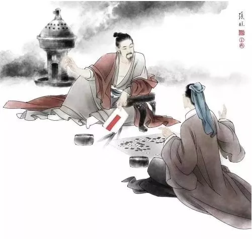
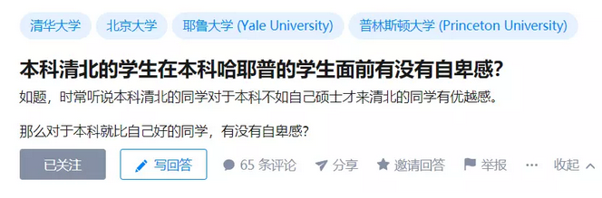
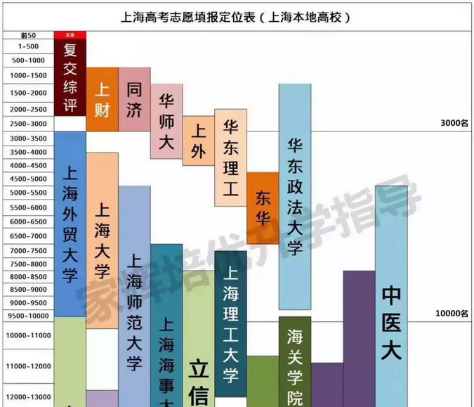
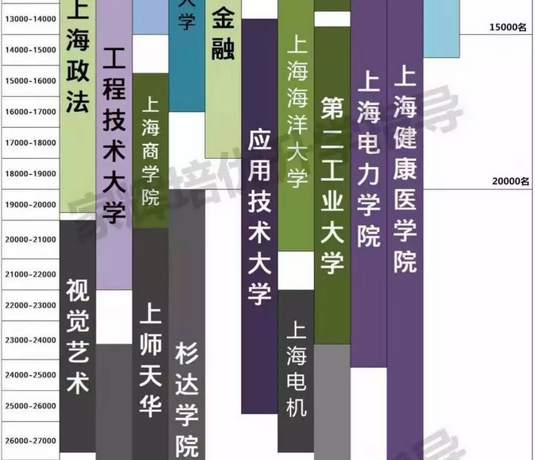
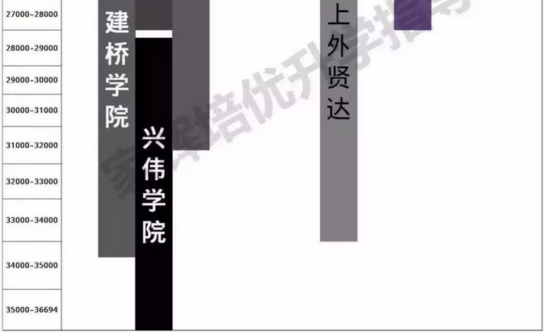
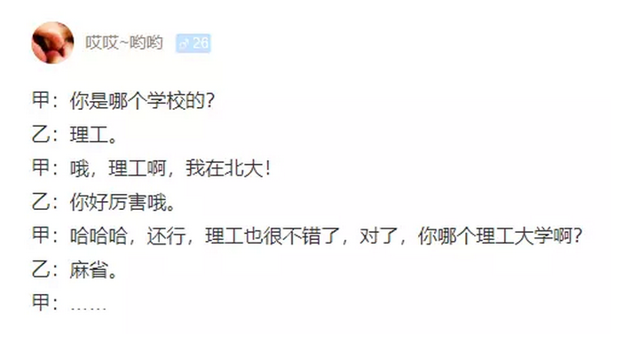

# 清北学生在哈耶普面前有没有自卑感 \#F1940

原创： yevon\_ou [水库论坛](/) 2018-09-04

**清北学生在哈耶普面前有没有自卑感 ~\#F1940~**

 

[zhihu.com/question/285871141]

 

呃，你要说完全没"自卑"吧，那肯定是不可能的。

毕竟彼此之间"身份地位"差那么远，一个如繁星璀璨，一个只配去前台当文秘。

 

虽然学历低点，档次贱点。未来也没什么出路，很可能去环卫局扫马路。

但是对弱者要怜悯，表面上还要礼仪客气。屈尊纡贵，谈笑风生。

 

"来，前程广大的同学，请上座"

哈耶普的同学，屁颠屁颠凑上来了。抽你娘的耳刮子，十七八个耳光打下去。

 

[v.qq.com/x/page/c0752gmw5uq.html]

我们说的"请上座"，指的是清华北大的学生。

哈佛，耶鲁，普林斯顿什么三流技校，赶到佣人房去。

 

 

 

一）名校

 

"知乎"是一个屌丝三校生聚集地。看问题，无疑也和农民皇帝金锄头一样幼稚。

 

对于底层人口，他们对于世界的认知，大致是：

-   博士生 \> 大学生 \> 中学生 \> 小学生

-   省重点 \> 市重点 \> 区重点 \> 非重点

 

就像水库整天嘲笑的"学区房"一样。湖南湖北的妈妈，绞尽脑汁，把孩子送进重点幼儿园\--重点小学\--重点初中\--重点高中，以为这样就能有"美好の前程"。

 

 

中国的大学制度，最底层是211。

稍高一层是985

再高一层，是Top 8，或者Top 4，北清复交人科南浙。

在整个学术链最顶层，是Top 2："清华北大"。

 

（注意左上角小字） 

比"北大清华"更好的学校有没有。

很多农村人凝思苦想，翻开"世界名校排名"。咦，"北清"只有100名左右嘛。连新德里大学，都比我们排名强。

 

  **排名**   **学校名称**         **学校英文名**                                       **国家地区**
  ---------- -------------------- ---------------------------------------------------- --------------
  1          麻省理工学院         Massachusetts Institute of Technology (MIT)          美国
  2          斯坦福大学           Stanford University                                  美国
  3          哈佛大学             Harvard University                                   美国
  4          加州理工学院         California Institute of Technology (Caltech)         美国
  5          牛津大学             University of Oxford                                 英国
  6          剑桥大学             University of Cambridge                              英国
  7          苏黎世联邦理工学院   ETH Zurich - Swiss Federal Institute of Technology   瑞士
  8          帝国理工学院         Imperial College London                              英国
  9          芝加哥大学           University of Chicago                                美国
  10         伦敦大学学院         UCL (University College London)                      英国
  11         新加坡国立大学       National University of Singapore (NUS)               新加坡
  12         南洋理工大学         Nanyang Technological University, Singapore (NTU)    新加坡
  13         普林斯顿大学         Princeton University                                 美国
  14         康奈尔大学           Cornell University                                   美国
  15         耶鲁大学             Yale University                                      美国

 

那么，"世界排名"前三的学校如何。是不是就比"中国前三"的强啊。

顺着这个思路，才问出"清北学生在哈耶普面前，要不要自卑感"。

下面居然还有389个回答的。还有一堆人叫好。

 

统统都是SB，以上全错。 

你能赞同这种问题，本身就说明你是"下等人"，"技校生"。

其中99%的，不可能是北清学生。

素质一塌糊涂，根本就不配上大学。

 

 

 

二）分值

 

为什么，因为绝大多数"社会底层"，他们看待人才和指标，是"一维"的。

 

好比吕布武力值100，关羽99，赵云97，黄忠92

吕布遇上关羽，就一定可以武力值战胜。

若是不胜，他们要大惊小怪"系统出了问题，不公平"。

 

 

对于"读书"这件事，他们默认"天下名校"是排名的。打分就象"武力值"，有100分，99分，97分，92分............一级还可以压一级的。

 

这种"单细胞生物"的脑容量，三观印象，作为一个底层装配线员工，是有资格的。

哪怕读个高中，技校，马马虎虎也放水过去。

可是要对于"大学素质"教育，这样一维世界观，是完全不够资格的。

 

换言之，凡是提问，支持，点赞的人，他们根本就没有资格上大学。

 

 

 

纵观中国的教育，从小学一年级，到高中三年级。十二年间，我们可以称为"通才"教育。

通才教育：用的是普适的课本。完全互换的通用件。

全国几亿学生，内容是一样的。

 

但是，到了高三末期，尤其大学开始，是要"分专业"的。

众所周知，高中要分"文理班"。

大学要分冶金专业，地质专业，通讯工程，电子工程，国际贸易，管理会计，金融证券，医学生命，工民建筑，汽车机械.........

 

到了大学以后，你就是"专用件"了。

一名"通讯工程"的学生，和一名"汽车机械"的学生。你要说哪个更优秀，那是非常难判断的。

 

2000年代，"中国移动"是全港股最赚钱的公司。电讯巨头如日中天。

可是如今，"通讯大船"已沉。反而是新能源汽车，电动蔚来汽车，迎来了又一春。

 

你把"专用件"拿来比试大小，本身就是愚蠢的。

专用件只有适者生存。

 

 

 

三）北清专用件

 

那么，"清北"的专用件是什么。专业对口是什么。

这事问问你的父母，几乎老一辈人都知道。他们会神神秘秘地对你说：

 

做官

 

不要看俞敏洪逐出体制，一代移民教父。也不要看王牧笛创建了"功夫财经"。

这些都是北大的二流份子。

 

真正清华北大中的菁英呢："做官"。

清华几乎就是当官，当大官，当顶级大官的唯一通道。 

 

在日本政界，长期存在"东京大学"现象。

日本的内阁，厅房长官，首相，普遍都是"东京大学"校友。

只有东大本科，才能升职迅速，而且顶峰不可限量。

 

在日本历史上，只出过少数几任"早稻田"大学的首相，也因此在政界吃不开。施政处处受阻。

例如石桥湛山（55任），海部俊树（76任），小渊惠三（84任）等。

 

 

如果你看中国的"京官"圈子。则"清华当官，北大经商"基本已经成为共识。

-   重点培养的"明日之星"多数出自清华。

-   李彦宏，李国庆，丁健，王志东，"北大毕业"是迅速积累互联网名望和人脉的最好方法。

师兄弟互相提携，北大人几乎垄断了证券业，垄断了互联网创业圈。

 

 

 

四）哈耶普的作用

 

好了，我们现在来看，"哈耶普"有什么用。

 

你以为进了哈佛，耶鲁，普林斯顿，是去"读学问"的么。

如果你这样想，你也太Naive了，低级幼稚。甚至不配作为一个成年人，直接淘汰。

 

成绩和学习，当然也是重要的。

不过没那么重要。

哈佛不招高分华裔，有道理的。

 

 

"哈耶普"主要是一场筛选。筛选出三种用途：

1）美国上流社会的入场券。

2）殖民地附庸的高官子女

3）外资企业高管

 

"哈耶普"学历的第一个用途，是美国上流社会的入场券。

好比"清华，北大"能让你在国有企业，被火箭提拔一样。

"哈耶普"学历，也让你在美国政界，商界，军界，大有裨益。"耶鲁同学会"就是金字招牌。

 

英国自从1848年征服印度，英国人就特别热衷，把印度土司王公的小孩，送到伦敦进行"英国式教育"。

这些人，此后又被派回殖民地。并纷纷担任土著中的高官。

 

通过"英式教育"，伦敦当局不仅拉拢了大量的亲英派，给他们灌输了英式价值观。

而且稳固了殖民地的统治，同化了殖民地的上层。

 

 

第三种用途，是随着大量的外资企业，来华做高管，做买办。

在外企的眼里，一张"宾夕法尼亚州立"文凭，无疑比"同济"更值钱。

 

可问题是，目前这三大用途，都不匹配!

 

 

 

五）哈耶普的悲剧

 

学历从大学开始，就已经不是单纯的"考分"问题了。

学历的规划，是你人生规划的一部分。伴随着你整个人的整体战略，牵一发动全身。

 

既然大学都是"专用件"。你就一定要想好，一个萝卜一个坑。

挖错了坑，再好的萝卜，也安装不下。

 

 

"哈耶普"是帝国学历。伴随着美帝帝国的全球扩张，熠熠生光。

[可是如果萝卜和坑不匹配，就很鸡肋了。]

在目前中国国内的"经济环境"下，这三大用途，恰恰是一个也用不到的。完全错配。

 

-   用途一：加入美国上流社会

 

这在80，90年代"出国潮"时，是一个很诱人的出路。

在USA洗盘子，积攒学费读名校，出来几年别墅豪车都有了。

 

可是随着中国国力的增长，"移民美国"渐渐地褪色光芒。

"过海龙"战斗力打三折。二等公民永远是不同的。

 

你可以想象一个巴基斯坦人，哪怕他读了北大文凭。终究也不被"北大人"看作是自己人的。

一个华人，想在白人的社会出人头地。艰险困难重重。

 

更糟糕的是，目前有大量的妈妈津津乐道"藤校"。

藤校是坑中之坑，给你也别读！

（有空展开）

 

 

-   用途二：控制殖民地高层

 

中国早就不是半封建半殖民地社会了。

中国目前也不存在一个"崇洋媚外"的高层。

 

想在国外读一个学历，回来就做高官。

1920年代或许可能。今天绝无可能。

再说，你也没爹。

 

 

 

-   用途三：外资企业高管

 

最近的十年，是外资企业在中国全面溃败的十年。

不仅市场份额大幅丧失，而且毛利率急剧降低。产品没有竞争力，这才是最大衰败死穴。

 

目前的外企内部，纷纷裁员。公司资深"冗员"太多，抢座位不够。

再想"海归"进入外企。恐怕不是好的出路。 

 

除了"哈耶普"三大用途完全无效之外，还有一个致命死穴。

国家不信任你，终身做大官无望。

 

"忠诚"远远比能力更重要。社团用人，最讲究的"根正苗红"。

"清华北大"的学生，稍微苗子好一点，一进大学，辅导员就盯住了。

此后反复观察，反复考察。用下来都是自己人，子弟郎，放心。

 

你在国外读的大学。大学四年早就不知道被"渗透"成什么样子了。

亡我之心不死，被打成筛子一样。

这种人，国家怎么敢用。怎么敢给你大官，实权。

一辈子都不可能重用的。你这辈子完蛋了。

 

 

 

六）结语

 

1949年以后，全中国只有五所大学，是美国人全世界承认学历的。

 

上海人曾经牛皮烘烘，对外号称"Top 4"。

北清复交。复旦也是一所烂学校，烂得一塌糊涂，可就是"参"不倒。

 

南大，浙大，无论他们宣传学术上有多强。新发了多少SCI论文。

Top 4就是F4，人家根本正眼都不瞧你一下。

 

 

可是时至2000年以后，复旦的地位急剧下降。今天上海人寻找出路，复旦可能还不如"财大"。

为什么，因为国家突然不给复旦"官"做了。

 

"综合性大学"之所以矜贵，之所以牛强，是因为对接着"吏部"科举。

你一旦不给官做，复旦物理系有屁用。哪头傻子会来读理论物理，量子色动力学。

倒八辈子血霉。

 

 

真要论出路，不给官做，复旦可能还不如"财大"。

至少上海证券公司里的人，全部都是财大出来的。还占据了银行部分。

 

不仅找工作容易，上下游都是师兄师姐。辞职搞搞银行中介，油水外快。

后门进出，都是以前上下铺，打篮球，一起盒饭的同学战友。

 

 

"哈耶普"的道理，于此类似。

哈耶普的学生，要么你就在美国发展。赌美国国运胜过中国。

回国竞争的话，你和"清华北大"学子，根本不是一条起跑线上的。

 

人家上手可以进部委做实习生。

您河北临时工吧。

连个人脉师兄弟都没有。

 

Top 10之后的美国名校，在国内根本没有知名度，没有IP。

没有老板卖你账。没听说过。

 

俺说句真心话，麻省理工或许还不如华东理工。

 

 

 

（yevon\_ou\@163.com，2018年9月3日晚）
