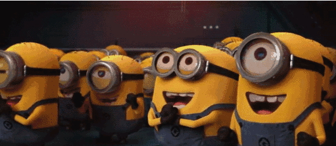
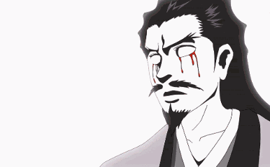
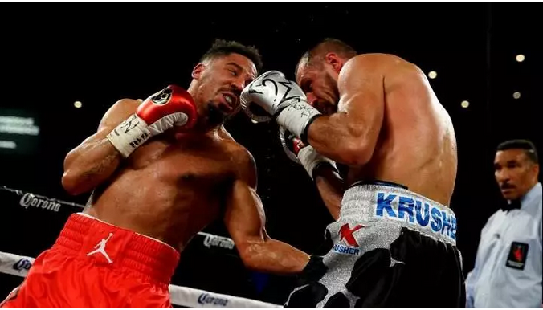
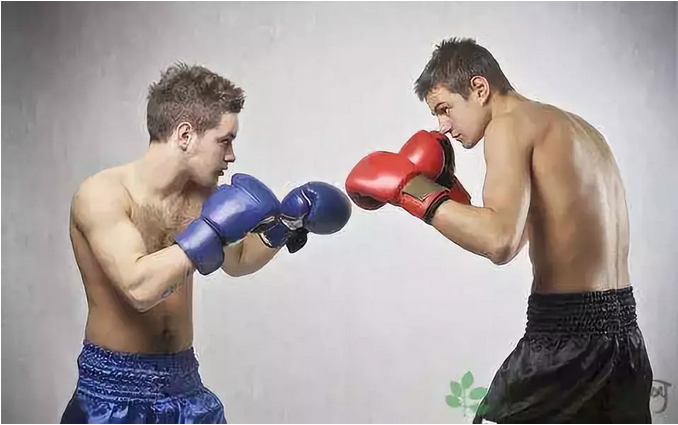

# marketing涨价急先锋 \#F1960

原创： yevon\_ou [水库论坛](/) 2018-09-12

}

**marketing涨价急先锋 ~\#F1960~**

 

 

乱市易发财

 

 

一）涨价

 

在上一篇[\#F1950](http://mp.weixin.qq.com/s?__biz=MzAxNTMxMTc0MA==&mid=2651018787&idx=1&sn=f47746648f10f16af2d6df57228a78f6&chksm=80720030b7058926bb3c804be7aa5c9b67e069a8d19294bd10fca87eed469178179c8e709b0a&scene=21#wechat_redirect)中，我们说道"全社会所有企业，社保成本+20%"

"那么物价就会+20%"

 

好了，现在问题来了，怎么涨，用什么方式涨？

 

 

用一个最简单的例子，好比门口卖"生煎包"的。

十元一两，一两四个。

请问，涨价的意思，是不是修改价格到12元/两。

 

答案是：不可能。

 

 

古往今来，从来没有这样的涨法。

我们之前留言，痛斥的"中二病"学生，

-   "涨价是不可能的。竞争这么激烈，哪家企业敢涨价"。

-   "涨价了，客户就跑光了"。

 

这二句话其实是"对"的。

你直接把价格提升到12元，消费者是很"反感"的。而且也会导致抵触和口碑奸商的。

 

 

更为严重的是，某些时刻，社会上还存在一种生物，叫做"圣母""公蜘"。

圣母婊会站出来说：

-   "企业，应该有社会责任感。不可以把企业的负担，转嫁给消费者"。

-   "遏制不合理涨价行为，政府要管一管"。

 

在这种情况下，甚至会发生"价格管制"。政府强行把价格，锁定在10元/生煎上。蚀到你手软。

 

那怎么办呢？

 

 

 

二）涨价

 

三叶虫没有神经。没有中枢血管，也没有内分泌系统。

生命从远古走来，最初是一个单细胞，后来慢慢变成多细胞，最终演化成无比复杂，光大脑就120亿脑细胞的人类。

 

生命的进化，其实是一个不停复杂，不停细化的过程。

 

 

marketing思想的精髓，其实就是"雕花"。在硅原子晶片上，蚀刻出CPU。

你只有复杂化了，才可以形成"套路"。

一杯奶茶加一个汉堡，就成了"套餐"。而套餐之后，就有无穷无尽的变化。

 

我们来想象一下，产品的"双轨制"。

假设你有二个产品线：

A: 15元的虾肉生煎

B：10元的普通生煎

 

在平时，这二条产品线是"并行"关系。虽然号称"虾肉"，但其实也没有多多少虾。

标价15元，也就适应某些"土豪"，偶尔不差钱的消费。

象这种奢侈炫耀性消费，我们可以假设份额是：90% vs 10%

 

 

但是，除了"虾肉"本身的产品区别之外，"marketing"所谓的市场营销，它是全方位的。包括但不限于：

-   店铺的开屏Banner

-   店内海报

-   菜单插页厨师推介

-   收银台的产品排序

-   "本日特价"产品促销

-   Coupon礼券促销等

 

这些东西，我们统称为"展示资源"。

我们知道，"淘宝直通车"中的"搜索排名"，价值是巨大的。基本上排前五的囊括了主要销量，三屏之后，差强就没什么买家了。

 

同样道理，在店内展销时，"近期主打"的效力是巨大的。

资源倾斜给哪个产品，哪个产品销量就会上升。

 

 

 

三）高级管理

 

AB二款产品，仅仅是非常入门级的"营销手法"。

事到临头，再想起开发"高级"SKU，更是外行人的小白。

 

 

对于真正的500强大公司，他们一般都是维系着"高中低"全套产品线的。

这里面的系列，并不是AB款。而是可能有5\~6种ABCDEFG。

 

每一年，公司都会排定"整体营销计划"。

因为人口是在变迁的，消费也在升级降级。纺锤形，金字塔型等等。

 

每一年，公司都会判断"中产主流""低价寒冬""豪门饕餮"，然后确定本季的"主打"策略。

 

这意味着什么。意味着一旦社保+20%，公司要调整中高档优先，是非常迅速的。而且也是隐蔽的，不为人知的。

 

这是公司内部的经营管理，任何圣母也不能多插嘴的。

 

 

 

进一步，公司还可以人为地"淘汰"，"抑制"低端产品线的销售。尽量的把客户都Upgrade到中高端产品线。

 

譬如说，你跑到面馆，"老板，给我一碗5元的杂酱面"。

"亲，30元的松茸花胶面要不要尝试一下，当季新款。还送价值128元的折扣券大礼包"。

 

"不要，我就要5元的杂酱面"。

然后你翻菜单啊，要翻到三级菜单的第八页下面，才有一行小字。

如果不是老顾客，你根本不知道货架的角落里，居然还有5元的杂酱面。

 

 

除了"隐蔽菜单""削弱展示"之外，商家还可以采取"降低质量""削减份量"等方式，逼着你走。

-   譬如说，面馆里的面，是不是份量越来越少了。

-   快餐皇堡，二个汉堡才吃得饱。

-   牛肉面里，再也没有牛肉了。都是土豆粒。

 

如果以上大杀招均无效，客户象跟屁虫一样，非要跟着你买5元的杂酱面。那就只有最终武器了：

"对不起，今天调酱的师傅病了。没有杂酱面"。

 

 

 

综上所述，一些大型的企业，其实一直都有ABCDEFG等六七条产品线。

在普通的时候，EFG等"高档"产品线，销售额是很小的。仅仅作为宣传展示使用。

 

但是当商家，收到外部的社保，成本等冲击；商家就可以迅速地调整产品线。

主推中高档产品，压制低档AB类产品的销售。实现销售额的提升。

 

从法理上讲，我卖的还是CDE等原来已有的商品。

因此圣母是没有任何办法挑剔的。

我甚至还可以给你一个99折。

 

对外宣传访谈时，我可以宣称"专注于高附加值产品，大力发展先进制造业，先进服务业，实现产业升级"。

那真的是一点问题都没有的。皆大欢喜。

 

 

 

四）商业竞争

 

那么，这么好的事，为什么以前不做呢。

如果仅仅把顾客，驱赶到"中高端"产品，就可以增加销售额。那你之前怎么不这样做呢。

 

最主要的问题，源于竞争。

 

 

我们来看这个表格： 

  售价   3   4   5   6   7   8   9
  ------ --- --- --- --- --- --- ---
  产品   A   B   C   D   E   F   G
  对手   a   b   c   d   e   f   g

所有的企业，打拳都是"套路"。

也就是用ABCDEFG商品，覆盖3\~9元的市场。

 

同时，所有的商家，又都是差不多的。

也就是你的竞争对手，也开发abcdefg商品，也是卖3\~9元。

 

 

这个时候，假设你想"异动"。

取消C产品，把原先3元买C产品的客户，统统3.8元赶去买D产品。

这个时候，你的竞争对手，突然c降价，c卖2.8元怎么办。

你无缘无故地涨价，就是给"细密织网"的产品线，制造了一个漏洞。

从2元\~3.8元，这一段"市场"是空的。

 

如果你的竞争对手，抓住这个机遇。搞"加量不加价"。小c不仅不涨价，反而降价-10%，你怎么办。

 

c卖2.8元的话，等于附近这一段的空间，所有的购买力，市场份额，全部被对方吸走。

狠狠一记左勾拳，直接打在你无遮挡腹部肋骨上。黄疸都吐出来了。 

 

为什么企业家，一定要等到加成本时，才能搞"提价升级"战略。

因为这个时候，竞争对手不能卖c=2.8元了。

 

成本已经上去了，成本不是c=3，而是c=3.3.

他卖2.8元，每支就亏五角。卖得越多亏得越多。而且这个亏损，是不能靠销量弥补回来的。

 

这个时候，我的肘下就没有破绽。就不怕你右勾拳了。 

 

有很多的中二青年，保有不切实际的"仇富"思想。

他们设想中的"加税加社保"：

-   企业家先死撑。用利润填补费用。价格战被牢牢锁死。

-   部分资本家亏损到破产。

-   破产出清退出市场。

-   价格上涨，重新达到平衡。

 

这整个周期，可能维持2\~3年。而且在初期，消费者是"看不到"物价上涨的。

屌丝们觉得这一个模型，很贴切心意。反正暂时物价也不会涨，而且可以看到有钱人纷纷跳楼，岂不是大快人心。

 

亲，真不是这样运转的。

 

穷人的弱，是全面的弱。"黄宗羲定律"教导我们，无论怎么改，都必然是穷人更吃亏。

因为你弱，因此越波动，你亏得越多。

 

真实的世界呢，商家手里，普遍都是六七八条产品线的。

商家对于Upgrade消费者，也是不遗余力的。

每一天都想掏空你口袋。鼓励你买"限量纪念版"。

 

只不过商家之间有竞争。谁都想"品质相差无几，价格打6折"，刷出一个爆款。

一旦你"升级"过度。就很容易被竞争对手打爆肋骨。

 

确认过眼神，你遇上对的人。

 

而一旦加税加费，成本发生了无可逆的上升。商家只要对视一个眼神，"产品经理"马上可以确认，"对方不会和我发动价格战"。

 

这种情况下，你还等什么呀。明天就可以把价格调上去。

涨价是第一波的，商家的反应是最先列的。等到反应为穷人的收入，才是最后一波。

 

 

很快的，我们身边的小店，就会发生一波"升级潮"。

生煎馒头，会飞快地全面升级为"虾肉生煎"。

 

顺便说一下，哥哥6岁的时候，上海生煎包是0.04元一两。

此后大壶春就玩：生煎\--虾肉生煎（涨价）\--没虾\--没肉\--虾肉生煎（涨价）的游戏。

一直玩到了今天10元/两。

 

 

 

（yevon\_ou\@163.com，2018年9月11日暮）
