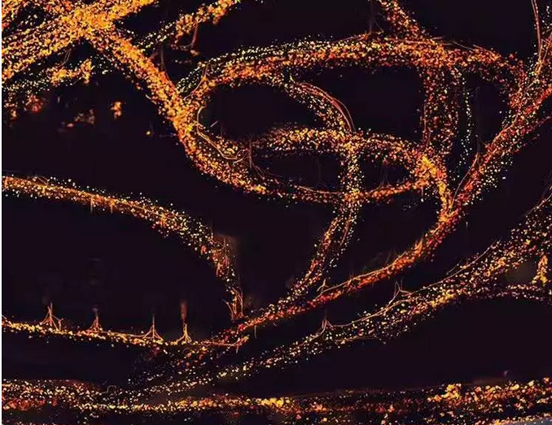
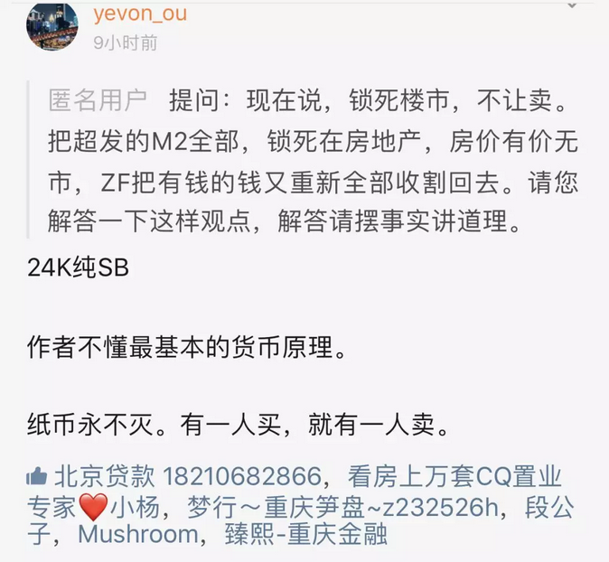
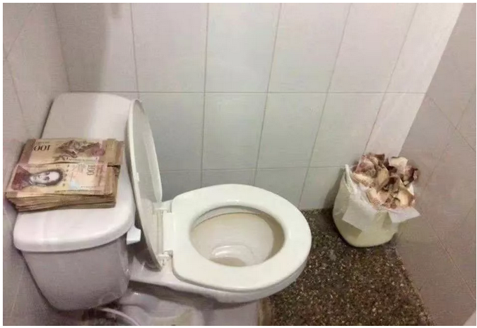
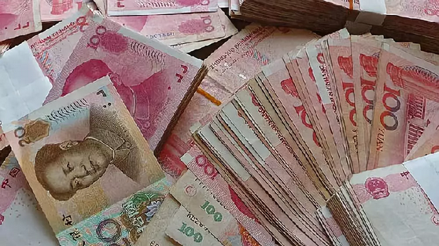
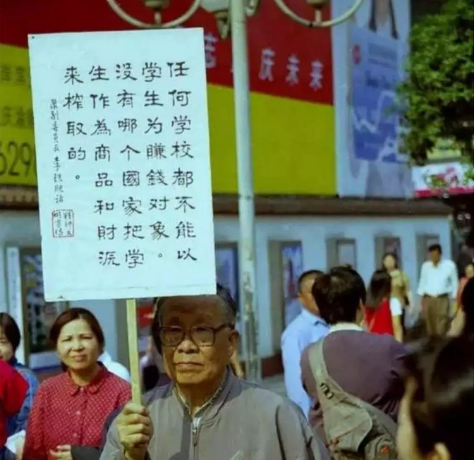

# 什么才是宏观经济学 \#F1970

原创： yevon1ou [水库论坛](/) 2018-09-17

**什么才是宏观经济学 ~\#F1970~**

 

本篇为经济学。

 

 

昨天，有人在水库"知识星球"提了一个问题。

实在再经典不过了，值得展开写一篇。 

 

 

一）微观经济学

 

首先，我们来看"微观经济学"。

什么叫微观经济学。微观经济学，指的是"为人处世"，"在储蓄和消费之间选择"，"在价格和品质之间选择"的一门学问。

 

 

举个例子，假设有一个青年"张三"，税后月薪是10000元。

-   净储蓄2000元

-   房租2500元

-   吃饭2500元

-   交通500元

-   衣服和淘宝1500元。

-   休闲1000元

 

那么这是一个非常简单清晰，"安置"妥当的处理方式。

张三在"消费/储蓄"中，做出了80:20%的抉择。

在"衣食住行"四大类中，也做出了15:25:25:5%的分配。

 

 

 

好了，现在假设房东李四，找到张三。说"房租要涨价了"。

下个月开始，房租会由2500元，上涨到3500元。

请问张三会如何调整，手足无措？

 

微观经济学对此的解释，至少有二重效应："替代效应"和"财富效应"。

 

首先是"替代效应"。人类购买一项服务，取决于消费能获得的满足感。

"衣食住行"，任何一款消费变贵了，都会减少"该大类"的消费量。

好比韩国牛肉特别贵，韩国人就少吃点。多买些化妆品。

如果房租涨价了，就会促使人都搬去地下室。而维持"住房类25%"尽量恒定。

 

 

第二个是"财富效应"。任何一种物价的上涨，都意味着生活的更艰难。财富的缩水。

所以，受影响的，不仅仅是"住房"类消费。而是你每一个"大类"的消费都减少了。

 

以前每周周末，去村口买半只烧鹅。顺便调戏一下冰艳老板娘。

等到房租涨了，干咽口水。花花肠子就没有了。

 

                  原本   涨价后
  --------------- ------ ------------------
  储蓄            2000   1800
  房租~(+1000)~   2500   3200~（搬小住）~
  吃饭            2500   2300
  交通            500    450
  衣服购物        1500   1350
  休闲            1000   900

 

 

"替代效应"和"财富效应"是挺绕的。

因为一次"涨价"行为，却可以给你拆出"二次"效应来。

 

但这事不是我编出来的。

你去买任何一本《微观经济学》教科书，教科书上就是这样写的。

 

这也显露出了"读书"的好处。因为别人看见"涨价"，就只会骂娘。只会骂出一种套路。

不象是你，文绉绉的。可以编出二维表格。

 

                 财富效应   替代效应
  -------------- ---------- ----------
  住房类消费：   减号       减号
  其他消费：     减号       加号

 

看到3/4的"减号"，青年张三心中充满了愤懑。

打倒万恶的房东，害得不能每周都去买烧鹅，调戏冰艳老板娘了。

政府应该管一管，限制房租。

 

 

 

那么，讲完了"微观"，"宏观"应该怎么样。

假设我把张三的样本，扩大10000000倍。

研究一千万人口，是不是就变成《宏观经济学》了？

 

你想象一下，动辄每个月消费，都是千亿数量级。

跺跺脚，震撼金融市场。

那一定得上大数据，大人口。

算算平均数，中位数，离散数，难保还算算基尼系数。够高大上。

 

 

恭喜你，如果你看到这里的话。

则以上1000个字，全部都是错误的！

 

整部"微观经济学"，几乎就是错误和谬论的大集合。

在《宏观经济学》的眼里，"微观经济学"甚至都不能算科学。

整部学科，几应该彻底取消。

 

 

 

二）宏观经济学

 

宏观经济学研究的是什么。研究的是"青年张三+房东李四"。

研究的是买家和卖家的整体。

 

"一人所失，即为一个所得"。

当你放弃局部，放眼全局的时候，结论是很不同的。

 

 

举个例子，汽车驱动，主要靠燃烧汽油。

目前整个的人类文明，热机的效率是非常低的。六缸大约只有35%左右。

也就是汽油中释放的能量，只有小部分转化为了动力。

绝大部分变成了热能，噪音，磨损，浪费掉了。

 

对于同济大学出来的"工科生"而言。他会觉得非常惋惜。因为这是能量的"净损失"。

汽油烧一吨少一吨。甚至会得出整个地球"石油不够用"的结论。

 

但是对于复旦大学出来的"理科生"而言，他会瞪你一眼。"能量守恒定律"。

汽油能量散发到道路，大地，路基，花草，白云，风。

如果你能把这些能量全部"搜集"的话。则总能量其实是守恒的。

对于地球而言，加温效应，等同于燃烧一吨燃油。

 

 

"买房"这件事，《宏观经济学》的眼光也是一样。

"货币"永不消失。货币守恒定律。

 

纸币这玩意，一经印刷。

除非你拿来点烟，或者当厕纸，否则所有人都小心翼翼保存。数量永不减少。

货币如H~2~O，又怎么会消失。

 

 

 

你如果把"张三+李四"，当作一个整体来考虑。

则你会发现，所谓"购买力消失"，根本是无稽之谈。

 

一人所失，即为一人所得。

屌丝失去了2500元购买力，则房东立刻获得了2500元购买力。

 

屌丝哀叹"房租"涨价，财富效应+替代效应，侵蚀了他的购买力。再也没有能力，去村口买只烧鹅勾搭老板娘。

 

而老板娘却说，每个月有位中年大叔来买烧鹅。生意兴隆，不需要担心内需、购买力。

 

 

 

有天涯傻空说：

-   把钱都赶去房地产市场。

-   然后把房地产市场冻结，锁死。

 

但真实的情况是，钱不是"工资"。

工资是消耗性的。而"钱"就如同地球上的水，永远以H~2~0形式存在，水分子不消失。

 

仅仅就在你付房款的第二秒，房东就获得了500W元的现金。

你失去购买力，房东获得购买力。

房东再去买瓶酒，酒店获得购买力。

你怎么"锁死"。没法锁死的。

 

\*
在宏观经济学中，真正锁死货币的，是"流动性"。此和交易量成正比。这个话题有空再讲。

 

 

纸币一经印刷，数量就永不消失。

对于个人来说，或许存在"月薪一万"，付了房租就不能再买手机。

但是对于经济整体而言，并没有"购买力"不足的问题。

 

我们的社会，永远有150万亿M2。

而且任何时候，都会有150万亿M2。

 

如果你购买一手房的话，则这个"链条"更加明显。

一手房的"产业链"非常悠长。从卖地，建筑商，园林绿化，装修，企业融资，营销销售，家电，公积金贷款，工地民工......

当小白领失去500W元购买力时，可能有数十，上百人拿到了"工资"。[千百人的购买力都增强了。]

 

 

 

三）宏观经济学之诬

 

我们为什么要强调《宏观经济学》，为什么要强调"微观经济学"很多观点都是不对的。甚至是倾向邪恶的。

因为微观经济学，很容易沦为某一个群体，某一小撮人的利益算计。

 

-   微观经济学，关心的是"张三"的利益。是张三利益最大化。

-   宏观经济学，关心的是"张三+李四"的整体利益。关心的是公平！

 

 

例如，一个人如果醉心于"微观经济学"，他很容易提出：

-   医疗费要降价

-   教育费要降价

-   房价要降价

-   政府要抑制通货膨胀

-   购买房产会导致内需不足

-   免费的福利越多越好

 

 

这样的人，我们有一个术语加以形容，叫做"精致的利己主义者"。

也就是自私自利，竭尽所能为自己谋取利益。

而丝毫不顾全局和公平。

 

（因为）做医生是不可能的，这辈子都不可以当医生的。所以才呼吁"医疗费"降价。

归根到底，是办公室小白领的屁股。

 

-   医疗费降价，无异剥削医生的劳动。

-   教育费降价，无异剥削教师的劳动。

-   房价降价，无疑剥削基建土建的劳动。

-   通货膨胀永不存在，永恒为0，见《正本清源话通缩》

-   购买任何东西，都不会导致内需不足。

-   福利越少越好。

 

 

站在《宏观经济学》的立场，考虑"张三+李四"的整体。则"微观经济学"的绝大多数诉求，都是邪恶的+自私的。

包括那个"举牌"的老头，统统不是人，是人渣。

 

-   医生难道不是国民么。

-   教师难道不是国民么。

-   铁路工人难道不是国民么。

-   凭什么别人都要跌价，就你涨工资？

 

 

可是我们整个国家，依然津津乐道地"控制医药费价格，降低药价"。甚至把这写成了一种政绩！

"控制春运车票不涨价"

"控制蔬菜肉禽不涨价"

那就是"白领市民"的特权阶层，盖过了医生，铁路，农民，不公平！

 

 

我们为什么要普及真正的经济学。因为错误的经济学，会带给我们国家以灾难。

"微观经济学"最终养活的，是一个精致的政治特权群体。

 

考虑"张三+李四"的宏观经济学，才能带给你公平。

 

 

 

四）结语

 

如果你研究"局部"，不考虑外界能量的回收。

则你研究"张三"，哪怕你把数量扩大10000000倍。你依然是"微观经济学"。小乘狭隘，不登大雅之堂。

 

如果你研究"整体"。哪怕仅仅"张三+李四"二个人，你也是《宏观经济学》。

太极阴阳，循环不息。

 

 

 

（yevon\_ou\@163.com，2018年9月16日暮）
