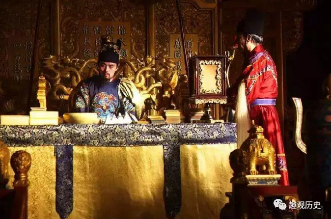
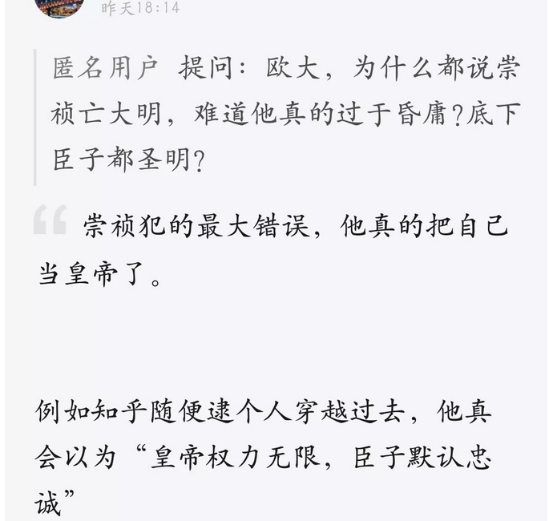
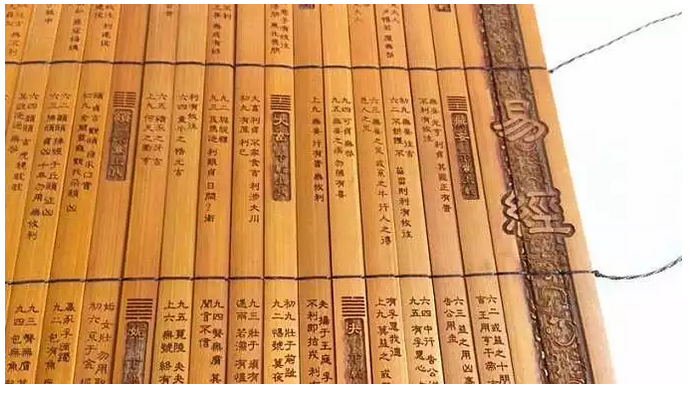
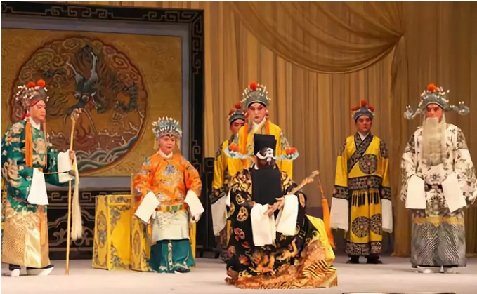
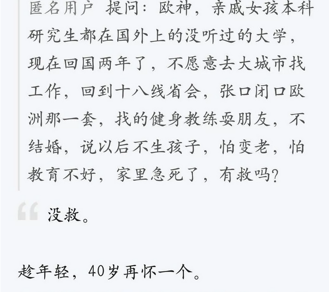
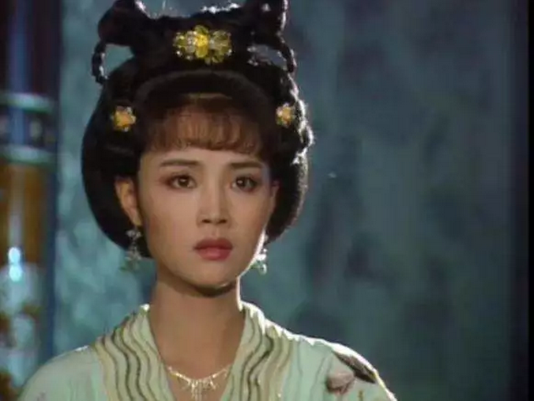
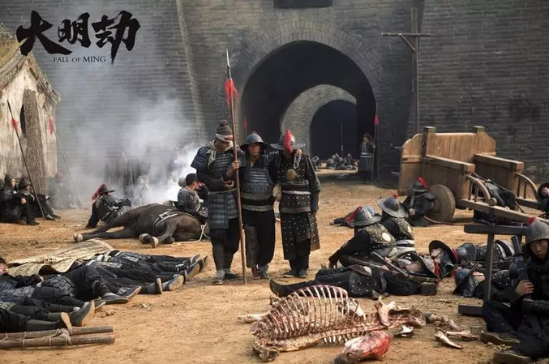

# 崇祯是怎么死的 \#F1990

原创： yevon1ou [水库论坛](/) 2018-09-24

**崇祯是怎么死的 ~\#F1990~**

 

本篇为历史

 

 

 

一）牧民之术

 

这二天实在没东西可以写了。晚上拉着王福重喝酒，谈到删帖凄惨之处，忍不住抱头痛哭。

近期的热点，应该是广东拟调整预售制度。但这事哥哥左思右想不安全，不该写。

 

正好知识星球有人问了一个"明史"的问题，那咱们还是嗑叨五百年前吧。 

 

崇祯是怎么死的。大明朝是怎样灭亡的，这事还得从"牧民之术"说起。

众所周知，事实上存在着二条教育线路。

一条，是"牧民之路"。

一条，是"被牧之路"。

 

天子牧民，巡狩四方。对于老百姓，老百姓被灌输的是"诚实礼仪信"，做人要老老实实，听老师的话，听家长的话，听爱护小动物的话，来，我煮碗面给你吃。

 

 

这一套，你从小被灌输和教育的东西。

随着我们逐渐在社会上生存，我们逐渐发现"不对"。

 

譬如你的老师和父母，总再三强调"铁饭碗"的重要性。好像你一旦失去工作，便失去了一切。

但是你在"柳贱男"的岗位上做一辈子，你买不起一套房子。眼睁睁地看着"倒爷"们大发其财。

然后你想，肯定有什么地方错了。传统教育灌输给你的那一套，有不对和谬误。 

水库论坛，致力于"反向"破解这个真实的世界。水库的口号是"毁三观，竖新生"。意思就是打破旧的枷笼，重新认识这个新的世界。

 

毕竟，这个世界运转的真实规律，我们只触摸一隅。

例如简单卖一支牙膏，marketing居然可以变幻出这么多的骗术和手法。而消费者还傻呵呵地以为自己买到了"品牌"。

 

请问，价值在哪里，IP在哪里，IP的演变在哪里。

 

从一片混沌中，要摸索出真实的规律。类似于牛顿总结三定律，爱因斯坦推出相对论。是这世界上最最难的事。

鱼儿游在水中，意识到水的存在，是最难的一步。几至于不可能。

水库论坛，战战兢兢追求更深层次的真理。

 

扯得远了。相对于"被牧之术"，其对应的是"牧民之术"。

《易经》最早的传承，被叫做"连山藏"，本来是太子的读书。所以被誉为蕴涵鬼神难测的威力。

 

对于"顶级贵族"而言，他们是有另一套教育体系的。

在这套教育体系中，事物的原理，被揭示得非常清楚。而杀伐决断，却远和平常人不同。

甚至这套体系中，根本就包括"干扰剂"，告诉你普通人应该受怎样的教育，让你一辈子不觉醒做佣人。

 

 

可想而知，这二套教育体制，是非常非常地不同的。

老百姓受的教育，是"显学"。是满大街都买得到的大路货。其主要任务是教育你做一个乖乖的"顺民"。

 

而顶级贵族那套东西，是"隐学"。甚至可以说"不落文字"。

秘密本身是力量的一部分。有大量的手法和机密，口耳相传，直接由帝王传授给太子。没有第三人知道。

 

 

好了，现在问题来了。假如皇帝死得太早，幼儿没有成年，"传承"发生了断裂怎么办。

我们综观古代历史，几乎所有的太平盛世，都和"国立长君"有关。

几乎所有的祸事，末代迹象，都和"幼主"有关。

 

《倚天屠龙记》中，小昭出生的波斯明教。连出几个庸才，"乾坤大挪移"心法就失传了。

短短一篇心法，还容易断篇。如果是复杂的"为政君宰"之道，岂不是更容易失传。

 

东普鲁士的霍亨索伦家族，以区区一堡之地，最终成为欧洲最大帝王。靠霍亨索伦家族的天赋是"长寿"。

十代人的时间，便前后历经三百年。平均每一任家主在位30年，接班都在30岁，没有任何一个幼君。

霍亨索伦家族，可以等待对手们"犯错"。法国奥地利上一个幼主，普鲁士国土就扩张一圈。

 

清代前期的皇帝，各个都高寿。而且继位时刻，普遍成年。

"清三代无子"，到了同治光绪宣统就崩了。

 

崇祯是怎么死的，崇祯死在，他真的把自己当皇帝了。

 

 

 

二）无往不利

 

崇祯最大的问题，他并不是皇长子，他是"皇次子"。

 

之前日本内务府大臣再三询问，问会不会修改天皇继承条例。

小泉纯一郎不耐烦地答，"女孩子只有三岁，为什么如此着急逼问"。

内务府大臣回答说，"因为继主和亲王的教育完全不同，敬宫爱子殿下必需立即确定教育方向"。

 

"连山藏"既然被誉为帝王之书；帝王之术的意思是说，看的人越少越好。

信王朱由检虽然也是亲王，但"连山藏"还是没有资格看的。

 

天启帝朱由校的溺水，是个意外。按照儒家"父死子承，兄终弟及"的规矩，他唯一的弟弟朱由检即位。

 

但是"崇祯帝"其实并没有受过完整的"帝王学"教育。一天也没有。

 

 

 

我们曾经有个笑话，说把目前知乎600W用户，依次送回古代穿越。

无论你哪一个等级的超级大V，你穿越到"崇祯"的身上。你也依然是把事情搞砸的。

为什么，因为你的"三观"不对。

 

譬如说，你是否觉得皇帝一定是最高权力。想砍大臣谁脑袋，就砍谁脑袋。

你是否相信，皇帝说了算。

你是否相信，朝堂之上，忠心耿耿的人占大多数。臣子们都是爱戴你的。

你是否相信，东林党是清流，正人君子。

 

我要告诉你的事，以上全错。

"君权"根本不是那么一回事。

 

 

"君权"的核心游戏规则，大致可以解释成"齐心协力骗老大"。

台下有100个臣子。你说有多少个是"忠心的"。

-   崇祯以为有70个。

-   你以为有90个。

-   其实是0个。

 

但是这事，崇祯不知道。

他爸爸死得太早，也没想培养他。

他哥哥死得太快，来不及培养他。

帝王权术，崇祯并没有"传承"到。

 

因此当崇祯坐上皇帝宝座之后，群臣在台下三呼万岁。

崇祯飘飘然，他真的觉得自己是"万岁"了。

而这个"万岁"的角色，并不是他父亲或者哥哥曾扮演的角色。

而是小说和戏文中，民间艺人所描绘的"万岁爷"。

 

那么，民间草根，说书艺人描绘的"万岁爷"什么样呢。

儒家传统中，叫做"君君臣臣父父子子"。名词+形容词。

 

-   儒家经典中，皇帝要象皇帝。

-   臣子要象臣子。

-   父亲要象父亲。

-   儿子要象儿子。

 

意思是，皇帝如果打你屁股，你不能反抗。你反而要反思，"是不是我做错了什么"。

皇帝反正永远不会错，错的一定是你。

 

臣子首先反思，哪个帖子写得不对。这才是做臣子的礼仪。

皇上虐我千百遍，我待皇上如初恋。反抗，不存在的！

 

 

 

这是一种理想状态，但是我们知道，真实情况是这样么？

-   臣子没有怨恨么。

-   臣子完全被"儒家"洗脑，伟大自愿奉献么。

-   汉魏和士族斗了几百年，这些"缙绅"们，好对付么。

 

真实的世界，根本不是傻白甜想象中的"符合课本"。你一个小孩子走在这种狼虎场，简直就是盲人夜路。

 

 

可是这个道理，崇祯不懂得。他就像温室里的花朵，完全依循着"简单傻白甜"原则。

 

崇祯十五年，松锦大战，洪承畴全军覆没。兵部尚书陈新甲密谋和女真议和。

消息不慎泄露，朝野哗然，崇祯斩陈新甲。

 

再往上溯一千年，唐太宗李治有一次实在忍无可忍，想废了武则天的皇后。

他叫来上官仪拟诏。书写途中，武则天匆匆赶到。扑进李治怀中，大发一千斤糯米嗲。

 

于是"废后"的事情作罢。上官仪手里拿着诏书，目瞪口呆。

武则天冷冷地问，"哪来的诏书啊"。

李治沉默不语。

上官仪大哭，"堂堂大堂天子，竟是言而无信之人"。

 

这个就是著名的"天子无信"故事。结局是上官仪一代清官，文采风流。含冤被判"假冒圣旨"，满门抄斩，家属罚没宫奴。

于是才有了一代才女：上官婉儿

 

这个故事告诉我们，李治还要羞愧满面，还被人骂上一千年。

而崇祯呢，他恬恬自得，毫无羞愧。

 

"议和"的事情，是崇祯和陈新甲二个人密谋的。

事情败露，君就抛陈新甲出来，灭门抄斩。

不知道陈新甲临死之前，有没有说一句"堂堂大明天子，竟是言而无信之人"。

 

 

你这样做人做事，以后就不会有人帮你出力。

二年之后，李自成逼近北京。崇祯急需南逃，满朝文武面面相觑，就不愿意站出来做第一个"劝谏"的人。

 

因为他们知道，谁要是开了"卖国贼"的口，以后难免满门抄斩。

崇祯这个人刻薄寡恩，卖起队友毫不手软。

 

崇祯觉得天经地义，因为他是皇帝，"君君臣臣父父子子"，by
law皇帝天生就可以出卖臣子，不用负任何道义责任。

 

可是臣子们不这样想啊，你真以为书呆子啊。

江湖义气，报恩报仇，才是这个世界真实运行的规律。

 

在电影《大明劫》中，名将孙传庭，带着大明最后一支能打的部队。外无粮草，内有监军。而他的任务，却是死死堵住潼关口子，否则李自成席卷全国。

 

结局不出意外，孙传庭力战战死，以死报国。老婆带着二个女儿投井。

可是崇祯接到消息之后，大怒若狂。

在崇祯的字典里，没有"臣子已经尽力了"。只有"臣子还不够尽力"。

 

崇祯剥夺孙传庭一切抚恤，还诬陷他罪臣。人心寒透，再也没有人愿意为朱家卖命。

 

-   崇祯想：我是皇帝，你是臣子。你为我卖命不是应该的么。

-   我为什么要体恤你？

 

 

 

崇祯的父亲，哥哥，是给他留下一点"忠贞之士"的。毕竟还是有对大明忠心耿耿的人。

可是崇祯十七年，一共换了54个内阁首辅，杀了7个总督，11个巡抚。

最后崇祯还觉得自己没有任何错误。"此皆臣子误我"。

 

朱家刻薄寡恩，自私自利。

你还真把自己当神仙啦。

 

 

 

（yevon\_ou\@163.com，2018年9月24日子）
