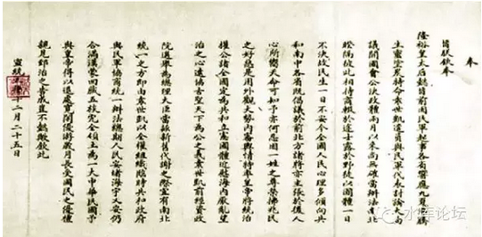
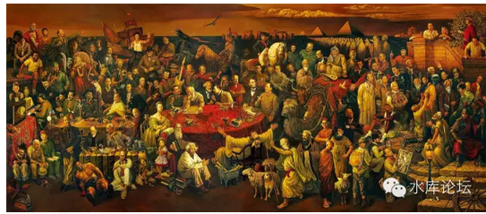

# 军代表叹了口气，解开手枪放在桌上。

"请你支持国家的政策"。

一）枪抢

前二天看知乎，看到一个故事：《父母讲过哪些至今记忆犹新，对你有深远影响的儿童故事？》[\[1\]]，别去找，帖子已经删掉了。

作者说他姥爷是开杂货店的。生意也不大，中小企业。

到了56年的时候公私合营，刚开始是说利润上缴大半。可到了后来就变成公家派驻人手，给你一笔小钱，打发资本家走路了。

那一天的晚上，组织上派了一个军代表，到他们家里。黑灯烛火，和他姥爷谈公私合营的事。

军代表大谈了一阵子公私合营的好处，可他姥爷抵死不从。说来说去总是"不中"。无论如何不肯答应。

最后，到了快要走的时候。军代表叹了口气，解下了腰间的手枪，放在桌子上："请你支持国家的政策"。

他姥爷脸色苍白，回头看了看他姥姥。再看了他妈和二个姑姑，三个舅舅。

于是只好说"中"。

我复述这个故事，并不是想去指责"公私合营"。而是想说另一个角度:

"当时当地，在军代表心中，他所做的事情是正义的么"？

当军代表解下手枪，放在一对老人，六个孩子的面前。

他是怎样想的，他认为自己的行为是正义的么。

我想，答案应该是"正义"的。

任何大型的国策，领袖做出了决断，归根到底还是要底下的人去执行的。

任何一项国策，都有其执行的背景。至少有一部分的人，要同意你这是正确的。

我们说"政令不出中楠海"，和平时期尚且如此。在证券不稳固，刚刚建立的时候，组织就更加疏松了。

一件政策要执行，关键是下面的人认可，赞同你的想法。所谓"得民心"，得民心的事情才能事半功倍，否则就是事倍功半。

二）民心

请问，抢资本家的钱，是哪门子得民心。

隔壁家的大春，已经流淌着口水凑过来了，"好的，要的，俺满意的"。

滚你妈的大头鬼，得民心什么时候包括你了。你丫的根本就不是"人籍"，你丫的是"绵羊籍"。

"马冬梅，大春"之类的，其实都不能算人。

天子牧羊，你是不包括在人里面的。

"士农工商"，所谓的得民心，主要是指"士"，干部缙绅。

而农工商，是无效人口。在政治上是被畜牧的，只要士大夫决定了再执行即可。

1956年的"公私合营"，关键是在士大夫阶层获得了认可，在知识分子之间获得了认可。

军国大事，出二三人之口，入二三人之耳。

那么，他们为什么要认可呢。

因为1840年时，中国是"天朝大国"。在康熙乾隆的眼里，中国是地球的中央，是万邦之华夏。

可是1840年时，中国人第一次发现，地球是圆的。另一侧还有海洋文明，还有英美法德。

1840年还仅仅是一个开始。1840年给人的印象是，这仗是可以打的。清国英国实力差不远的。仅仅是清政府腐朽昏庸，所以才打败的。

可是又过了一个甲子，到了1900年。发生了"庚子国变"。

这一下子，才是真正打懵了，打疼了。

中国人突然发现，不要说什么"慈禧向全世界所有国家宣战"。仅仅是一个小国，一个奥地利，意大利，比利时之类的。中国人都打不过。

八国联军主战部队只有8000人，而且势如破竹，一下子就把中央军打得溃不成军。

"八国联军"奠定了之后五十年的主线轴。从此以后你看民国史，中国对任何一个国家都在忍让。一直都是"列强侵食中国"的局面。

而中国的主权内政，则一再受到邻国的渗透。几次三番沦为傀儡国，一开始是日本，然后是俄国。

"士大夫"是很微妙的一个群体。并不是说最有权有势的人就是士大夫。譬如马云，王健林，他们并不是士大夫。

而皇族勋贵，驸马贝勒，也不一定是士大夫。

但是一些社会地位很低，甚至完全没有文化的人，却有可能是士大夫。

譬如黄兴，孙文

譬如吴佩孚，段祺瑞

譬如陈云，邓

你可以把"士大夫"理解为儒林，也就是真正为中华民族掌舵的人。

在"士大夫"的眼里，满清朝廷只不过是一层白手套。虽然康熙乾隆的时候，曾经达到过鼎盛。雍正把所有的生杀大权都捏在手里。

可是按照"历史的诡计"[\[2\]]，皇帝仍然是白手套。

如果满清无能，那就把满清换掉。

大清亡了，华夏还在。

在真正的上层知识份子眼里，关键是中华民族屹立于世界东方之巅。其他都是白手套。

三）工业革命

1861年，第二次鸦片战争火烧圆明园。咸丰仓皇出逃，并死在了热河避暑山庄。

负责善后的是六王爷奕欣。

中国的历史教科书，有很大的问题。

传统认为，中国现代史从1840年鸦片战争"虎门销烟"开始。但其实道光年间，洋人对我们没什么触动。

鸦片战争I虽然打败了，但朝廷庙堂上只以为那是一次常规的边境冲突。

对国体，政体，社会风貌，完全没有任何触动。

也就是说，道光之后，皇帝和大臣浑浑噩噩又过了二十年。完全和往常一样，英国人都快要被遗忘掉了。

"中国现代史"的真正开始，其实是1861年。

第一次鸦片战争打到天津大沽口就停止了。匆匆议和。

可是第二次鸦片战争，是直接打下北京。皇帝出逃。而且明显的势力对比，显示Musket和Cannon完全不能抵挡。

这样一来，清廷才是真正被震动了。

当六王爷从热河返回，他背负的主要使命之一，就是向洋人"购买"这种威力强大的武器。

洋人有二个，英国人和法国人。

六王爷心怀忐忑，不知道能哄能骗，六百万两白银可以买3000把枪否。

谁知道洋人一开口，还没等英国人法国人互相竞争。奕欣立刻听到了回复；

"洋人不仅肯出售武器，而且肯出售武器的制作方法"。

六王爷不禁大喜过望。

[这是中华民族史上，关键性决定性的一刻]。如果要考历史学高考，这才是必须划出的大纲。而不是什么南京条约具体条文。

这件事的后果是什么呢，是中国开始工业化。

不是1840年开始工业化，而是1861年开始工业化。

在我之前《论工业革命1》[\[3\]]，《论工业革命2》[\[4\]]二篇文章中说到，什么是工业革命，工业革命就是能源革命。

那什么说中国冷兵器输给了热武器，统统都是民科马克思主义教育愚民。

奕欣拿到了大炮图纸，摊开一看，不禁皱起了眉头。

大炮其实很简单，就是一个圆筒形，塞入火药炮弹，就可以发射。

真正的难题，是钢产量。

一门大炮上千公斤，现代战争动辄几百门，几千门大炮。清廷上哪找这么多纯钢去。

而且因为大炮的膛压非常高，这都要优质高炉的百炼精钢，不是乡村里的铁匠铺。

鸦片战争表面上是热武器对于冷武器的胜利。而实质上是钢产量的胜利。

奕欣虽然拿到了图纸，可是他无法制造。

因为他没有那么多钢铁。

中国真正的工业革命，从1861年开始。如果你看看李鸿章当时的奏章，"唯今百计，首在铁利"。

奕欣的重中之重，首先要造汉阳铁厂。

但是，炼钢需要用煤，所以还需要开平煤矿。

从煤矿到钢厂，需要运输，于是有了津浦铁路。

等到钢炼出来了，需要制造成枪炮。这才有了江南制造总局。在上海。

以上就构成了"洋务运动"的主体框架。

扯得远了，我们今天不讨论洋务运动。不展开下去了。

四）发展速度

当大清不行的时候，士大夫阶层毫不犹豫地换掉了大清。

洋务运动失败了。

它失败的原因，是"官僚主义"。

象造大炮"动摇国本"这么重要的事，奕欣肯定不肯交给民营企业干。

甚至他也不放心汉族官僚干。煤矿，炼钢，制枪，分开放三个地方，本身就有制衡的意思。

所以洋务运动从一开始就是一个国营企业。效率之低下，再加上当时中国人普遍科学文化水平不行，闹出了不少笑话。

有一种说法，汉阳铁厂，一直到1949年新中国成立，都没有好好炼出过任何一锅钢。

因为炼钢用铁矿石，铁矿石要分酸碱度。这是最基本常识。

可是清朝的官员说，"中国地大物博，什么矿石没有"。统统给我一股脑扔进炉子里。

于是炼出来的矿，就是废渣。这钢完全没法用。

同样的道理，福建马尾船厂，造的船不能出海。因为"名吏"沈葆桢不懂平底尖底。丫居然还是晚清一代名臣，教科书拼命赞扬的好人。

而江南制造总局，因为造枪炮是一种技术活，这里面牵涉到的企业管理更多。

一直到清廷瓦解，局里甚至都没造出几支原型枪。反而耗费了朝廷几百万两白银预算。

很多人对1894年"中日甲午战争"有误解。误解以为日本纯粹是运气才打赢的。而且中国赔了3000万两白银，造成了日本的崛起。

这话纯粹是文青没脑胡说八道。

如果1894年中国日本是"势均力敌"差一点输赢的话。

那为什么到了仅仅43年之后，1937年，中国人民就能喊出"打破了日本三个月灭亡中国的美梦"。

你要无脑文青SB到何种程度，才会自相矛盾，精神分裂啊。

你要说3000万两白银激活了日本军事工业的话。那你知道，以中国的地大物博，再挤出3000万两白银有何困难。

你随便划个特区，在山东划个"经济开发区"。你倒是打造"阪神工业带"试试。

清政府灭亡最后一年，全国财政收入是1.2亿白银。

事实的真相，是日本的"发展速度"，远远超过大清。

1886年清军嫖娼长崎，发生了"长崎事件"。日本忍气吞声，赔礼道歉。闷头发展海军。

可是到了1894年，双方至少已经势均力敌。

到了1905年，日本打败俄国。

到了1931\~1937年，日本相对于中国，已经是压倒性优势。飞机大炮压着你打。

所以，文明的竞争，关键还是发展速度的竞争。

你不需要叹息"甲午战争"中某一发炮弹没有打中，某将领的英勇或怯懦行为。

你不需要象鸡婆一样计较3000万两白银。

关键是二国的发展速度不同。你1894年不败，1900年也是非败不可的。八国联军的主力就是50%的日本人。

说回正题。在士大夫的眼里，清廷不行，所以他们毫不犹豫地换掉了清廷。

中日二国，几乎差不多时间"开化"。中国是1840年鸦片战争，日本是1853年"黑船事件"。

可是中日二国，发展速度完全不同。

中国暮气沉沉，发展了60年，几乎没有任何变化。"洋务运动"钢铁也炼不好，火枪也造不出来。

而日本飞速发展，工业化毫无窒碍。

其中的区别，在于日本一开始就是"工业民营化"的。

你看丰田汽车，丰田的起家史，他纯粹就是二个汽车爱好者自己搞起来的。

虽然丰田要能活下去，高度依靠政府订单。对于他的发展方向，政府也有巨大的干扰。

但是民营企业想要进入汽车业，是没有任何阻碍的。

日本人的"煤炭，钢铁，机械制造"也完全都是民营的。都是日本企业家一手主导。

政府在旁边看着，确保你不会造反。但总体而言是放心的，放手的，忠诚的。

可是清政府对于"工业化"的态度是不同的。

清政府的总体态度，是"宁予友邦，不予家贼"\[5\]，他们拿到了工业化秘笈之后，是藏着腋着，无论如何不肯给民间看的。

归根到底，满清是一个"少数民族"政权。

炼钢并不难。真的拿到了许可证，一个象江西，广西这样的三流省份，短期之内就能炼出百万吨的钢产量。

换算成枪炮，就是几十万支枪。

如果他们拿枪起来造反怎么办？

满清政府是绝对不会允许有任何"民营"煤铁复合体存在的。他不是对企业家没信心，他是对外省总督没信心。

如果你看过"满族人口分布"的话，你就会知道，皇太极入关，满族基本上只分布在北京，沈阳，这二大省份区域。

因为满族本身人口太少。对于外省的控制，例如湖南，广西，云贵，他几乎是完全没有满族人口的。

如果我在广东造一个钢铁厂，有海运交通之利，人才济济。炼钢发展迅速。

我派一个满族总督过去，名义上是最高长官。

可是万一发生"兵变"怎么办。

在广东你是完全没有满族人口的。就算总督是满人，巡抚是满人，可是下面所有的中层官吏全部都是汉人。

这种地方，一旦杀老板，也就几天的工夫。

而等你中央军调兵镇压，人家早就加班加点几万支枪造好了。

这就是后世实际发生的事。

1）八国联军之后，清政府实在忍无可忍，在全国兴建了钢铁业。普及"新军"。

2）武汉新军哗变

3）清政府灭亡

五）战乱

在士大夫眼里，君王不过是白手套。

你以为你君临天下，其实你不过"整体生态系统"中的一枚小虫子。

当满清一败再败，国力发展滞后，从"英国平起平坐"沦落为"日本随便揍"。

在士大夫心目中，清廷也就逐渐失去了合法性。

辛亥革命，以袁世凯，段祺瑞，黎元洪取代了满清皇室。

但你要注意的是，"北洋系"其实和清廷一母同胞的血统，本来就是朝廷的臣子。

朝廷中枢未变。

类似于曹操篡汉，司马代曹操，本质上并不能算是改朝换代。

民国之后，一直围绕着中华民族的重要枷锁"不许工业化"，终于被解脱了。

你要知道，1860\~1911，在这近五十年的时间内，

不是中国人不懂如何炼钢，煤铁复合体；而是朝廷不许中国人炼钢，是"行政管制"了不许炼钢。

其道理，就像法国政府拒绝Amazon.com入户一样。

教科书不会告诉你的，自从1911年开始，中国工业进入迅猛发展。无论轻工业，重工业，各大煤矿，都是从那个时代开始。

我们常常谈论"民族资本家"，好像1930年上海遍地都是资本家似的。其实1911年挣脱少数民族统治，中国的工业化现代化才迅猛开始。

但是，多灾多难的中国人民，他们始终都混淆了另外一个问题，"为何民国时期的工业发展不起来"。

为什么满清时期的工业发展不起来，我们有了明确的答案。"因为朝廷不许你造"。

民国时期工业发展不起来，主要因为战乱。

战争是很恐怖的一件事，有战争的地方，就没有繁荣。

民国虽然挣脱了满清皇室的"不许工业化"这道束缚，可是民国很快就陷入了战乱。

任何一个朝代刚开始的时候总是这样的，"威望"还未建立，战争总是难免的。

因为战争，从1911年开始一直打到1925年北洋系落幕，常凯申北伐。

然后中原大战。

然后1931年日本入侵，1937年全面战争。

1945年内战。1953年韩战。

一直到1953年才算是尘埃落定。

工业化并不难。不就是"挖煤\-\--炼钢\-\--再挖煤\-\--再炼钢"么。今天的小学生都知道这个流程。

可是对于苦难深重的中华民族，他耗费了足足一百年，还不止。蹉跎在路上。

前半截1861\~1911，是因为满清皇族的私心。

后半截1911\~1953，是因为王朝崩溃后的战乱。

推荐一个极佳的帖子。马前卒写的：《有哪些东西是 1949
年后才有的，却常被我们当做传统文化？》

http://www.zhihu.com/question/32228461/answer/66571169

文中写到了单纯的煤炭和钢铁，不需要任何加工，作为"最终消费品"，对中华民族的巨大贡献。

以及1979年以后，中国森林覆盖率急剧提高，环境远超老毛的事实。一定要看。

如果时间有多，还能看马前卒的另外一个帖子：

《新中国成立后建成哪些特别有格调的建筑？》

http://www.zhihu.com/question/34918870/answer/71856866

这个帖子写到了"钢铁业"的巨大作用。

正让人击节赞叹，同济工程师水平之高之际。作者笔锋一转，提出钢铁化的方法是"大跃进"。

唉，理科男还是丢工地上去吧。

参考阅读三：马前卒《所谓「江南小镇」是什么样子的？》

http://www.zhihu.com/question/27633973/answer/38489422

六）继续苦难

然而，苦难仍未停止。

到了1953年，又发生了新的问题。

因为长期的得不到发展，因为和世界列强距离越拉越远，使得中国的"士大夫"阶层，产生了焦虑。

为什么一百年了，我们还是没赶上来。

所谓病急投偏方，一个人越是病得重了，越是愿意相信老中医。

对于中国的士大夫，他们一开始相信的是孔孟之道。

后来发现孔孟之道对于炼钢没什么帮助，于是抛弃了清廷，成立了共和国。

但是"法国模式"的大革命，并没有使1911年民国立即变强。于是又有人提出了学德国。

常凯申的威权主义，政党和政府组织模式，全都是照抄德国顾问。

当然，最后掌权的是俄式革命。

对于"士大夫"来说，其实死多少人，他们是完全无所谓的。抗日战争死掉5000W人，那也仅仅是个统计数字。

秦失其鹿，天下共逐之。所谓天下，不过是一块试验田罢了。他们关心的是国家的力量。

因为中国折腾来，折腾去，国力始终没有腾飞，始终是一个"睡狮"。

所以士大夫阶层，开始有所厌倦。不再信奉真理的美好。

病急投偏方，他们开始认为，能否有更快捷径，要下点猛药。实现民族反超。

各位，读书要读到核心。《资本论》最核心的史观，最至关重要的是哪一句话：

"共产主义能提供比资本主义更高的效率，更高的社会生产力"!

真正吸引中国士大夫心的，是这一句话。

马克思主义史观认为，人类社会划分为：原始社会，奴隶社会，封建社会，资本主义，共产主义五个阶层。

其中共产主义是最高阶段，生产力极大解放，物资极大丰富，国力鼎盛。

真正吸引中国士大夫阶层的，是这样一个"弯道超车"的承诺。

1949年时，在资本主义阶段，中国基本已经输给了英美法德。距离遥远，追也追不上。

可是，在中华士大夫阶层的内心，长的是一颗"中华帝国"的心。

中国才是地球的核心，中国人才是地球人最优秀的民族，中华才应该是至尊威压的核心强国。

无论皇帝怎么变，政权怎么变，可是帝国不变！

对于士大夫阶层来说，他们的任务就是让中国尽快尽可能强大。国体高于政体，皇帝可以抛弃，5000W人头可以抛弃，一切为了中华。

这是人文思想基础。

七）计划经济

另一方面，在经济学领域，十九世纪20年代，也发生了重大的变革。

在1920年之前，经济学领域，主要是"要素分配"。

譬如A国擅长葡萄酒，B国擅长伐木，则AB二国交易，大家都有好处。

到了1920年代，"国家干预"理论开始形成，并在凯恩斯手里达到大成。

国家干预理论，并不是说"古典经济学"有错误。事实上，那么多年，那么多人，几百年的积累，哪那么容易颠覆。

"古典经济学"讲的是一个小村庄里，有人伐木，有人烘培面包，有人做油漆匠。大家小心翼翼地分配工作和原材料，最终让生产力最大化。

而"国家干预"理论，是指突然冲进来一个人，冲大家吼道:"伐木的，烧饭的，刷墙的，统统都别干活了。大家拿起武器，凑满200个人，跟我出去当强盗去"。

然后你面面相觑，跌倒在凳子下。

"古典经济学"并没有错误，你治理一个村庄，也达到了效率最高化。

问题是，"集体主义"是另外一种模式。完全颠覆了你现有的模式，根本就不是一条路径。

至到1920年代，集体主义，国家干预，大行其市。

当时的思想，是一种创新的思想，"将所有人集中起来，统一管理，会不会效率更佳"。

这是一种很有诱惑力的想法，微信《人文经济学会》刚分享了一篇文章"爱因斯坦谈经济为什么不靠谱"。

说的就是爱因斯坦这种顶级超级天才级的智商科学家，也是赞同计划经济，并认同这是一种很有吸引力的学说。

因为当时：

1）集体主义从未被实践过

2）当时的重工业，主要是煤铁复合体。的确是简单重复扩大即可。

3）大计划的美学感。

在人文经济学会文章中，他们鉴定为这是一种"工程师治国"现象。

意思就是，19世纪人类文明的工业革命上升太迅速，给了人类太多信心。

人类自信有足够理性。

挑战未知。既然这件事从未试过，或许里面有大机遇呢。好奇心和创造力，始终是驱动人类进步的原动力。

这是一种诱惑。直到今天，如果你问我"把所有人集中起来，干一件事，会不会更有效率"。

"集体主义比个人散沙化累加，是否会产生神奇的质的突变"。

虽然哈耶克奥派进行了无数无数的批判，可我仍不敢说以上观点是100%的错误。最多是95%

于是，1920年之后，地球上的人类开始了轰轰烈烈的"集体主义"实践。

最典型的，譬如苏联的古格拉农场。

mao的国有化改造。

北韩金一胖二胖三胖。

以上为经济学方面的基础。

七）信仰

当军代表面对杂货店铺子老板，二个老人，六个孩子。

他走进去，解下手枪，放在桌上。

"请支持国家的政策"。

在军代表的背后，是连长，营长。

在连长营长军队的背后，是D

在D的背后，是党中央。

我们要说的是，在这一刻，他是真心认为自己是"正义"的。

党中央是什么，党中央就是士大夫。

士大夫的目的是什么，士大夫的目的就是国富民强。实现中华民族的伟大复兴。

先有理论，再有信仰，再有行动。

党指挥枪。

没有信仰的军队永远只是军阀地痞流氓，注定得不了天下。

在1956年的关头，中国的上层精英，由于"100年都未崛起"，而产生了焦虑。

因为焦虑，更愿意采取更激进，更极端的偏方。

试验的方法是弯道超车的共产主义理论。试图获得"更高更快的生产力"。

所以我们看到wenge，看到wenge中砸了炎帝墓。这在平时是不可想象的事，为什么要这么做。

因为他要"偏激"，要走上偏方。非如此不能显得"不平庸"。

千年地主，在漫长的三千年古中国文明史上，朝代更迭，可从未发生过"杀地主"，剥夺私有产权的事。

这块地，大清，北洋，国民党，日本人都来过了。始终都是你家的。G党一来，变国有了。

这样的事为什么会发生，归根到底一句话"事急求偏方"。

"公有制"是一剂偏方，悖逆人伦千年来未曾有过。

可万一有效了呢？

当军代表走进杂货铺铺子中时，其实他心里坚信他是"正义"的。

因为只有把你的资本交出来，国家才能凝聚力量。

把资本汇成一股，才可以投资重点项目。

千千万万个小业主，还不如周部长、刘部长高瞻远瞩。

当军代表把枪放在二个老人，六个孩子的面前时，他是真心觉得自己是"正义"的。

所做的一切，都是为了中华民族的更快崛起。

哪怕把3500W地主都杀了，对于士大夫也不曾怜悯。这一切都是为了中华民族的更快崛起。

按照冬川豆目前提供的一些史料，1937年"七·七"事变，其实是中国人自己挑起的。

目的就是为了发动一场战争，把满洲国留在中国国土内。

无论这场战争是输是赢，最终满洲和中原，将是同一个国家。

为此，蒋公不惜豪赌。

哪怕豪赌最终输到去了台湾，他也不曾有过后悔。哪怕TG统治大陆，只要我们是一个领土完整的国家。

求仁得仁，仁矣。这才是士大夫的情怀。

同样道理，当要杀死，饿死"二个老人，六个孩子"时，我根本不会眨一下眼。

哪怕你要杀死3500W地主，为了国家民族，士大夫根本不会眨眼。

哪怕你要杀了士大夫本身，把曾国藩家族屠灭。曾公不在乎。

哪怕你要杀了yevon\_ou。

对的，我的意思是说，"我愿意"。

华夏不灭，血统永存。

八）改革

计划经济的弯路，使得中国的崛起又耽搁了三十年。

1978年太宗上位，1979年开始邦交正常化，访问的第一站去了日本。

日本回来，太宗脸色沉重，"各位，我们再不振作，就快要被**开除球籍**了"。

的确，当时的中国，和世界差得太远。而且越拉越远。仅仅以工商业产出和消费品计算，十亿人口的大陆，GDP居然低于2000W人口的台湾。

海军军费也是。

国民党笑不动了。

此后的故事，大家都知道了。

太宗从1979年开始改革开放，先是积极地纳入国际贸易体系，既买到了商品，又参与国际加工分工。

另一方面，国内改革。以前不许摆摊不许经商不许创业，现在统统去干个体户。

太宗可能是中华民族最伟大的功臣。以后《文明7》要立头像，建议选用太宗。

改革开放迄今36年，按今天取得的成就，中国完成了过去150年的全部梦想。

不仅补回了过去150年的满清差距。

而且拉回了1500\~2000大航海时代500年的东西方差距。

伟人啊。

当然，不是说太宗造神。

只不过中华民族绕了这么多弯路之后，终于走上正轨了。人也不能一辈子倒霉是不是。

只不过，运气仍然是实力的一种。而且还是很重要的一种。

所以还是太宗NB。

九）真空

太宗的改革开放，是很不完善的改革开放。用他自己的话说，是"摸着石头过河"。

也就是说，中国人的确是富了，是崛起了。

可怎么富的，怎么崛起的，不知道。

这就在以后产生了隐患，有可能会走上弯路。

你如果问目前中国的顶层结构，上层人物嘴上不说，但有一点是承认的："意识形态真空"。

马列主义，是肯定已经完蛋了。计划经济，集体主义，试验过了，不通。

按照西方的"民主，平等，博爱"，你看看民主福利社会都搞成什么样子了。福利毁掉了西方文明，以致于被中国36年迎头赶上。

"博爱"，你再看看伊斯兰绿教，地球之癌。博爱也是条死路。不能杀菌。

真的应该如何走，高层没方向。

"意识形态真空"，也就是说，目前中国的国教是空的。

既不是儒教，也不是马教，更不是基督教。

而是嘴上说着"推进社会主义初级阶段"，实际什么也不知道。

十）自由主义

未来应该怎么走，从目前看，应该是"自由主义"。

奥派，奥地利经济学派，正在学术界取得全面压倒性无可争议的胜利。

天底下的经济学分二种。

一种是讲道理的。

一种是不讲道理的。辩论说不过你，就请你去喝咖啡。

在所有讲道理的经济学中，奥派天下无敌。

目前，其余的经济学已经被逼到了绝路。他们唯一的出路，就是不停请你去喝咖啡。

但是，这个终究是不可阻挡的。

奥派基于几条基本思想；

1）人在为自己劳动时，效率最高。

2）社会太庞大而复杂，以至于无可计算

对于第一条，基本上是没什么疑问的。"按劳分配"，对生产者的任何抢劫，都会导致效率降低。

对于第二条，也就是奥派的基础。他们认为目前的社会复杂程度，仍然超出了计算。

对于第二条，其实我们有一个直观的看法。

目前商业领域，最庞大的"组织"是沃尔玛。大约拥有220W个员工。

这个规模，是他保持"效率"的极限。

大企业有大企业病，规模效应并不是越大越好。

Walmart本身是一家在市场中竞争，并且活下来的企业。他最终能保持到220万人的规模，或许就表明人类"有效率"的组织，规模上限就是220W人。

当然，近年Walmart市场份额不断下降，被电商打得溃不成军。这是另外一句话。

对于人类，政党和国家。他们同样存在"规模上限"。

TG目前名义拥有8000W党员，TG内部的腐败低效，也是人所尽知的。

如果TG和山姆·沃尔玛一样精明能干；

我们是否认为，TG作为一个政党，合理的规模应该是220万党员呢。再多只是累赘，反而吸TG血的。

同样道理，"计划经济"其实是把全国当作了一个企业。

Walmart号称拥有全球第二大的卫星网络，仅次于美国军方。做的又是相对业务单一的"零售/库存业"，管好库存就可以了。

在没有计算机的年代，130000W人口一个企业，国家计委如何管得过来。

如果企业合理的上限是220W员工。则计划经济毫不可行。全国分裂成千千万万家中小企业，互相合作，买卖有无，这样才是有效率的政体。

这就是奥地利经济学派的逻辑。

十一）繁荣昌盛

当军代表走进杂货铺，解下手枪，放在桌上。

"请你支持国家的政策"。

"不，先生。杂货铺让国营企业运营，只会服务态度冷漠，库存管理混乱。为了我们的国家，请让个人拥有企业"。

这才是"自由主义"下会发生的对话。

会阻止军代表"没收"杂货铺的力量是什么。不是仁义与道德，人性与儿童。

而是效率。

当士大夫发现"计划经济"并不如马克思吹牛的产出。当士大夫发现"个人经营"杂货铺远远比国营有效率时；

这才是保护你的关键性力量。

看不懂么。我们换个通俗点的话说："繁荣昌盛永不存在"。

哈耶克，梅塞斯，自由主义者们认为，当人拥有自由，企业拥有自由，社会拥有市场的时候，这个状态是正义的。

马基雅弗利主义者说："同意。当且仅当他代表生产力的方向"。

自由主义者认为，人当生而自由。人有选择自己工作的自由。

企业有选择生产什么，不生产什么的自由。

人睡到半夜里有Never听到："伊万诺夫，你被捕了"的自由。

马基雅弗利说："支持，以上都同意。仅限于目前的生产力阶段"。

我们生活在一个非常好的年代。在这个年代里，最有生产力的，恰好是自由主义。

无论是理论，还是现实。

无论是哈耶克的书卷，还是朝鲜农场里的斑斑血泪。

都证明了了一个染血的事实，"给人民自由，要比机关枪顶着强制劳动更有效率"。

所以我们可以去沙滩度假，可以去股市投机，而不用担心有人敲门："伊万诺夫，组织要求你马上去加班36小时"。

这一切的背后，都是经济学的保障。哈耶克经济学证明了自由主义更优。

我们有幸生长在了一个最好的时代。这个时代的生产力模型，是适合于老百姓享受财富的。

在未来的前路，或许未来100年，目前看仍未变。你和你的子孙，仍能享受幸福美好时光。

但终有一天，生产力是会改变的。

马基雅弗利主义者和自由主义者的区别是什么。

自由主义者认为，自由是目的。

马基雅弗利主义者认为，自由是手段。

在21世纪\~22世纪这一段最美好的时光。二者是重合的。所以马基雅弗利主义者，也是自由主义者。

但终有一天，二者会分道扬镳的。

十二）求仁得仁

我们从来不关心天国的荣光。

曾经认识有一个基督徒，天天去教堂祷告，然后恐吓说："你不信奉神，将来进不了天国"。

我冷冷地说，"你最该做的是去整容"。"都快34岁了，长得这么丑。嫁不出去，没有子孙。你快连地上的荣光都没有了"。

天国的荣光是什么，怎样才能进基督教，伊斯兰教，拜火教，印度教的"天国"，我们根本不在乎。

马基雅弗利主义者关心的，是"生存竞争"。10000年以后，地球上活着的都是我们的子孙。

至于天国上活着哪些子孙，我们根本不在乎。并且不介意送你进天堂。

当我们谈论"自由"时，若你把"自由"当作一种价值观，那你就错了。

"自由至上"，和"人权至上""可兰经至上"一样，都是一种宗教口号，毫无意义。

马基雅弗利主义者视自由为手段。

自由主义者视自由为目的。

二者仅仅在AD2000\~2200年间有重合，到了2300\~2400年或许就分道扬镳了。

为了"自由"而放弃实际的利益，为我们所不取。

温情脉脉，本就是属于圣母婊的领域。

或许哪一天，军代表走进杂货铺。却是我支持他，教唆他去的。

当你死抱着"自由"，"人权"，"每一个生命都不可放弃"，那你就会象欧洲圣母，迟早被寄生虫绿教癌一样咬死。

而马基雅弗利主义者，几乎是不可被击败的。

我们不在乎天国的正义，我们只在乎人间的。在生命的竞争中，只有马基雅弗利主义者可以活下去，那就够了。

很多人看我写了那么多自由文章，以为我是个自由主义者。

其实我是马基雅弗利主义者，再三强调，俺是道教徒。

道教的核心思想："天地不仁以万物为刍狗"。

我们只是暂时同路人。

(yevon\_ou\@163.com,2015年11月23日午)

[\[1\]]《父母讲过哪些至今记忆犹新，对你有深远影响的儿童故事？》http://www.zhihu.com/question/36490877

[\[2\]]"历史的诡计"是一个专用术语。指的是你以为自己英明神武，其实却不过是被生产力推着走的结果。具体可搜索自学。

[\[3\]]《什么才是生产力（上）\-\-\-\-- 工业革命》http://www.shuiku.net/forum.php?mod=viewthread&tid=25030

[\[4\]]《什么才是生产力（下）\-\-\-\-- 熵减少》http://www.shuiku.net/forum.php?mod=viewthread&tid=25036

[\[5\]] "宁予友邦，不予家贼"这八个字其实是编出来的。是山西总督痛斥省内盗匪之语。
