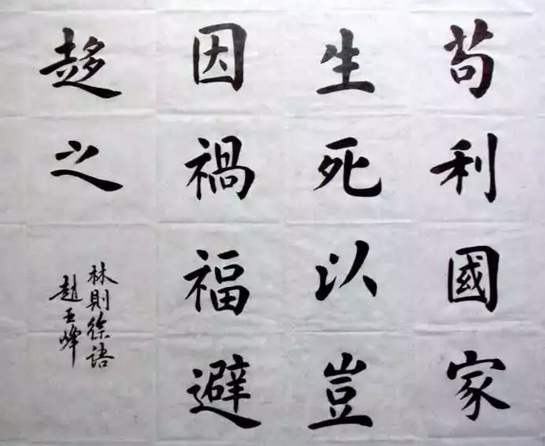

# 汉朝初期经济分析 \#F2070

原创： yevon\_ou [水库论坛](/) 2018-10-19

**汉朝初期经济分析 ~\#F2070~**

 

鹅，鹅，鹅，曲项向天歌。

 

 

一）前言

 

五天写了四篇文章，疲惫不堪。

但是今天广告商又催更，要第五更。

 

实在有点写不动了。轻松一点，写篇口水文。

大家多担待。多点广告。

 

 

前二天有人问我，"市场经济"是不是很久没有提了。

我叹了口气说："是呀"。

别人接着问，"什么时候，才能再回到以经济建设为中心。大家再过过下海鎏金好日子"。

我说，"咖啡难喝，要不我给你讲个历史故事吧"。

 

 

 

二）朝代

 

中国传统的历史教科书，把过去2000年统称为"封建社会"。

其实这是不对的。

 

中国历朝历代，彼此之间差异极大。汉室依赖外戚，唐代依赖武官，宋代依赖文官，明代谁都不信。

整个王朝的"宪纲"不同。导致游戏规则也不同。相应的文化脾性都不同。

 

唐代跋扈的节度使，宋代温文的进士书生。简直就是二种动物。

大天使制定规则，然后才衍生出世间万物。

 

 

"朝代"朝代，如果说"王朝"的不同，许多历史基本爱好者，都能够理解。

则"代际"的不同，普通人就忽略了。

 

事实上，在王朝的内部，几代君王之间，差异可能非常之大。

大到翻天覆地，颠倒日月乾坤。

 

"变"才是永久的。

一朝天子一朝臣。人亡政息，人走茶凉。

"富贵常桓"真是痴心妄想。

 

 

譬如说，"清代"一共十三帝。但满清可以划分成为三个王朝，彼此之间相差极大。几乎不是同一个星球。

-   努尔哈赤，皇太极，顺治

-   康雍乾

-   咸同光宣

 

满清发迹于白山黑水之间。由一个幼小部落，夹缝生存。屡屡在多次军事冒险中，获取先机。初期三帝，几乎都是"创业者"类型。

 

中期的康雍乾，统治着庞大的帝国。国泰民安，和贪腐的官僚系统做斗争。显示出了高明的统治术。

 

后期四帝，国门已经被砸开。面对洋人的步步紧逼，千年帝国的工业化转型。沦为二流国家，开始踏入平等外交博弈舞台。"三千年未有之变局"

 

 

可以说，"爱新觉罗"是一支非常优秀的血脉。他们在绝大多数场景，都做得很好。

"与时俱进"，不同的关卡，都获得了新的技能树。统治者革新演化，绝不是老旧守成之辈。

 

但今天出于某些原因，我们不讲清朝。我们讲"汉朝"。

 

 

 

三）汉室的代际变更

 

西汉的第一个皇帝，是"刘邦"。

刘邦击败项羽，扫平宇内。当皇帝后，又马不停蹄地剪除异姓王。他全部的注意力，都放在了汉室的建立。

 

汉室第二个皇帝，是"惠帝"刘盈。这是一个很短暂的过度，没什么功绩。

此后，其实西汉还有二个皇帝，"前废帝"和"后废帝"。只不过教科书不教。

 

 

"汉文帝"刘恒，是西汉的第六任皇帝。

刘恒的母亲薄氏，原本是魏王豹的姬妾。魏豹兵败之后，没入了刘邦的后宫。一辈子只侍寝过一次，一次就怀了刘邦的骨肉。

 

当时，长安城内，陈平，周勃，刘章联手灭了吕后。大伙商量下来，觉得薄氏一个人在大同，娘家势力薄弱，最好容易控制。因此邀请了"代王"刘恒即位。

刘恒的老婆姓X。

刘恒答应的那一晚，他的老婆和四个儿子同时暴毙。

 

 

刘恒来到了长安，他面临的局面，是整个长安纷纷扰扰，二十年换了六次皇帝。绝不太平。

因此刘恒的核心利益，就是无论如何，要把皇位坐稳下去。

 

具体怎么做呢，那就是什么事情也不做。

我们看历史问题，一定要看历史的"大环境"。总路线决定一切。刘恒并不是生来就是"文帝"。

起手牌如何，决定了牌路。

 

 

当时，刘恒和勋贵们总体的关系还不错。老家伙虽然跋扈，但也算视他如手心手背。

而刘恒最大的优势，是他年轻。他小一辈，他可以慢慢熬，熬到老头子全死光。

 

终"汉文帝"一代，轻徭薄赋。连个露台都不修。

放开民间铸钱，政府小到了极致。

一心一意，躲在后宫养生。

 

 

结果是很明显的。"汉文帝"在位23年。他做到了二件事：

1）老头子基本全在他前面死光了

2）时间就是IP，皇权极大稳固

 

汉初的"皇权"传承，纷纷扰扰，二十年改了六次，眼花缭乱。

但是"汉文帝"这23年的皇帝一坐。哪怕垂拱而治，什么事也不做。天下人都认清了"帝室正统"。

这就为太子刘启接班，奠定了无可争议的法统。

 

 

到了汉景帝这一代，皇室的正统，已经没有任何质疑。

因此汉景帝可以腾出手来，做一些他想做的事。

在汉景帝任期内，解决了"七王之乱"。

可参见这篇《[汉景帝的新理念](https://mp.weixin.qq.com/s?__biz=MzIzNTM2OTc2Nw==&mid=2247484957&idx=1&sn=218776ea9e277376987e10fcf90eac38&scene=21#wechat_redirect)》

 

但是汉景帝虽然在"削藩"上面取得巨大进展。

但真正的"大事业"，还得等汉武帝来做。

 

 

 

四）黄老的落幕

 

汉文帝23年，汉景帝16年，合计约四十年。

史上并称"文景之治"。

在文景之治的背后，还有一位功臣。刘恒的第二任老婆，"太皇太后"窦氏。

 

 

汉代的初期，法家，道家，儒家，几股势力纵横交错。

在"治国之道"领域，并没有绝对的宗教法庭。

 

大家都知道，文景之治的关键，在于"休养生息，内用黄老"。

许民以自由，政府小到极致。

这是道家的思想。

 

道家的主要支持者，是"孝文窦太后"。

对于道家的思想，文帝是身不由己，景帝是三心二意，武帝则是完全听不进去了。

 

民富而国退。

你有那么多钱，民脂民膏，为什么不搜刮起来，做几件大事。

 

GDP天下第一又如何，你是军事强国么。

"集中力量办大事"，老百姓饭吃那么饱干什么。

 

刘邦执政的最后几年，打了一次大败仗。远征匈奴而未成，史称"白登之围"。

当时刘邦已经快要被俘虏了。签订了极为屈辱的（秘密）外交协议，才放了回来。

 

此后，匈奴可汗给中原写信，就有一点趾高气扬。有一次，他干脆写信要求太后吕雉，做他的奴婢。

而吕雉的回信，经过慎重的外交考虑，是这样写的"老身年老色衰，怕侍奉不了大汉的雄伟。现有美貌官家女儿二十人，特此奉上"。

 

 

这么屈辱的国赦文书，在年少气盛，血脉正统的"汉武帝"眼里，自然是不可容忍的。

你有再多的钱又如何，粮食充盈又如何。钱可以买来尊严么。

为什么不"集中力量办大事"。

 

"法家"是一门学派。提倡的是"军国主义"。

具体的做法，就象一台战争机器，把民间最后一滴鲜血，都压榨到国家手里。在穷兵黩武的体制下，哪怕弱小国家，有时也能战胜大国。

"法家"不可常用。因为会损害国力。

 

 

黄老还是法家？

汉朝的"总路线"斗争。在汉文帝时代，是垂拱而治，休养生息。

汉景帝时代，蠢蠢欲动。但又被他妈一掌拍死。

 

汉武帝建元六年，67岁的"太皇太后"窦漪房病逝。权力从西宫转移回皇帝手里。历史的走势，遂一发不可收拾。

 

 

 

五）历史的起伏

 

一个人如果生活在了"汉武帝"的年代，他会觉得历史的车轮，被飞快地搬上了TESLA。

就在窦太后死了之后不到十年，"官吏"扩充了约十倍，"军队"扩充了一百倍。

昔日田园牧鸡的惬意生活，完全被无休无止的徭役和差调取代。

 

这个傻瓜居然还在问，"什么时候恢复市场经济"。

 

昔日被奉为圭臬的"市场经济"，突然之间无人传颂。经典卷帙，遗掷在地。财富不再积累，而以惊人的速度消耗。

参见《汉武帝的新思想》

 

"文景之治"如此美妙的时代，却是和"永嘉之治""贞观之治"一样短暂，昙花一现。

千年以下，如此大快朵颐的时代，也只出现过四五次罢了。

 

很多人幸福得太久。以致于他以为"太平盛世"的景象，是与生俱来，天经地义的。精力过剩之余，甚至还可以关心猫猫狗狗，鱼类环保，弱势人群心理健康。

 

恒纪元

 

其实"盛世"是很短暂的。其绽放的数量级，甚至都不是一个"朝"，几百年的时间。

而仅仅是一二个"代"，三四十年的时光。

 

 

所有的"政策，理论，主张"，看似堂皇，其实却不过是更大视野下的一枚算筹。

-   当需要黄老时，有黄老。

-   当需要儒家时，有儒家

-   需要盐铁专卖时，有盐铁司。

 

每一代皇帝，有每一代皇帝的手牌。相应的，他们的打法完全不同。

目标不同，便有不同的"总路线"。

 

 

值得注意的：这个变化可能非常之快。不是以"朝"为单位，而是以"代"为单位。

-   前一秒还说张艺谋超生，罚了几百万。下一秒就放开二胎了。

-   前一秒还是帝国主义资本家的走狗。下一秒就引进"外商"了。

 

巨兽的身躯稍微转向，碾垮了身下无数的花花草草。每一只蝼蚁，都是一个中产阶级家庭。

 

 

 

六）结语

 

不要抱怨"看不懂"。

嘀咕着"怎么可以这样"。

那是他们不了解，整个社会的变迁，远比他们想象的快。

 

三十年河东，三十年河西。"大运"的界限，是三十年，而不是一辈子。

  

 

（yevon\_ou\@163.com，2018年10月18日晚）
