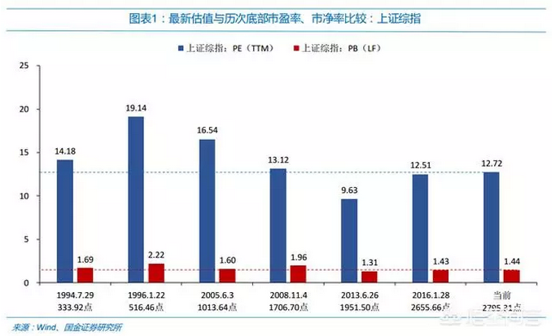
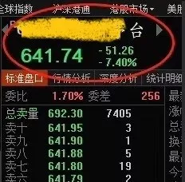
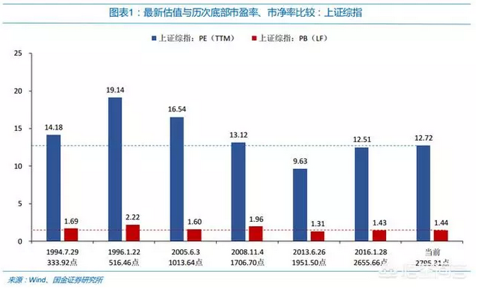

# 合伙做生意的641 \#F2080
-----------------------

原创： yevon1ou [[水库论坛]](/) 2018-10-24

**合伙做生意的641 ~\#F2080~**

 

 

 

一）前言

 

早上，看到微博向班长一张图。十分有趣，忍不住说上二句。

 

年轻人炒股，往往从格雷厄姆的《证券投资分析》入手。

大师们的辉煌巨著，微言精算。教科书级的循循善诱。

看完以后，自觉智商也高人一等。

然后，化作一片韭菜。冲进股市，被人无情收割。

 

证券投资分析的第一课：

-   格雷厄姆的《证券投资分析》是错的。

-   彼得林奇的心得和书籍，全部都是错的。

-   巴菲特是错的。

-   你上手懂得把《证券投资分析》扔进垃圾筒里。你才算入了门。

 

鱼最困难的，是意识到水的存在。

割韭菜最关键之处，入门第一课，就把他带歪。基础就打骗了，以后只能任人宰割。

 

当乡村杀马特，二线三本娃，辛辛苦苦啃着《证券分析入门》时。

有没有人告诉他，这本书就是彻彻底底错误的。

没有，绝不会有。

这个坑，他一辈子也跳不出来。七亏二平一盈。

 

（某知名老庄股）

 

二）合伙做生意

 

假设你手里有点闲钱。你有一个"发小"二狗蛋，是你姑妈家的三姨夫的四舅子的小侄子。

你们俩从小玩到大，关系可好了。光腚一起长大的二伢子。

 

 

狗蛋找到你，说他想做一些"小本生意"。想开洗车行。

生意投资不大。连场地加设备，一共几十万。当然这钱他也拿不出，所以想找你合伙。让你入股。

 

按照"狗蛋"的说法，这个项目真的是花好稻好。

你想，国贸CBD汇集了几十万人群。金银花白骨精，购车最有实力的款爷。而且也舍得为爱车打蜡保养。

 

按照国贸地区的总人口数，乘以40岁以下的人群，再乘以男性%。然后算算月均洗车次数。

哇塞，市场无比巨大。财源滚滚啊。

 

 

可是狗蛋"忽悠"着你入股做生意，你低着头，一个劲地使劲抽旱烟。心里总有一个念头，翻来覆去地响"不中，不通"。

你忍不住想问：

-   附近地区，有没有其他洗车行，竞争如何。

-   国贸地区，无比拥堵。二条街之外，客户也懒得开车过来。

-   你有停车位么，容量爆了怎么办。

-   商铺租约签了几年，万一房东涨加怎么办。房东赶你走怎么办。

 

这些念头，反反复复在你脑海。然后你再回家和媳妇商量。

媳妇用脚踹你肚皮。"傻了你啊"。

-   狗蛋做了二年，携款潜逃怎么办。

-   明明账上赢利，他和你报亏损怎么办。

-   狗蛋给他媳妇开高工资怎么办。

越听越是风险。越想越是风险。

 

 

我们稍微有一点社会常识的人，都知道"合伙做生意"，是万万搞不起来的。

即使几个好朋友，意气相投，大家联手创业。

等公司稍微大一点，一定会有权力斗争，一定会有小九九。搞得不好，真心连朋友都没得做。

 

这件事是如此之困难。以至于"回家和老婆商量"，基本就等于"拒绝"的代名词。

 

 

以我们房圈为例。最简单的，借二张信用卡。

"朋友的婆娘"，晚上一夜疑不成寐。

-   会不会做违法乱纪的事，会不会连累到我们。会不会警察上门来了。

-   不行，明天4:30am天一亮，就得让老钱去把卡讨回来。

 

借卡是困难的。办POS机，捆绑别人的借记卡，借名字代持，更是千难万难。

如果你问亲朋好友借点钱，说好了用十二个月。二个月还没到，他涎着脸过来了，"孩他妈想买点p2p......"

 

 

中国是一个"低组织度"社会。意味着在我们这个社会中，"合作"是非常非常困难的。

乡党，社众，抬会，早就已经被打散。仅只有在潮汕地区，还留有一些残余。

 

相对应的，在中国"拉朋友做生意"，需要付出非常非常高的回报。

 

 

 

三）代价

 

如果二狗子拉你开"洗车行"。你会要求几个点的回报？

你把头摇得象拨浪鼓一样。"不是利息的问题，而是本金的问题"。

 

"你贪我息，我贪你本"。

一年期存款利率，目前不过1.75%。理论上来说，哪怕只有2%的回报率，也足够"合作做生意"了。

 

 

但你跑到社会上去，你说拿2%回报向人融资。那是滑天下之大稽。

被人当神经病赶出去。

 

在这个社会上，投资"实业"，比较正常的融资回报率，目前行情在20\~25%左右。

狗蛋找你"合伙"来洗车店，你投出去的钱，回报要求20\~25%左右。

 

 

这个数字是怎么来的么。

首先，这个社会上不仅有"股权"融资，也有"债权融资"。你把钱放出去，吃利息，也是一种人生。

 

债权融资，有抵押物抵押，或者水库多军内部拆解。则安全性是非常高的，99%安全。点数一般10\~12%

中小企业融资难。你也可以简单地，把企业贷款还掉。就是8%的无风险收益。

 

 

25-12=13%，剩下的13%，是"折旧"。

企业寿命，是需要提折旧的！

 

狗蛋拉你开的洗车店，你不指望能开到"天荒地老"吧。不指望能开几百年，子子孙孙无穷尽传下去。

企业是很"脆弱"的。一个环保政策变化，一个商圈地铁改道，甚至出现一种新的机器，也会导致你的生意关门。

企业的死亡，[是断崖式的。]

 

前一年还如日中天，后一年就柯达诺基亚贝尔斯登。

平时不提折旧。一个浪头过来，毕生股份，直接清零。

 

 

13%的折旧，相当于7.5年的回本。

也就是你和狗蛋开的这家洗车店，连续七年，每年分红25%。最终结果，和定存8%吃利息差不多。

 

这里面的数学，是非常非常残酷的。

 

现在的年轻人，开个奶茶店，烧烤店，一年到晚忙到头，发现刚刚打平。其实就是亏了。

实业入场的目标，[至少应该是回报率25%]，达不到这个利滚利水平，根本不该去创业。

 

 

 

四）募资

 

好了，现在我们看另一种情况。村里有个狗大户张老爷。他想投资一个完全"不靠谱"的项目。类似于低压电器，或者连锁餐饮。

 

张老爷找你融资，拍着你的肩膀说：

"阿韭啊，和狗蛋的合作你不敢投，与我合作，你想收几个点呢"。

 

 

几个点？你自己说几个点。

你张大户欺男霸女，横行无耻。内部管理混乱，中层贪腐。对外账本不清，表兄弟关联交易频频。

而且你从来不分红，赚多赚少黑箱说了算。

 

我和狗蛋，当年一起钻玉米地，偷红薯，是过命的交情。

你，张大户，就是那个地主。

 

和狗蛋的合作，俺还不放心。怎么肯把辛苦血汗钱，交给你这个张大沪！

 

 

如果说，和狗蛋的合作，我的要求是"年分红20\~25%"，尽快把本金收回。做好七年后公司不复存在的打算。

 

那么和张大户的合作，我至少要求25\~33%吧。我对你有四年的耐心。四年之内，我必需取回全部的本金。从历史记录看，你连四年都不安分。

 

 

请注意，我们这里讲的是"现金"。现金分红。

一元现金，在上市公司手里，和在小股东手里，其代价是完全不同的。应收账款一元，最多也就值个二角，三角吧。

 

"市红率"，我们讨论的是市红率。

市红率，而不是市盈率。目前市红率，仅仅只有1%左右。

 

 

 

五）估值

 

我们看回这张表。 

 

股市的"均衡"估值是多少。多少倍市盈率，是公允而合理的。

这个问题，按照"政治正确"的说法，绝大多数证券公司的报告，会推介你20\~25倍市盈率。

==\>"如果PB仅有1.7\~1.8倍。那估值就是合理的，值得并购买入的"。

 

 

谎言，彻彻底底的谎言！

 

股市，就是合伙和狗大户张老爷做生意。

应该按照合伙人的要求估值。

 

 

如果你真正熟读历史，你就知道，在历史的长河中，股票从来不是估值很贵的东西。

 

在股票出现的最初100年中，它是长期遵循8/8/8原则的。

市净率0.8PB，市盈率8倍PE，分红率8%现金

 

 

只看过《证券投资分析》的小白，狗屁不懂的三本大学生，会惊讶地问："8倍PE，估值不会这么低吧"。

 

就是这么低，而且只有全世界"最好"的股市。英国有悠久的契约传统，美国有最严厉的SEC监督，英美股市才有8倍。普通股市只有5倍。

 

在整个1960\~1980年，经济发展最好的日本，模范增长明星。而其股市平均PE=6倍，中小企业股只有三倍。PE=1（看清楚不是PB）的公司比比皆是。

至于东南亚，四小龙，更是别提了。香港股市一直有PB=0.1的企业（今天都有）。十块钱"净资产"卖你一元，你说便宜不便宜。

 

\* 香港股市，要到"红筹兴起"后，估值才开始离谱。至于原因，不提也罢。

 

 

造成8/8/8估值的原因：所有人默认，公司寿命是需要提折旧的。

古典保守主义者认为：在你破产之前，你分的所有红利，等于你的价值。

从这个角度看，绝大多数科技公司，是一文不值的。

 

如果我们按照"狗大户张老爷"合作的思路，来考察目前股票的估值。

你说值多少钱。

如果按照"市红率"20%估算，你说这盘生意，值多少钱。

 

难道獐子岛的董事长，会比光腚发小二狗蛋更值得信任么？

 

 

 

六）结语

 

格雷厄姆的《证券投资分析》，是一本彻头彻尾错误的书。

因为作者写于PE=0.8的时代，诸多"价值分析"，是基于股票有价值的基础上，研判笋盘。

 

但现在根本不是古典时代。现在是一个PE=80，PE=300，PE=无穷大的时代。

因此整个游戏规则，就完全变了。

 

 

股市真正的游戏规则是什么，下篇再说。

 

（未完待续）

 

 

（yevon\_ou\@163.com，2018年10月23日晚）
