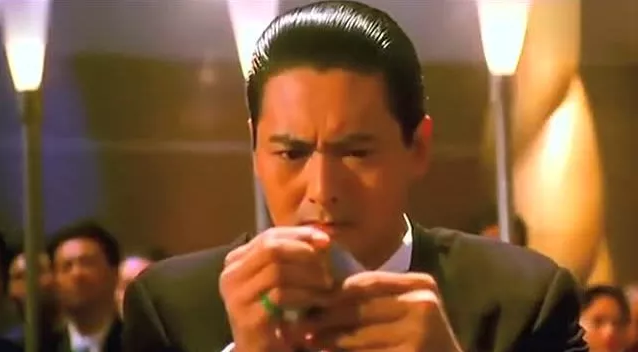
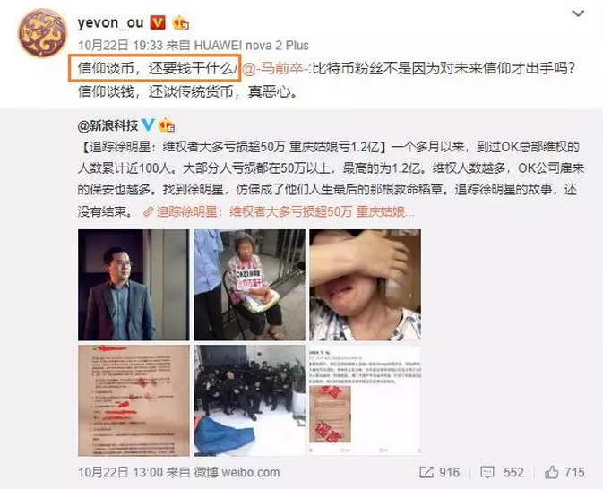
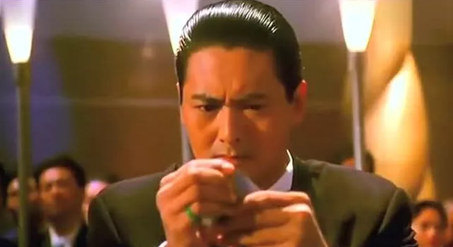
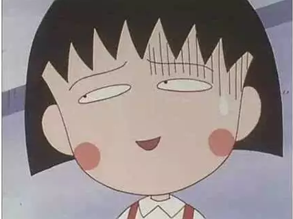

# 股市估值点641 \#F2090

原创： yevon\_ou [水库论坛](/) 2018-10-25

**股市估值点641 ~\#F2090~** 

[昨天](http://mp.weixin.qq.com/s?__biz=MzAxNTMxMTc0MA==&mid=2651019186&idx=1&sn=a1492c50d136a447825070f35339cceb&chksm=807201a1b70588b73db810f9b276d14ed488cdfbc0b88b1751cda8d3fd2bf5c23536263ba8b6&scene=21#wechat_redirect)的讲座公告，大家点"阅读原文"购买。

 

 

一）六百点

 

中国股市的合理估值，是600点。

 

且慢，且慢，且慢。

大炮一喷，我知道一群人要疯了。得罪利益，比得罪灵魂更严重。

 

按照以往的经验，下面肯定一批人要留言：

-   "水平太差了"

-   "什么都不懂，狗屁不懂嘛"。

-   "买了二套房子，也敢评论股市"

-   "茅台是支好股票"。

 

 

好了，我只要问你一句话：

明天把股市关掉。

只许持有，不许交易，股票还值多少点。

 

 

你们那么多口口声声说"价值投资"的家伙。

如1950年般关闭"证券交易所"。

所有股份，只许持有，每年寄一次红利。

你摸着良心说，为了手里每年分红0.1元的股票，宁愿支付多少价格？

 

如果你的发小"狗蛋"。合伙做生意。

10000股，每年"分红"给你1000元。

这盘生意，你觉得还价值多少钱。

 

 

人啊，时刻生活在面具伪装之中。

说出来的话，你骗我，他骗你，没有半句真心。

 

遇到股市中人，币圈中人，个个"价值投资"，区块链看好。

可是你真问他，"不许交易，只吃分红"，一群人吓得逃比兔子还快。

 

中国的股市历史上，从来不存在"价值投资"。

目前市场上的站台大V，周金涛，任泽平，美林时钟之类的，全部都是骗子。

 

因为"价值投资"，A股就需要市红率25%，估值就是600点。

你凡是600点之上，买来卖去，反复交易，全部都是投机。

100%的人口，都是冲着"博差价"去的。

吃股利的，一个也没有，一个也没有。

 

 

历史上这么多年。早在2000年，"楼市蕴含巨大泡沫，房价高估""股市低估，全仓抄底"。

类似言论，不绝于耳。

 

我很有底气地和你说一声，"房子我敢持有到天荒地老。满五满十多军大把"。

 

全天下，有哪一只股票，哪一个基金经理，敢说"天荒地老"。

哪只股票，你敢交易所关闭。

到底谁有泡沫，谁被高估四倍。我呸！

 

 

 

二）漫长的泡沫

 

自A股面市以来，它就从未以PB=0.3，PE=5的"正常估值"进行交易。

在中国人有记忆以来，A股的估值，向来是PB=1.5，PE=25.

 

这段记忆是如此之长，以至于大多数80后，从1990年开市以来，漫长的三十年，全部都浸润PE=25高估值时代。

泡沫之悠久，甚至洗刷了一代人的记忆。让他们认为"25倍"天经地义。

 

我想，中国股市，可能改写了一部分的经济学教科书。

-   教科书：泡沫是短期的，泡沫终究会破灭

-   中国股市：泡沫可以长期，长到维持30年。

 

 

格雷厄姆的《证券投资分析》，讲的是PB=0.8的古典时代。在"价值合理"的年代，如何挑选好货。

A股如果禁止交易，则A股的估值，就是600点。这点是无可置疑的。

 

问题是，A股是可以交易的，而A股的价格区间，长期维持在2500点，PE=25倍左右。

那么，这是什么游戏规则呢。

 

A股卖的，其实是博彩业价值

 

 

一个价值600元的东西，长期以2500\~2600元的价格在交易着。而且维系了三十年。

100%炒股票的人，都是博彩。互相算计，赚的是其他"玩家"的钱。

 

问题是，博彩业也是一门巨大的需求。

有需求，就有价值。

 

为什么一定要价值投资呢，为什么不能是[纯消费]呢。

澳门的赌场，每年几千亿赌收。全世界公认，这也是一个"产业"。

有需求，就有产业。任何满足了人类心理"快乐"，都是产业。

 

谁都知道，去赌场，总体上是亏钱的。

那又如何，你就当掏2000元，做了一个SPA。

 

-   SPA做完，你二手空空。可是神清气爽

-   赌场出来，你二手空空。神清气更爽

 

你把股市理解成"博彩业"，主要哄老年人开心。梭二把好似做"足浴"。比足浴效果还好。

从"先进娱乐业"的角度来看，道理就说得通了。 

 

A股真实价值600点。

它能卖2400点，七成五的估值，来自于"博彩业"。

 

 

 

三）博彩业的游戏规则

 

[\#F2080](http://mp.weixin.qq.com/s?__biz=MzAxNTMxMTc0MA==&mid=2651019186&idx=1&sn=a1492c50d136a447825070f35339cceb&chksm=807201a1b70588b73db810f9b276d14ed488cdfbc0b88b1751cda8d3fd2bf5c23536263ba8b6&scene=21#wechat_redirect)我们开篇明义，格雷厄姆的《证券投资分析》是全错的。

因为那本书，适用于600点的区段。

2400点，完全是博彩业游戏规则。格雷厄姆不适用。

 

股票什么时候涨，什么时候跌。

这时候的游戏规则，你不要看《证券投资分析》。

你要看《博彩业游戏规则》

 

市场智慧：资金面比基本面更重要。消息比年报更重要。

长期股民总结出来的经验教训，有道理的。

 

 

博彩业的主要游戏规则，是"流量IP"。

狗屎不重要，废纸也不重要。买卖股票，99%的人不看基本面。

 

"SB的共识也是共识"，既然大家都开始炒空气了，则最重要的指标是：

韭菜的数量

 

喜欢问"干货"一点的，2018年今时今日，中国股市面临的主要困难。有三点：

 

1）市场容量

2）币圈分流

3）严格监管

 

 

四）A股的生命周期

 

从历史上看，A股一直是往下走的。

这句话的解释，不是说指数，而是说"老股"表现都不行。

 

A股的"扩容"，是有非常明显轨迹的。从300家，到800家，到1500家，到3000家。

如果我们拆散细看的话，则越老的股票，表现越差。

 

 

这是一个很浅显的道理。"庄股不复兴"。

600元的东西，非要卖你2400元。

你见过哪一个ICO上市之后，大股东还卖力吆喝的么。没有，都是逢高套现。

 

就是说，老股在任何一个点位，都一定是"慢慢下滑"的。

2600，2400，2200，2000.........

 

 

而股市的拉升，主要靠"新股，次新股"。

你在2400点价位，上市一批新股。新股的总市值，是老股等量。

然后你把新股拉高三倍，指数就到了4800点。

依次类推。

 

你可以看中国股市的历次牛市，都是如此手法。

如果你的老师没有教你，那他是混蛋。

 

这个其实是一种，数学上的"作弊"方法。玩了三十年。

但问题是，随着A股的"总市值"越来越大。"再扩容"的难度也越来越大。

 

当"股市市值/GDP"比例越来越高。

骗局会超过市场总容量。

 

 

 

五）币圈的竞争

 

1）市场容量

2）币圈竞争

3）严格监管

 

A股的第二个问题，是"币圈"的竞争。

分红0.1元的股票，根本没有任何"内蕴价值"。见它的大头鬼。

"玩"股票唯一的意义，仅仅是"博彩"投机。

 

 

问题是，赌场也不是你一家的。

随着"人民群众的生活水准"不断提高，今天的环境，已经和90年代，很大不同。

 

90年代时，如果你想发财，除了"死工资"，利出一孔，你几乎没有任何出头的机会。

哪怕这个赌场再不公平，至少是个梦想。

 

 

但是在2018年，"博彩"的品种，已经大大丰富。

-   在家打打麻将，棋牌室小钢珠，根本不算违纪。

-   迈出国门，中国周边遍地CASINO。新加坡，越南，缅甸，都是中国人身影。

-   如果你想算计，可以p2p.

-   小注金额，网上彩票。

-   外汇，黄金

-   德甲意甲，足球竞猜。

-   大体量的，还是房产走势。

 

这一切都是"博彩"。都分走了股票的流量。

最后最致命一击，来自"币圈"。 

 

拉里佩奇说，Google最大的竞争者，不是Facebook，或者苹果。

而是NASA.

因为归根到底，是"人才"的争夺，而不是"产品"的争夺。

NASA很酷，很有宇宙价值。google最关心的"人"被抢走了。

 

同样道理，股市真正的对手，不是楼市。而是"币圈"。

你不要看资金面的争夺。

你要看"用户"的争夺。

 

股票的本质，也是空气币。

 

如果一支股票，售价300元，分红0.1元，那么它和"空气币"有什么区别？

那么多亏损上市的"独角兽"，还不都是空对空。大家乐呵呵博差价，割韭菜。

股票和"币圈"，才是同质同种，同生态位的竞争对手。

 

 

币圈实在提供了一个完美的"赌场"。

-   没有涨跌幅限制。

-   没有杠杆限制，最多可以加20倍杠杆。

-   没有交易时间限制。

-   没有动机的限制。

 

既然大家进"赌场"，都是投机去的。没一个吃红利。全都是心术不正。

那么"币圈"的大涨大跌，显然刺激多了。

 

股票：期货：币圈

大麻：可卡因：海洛因

 

在币圈，一个晚上涨跌+20%，都算是"小幅波动"。造富神话和破产讨债并存。

经历了币圈的大喜大落，人很难再有心态，重返淡而无味的股市波动。

 

每天才赌4个小时，涨跌幅±10%，好无趣啊。

适合中年大妈。

 

 

尤其是对90后年轻人的收割，"币圈"占据了绝对份额。

"股市"越发沦为养生枸杞中老年人的闲溜场所。

从IP角度来讲，前景堪忧。

 

（想想更老的更老的老头子的邮币卡）

 

 

 

六）强监管

 

股市的第三个问题，是641.

 

上位者一定要内心清楚，中国股市，是毫无价值的。

别说4500点防线，别说2000点支撑位，都是马奇诺。

 

 

股票现售的价格，主要是"博彩业"价值。

靠博彩业支撑。高抛低吸，互相算计。大家玩得兴高采烈。

可是你说"赌神"周润发吧。他跑到你的场子。被告知：

-   "出了三个K之后，便不可以出♠Q"。

-   "斗地主♥8910JQK可以出，但是♥78910JQK便不许出"。

-   "如果你摸到四个A，系统自动判断你作弊"。

-   "庄家出♦4，你必需回答要不起"。

 

 

周润发一脸黑线，"你玩我"？

要说什么天理，没有天理。

 

规矩就是这样，没有道理。

想在这个场子玩，庄家的♦345，你就必需/只能/说要不起。

 

你这个赌场，本来已经令人乏味了。

再搞这么多规矩，更没有人玩了。

 

鉴于咖啡，641我们就不展开了。

 

 

 

七）结语

 

炒股的都是下九流。中年大妈。

 

 

 

（yevon\_ou\@163.com，2018年10月24日晚）
