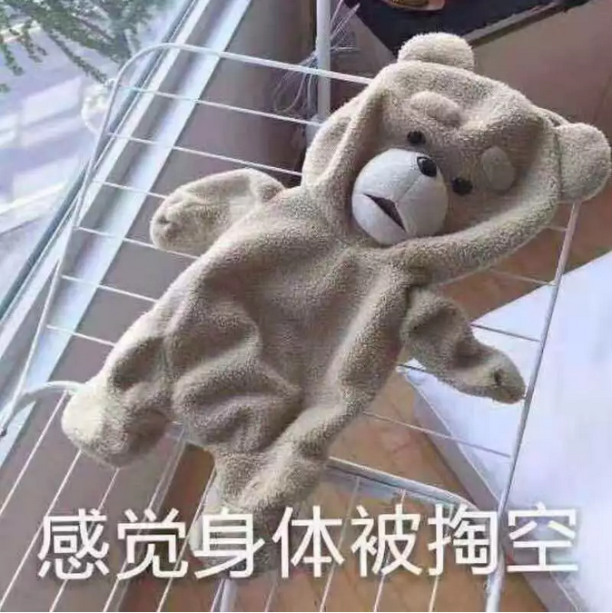
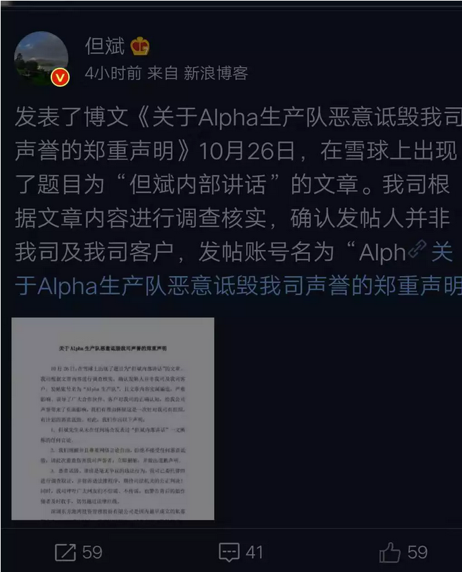
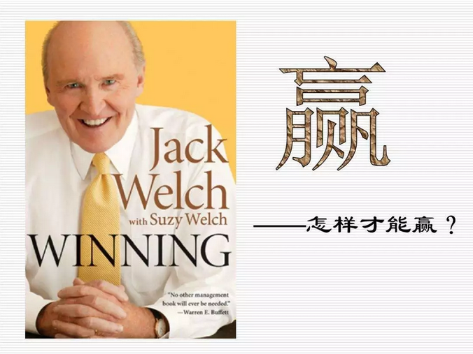
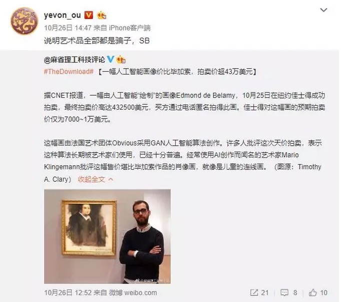

# 肮脏的收藏业 \#F2100

原创： yevon\_ou [水库论坛](/) 2018-10-29

**肮脏的收藏业 ~\#F2100~**

 

 

【网络谣言】但斌：

 

市场牛熊跟我们有什么关系呢，价值投资的旗子我们要继续举下去，真价值投资假价值投资重要吗？重要的是让客户相信我们。我们给客户买了是股票，但是我们要灌输给客户他买的是股权，不要担心客户不接受，客户要真正懂投资，也不会来找我们。

只有让客户接受自己买的是股权，他的钱才可能是我们的钱，我们首批客户签的都是10年，这是我们的基本经营思路。

推荐股票和预测走势是低级的人用的低级方法，你推荐一只股票或预测一段走势，最多1、2年客户就来验证，假如对了，你还可能混下去，假如错了，你就很难再混下去了。还要给人骂是个骗子。我们不要干这样的傻事。

我们公司为什么在门口竖上"专注股权投资"就是这个道理，我们要反复给客户灌输两个理念。一个是强调看好中国经济。另外一个是帮助客户管理家族财富。就算将来投资亏了，那是中国经济的问题，与我们无关，为什么要强调客户家族后代，因为反正是留给子孙的，客户就不会因为市场的波动来找你麻烦。

华尔街前辈早就告诉过我们，这个市场傻瓜永远存在，只要坚持跟他讲价值投资，你让他相信有价值公司，相信要长期投资。你赶他走他都不走。这样他的钱就漫漫变成我们的钱。

 

客户永远是对的，我们的客户我们的朋友基本都是中国的富人，所以可以说：富人永远是对的。

你不要管王石、马明哲说过什么，他们的话一定是对的。穷人说的再多都不如富人说的一句话。现在又不是闹革命，穷人是没有价值的。富人可以给我们带来财富。无论富人说过什么，做了什么，你只要帮助他们说帮助他们做就对了，维护富人的利益其实就对于维护我们的利益。

我在我老家的日子，还有我刚来深圳的时候，说实话，穷日子我是过够了，你老跟穷人在一起当然不可能会富有。

我们基金的门槛是300万，这在同类基金当中可能算最高的，我们就是要找全中国最富有的一群人，他们每年给我们3%、5%，相信我们也可以可能跟他们一样富有。

 

负责博客的还是继续负责下去，每天还是继续要更新，首页不要让他们发评论，话语权不能丢，新浪1000个名额满了不要紧，发现乱说话的可以踢掉，让相信我们的人可以加进来。

做庄其实是很傻的行为，你做一次，客户最后把钱拿走了，而且长期来看，我没有见过坐庄能长期赚钱的。还要担心法律的风险。

我们为什么要宣传和强调长期股权投资，我们为什么基本上只买不卖，我们为什么不担心市场是牛是熊，我们的赢利方式其实是管理费，客户的股权长期在我们这，我们就可以长期拿管理费。

你们不要有思想负担，我们不是在骗人。资本的流动是有规律的，一定是从愚蠢的人流到聪明的人的那里。上帝会帮助我们有才能的人会得到更多的财富。

 

你不要老担心客户会怀疑，客户首先认同我们的想法我们才会跟他签字，他要是怀疑就等于在怀疑他自己。富人的弱点就是太要面子，这点我们可以放心。

说老实话，就算上次那样有人来动粗，我们还是有办法。心平气和才能解决问题。客户无非就是问你为什么高位不减仓，为什么一两年不赚钱，你拿茅台、万科给他看看，然后再拿美国指数给他看。反复强调我们帮他拿的是全中国最赚钱的上市公司，皇冠上的珍珠，反复讲巴菲特，刘元生，A股会到一万点，到时候你的投资会是多少。

 

\-\-\-\-- Alpha生产队

 

 

 

一）古董

 

首先，我问各位一个问题："古董有价值么"?

 

譬如你拿一件宋瓷。汝窑的瓷碗。

如果说"使用价值"，那真的是一点都没有。

 

捧着碗吃饭，汝窑的瓷，还不如2元一个的大白碗。

现代工艺制造，釉面更光滑，杂质更纯净。

最关键的是，打碎不心疼。谁没事捧着几十万元的碗，吃几元钱的煮白菜啊。

 

 

如果你要说"文艺价值"，或者"考古价值"的话。那估计也不大。

人类的绘画，已经经过了十足的进步。从"蒙娜丽莎"开始的光影画法，到毕加索的印象画法，几次飞跃。

若是考古，考证的话，只要留下照片，碎片。似乎也没必要买个碗回家。

 

你再想想，但凡明器，都是从地底下挖出来的。

这个......不知道有多脏啊。想想都恶心。

反正"鸡缸杯"拿来喝茶的事，我是做不出来的。

 

综上所述，古董的价值何在。"因为稀缺啊"。

 

 

古董的支持者们认为，古董是一种"不可再生"的资源。

时光机器，尚未制造。你不可能穿越回宋代去。

宋代遗留下来的古物，因为战乱，纷争，保管不当，砸一件少一件。

 

这是一个"供应量为负"的市场。存量紧缩，价格岂能不涨。

 

 

 

打住，打住，蓝色的这句话，是错误的。

bug在于：历史虽然在不断摧毁古董，历史也在不断制造古董。

 

 

举个例子。如果你是一个"历史系"学生。那你穿越回汉代，是非常幸运的。

汉代的教授，课堂上就只会考你"夏商周，春秋战国，秦"代历史。

 

如果你穿越回唐朝呢。老师就要考你"夏商周，春秋战国，秦汉，魏晋，五胡十九国，隋唐"。

穿越回明朝呢。要考"夏商周，春秋战国，秦汉，魏晋，五胡十九国，隋唐，五代十国，宋辽金蒙，元明"。

 

 

 

作为一个明朝人，你持有一件"宋代"瓷器。沾沾自喜，觉得"古董"一定可以保值升值。

可是真放到五百年后呢，虽然"宋瓷"更稀缺了。但是"古董"的品类却增加了。

 

明清瓷器，明清字画，明清红木家具，无数文人墨宝又加入了新一轮的收藏。整个市场的竞争，只有越来越激烈。

 

 

古埃及从AD3100年开始，一共经历了二十八个王朝。梳理他们，耗费了考古学家大量的精力。

那么，请问一件十五王朝的艺术品，和一件十八王朝的艺术品。

其拍卖价格，会有巨大的差异么？

 

-   今天，你是房龄0年的新房，隔壁是18年楼龄老房子。

-   廿年后，你房龄20年 VS 隔壁38年。

-   都是老女人，有区别吗？

 

如果你"给古董以岁月"。它反而是毫不保值的。

古董虽然是"稀缺"的。但古董的供应，却反而是不断增加的。

 

 

张维迎教授说，经济学中，根本不存在"垄断"。只存在"替代"。唯一的区别，在于"替代"程度的多少。

好比Nokia任何一款型号，都是有专利的。谁也不能生产。

苹果生产的iPhone，其实是"另一种类型"的手机。靠替代击败了Nokia。

 

手机相对于"分众传媒"，又是一种替代。外卖相对于"方便面",也是一种替代。

方便面巨子："垄断"永不存在+"替代"无所不在。

实在是非常大的智慧。

 

想通了"收藏流"的原理，便知道收藏流不可能赚钱。

 

 

 

二）收藏流

 

这二天，"Alpha生产队"刷爆了朋友圈。因为他揭发"[茅台正下](http://mp.weixin.qq.com/s?__biz=MzU3MzQ2MDEwNQ==&mid=2247484373&idx=1&sn=20f01dddb52c463a948a60891085e3cd&chksm=fcc01833cbb791254d0102d8036747b56e9f336b313cd9854a13d0a70b302dba3ca4772936ef&scene=21#wechat_redirect)"但斌的一段内部对话。 

 

当然，"但斌"团队，也已经辟谣了。

我们也无意追究，到底真的假的，是谁说出了这样一段话。

 

这件事其实是收藏业！

 

我们想说的是，这样一种操作手法，是典型的"收藏流"。

虽然话可能是但文，但武，但赟说的。

但客户整体的思路，就是"收藏流"。

 

 

与时俱进，"收藏"这种事，最早是古董瓷器，金石书画，唐砖汉语，翡翠佛像。

渐渐地，扩展到影星球衣，名人签名，邮票钱币电话卡，Chanel限量版。

 

随着人民群众物质生活的不断富裕。"集藏"也扩散到了金融业的领域。变成了一些"较稀缺"的资产。例如：

-   某些"一流公司"的股票

-   限量版的数字货币。

-   珍稀地段不可复制的豪宅。

 

 

"茅正下"虽然也有忽悠客户的举动，但关键还是客户的内心。客户愿意信你，是因为客户的内心在骚动。

有一群人，喜欢在"投资"领域，购买"不可再生"的古董。

 

问题是，你买"稀缺古董"能赚钱么。收藏流能赚钱么。

答案是：不能

 

 

 

以我们之前举的"宋瓷"的例子。

宋代的瓷器，是越来越少的。但同时，也是越来越不稀缺的。

 

"市中心好地段"稀缺的房子。你按CBD的目光看，的确是造一块少一块。不可再生。因稀缺而有价值。

 

 

但是CBD本身，却是不断增加的！

"市区"的概念，从最早的二三条商业街，到十几个副中心，再要远郊几十个开发区。

每一个"副中心"，都有其独占鳌头的楼王座。

从整体来看，"景观大宅"一定是不断增加的。

 

 

 

同样道理，如果客户想通过"定期定额"购买"蓝筹"公司，那也是注定失败的。

因为根本不存在"稀缺"的蓝筹。

 

-   不需要经纪人来忽悠你。

-   是你自己的思路有问题。鬼话都信。

 

没有任何公司，是真正优秀的。

市场的真相是，优秀的公司不停地换。每隔十年，就换一批崇拜偶像。

  

回头望，哪怕仅仅十五年之前，新华书店最好卖的书，最大的造神运动，还是杰克韦尔奇，"经营之神"。

今天，你看看GE的股票卖多少钱。刚刚腰斩，前二天被赶出道琼斯指数了。 

同理，日本有四大"经营之神"。索尼松下，如日中天。

今天呢，索尼还剩多少市值？

台湾的经营之神，台塑王永庆。现在混得怎样。

 

美国IT界，80年代的巨无霸是IBM，90年代是微软，00年代是Yahoo，10年代是APPL.\
昔日的超级巨无霸，不到十年就已过气。

而苹果呢，也大概率熬不过下一个十年。

 

哪里有什么"一生一世"的大蓝筹

 

三）收藏流的盲井

 

收藏流，或者"定期定额"之流，是非常糟糕的思路。

意味在未来30年，你对自己的投资失去了判断。

 

从概率上讲，不管有没有"恶意经纪人"。收藏流本身，买到"劣质资产"的概率是非常非常大的。

这一点，在艺术品，邮票，股票等投资上，尤为明显。

 

举个例子，前二天艺术品市场，刷出了"AI作画"第一拍。

这是典型的"[三无谣言](http://mp.weixin.qq.com/s?__biz=MzAxNTMxMTc0MA==&mid=2651019113&idx=1&sn=4e28bb346c6a881b26551c87db7afa66&chksm=8072017ab705886cc82d08f5b250d02683caef102e57b06f966462d6b106f6fa5085dcb85fa2&scene=21#wechat_redirect)"。没有披露AI算法，没有披露买家，没有披露交易税费。

 

因此，这是一笔非常"可疑"的交易。很有可能是庄家自买自卖，左手交易右手，恶意宣传造势。

 

 

但是在"收藏流"，这种伪劣信息，就成为了致命的软肋。

因为的确有"富人"，他们从实业，工厂，倒爷，不知道什么渠道，赚到了第一桶金。

但是同时又没有任何财商。德不配位，在金融市场，只能当韭菜割。

 

这种"狗大户"就会不停地购买陈东阳，丁绍光的画。一幅又一幅，单向地买入。

买入以后，他也不研究"物有所值"，"流动性"。

 

看似满满一屋子的艺术品，账面估值都很高。心满意足。

等你哪一天走了，你的遗孀想要变现。她就会发现这满满一屋子的"奇珍异宝"，根本卖不出什么钱。

 

集藏从本质上来讲，只有买入时烧钱。卖出时，根本毫不值钱。

只能作为消费，不是投资。

 

类似的故事，已经在"集邮界""藏书界"发生了许多次。

国内外新闻报道屡见不鲜。

 

 

在中国，无良经纪人更可能喂给你的，是"老庄股"。

那些远远偏离基本面，被爆炒几十倍的庄股。通过"代客理财"，让定期定投的狗大户接盘。

例如茅台，地球人都知道，根本出不了货的正下烫手山芋。

 

\* 以上都不是最惨的。最惨的是三十年"定期定投"BTC的程序员。

 

 

四）结语

 

"收藏流"是一件很脏的事。简直和贩卖明器一样腥臭。

 

360行，每一行的钱都有人赚。

客户出于某些认知误区，放弃了判断力，"定投式"买入，被坑几乎是必然的。

对韭当割。

 

但是你去做这行，鼓吹客户"收藏"，你赚客户这种钱。

还是，很脏。

 

（yevon\_ou\@163.com，2018年10月28日晚）
