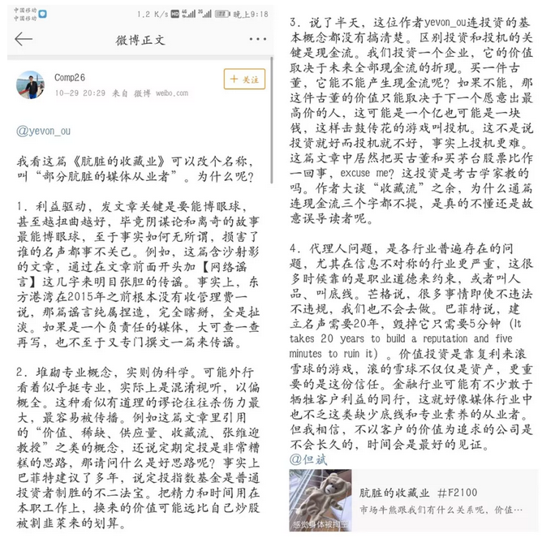
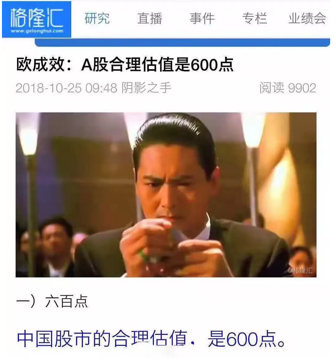
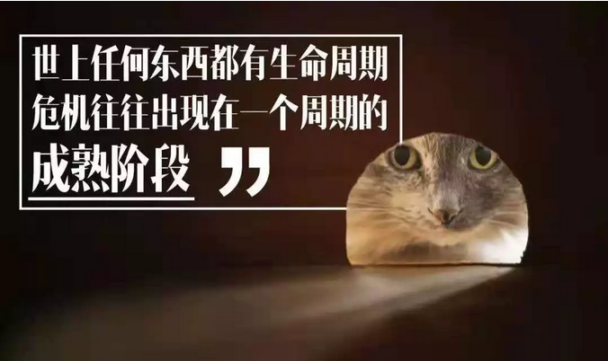

# 定投就是诈骗韭菜 \#F2110
------------------------

yevon\_ou [[水库论坛]](/) 2018-10-30

**定投就是诈骗韭菜 ~\#F2110~**

一）收藏流

 

上一篇《[[肮脏的收藏流]](http://mp.weixin.qq.com/s?__biz=MzAxNTMxMTc0MA==&mid=2651019272&idx=1&sn=b552ed31bb0475542db893672fdb0b5e&chksm=80720e1bb705870da2b08454fd21d8df5adf823798834be13661a1d51df177dcb2e7dafee3ce&scene=21#wechat_redirect)》，我们讲了：

1）收藏本身不会导致"稀缺"。

2）很多客户，用的是一种"收藏流"心态。看中了心水资产，就经年累月不停间地买入。

 

但是，我们并没有细讲，为什么"收藏流"是一门很糟糕的流派。

收藏流的收益率，通常远低于正常的股票，债券投资。

甚至沦为"垃圾资产"收藏大户。

 

没讲邪恶经纪人，怎样从"收藏流"中，收割尽可能多的韭菜。

 

没有讲，为什么著名的"定期定额投资法"是错误的。

 

 

 

驭民之道，诛心最上。

天底下的事情，最核心的是洗别人的脑。把他脑汁洗成墨汁了，不愁念咒启动提款机。

 

我们说过，股市有几大骗局。骗局的核心在于，"入门第一课"就直接把你带到沟里去。

格雷厄姆的《证券投资分析》是错误的。什么看市场份额，增长速度，毛利率，竞争对手等等分析，统统都是错误的。

 

 

哥哥有一次参加《世界BCH大会》。听见与会者大谈数字货币理想，人类沟通与自由。去中心化如何美好。

可从头到底，从来没有任何一个人提到，为什么BTC要卖6000美金，而不是60美金，也不是\$1。

哥哥冷眼冷笑，这就属于"入门第一课"带歪掉的。智商比较低的人，难以辨清广告和忽悠。

 

同样道理，在金融&投资领域，还有一个"常识级"的洗脑谬误。

小白最容易犯的，"定期定投"。

 

 

 

二）定期定投

 

首先我要告诉各位，"定期定投"在学术界是没有地位的。

你翻开任何一本"学院派"投资学理论，绝对找不到"定期定投"的说法的。

 

这个揭示，估计又毁了很多人的三观。

简直就和水库前几篇，讲"[[拉动内需是伪科学]](http://mp.weixin.qq.com/s?__biz=MzAxNTMxMTc0MA==&mid=2651018839&idx=1&sn=f20b2edfeeaa3001cf516bd7d8027db3&chksm=80720044b7058952b46f5bc8238e902400afee205fb2f87fe62a4b755853e806ad0e216b9d48&scene=21#wechat_redirect)"。正统的经济学教科书，是没有拉内需说法的。

 

 

"定期定投"是基金公司，自己搞出来，然后推销给投资者的。

 

只不过假假真真，"基金公司"掩饰得很好。他们把"定期定投"包装在投资学科普之中。

其用心之险恶，简直让你以为"鸿毛药酒"就是CCAV官方赞助的。

而针对的"目标客户"呢，则是"按月发粮"的小白领。

 

 

真正的投资学，投资应该"越早越好"。换言之，第一时间冲进银行。

 

设想一下，假如你刚继承了一笔遗产。金额有数百万美金之多。

从"理财顾问"的角度，你应该如何打理你这笔横财呢。

 

100%的投资学教科书，都会告诉你，"今天就投入到金融市场"。通过购买一个多元化的组合包，来分化风险。例如债券+股票的组合。又或者美国股市+欧洲股市的组合。

 

有没有人建议"时间上的拆分"呢。例如把这笔钱，拆成12分。现金先揣在手里，每个月打一份。"时间上"错开金融市场的高峰低谷。

没有，100%没有。

 

 

"定期定额"理论的设计，从一开始就是为了宰小白兔。哦，小白领。

它故意设计成"每月一次"的供款方式，就是为了符合小白领"月薪"的出粮规律。

 

在数学上，"定期定额"荒谬绝伦。

正三角，倒三角，定期定额，投资顺序的任何改变，都不可能影响收益。智商税。

 

 

 

那么，"定期定投"学说出现的原因是什么呢。

之前【蛋冰谣言】讲得很清楚了，为了手续费。

 

一个赌场，最怕的是你不来。最怕没有流量，没有客源。

而赌场的一切行为，都是为了让赌客更多的滞留。

 

 

平时，赌场要吆喝流量，需要付出非常大的"广告推广费用"。

而"定期定投"是二根最好的吸管，源源不断为赌场吸取资金。

基金公司编造虚伪的理论。

它就是想赚你管理费罢了。仅此而已。

 

 

 

三）定期定投的弱点

 

岳飞说："兵无常势，水无常形"。

 

意思就是说，保持灵活性，随机应变，才是军队最有战斗力的时刻。

反映到个人，则是头脑清醒，时刻判断，才能保护财富。

"定期定投"为什么输。因为你被固定了行为，确定了战场，被人看穿了底牌。

 

 

在水库文章《社保划算，还是商业保险划算》\#F1130一文中，我们曾讲到香港"强积金"的故事。

强积金只要求你取出工资的14%，随便你投资什么股票，已经算仁至义尽。

但是，依然遭受了香港证券界的强烈反对。

 

为什么，因为人口在各个年份，出生率是不同的。存在Baby
Boom，某几个世代，人口特别多。

这样，如果你拿14%的工资去"投资"，保值升值。你就表现为，同一个时段，买盘特别多。

 

而等到你想退休的时候，60岁降临，所有的人一起抛股票。这个世代，抛盘就特别重。

 

这就给大鳄创造了"人为波动"的机会。在某几个年份，大鳄知道你一定买。它可以把股价拉得很高。

等你退休了，他知道你"不得不抛"。他就会把指数压得很低，廉价收割你的筹码。

 

 

同样道理，"买与不买"是一种选择，是一种灵活性。

奥派讲究dT\>0，选择越多越好。

你签署了"定期定投"，就等于你放弃了选择，放弃了灵活性。失去了战术自由度。

 

至于有某些蠢货，转载"巴菲特"推荐定期定投。那是老头子嘴炮。这种鬼话你都信。

巴菲特的言论，是基于过去三十年美国股市的大涨。狗屎运。你问他现在还敢这样买么。形式已经完全变化了。

 

而且"定期定投"，在证券界，也是质疑不断。譬如你选择另一种简单的操作，"恒生指数高于19倍PE抛售，低于14倍PE买入"。则坚持30年，效果比"定期定投"更好。

 

脑子长着干嘛用的。

别人给你一副镣铐，你还要感谢人家把你卖了。

 

 

 

譬如说，你是证券公司大佬。手里有几千几百个客户，都签了"定期定投"协议。并且购买指定股票，例如五粮液。

身为证券公司老总，这些人账户，在你眼里都是"透明"的。也被看穿了底牌。

 

既然他们象"僵尸吃了你的脑子"一样，完全没头脑，闭着眼睛地买入。只进不出。

那我就把"五粮液"炒高好了。有生之年，坐庄老庄股。"定期定投"做接盘侠。

 

而你们的"年龄"，又是全明的。我完全看穿了你的底牌。

知道你哪一年退休，什么时候开始用钱，不再买入，转为抛售。

在你59岁那年，"五粮液"股价崩盘。

 

 

简单地说，任何一样东西，只要"定投"的人多了。它就会被炒成垃圾。

包括指数基金。

 

 

 

四）定期定投的死穴

 

之前二篇《[[合伙做生意的641]](http://mp.weixin.qq.com/s?__biz=MzAxNTMxMTc0MA==&mid=2651019186&idx=1&sn=a1492c50d136a447825070f35339cceb&chksm=807201a1b70588b73db810f9b276d14ed488cdfbc0b88b1751cda8d3fd2bf5c23536263ba8b6&scene=21#wechat_redirect)》《[[股市估值点641]](http://mp.weixin.qq.com/s?__biz=MzAxNTMxMTc0MA==&mid=2651019202&idx=1&sn=11e071981b63f0daf2956dbf63c2827d&chksm=807201d1b70588c7fd2fce4c7f1abf2aa07d027583b008433665b4b3d0ca886bb87499c65f81&scene=21#wechat_redirect)》，发出去以后，被人转到了格隆汇。

雪球的大V们爆了，还有一个叫DAVID的，思路不清，领了二字套餐。

哥哥叹了口气，做股票的人素质低啊。

低在什么地方，阅读能力差。

 

你还拿莘庄的房子，类比A股股市。

还争议什么PB，PE，PEG。

那是真没看懂水库的解惑啊。

 

房子和股票的根本差异在什么地方？

股票需要提折旧本金！

 

 

公司是会破产的。无论你提7.5年中小企业破产速度，还是15年上市公司平均速度。股份，终究是要提"折旧"的。

 

有统计显示，美国500强的企业，平均存在寿命是35年。

这意味着你一个风华正茂的年轻人，硕士毕业25岁加入公司。

等你勤勤恳恳，科长，次长，部长，熬到正职；

60岁准备拿退休金退休了。公司破产了。

 

 

有破产存在，企业就至少提-7%/年的折旧。

加上分险，回报，"股息率"差不多就要10%了。

 

而地产是不需要提"折旧"的。即使提，也是非常缓慢的。考虑到"拆迁"等因素，其残值，甚至是超过100%的。

所以楼市只要2\~3%的租金，就比你10%分红的股票还要强。

 

只要股票还提折旧，股市就永远也跑不赢楼市。

 

 

在美国，不乏有人"定期定额"投资GE股份的。

从1950年代开始，大蓝筹，每一分钱的工资都买入。每一次的分红，都转成股票，直接滚动再买入。

 

在香港，大把大把十几万人"定期定额"认购HSBC。

从60年代，上市价5元，一直买到今天。整整五十年了，也不过63元。

什么"大蓝筹的投资价值"，令人堪忧。

 

定投真正的忧虑，难道不是你投资了一辈子，临到退休，公司破产，直接退市么。

 

例如那个倒霉的定投三十年BTC。

ps. BTC是真没分红的。属于质疑3中的"纯投机"产品。

 

 

 

（yevon\_ou\@163.com，2018年10月29日晚）

