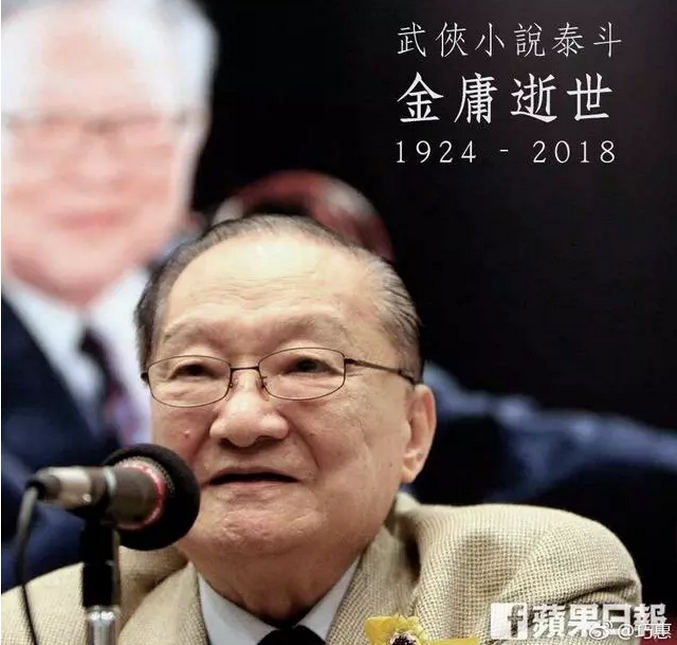
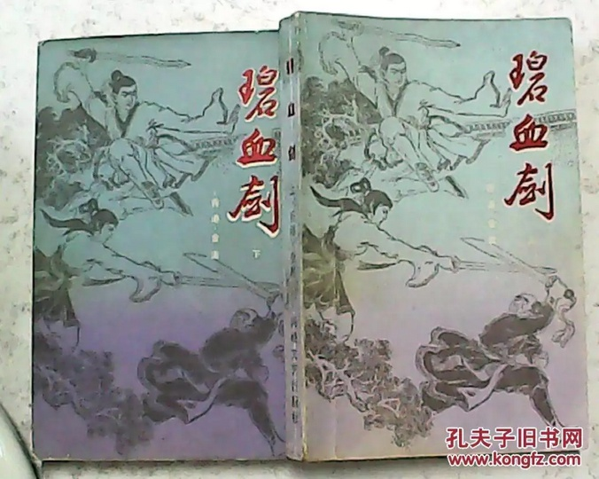
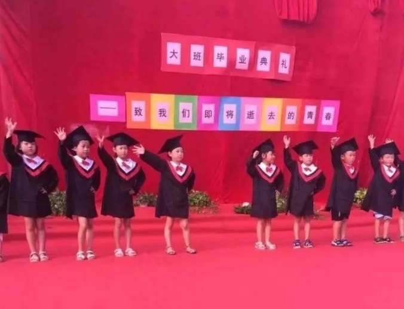
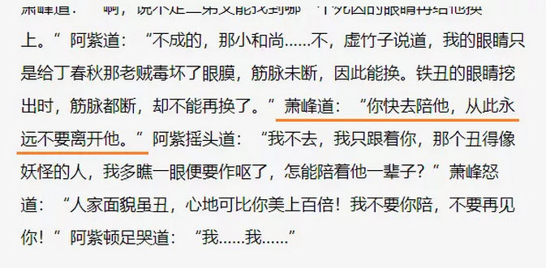
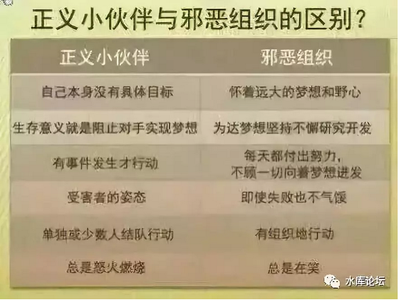
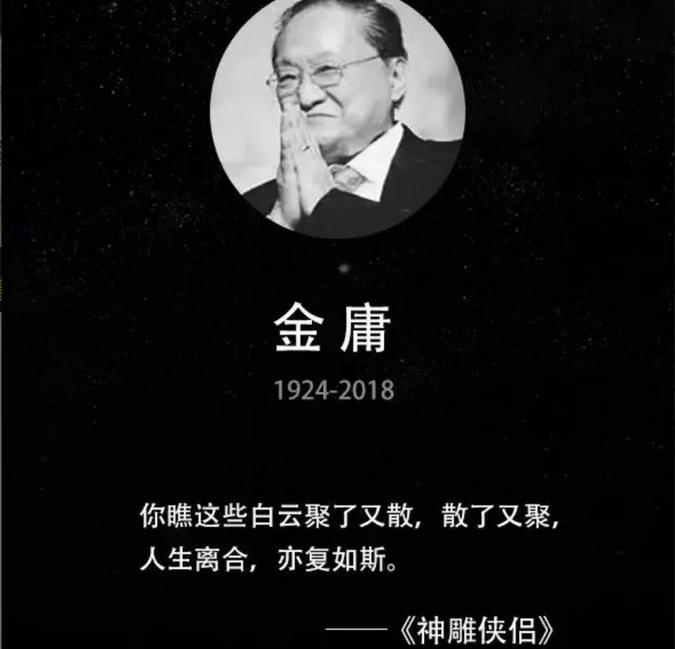

# 

**金庸是个大左派 ~\#F2120~**

 

 

 

一）金庸

 

在我的一生中，查良镛可以说是对我的教育、三观，影响最大的一个人了。

 

 

小的时候，唯一的记忆，是极度的贫穷。

贫穷到全家上下，找不到一本书，找不出一册小说书。

 

当时，楼下的滚地龙，和我家一样穷。连马桶间，都是斜顶的。只有小孩才能直立进入。

但是这么贫穷的马桶间，爬上马桶，攀右上角第三个格子反手拐角，却有一本残书：

 

《碧血剑》，上册

 

政治语文数学物理化学地理历史生物，官办教育花了一辈子，无数的大力气洗脑。最终却敌不过这一本"港台文学"。

 

 

拿到了《碧血剑》，我瘫倒在床上。

列子御风而行，原来这世上，还有另一种活法。

 

笑傲江湖，叱咤风云，神仙伴侣。活得自由潇洒，纵横名山大川。

你是主角。

没有班主任，没有戒律清规，没有各路神仙。中国学生象狗一样生活。没有限购限贷。谁也不能见你踩上二脚，你还要谄媚地摇动尾巴，主动学"汪汪"叫。

 

 

如果按五天一次估算，《碧血剑》俺大概看过200遍。

仅仅只有上册啊，缺页啊，残边啊。这是何等狗血的人生

 

一直要到12岁，俺才能摸到《碧血剑》下，知道袁承志的大结局。

咦，怎么还有一册："广东英雄袁蛮子"

 

 

"金圣人"说的，每一句话都是对的。

我全心全意仰慕您。

 

"广东英雄袁蛮子"看得我热血沸腾，看得我拍案而起。既钦佩于东林党人的气节，又哀叹明末时运的不济。英雄史诗，熠熠生辉。

 

 

多年来，有一件事，我从来都没有怀疑过。

"华山派袁承志"，他为什么要支持闯军呢？

 

 

 

 

二）华山派

 

在金庸的书里面，"华山派"的驻地，在西岳华山。

华山在陕西境内，陕西是李闯的地盘。

"华山派"的立场，奉大顺朝廷为正朔，为闯王李自成出力。甚至不惜卖了青青的嫁妆。

 

袁承志支持的，自然就是大大的好人。

闯王做的一切，肯定也是奉天承运。

 

 

后来我正史看得越来越多，尤其16岁开始读《资治通鉴》七十二册，渐渐发现，这里面是有问题的。

"闯军"在正史上，定性是"流寇"。

"流寇"从任何一个角度讲，都是最坏最脏的。

 

 

楚汉争霸，萧何经营关中。

袁曹争霸，荀彧经营兖州。韩浩屯田。

 

自古所有的"争霸"战争，争气一点的诸侯，"根据地"是一定要有的。

有了根据地，你才有银两钱铢。才有源源不断的兵源。

 

而"根据地"要经营得好，就一定要繁荣富强，法制文明。

守规矩，有秩序，商业才能繁荣。

 

 

但是"流寇"不同。流寇是没有根据地的。

流寇最大的类比，是蝗虫。

流寇每到一个地方，就把当地的血吸干。能抢的一切东西，全部抢走。你简单比拟为"鬼子进村"好了。

 

生活在流寇统治区的百姓，痛苦不堪。

因为流寇区内，是没有"天理"的。

商家A买了B的货物，却不给钱，你去找官老爷主持公道。

 

流寇区"军政府"县太爷会怎么办。

显然是把A的钱+B的货，黑吃黑，二边都没收。

千里白骨，生产力几十年都不能恢复。

 

 

"[晚清沧海事](http://mp.weixin.qq.com/s?__biz=MzU0Mjc2OTkzNQ==&mid=2247484253&idx=1&sn=e7daab119e7f5cac4ce859f3c68d88b6&chksm=fb14d53dcc635c2bd58c4a1ca8d05a0031dd9351fcbcf76a62c00191323e33d8bfc248421d80&scene=21#wechat_redirect)"作者，花了大量的篇幅，痛骂捻军。

捻军就是流氓，就是人渣。全都是品德最为败坏的渣滓。

 

一个正人君子，是无论如何也不会去帮助"千里转战"的流寇的。在他们刀下，不知道有多少冤魂，多少良家妇女。

 

金庸老爷子，是怎么写出来，华山派为李闯效力的呢。

 

 

 

三）立场

 

杨过一辈子的最高成就，襄阳城外，飞石击毙了蒙古大汗蒙哥。

郭靖携手带他入襄阳城，欢声雷动。

 

杨过忽然想起："二十余年之前，郭伯伯也这般携着我的手，送我上终南山重阳宫去投师学艺。他对我一片至诚，从没半分差异。可是我狂妄胡闹，叛师反教，闯下了多大的祸事！倘若我终于误入歧路，那有今天各他携手入天的一日？"想到此处，不由得汗流浃背，暗自心惊。

 

WHAT！ARE YOU KIDDING ME ？

 

杨过这一辈子的成就，关全真教屁事。

难道不是他反出全真教，自我奋斗，才有了黯然销魂掌么。

 

孙婆婆当年怎么死的。金轮法王第一次来中原，清静散人把自己的佩剑给他。杨过拒不接受，仇深似海。

 

你一辈子没有受过体制任何恩惠。临到头来，感谢组织，感谢妈妈，感谢领导关怀，感谢朝中大臣指点机宜。

 

您啥意思啊，跪舔亚克西。

 

 

丐帮有四大长老，净衣帮：彭，简，梁三位长老。

污衣帮鲁有脚。

脑筋急转弯，请问谁是好人，谁是坏人。

 

这种事，简直用大腿都能想到。

"富人都是坏人，穷人都是好人"。

 

彭，简，梁傻乎乎做了NPC，挡在了"黄帮主"真命天女上位的路上。被碾压得粉身碎骨。"净衣帮"全灭。

污衣帮才是政治正确大好人。

 

 

 

英雄好汉，都是不谈钱的。谈钱就庸俗了。

袁承志得了建文帝宝藏，那是一定要捐出去的。万万不可自己当土财主花。武林人士，怎可如此堕落。

 

最奇怪的是，狄云得了梁元帝宝藏，可是他也不花。

你说珠宝有毒吧，拿个大袋子装着。扔瀑布里面慢慢地洗，迟早总能洗干净。

但英雄好汉光明磊落，说不拿就不拿。

 

 

郭芙毫无家教。杨过又没害她虐她，挥剑就砍下杨过一只手。

砍你一只手怎么办呢，先贤教导我们，"以牙还牙，以血还血"。

 

阿弥陀佛，怎么可以这么"血腥暴力"呢。道个歉就可以了，下次不许了哦。

严格地翻小说，似乎连道歉都没有。

这是人写的东西么。"以德报怨"您有病啊！

 

 

最后，轮到我们的"完美英雄"，南院大王萧峰。

或许我该提醒你，在倒数第二章《敝屣荣华，浮云生死，此身何惧》中，萧峰逼着阿紫嫁给游坦之，这又怎么回事。

"武穆遗书"一套兵法，可以用上二百年。甚至战胜察合台的精锐骑兵。

袁紫衣死活一定要当尼姑。

武修文武敦儒猪队友，失陷蒙古军营，一定要去救。

 

仔细想想，"金庸"作品中，三观不正的地方甚多。

 

 

《广东英雄袁蛮子》是彻头彻尾的胡说，谎撒得连脸面都不要了。

 

袁崇焕治辽三年，花的钱，比之前十三年还要多。因为他的无底洞军费，才激起了"辽饷""三饷"。

 

而且"辽军"在他的手里，完成了军阀化。从此以后辽军内战内行，外战外行。一心一意问中央要钱，破贼无心，养贼自重。

 

因为"辽军"尾大不掉，孙承宗向皇帝建议，撤除辽军。重新建立以北京为核心的"中央禁军"系统。这就是明末著名的"辽人养辽土"大讨论。

 

而且袁崇焕出身东林，党派之争极浓。他擅自处斩了"非东林"系的皮岛毛文龙，导致明朝整个海军防线崩溃。

 

毛文龙部下沈志祥率众投降满清。成为"汉五王"之下，唯一的公爵。世袭罔替一直延续到光绪。

 

 

 

四）左翼

 

有一位美国学者，曾经评论中国的武侠小说。

（当然，同样的评论，也可以用于欧洲的骑士小说，和美国的魔戒）

 

他说，武侠小说的本质：

1）你拥有不受别人伤害的权利（伤害豁免权）

2）你拥有伤害别人的权利

3）主要使用身边的随手武器

4）没有任何组织，计划，彻底的原子化

 

你仔细回想一下，武侠小说中的套路。他会用到刀剑，笔，萧，佛珠，打狗棒。

但他绝对不会用到机关枪！

 

绝不会用到，任何：

-   事先需要大量的组装准备

-   需要多人协同操作的

大型器械。

 

武侠小说永远都是个人英雄主义。靠独立个体的武力。而不是：

-   大量的兵种协同配合

-   组织，生产，后勤和运输

 

因此武侠小说的本质，是一部农民的小说！

  

武侠小说的土壤，是中国的八亿农民。或者洗脚上岸，但内心依然没有摆脱的农民。

 

农民习惯了"原子化"，他们的生活，独来独往。

而农民也没有任何成组织，有预谋的大型机械，他们常用的"独门兵器"，就是身边的旱烟杆。

 

农民们YY的"超级英雄"，便是把普通人的能力，放大无数倍。

类似把蚂蚁放大成大象。

 

 

在"武侠小说"中的超级英雄，虽然有内力，一举手一投足，都有千斤力道。

但是其"击打"方式，依然是肉体接触。

"胜负"方式，依然是斗殴对决。

 

成年人了。

等你成年之后，你才发现金庸的不成熟。

 

 

鱼最难的，是意识到水的存在。

很多年以后，我才意识到，金庸其实是一个大左派。他的三观，并非完全正确。带歪了青春。

 

金庸崇尚农民起义，崇尚仗义疏财，仇富嫉贫。满脑子没有半点"组织"意识，正义的小伙伴，傻乎乎地坐等被人打。

 

"侠之大者，为国为民"。金庸有着悲天悯人的情怀，但武侠小说本身，并没有太多通过"建设天国"的道路。

 

农民治国，是没有好下场的。同样道理，大侠整天无所事事地跑来跑去，也完全不知所谓。

 

工业时代的调度，组织，计划和牺牲。在金庸作品中，看不到"机器轰鸣"的组织力量。

 

金庸写的，其实是童话。

适合十岁小朋友看的童话。

 

可是，金老啊

童话就童话。你不是最完美的，又怎样。你即使有一万个槽点，您别走啊。

你走了......我们，很伤心。

（yevon\_ou\@163.com，2018年10月30日晚，老男人敬上）
