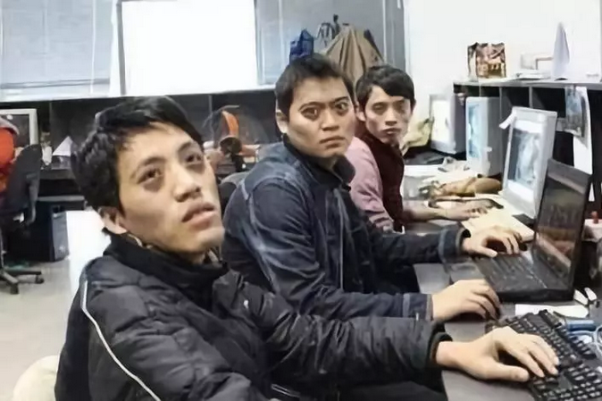
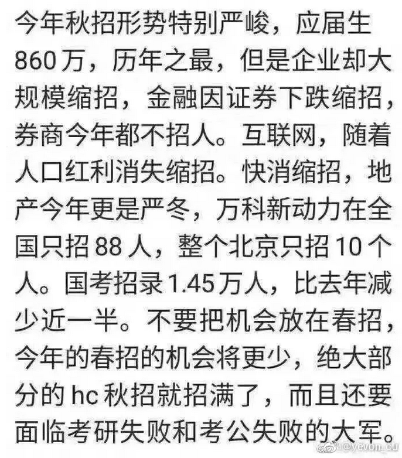
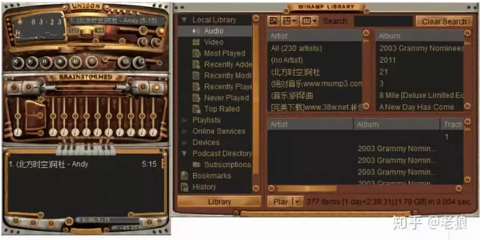
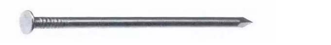
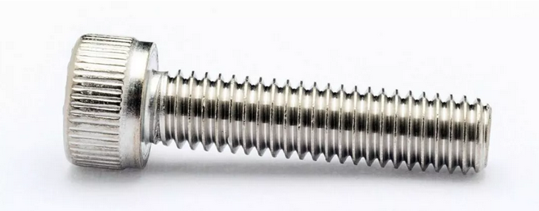
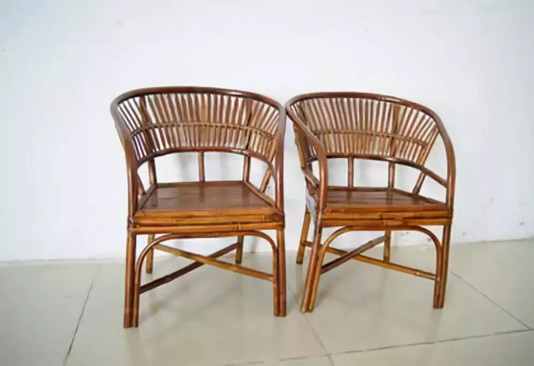

# 程序员会不会失业 \#F2140

原创： yevon\_ou [水库论坛](/) 2018-11-13

**程序员会不会失业 ~\#F2140~**

 

 

 

一）讲座

 

昨天，我们在北京国际会议中心，举办《[人文经济学会](http://mp.weixin.qq.com/s?__biz=MjM5MTYwNzYwOQ==&mid=2655585954&idx=1&sn=9af1a653b8ca110ce18ea22dec3a120f&chksm=bd0f58f48a78d1e276ad7fd720bafe17321843223a229474789bd736067c4a5703a946c008ee&scene=21#wechat_redirect)》经济学讲座。题目是《[工业革命与市场经济](http://mp.weixin.qq.com/s?__biz=MzAxNTMxMTc0MA==&mid=2651019432&idx=1&sn=96312f32c14f93bd87f5cb7f8d59dad6&chksm=80720ebbb70587adae6f200346e616c2427ed67c409e66e29c5548ab1667ec6b83b28e5c4af3&scene=21#wechat_redirect)》\#F30

其中第十三节，我们讲到了"程序员失业"的问题。

 

这话题实在有趣不过。值得我们展开细讲一讲。

-   程序员是朝阳行业，还是夕阳行业。

-   未来对程序员的需求，是会增加，还是减少。

-   程序员个人的薪酬，是会增加，还是减少。

 

 

 

二）讲座

 

说起程序员，绝大多是人是悲观的。

而且越是业内的人，越悲观。

 

而且社会上普遍有一种"反程序员"的态度。

大家都是985的毕业生，我学机械，学工民建的，你学EE的。

-   学机械的毕业，5K一个月。

-   学电子工程的，进BAT，起薪25W。

 

这样的出路，自然很多人心里不平衡。

"程序员是吃青春饭"

"程序员996，就和当年出租车司机，外企员工一样"

"程序员短期短缺，未来会象山东蓝翔，翔大规模供应"。

 

 

包括程序员内部，对程序员的发展前景，也是普遍悲观的。 

你看，经历了多年的"扩招"之后，BAT终于"缩编"了。

新人一律喀嚓。

 

 

而在公司内部呢，一个个小组也是惴惴不安，大祸临头。

随着越来越多的"软件"被开发，公司显得越发人员冗余。

 

软件的版本，已经迭代到了7.0，界面已经美轮美奂。弹出一个窗口，都会有幻影效果。

相对应的，继续再升级优化的空间已经不大。（Winamp你一个mp3播放器软件，搞那么多皮肤干嘛）

 

更为糟糕的是，公司内部已经搭建了"软件之软件""函数之函数"。简称函数库。

 

举个例子，最早的时候，三维的画面换算，人物的远近大小，这些都是要你自己写算法的。

因此第一代3D游戏《Doom》出台的时候，那是了不得的大成绩。

每一家游戏公司，都要养一群"精通3D"程序员。

 

可是后来，就有一位大神，把所有的三维函数，统一写成了DirectX函数包。代码高度优化，高度精美，你拿来用就行了。

何必每家公司，都养一个团队呢。

 

 

再譬如说，20年前，哥哥多愁善感那个年代，《仙剑奇侠传》那真的是一行一行代码敲出来的。李逍遥见林月如，就要专门编一段"情话对话程序"。

 

可是后来，《仙剑》系列出第二代，第三代。

黑心的老板渐渐发现，不需要每次都编写新的代码。反正都是RPG游戏，拿过来把妖怪画面换一下，就是一个新的游戏。捞钱氪金。

 

 

再后来，更弄出了叫"游戏引擎"这样一个怪东西。

现代的游戏业制作，根本不需要自己写底层代码。而是更象我女儿玩的《Minecraft》。

它有一个编辑器。你把各个素材输进去就行。直接就是一个新游戏。

 

程序员抱头痛哭。"完了完了，没戏了。主程序都设计完了，我们也可以回家卖红薯了"

直男瑟瑟发抖，不敢贷款买房子。

 

 

 

三）制造

 

如果你是这样想的，这样规划人生，这样踢了程序员的男朋友。

那你昨天一定没来听我的讲座，《[工业革命](http://mp.weixin.qq.com/s?__biz=MzAxNTMxMTc0MA==&mid=2651019432&idx=1&sn=96312f32c14f93bd87f5cb7f8d59dad6&chksm=80720ebbb70587adae6f200346e616c2427ed67c409e66e29c5548ab1667ec6b83b28e5c4af3&scene=21#wechat_redirect)》\#F30.

 

昨天的讲座中，我们对程序员的描述是：

-   由无序变为有序

-   非标变成标准化

-   "熵"的处理者。

因为这种高等智慧的理念比较难。非水库系的小白听不懂。所以我们需要展开解释一下。

 

 

首先，我们讲一讲，什么是"熵"的概念。

我们举一个最简单的例子：铁钉

在莎士比亚年代，他在作品中几次描写铁钉。不是莎翁热爱木匠，而是铁钉挺值钱。可以一枚一枚，用作货币。

 

因为在中世纪，想要打造一枚铁钉，真的是很不容易的事。

 

你想，铁钉要磨得这么细。这么薄。二端还要连接起来，不凝固。都要靠纯手工活。

 

在工业革命出现之前，家具连接都用木榫头。只有极少数的富人，例如"国王剧院"主管，才用得起铁钉。

 

（榫卯结构） 

 

可是"工业时代"以后，铁钉就烂大街了。"全自动制钉机"每分钟制造300个，一天产量一吨。

 

其原理，大致是一根铁丝，然后一节节截断。自动焊接帽头。

我找了一段视频，不重要，可以不用打开。

[v.qq.com/x/page/e0346o4ili5.html]

 

 

"工业机械"这种玩意，看起来复杂，其实很简单。

其基本原理，通常总是一个圆盘，转啊转啊。

 

因此"工业机械"非常擅长制造大批量，但却千千万万个，完全一模一样的商品。

"熵"复杂度，几乎没有。

 

 

好了，现在问题来了，Step 2

我们不做"铁钉"。我们做"螺丝"。前后会有十几个批次，每次大小，斜度都不同。请问怎么设计。

 

螺丝和铁钉的区别，螺丝是有"斜纹"的。

因为你要加一道工序，先在铁丝上刻纹路。

根据参数，每次调整刻刀角度。然后再焊接。

Step3，新要求又来了，斜纹不用刻了。每一个铁钉上面，乾坤巽震，刻八卦符号。

 

如果说"螺纹"还是合理要求。一看到"巽卦"厂家就傻了眼了。心里千万个草泥马奔过。 

这玩意怎么刻，在"前工业时代"是无解的。只能靠人手车钳刨。难道还能把十万根钉子一一雕花？

 

40年前的"红旗"系列轿车，它是没有办法量产的。

因为汽车发动机那个"气缸"。惯例有七个出入孔，连环勾嵌，极为复杂。

 

传统上，这种迷宫一般，精密的高级部件，是靠八级铣工老师傅，纯手工一点点磨出来的。

因此产量无论如何上不去。

 

所有的一切，在"数控机床"面试之后，得到了颠覆。

数控机床，无论是三轴，四轴，五轴的；

输入程序。起身泡二杯龙井。回来离合器已经加工好了。 

我们再看Step 4

 

给你一吨钢，一台数控机场。前面是火星车，刚着陆在火星表面上。

 

请根据火星车返回的土壤分析，重力条件，自动设计一辆汽车。数据机床现场打印。打印完了，队员就可以直接开走冒险。

 

对于这样的要求，"数控机床"又傻眼了。它只能打印设定的程序。

而要根据环境，反馈算出设计方案。这需要极大的智能。

 

从Step 1到Step
4，是越来越复杂的场景。"熵"含量增加了。因此需要更高级的文明才能处理。

 

 

 

四）数码化

 

我们举了这样一系列枯燥乏味的例子，是为了说明：程序员正在数码化我们这个世界。

把整个世界，由机器不懂的方式，格式化成机器懂得的方式。

 

 

机器的本质，力量庞大，而智慧底层。

任何事务，只要可以交给机器完成，效率就可以提升千万倍。

 

但机器又很蠢，只有"幼儿园小班"的水平。

哪怕铁钉加纹路变螺丝，靠机器本身也是没法升级的。

 

程序员的职责，是给机器增加智慧。

代码的越积越垒，机器可以完成的功能越来越多。升级到小学一年级水平。

 

有了数据机床+数控编程之后，机床就对"铁钉，螺丝，螺帽"无所不能。

不管什么样的形状，都可以雕刻出来。

汽车发动缸，也可以量产了。

 

机器只能处理"标准化"业务，而对"非标业务"无能为力。

程序员就是扩充"标准"的范围。

  

人类的文明，还处于非常初级的阶段。有太多太多的东西，需要装进电脑里去。例如前不久刚发明的"自动美颜"。

从这个角度讲，"信息化社会"至少还有100年。

程序员永远有饭吃。

 

 

Oracle的CEO埃克森曾经说过，"甲骨文的数据库软件，市场份额已达到56%。但幸运的是，全世界只有20%的信息数据化"。

 

"数据化"三个字，实在是道破了文明的真谛。

-   1616年时，由机器制造的铁器，占人类的比重为0%

-   后来，铁钉完全由机器制造。

-   后来，螺丝，铰链，完全由机器制造。

-   后来，发动机汽车盖等复杂大件，完全由机器制造。

-   后来，所有的铁器100%由机器制造。手工业彻底消亡。

-   后来，机器造出了如图的竹椅。

-   后来，切牛排，包寿司，端盘子，擦桌子，一切的行为都完全由机器人操作。人类只需要吃。

在未来世界里，诸如擦桌子，糖醋排骨，教孩子写作业，驾驶宇宙飞船，都将被机器人认为是"简单重复"的标准化动作。

 

 

 

五）结语

 

我认为，目前的程序员，他们走错了路子。

他们花费了太多的努力，痴迷于"虚拟世界"。诸如网游，音乐，数据库后台，杀得一片红海。

因此他们才抱怨"程序员已死"。对前途无比悲观。

 

 

但事实情况是，市场对"程序员"有巨大的需求，但不是在线上，而是在线下。

我们有太多的机器需要升级，随便抓住哪一项，都可以发大财。

 

（机械外骨骼。可以让单兵携带200kg器械，飞檐走壁）

 

研究重心机器人，切菜烧菜机，图像识别，甚至控制无人机。

每一项都可以发大财。

 

问题是，象牙塔的白面书生，你们懂侍候机器么？

 

 

 

（yevon\_ou\@163.com，2018年11月13日丑）
