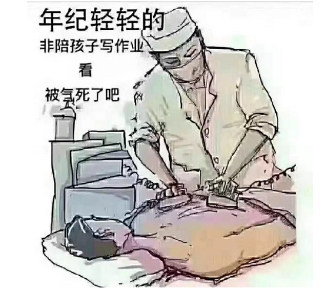
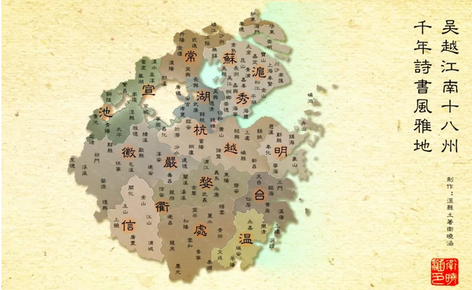

# 

**怎样才能继承3000W ~\#F2150~**

 

 

你这辈子，估计没什么希望继承三千万了。

但你的孩子可能。

 

 

一）套路

 

中产阶级和富人的区别，主要在于"富人开创套路，中产只会模仿"。

 

 

中产阶级的模仿能力，是非常非常强的。

在中国，任何一个"证书"，只要能有一点点的含金量，挂靠能赚一点点钱。中产家庭的"苦读"学子，就一定能把它考烂掉。

-   远的，例如ACCA，CFA，投顾证书，保荐人证书。

-   近的，例如"考证业的王冠"，一注建筑师。

 

 

但是，中产还是很穷。而且越来越穷。

中产和有钱人的距离，是越拉越开的。直到远得令人绝望。

 

论勤奋，论苦读，中产一点都不逊色。可能比有钱人家的孩子，培训班放学更加晚。

中产"事倍功半"，失败的最主要原因，他们的"套路"是过时的，是模仿落后的。

 

 

例如说，目前中产阶级最主流的"虎娃鸡妈"，她们奉行的套路大致是：

-   只生一个。信质量不信数量。

-   拼命读书，高学历路线。

-   以出国为荣。

-   储蓄，投资股票，厌恶负债风险

 

类似于弹钢琴，高学历，海外留学等标签，这都是以前的"上等人"做的。

中产并没有"通透预测"的能力，他们只能模仿。奋斗逼比你更鸡血。

却丝毫不知道，环境已经变了。游戏规则已经变了。

 

你再按这套打法去"读高学历"。举家之力堆一个研究生，结果只能是底层小职员。拿菲薄的薪水，连学费成本都赚不回。

 

 

天下熙熙，皆为利往。

如果单纯地讲"利益"，为什么你不换一个角度思考。其实你有容易得多的方法，很容易继承到3000W。一步跨越好几个阶层。

 

普通人想要跨阶的方式，可能真不是读书。

 

 

 

二）双职工的套路

 

中国大致从1949年之后，开始了"工业化"的进程。

工业社会和农业社会，是完全不同的二个体系。

 

李鸿章说"三千年未见之变局"。1949年之后，仅就"人与家庭"领域，就至少发生了以下变革：

1）废除了多偶制。实行一夫一妻制

2）女性开始进入工商业职位，"妇女能顶半边天"。

3）实行计划生育

4）素质教育开始兴起

 

 

对于"双职工"制度的意义，我们需要展开几句。

一个国家的"国力"，取决于四样东西：

-   人口

-   机器

-   国土

-   组织方式

 

长期以来，教科书对于"GDP"的描写，有一点错误。例如把GDP定义为"工商业总和"。

你生产一把椅子，这是GDP。

 

然而这是不对的！

GDP真正的含义，应该是：人力的生产+物资的生产+国土的生产+科技的生产。

 

你没有生产一把椅子，你生产了一个娃娃。

为了这个娃娃，你卖掉了你的大衣。

这同样是一种"产出"。

而且是最宝贵的产出。

 

 

按照京沪的标准，一个大学生，一年的收入很容易达到25万。

按22\~62岁，四十年的岁月中，他的薪酬总收入超过1000W。

哪怕扣掉一半，自身的"生存成本"。那至少也剩500W。

 

也就是说，一个妈妈，如果她有四个22岁的孩子。大学毕业，马上踏入社会。

那么这个家庭，其实就拥有2000W的净资产。

 

有一些女孩子盘算："嫁给拆迁户，还是嫁大学生"。

其实大学生的年薪，可以折算成"人力资源"。乘以30倍，是一个比较好的算法。

 

 

言归正传，我们的意思是："人力资源"也是宝贵的资产。

待在家里闷头生孩子，养孩子，陪儿子写作业，也是宝贵的劳动。

但是"双职工"呢，属于一种"寅吃卯粮"的行为。

女性出来工作，导致：

1）生孩子数量的减少

2）陪伴孩子时间的减少

3）保姆和钟点工的费用增加

 

从整体角度而言，"双职工"未必是生产力的进步，也有可能是倒退。

-   "丁克家庭"所谓的富裕，是以丧失未来为基础的。

-   生活潇洒自由，是以丧失未来为代价的。

-   物质产出增加，是以人口产出减少为代价的。

 

丁克家庭存款400W，未必有"多一个成年孩子"划算。

生产物资，未必是比生产人口，更好的主意。

 

 

那么，什么时候一个国家会选择，并大肆鼓吹"双职工"制度呢。

落后国家想要奋力追赶的时刻

 

有过几个年代，我们是那样地恐惧。帝国主义想要侵略我们的国家。

为此，我们不惜砍光了森林，炼制钢铁。

不惜破四旧，拆光了寺庙。

中华民族曾经不惜一切代价，要先把"工业化"搞上去。

"人口"，就是那个代价。计划生育之后，经济开始腾飞。

 

 

可是事移时易，随着"国家形势"的不同，中国已经是最大的工业国，第二强大国家。

这就让我们重新反思"社会战略"。在双职工和生孩子之间，重新再取得平衡。

 

见《[中国真的有那么强大么](http://mp.weixin.qq.com/s?__biz=MzAxNTMxMTc0MA==&mid=2651015737&idx=1&sn=205e10e92778e5e3f233e647d1b79bbe&chksm=80721c2ab705953c246dd310d3158746aa4f53e3a814fcb61653a8b8bc98aa344a84cd67e05e&scene=21#wechat_redirect)》

 

 

第二个问题是，"工业革命"是一件很新鲜的事。新鲜到我们全部都没有"经验旧例"可循。

中华五千年文明，封建社会长达2000年之久。历史的重复，使得各种情况，都有前人覆辙可以参考。

 

但是"工业革命"太新了。新到中产阶级完全意识反应不过来。

"工业革命"第二个问题是，小女孩很容易撞见"剩女陷阱"。

-   堆积大量的资源，高成本"精养"女儿。

-   高学历，海外留学背景

-   白骨精，职场体面高大上

-   35岁也没有男朋友。

-   只懂婆婆妈妈，爱护小动物，傻白甜

 

这样培养出来的女儿，其实是"废物"。

 

"工业革命"太新了，新到了中国人没有经验。坑无数。

他们不知道，大把资源堆积出来的，反而把"小皇帝"养坏了。

过度的富养，会有"富贵病"。

女儿精致得象象牙塔里金丝雀，不适合残酷现实生活。

 

"双职工"+"圣女病"

这二件事掺在一起，便是奇鯪香木+醉仙灵芙，产生了致命的毒性。

 

 

 

三）8421套路

 

8只老狐狸

4只大狐狸

2只小狐狸

1个傻白甜

 

 

有一些"乡村凤凰男"，想要出头，想要读书。

想要进体制内，科长处长局长，一级级爬上去。想要有钱有势有权。

他们是注定失败的。

 

为什么，因为他们面对的是"8只老狐狸"。

科室里的老狐狸，嘴上不说，心里可是铁索横江。

你年轻人这点花花心思，还不早就被人看穿。

 

"人际关系"办公室政治，最是口蜜腹剑，软刀子杀人不见血。

二面三刀，你再学一百年，你也斗不过这些老狐狸的。

更何况人家盘踞已久，天时地利人和，根深蒂固盘根错节。新来的"外来户"想要出头，绝无可能。

 

现在的年轻人，总是抱怨"阶层固化"。寒门再难出贵子。

这种事是必然的，也是无可阻挡的。

"老狐狸"可能是办公室战斗力最强的物种。护城河早已经挖好，深沟壁垒。

你想要通过"读书\--工作"这条路，中产职员向上爬，真千军万马独木桥。

 

 

但是另一方面呢，这个世界又是如此地讽刺。

8421傻白甜，三十丈高的城墙，却开了一道后门。

 

因为老狐狸无论如何强横，无论如何牛逼。他们终究是要老，要死的。

世界，终究是年轻一代的。

 

八个处长，八个风风光光的家庭，正面格斗，勾心斗角，你绝对没指望赢过八家。"既得利益者"囤积了大量的官职和财富。

 

但是8人变4人，4人变2人。

最终八个豪门的财富，全部汇聚到一个女继承人手里。

女继承人是个傻子。

 

 

屌丝们总是咆哮叫嚣，社会不公，阶层板结。动辄就要掀桌子，Broad Wu.

那是你颈上没脑子。不懂得拼命地生，用数量堆死质量。

 

今年上海高校录取116W大学生，报考人数只有115W人。

工业社会，商品富足，哪怕你养十个八个。

只要别傻不啦叽蠢到学钢琴、玩留学。你也能把每一个小孩培养成"大学生"。

 

 

然后你干嘛要撞铁板地，直接和"老狐狸"正面硬扛呢。搞得头破血流的，刺刀见红地，非要从人家手里把"局长"职位抢过来。

屌丝非要哭天喊地地，指望政府调控房价。扔一块限竞房骨头，恶心得你难受。嗟来之食。

 

你直接继承八套房子，岂不是更好。

为什么你非要正面攻打护城河，被城防砸得头破血流。

你不懂绕个圈子，拿了钥匙直接进后门。按倒拆迁妹。

 

见到白眉老狐狸，老狐狸气得咳弯了腰。

你强忍住笑，"叔公，以后就是一家人了，还请多关照。来，我来给您沏茶"。

 

近代欧洲，最强的皇室是奥地利哈布斯堡，拿到了超过一半的法统。

可是这个家族，既不出英勇的将军，也不出无双的谋士。

人家的特长是"生公主"。前后一共嫁出去十二位公主，靠联姻获取了欧洲大部分的王权。

 

 

 

四）大继承时代

 

 

以上海为龙头，苏湖杭，乃至整个大"吴语"区。

目前"吴语"区的人口趋势，十分衰败。

-   每过一代人，人口减少一半。

-   有1/3的婚姻，是涉外（地）婚姻。

 

花花世界，十里洋场。

锦绣大上海无数纸醉金迷，滔天财富，大小豪门。

 

上海人心知肚明，这么多的财富，守是肯定守不住了。

下一代，无论是男娶女，女嫁男，至少会有1/3落入到"凤凰"手中。

八位处长的世代积累，狐狸皮为他人做嫁妆。

  

这是数以千亿计的财富转移，但却是无声无息。以毫无争斗的形式，悄然滑落到"擅于生育"的家族手中。

没有和老狐狸的生死搏斗，只有含情脉脉的花前月下。

 

这种事，远远比房价涨涨跌跌二十个百分点重要多了。

最擅长积敛财富的家族，都是在不声不响中，已换作了城堡的主人。

 

 

 

（yevon\_ou\@163.com，2018年11月14日晚）
