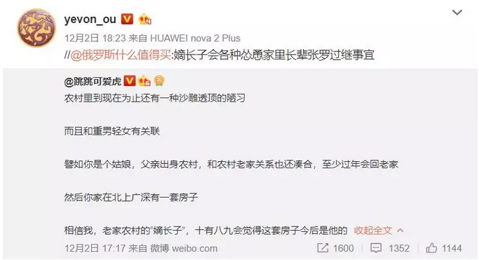

# 欧洲的铁路 \#F2170

原创： yevon\_ou [水库论坛](/) 2018-12-21

**欧洲的铁路 ~\#F2170~**

 

 

 

一）中古铁路

 

zm要求，周五再交一篇。

对于水库这种，严重依赖广告收入的"房奴"。金主就是上帝，万万得罪不起。

zm成了我老板。

 

可是我实在写不出，下午发了四个小时呆。刷了无数抖音，只记得了一首歌"空空如也"。

没办法，咱们随便写点历史凑数吧。

 

 

有时候我回首19世纪的欧洲"君主"，真心佩服这些帝王们。

不是因为他们通常都没有好下场。除了英国王室，其他接近全灭。

 

我佩服的是，19世纪欧洲王室，居然撑了那么久。

最后还有丹麦，瑞典等漏网之鱼。这份运气真心不错。

 

 

19世纪初，欧洲发生最重要的一件事：铁路被发明了。

铁路的发明，远远比中国人印象中的早。

譬如说，我们看电影"哈利波特"。哈利是在9¾月台上车。到达霍格沃茨的交通方式：轰隆隆的蒸汽火车。

 

中国人第一次看这样的电影场景，会很不习惯的。

因为"哈利波特"的背景设定，是中古时代。魔法与龙的世界。

你能想象玄幻小说中，斗着仙草和法术，突然冒出来一辆火车么。

 

 

但是英国人就习以为常。因为在英国人的记忆中，火车是"中古时代"。

工业时代的明珠王冠，英国却早在魔法时代就有了。

 

百度百科认为，铁路是1814年被发明的。

更具体的年份，其实并不可考。

因为最原始的铁路，是从煤矿中衍伸出来的。

 

煤矿工人很久以前，就习惯铺设二条铁轨，来运输他们的煤炭小车，直到地面。

到了地面以后，为何不延长几米，到达仓库。

到达仓库之后，为何不再延长几米，到达海边码头。

 

所以铁路"自古以来"就已经存在。铁路的历史，几乎和煤矿一样古老。

只不过"火车头"发明了以后，又有了一场飞跃罢了。

 

 

在最早的时候，铁路并没有引起什么轰动。英国人，也没有给铁路太大的重视。

因为"工业革命"首发在英国。而英国很凑巧，几乎所有的大城市都靠海。

 

所以英国人对于"陆路运输"的需求并不大。哪怕有铁路，英国人还是更喜欢用海岸线航运。航运的成本优势是巨大的。

 

相反的，当铁路传到欧洲时，瞬时引发了巨大的轰动。

 

 

 

二）皇家海军

 

许多人或许对1830年"皇家海军"的地位，没有直观的印象。其实那20年历史，对于皇家海军是刻骨铭心地，魂牵梦系的黄金日子。

 

 

教科书上说，1840年"鸦片战争"。中国陆防惨败。四万万人民，打不过3000入侵蛮夷，6艘炮舰。

 

教科书没写的是，同一个时代1840年，其实法国，德国，荷兰，比利时，西班牙......其他列强也被英国海军虐得不轻，脸面全无。

大清不是最惨的，彼此彼此。

 

 

因为当时的"皇家海军"，是极其罕见的一支"二栖海军"。

Frigate上面只有一半大炮，还有一半是装人的。主要是陆军龙骑兵。

 

海军具有"机动能力"。从广州出发，十五天到了泉州，再过十天到了宁波，三天到了镇江，二个月就到了塘沽。

而对于陆军，这样的机动跋涉，是不可想象的。也是无法防守的。

 

论战斗力，大清帝国并不输于英军。

可是这么长的海岸线，你是完全无法防守的。只能全面内撤。

 

 

在欧洲，形势与此完全一样。皇家海军既然控制了海洋，他就随时可以"登陆"。派遣一支地面部队，深入农耕区150KM左右。

 

有了"登陆作战"，你就可以烧杀劫掠，肆意破坏。极大地摧毁德意志的国力。

 

你也可以看看"法国地图"。法国整个西海岸，大西洋沿线，没有任何一座大城市。

 

 

肆虐欧洲的海军，在"铁路"出现之后，形势就完全二样了。

从登陆地点，到附近的城市，至少需要一天的时间。

 

而依靠铁路调兵，再加一些防御工事，也只需要二三天的时间。

铁路使得陆军，至少在城镇周围，获得了"皇家海军"一样的机动能力。

 

这时候英国再敢登陆劫掠，就会被暴打成浆。

 

 

"铁路时代"出现之后，皇家海军地位一落千丈。

从最初的，可以登陆劫掠的Marine，沦落为只能外海骚扰。封锁航道的远洋海军。

再后来，干脆拆除了全部的运兵设施，改装成全炮舰。

 

相应的，英国的劫掠能力，和欧洲诸国上贡程度，也大大减轻。

英国的国势，从1850年就开始走下坡路了。

 

 

 

三）人口的流动

 

"在铁路时代之前，真正的旅行并不存在"

 

铁路时代之前，欧洲最主流的交通工具，是马车。

想象一下，六个人挤在狭小的车厢里。分二排，大眼瞪小眼。

 

而且比"车厢"更严重的问题，是弹簧。

工业时代之前，真正意义上的弹簧并不存在。就连海绵也很少。

 

如果没有弹簧，这一路上的乡村泥路，您的屁股就慢慢减肥吧。

而且还要走很久，每天移动速度不超过20英里。从巴黎到Bordeaux可以爬半个月。

 

除了Marie Antoinette这种远嫁女人，没有人坐车走很久。

 

铁路的出现，改变了这一切。

第一次，无穷无尽的人流，可以离开他们的家乡，去看看外面的世界。

 

你不要看印度铁路这么奇葩。其实这已经是几个邦的人民，千年来最好的交通工具。

 

注：美国曾发生严重的"铁路股票投机"。

虽然最终证明，铁路并不是一个很赚钱的行业。其资本回报率，平均不足4%，大部分以亏损告终。

但挡不住有大量的资本，投入到"高科技"铁路股。掀起了许多泡沫。

 

四）封建的瓦解

 

欧陆列强，为了抵抗英军海军的侵略，把铁路修到了最远的城市。

他们没有想到的是，这也埋上了封建贵族们的丧钟。

 

因为千百年来，贵族们的统治，是很稳定的。

你是领主的马童。你的爷爷也是。你爷爷的爷爷也是。

世世代代，千百年来，人们被禁锢在这个山谷。世代都是你的家臣。

 

可是"铁路时代"之后，就不同了。人们发现，不用待在体制内了。

部分大着胆子去巴黎、马赛打工的人回来说，可以拿到好多的工资，而且也不用受气了。

 

于是"封建时代"就崩溃了。

封建领主，再也没有办法维系他的权威。

 

卢梭，孟德斯鸠，启蒙运动象野草一样如火如荼。

随着每一个农民，都发现他们可以争取"更好的机会"。"君王\--骑士"分封制度摇摇欲坠。

"君权神授"的路易十六，也无法维系思想上的冲击。

 

 

除此之外，"铁路"本身也是一个就业大户。

铁路，使得远距离交流，跨省贸易成为了可能。

在铁路车站的周围，必然兴建大量的货栈，转运，初加工。

这些都成了就业大户。

 

随着越来越多的人，在铁道附近找到了工作，脱离了农民身份。

封建领主的权益岌岌可危。封建依附关系，成了可笑的注脚。

 

 

五）质量的末路

 

我上周看欧洲史，看到此处时，忍不住拍腿击掌大叫。

你说我讲了这么多的铁路，你猜我看到了什么。

 

我看到了"质量"的不稳定。

"降低人口数量，提高人口质量"注定是要完蛋的。

得心有多大，才能说出如此无厘头的话语来。

 

"质量"是不稳定的。

 

大家都是人，谁也不是三头六臂。凭什么你一个抵我八个，四个，二个？

比英语奥数，固然你强。

如果要比赛"田径"举重的话，你一个贵族，可能跑步还没我快。

 

 

贵族之所以"贵"。一个抵你十个。是因为贵族有"资源"加成。

无论是学历，知识，金钱，土地，人脉.........一层层叠上去，十个农民，也抵不过一个老爷。

 

但十九世纪的问题是，"社会变化实在太快了"。

 

说不定哪天，大家比试的就是抖音跳尬舞的能力，电竞网游的能力，VR城堡开店的能力。

你之前学习的开车，翻译，拍照，弹钢琴等能力，是有可能一夜之间归零的。

 

"质量"高度不保值

 

 

工业革命，诞生了英镑超级强权。

欧陆各国，为了对抗英国，兴建了铁路。

因为铁路，带来人口流动，启蒙运动。

最终欧洲众王室垮台。

 

19世界还诞生了电力，无线电，化肥，医药。

其中每一项，都足以把世界搞得天翻地覆。

 

你自以为贵族垄断了"知识，金钱，土地，人脉"。

可是人家掀桌子，直接和你比游泳，比举重。一个人再快，游不过十个人。

何况，还有无数无数桌子。

 

 

 

六）结语

 

本篇的重点，讲的是"数量压过质量"。

追求质量是没有意义的。压缩一半数量，更是得不偿失。

 

居上位者风雨飘摇，未来有太多尺度、维度的挑战。

任何一个维度应对不当，就被人拉平到一起比赛羽毛球。

数量才是胜负手、王道。

 

 

*您要是联想到手机，互联网之类的。那是你们想多了。*

 

 

（yevon\_ou\@163.com，2018年12月20日晚）
