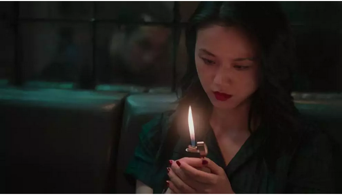
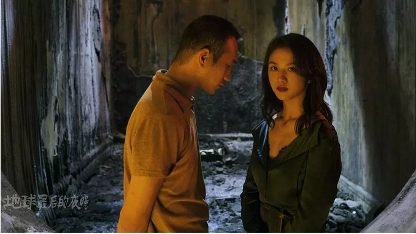
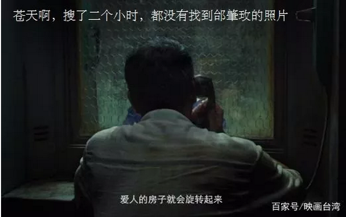
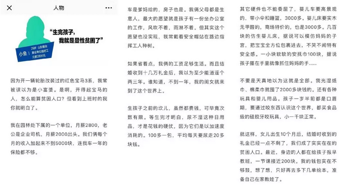
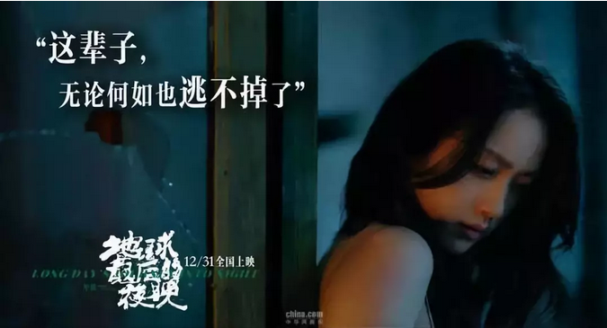

# 地球最后的夜晚 \#F2190
----------------------

原创： yevon1ou [[水库论坛]](/) 2019-1-2

地球最后的夜晚 ~\#F2190~

  

伤痕文学

 

 

一）跨年

 

12.31应该干什么事。

按照豆瓣的说法，应该去看《地球最后的夜晚》，尤其23:30午夜场，算准了时间，可以一吻定情，跨越2018。

 

真是一个不错的广告噱头，也使得毕赣导演第二部电影，没上映就获得了1.19亿预售。

你们是去看电影的，哥哥是去看汤唯的。

 

我几乎看过汤唯的每一部电影，无论多么小众，无人关心。

毕赣，小镇凯里，咖啡色的昏暗的夜，这些我都不关心。我就是去看汤唯的，看她穿旗袍的样子。

 

电影讲了一个庸俗不堪的故事。主角罗纮武，从一开始就说"他的记忆有点混乱"。分不清记忆和梦境。

而电影中，又再三提醒观众"电影里都是假的，是一幕幕场景拼接起来。回忆则相对真实得多"。

 

所以，这部电影，也是采取的蒙太奇手法。穿插了很多故事和隐喻。

凭哥哥低得吓死人的智商，我勉强把它们拼接起来。

 

 

男主角罗纮武，他有一个好兄弟白猫。白猫欠了左宏元的赌债，送枪晚到，被左杀了。

罗纮武为白猫报仇，找到了左宏元的情妇汤唯。

交往中却爱上了汤唯，深深地迷恋。

 

汤唯想要离开左宏元，鼓动罗纮武在电影院里暗杀左。

最后一个晚上，他们在火车站旁的小酒馆里缠绵。灯光和屋顶宛如旋转了起来。

 

晚上九点，罗纮武开枪动手。

远逃缅甸，一觉醒来，已经是十二年之后。

 

十二年后，他凭旧信，找到了汤唯的同伙邰肇玫。邰给了汤唯新地址。

原来，十二年前，事发后汤唯就一路逃走，逃到了旁海小旅店住下。等她再也没有钱付房租时，就嫁给了旅店老板。

 

罗纮武后来做了一个梦。在梦中；

-   他的儿子没有死

-   他的母亲是爱他的

-   凯珍还是少女，未曾被贩卖出村寨子。

 

凯珍说，她见到罗纮武时，就中了大奖野柚子。

 

嗯，大致就是这样的情节。

或许会有出入，但是并不重要。

 

我想说的是：凯珍，决不是长汤唯这样子的。

 

 

 

二）凯珍

 

汤唯是一等一的美女，一举手一抬足，自有风韵流露。

她和罗纮武在桥洞那场戏，水青色旗袍，大波浪长卷，肌若凝脂，笑而不语。便是在全国女星中，也是一流。

 

但是现实生活中，凯珍绝不是长这个样子的。

凯珍最有可能的长相，应该是：

（没搜到图
）

没错，既然大家是同场做贼，塑料姐妹花。

则凯珍最大的可能，颜值=邰肇玫

 

而且贵州这种小地方，根本出不了一等一的大美女。即使偶尔有根骨上佳的，身材也一定走样。气质也一定走样。

韦小宝到少室山下逛丽春院，血盆大口才是合理的水准。

 

 

 

你们在看电影，哥哥在看汤唯。

你们想的是电影情节，我想的却是"凯珍"这个角色。

 

在真正的社会中，"凯珍"这样的女子，会长什么样子呢。

她应该有着邰肇玫差不多的颜值，一个不幸的家庭和童年，身处大山之中，一辈子甚至都没机会去贵阳。

 

 

电影《地球最后的夜晚》描述的，真实是一个社会底层女子的样子。

凯珍是不幸的。

她很小的时候，就出去做贼。而且是合伙做贼。可见当地民风教育，已经败坏到了何种程度。

 

虽然凯珍本人，古怪精灵又浪漫。会拿着手电筒，幻想童话中的城堡。可是这一切，都不能改变她的命运。被出卖的命运。

 

后来凯珍被她的男朋友A，卖给了斑秃。一个很丑，连邰肇玫都看不上的男人。凯珍没有哭泣，反而接受了现实。"至少还能有电影可看呢"。

 

再后来凯珍，找到了左宏元。她央求左宏元，杀死了斑秃。收益仅是有限的自由。她从人贩子手中解放，依然饱受左宏元的虐打。仅偶尔可以消失片刻。

 

 

借助"白猫母亲"（张艾嘉饰）的口，说凯珍依赖左宏元之际，还和好几个男人交往。

罗纮武无非她众多旗子中的一枚。

 

片末的时候隐喻，罗纮武送给凯珍母亲的手表，喻义"一生一世"。

而凯珍回赠的，却仅仅是烟花，喻义"短暂"。

 

男人是真心的，付出了一生一世的承诺。

女人却是骗子，只利用他为自己开枪。

 

罗纮武负义开枪。远逃缅甸。

凯珍也逃走，却到了另一个铁道小镇。嫁给了旅店老板，寄宿做老婆。

 

 

这本来就是一个很简单的故事。如"白首太玄经"一般，导演想表达的，根本就不是故事。

 

凯珍的一生，有很多个男人。甚至她对于罗纮武，也仅仅是勾搭和利用。露水情缘。

这样一场毫不对等的爱情关系，依然不是重点。外界传闻的爱情动作，难怪要失望退片。

 

导演想表达的，是无休无止的雨季，永不见天光的灰暗，抑郁。和主人公命运的悲伧。

 

你有没有想过，一个像"凯珍"这样的女人，她的人生和生活，距离"京沪深"的白领，地球火星之间距离有多远？

 

 

三）下里巴人的女性

 

在现实生活中，一个"凯珍"这样的女性，绝不会有汤唯倾国倾城的容颜。

 

她很可能长着猪肥的4分脸，啤酒肚的小腹。

绝不会有"我见犹怜"的优雅，而可能是举止粗俗，谈吐鄙陋。

 

当她12年后，年老色衰，在一家不入流歌厅献艺。也只会唱同一首歌曲。

更有可能，是坐在粉红色灯管的洗头房里。

 

在你的心目中，除非家里缺一个清洁打扫干粗活的阿姨。否则你的人生，绝不会和她产生交集。

 

 

在真正的现实中，"凯珍"是绝不会有汤唯的颜值的。

归根到底，这只是社会底层，一个赌场打手，和歌厅舞女之间的爱情故事。

 

电影拍得凄惨唯美，旋转的夜空。可是真实现实中，会有人关心他们么。

会有人在乎小蚂蚁的生存，死亡，挣扎不甘么。

 

 

所以导演很愤怒。

毕赣很愤怒。

 

毕赣就是凯里人。他愤怒于凯里几乎没什么就业机会，也没有什么奋斗可能。无论你出水芙蓉，秀外慧中。

再好的女性，最后只能被压迫成小拉三。

 

 

导演愤怒，很愤怒。

真实的世界中，"万琦雯"吃的苦，丝毫不比你少。努力奋斗，抓紧每一丝养分活下去。

把你扔回凯里，你能活几集。

 

电影中，拍出来的天空，都是黑色的。整部影片浓郁的纯咖啡色。几乎没见过一次蓝天白云。

矿井，迷宫，命运不留一丝生路。这并不是一部爱情片，或者导演爱的，并不是相逢。

 

导演拍的是"呐喊"。为什么没有人关心，社会底层的[小人物](http://mp.weixin.qq.com/s?__biz=MzI2MzAyMjAxMQ==&mid=2462107695&idx=1&sn=1e6ff8c4bf8e6a8c188334f0cba222da&chksm=fd765cfbca01d5ed6b3e9e2ee105eb0cade126025e29e5521fa520646c09694403112ff79194&scene=21#wechat_redirect)。

 

 

 

中国近年的电影圈子，很\~不好。

简单点来说，就是"弱智化"。

 

典型的譬如"夏洛特烦恼""西红市首富""李察的姑妈"，这些都是非常精准的市场定位。

目标客群，一线城市弱智中产白领。

 

讲述的故事，无非一个社会底层屌丝小伙，也没有什么奋斗。突然就被20亿的天降大饼砸中。一路开挂，人生辉煌。

 

这种"爆米花电影"，使得众多已经被现代工业文明养傻，养蠢，眼高手低的家伙。退化得更为弱智。

拿着3000元月薪的前台小妹，天天盼霸道总裁翻牌子。

 

生活在x都，x都的精英们，越发地骄傲自大，圣母白左。

不接地气。

 

 

而"地球最后的夜晚"，是另一个极端。

底层的声音，也要发出一二次呐喊。

 

尽管它是如此地不合情调。有接近100万名中产阶级，在《地球最后的夜晚》首映之后，选择了退票。并且在豆瓣上，牢牢地把它锁定在3.7分。

 

 

 

四）结语

一月初一，随便写写。

你要问我怎么看电影。电影就是电影，别想太多。

俺纯看汤唯去的。

 

 

 

（yevon\_ou\@163.com，2019年1月2日寅）
