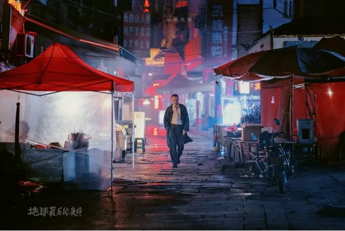

# 伊拉克投资指南 \#F2200

原创： yevon\_ou [水库论坛](/) 1月3日

（欧大可能配错图了）

伊拉克投资指南 ~\#F2200~

 

 

有时候我们翻开古老的卷帙。

寻觅十六年前的财经报导，专家分析。"考古"也是一门很有趣的事。

 

 

 

一）事前

 

2003年3月，国际金融市场，动荡不安。

在那一段时间内，表现最好的资产，其一是瑞郎，其二是黄金。其三是美金。

 

 

瑞郎的表现好，因为瑞郎是传统的"避险货币"。瑞士是著名的永久中立国。远离一切国际纷争。

瑞士本身，又是发达的工业化国家。因此国际八大货币，CHF向来是"避险天堂"。

 

瑞郎唯一的问题，是瑞郎太贵。

CHF是一种贵得惊人的货币。连欧洲人都受不了。譬如你在瑞士理发，最少也是35
CHF。在瑞士买瓶饮料，5 CHF起。

欧洲人去瑞士，都感觉物价翻一倍。

 

 

瑞郎走势在国际市场上，表现为"防空洞效应"。

什么叫防空洞效应。防空洞效应，是比"避险效应"更进一步的说法。

 

-   有事的时候，所有人争先恐后拼了命挤进去。

-   没事太平时，所有人争先恐后拼了命挤出来。

 

外汇市场上，瑞郎的走势，你要对事态有精确的估计。早一天，晚一天都不行。

世界一旦太平，瑞郎就会暴跌。

日期是最大的风险。

 

 

其次，对于"黄金"呢。黄金也是传统的"避险资产"。所谓一响，黄金万两。

只不过近年的国际走势，黄金IP消散。地位有所下降。

避险效果不如瑞郎，敏感度也不如瑞郎。可以排到第二。

 

 

第三个资产，是美元。

没错，就是那个USD，美国印的美元。

 

在国际金融市场中，美元真正的含义，是"本币"。这是USD坚不可摧的大国地位确定的。目前没有人可以挑战。

 

 

"本币"是什么意思。

绝大多数股市中人，恐怕都听说过"落袋为安"吧。

当金融市场剧烈动荡，恐慌不安时，"风险厌恶型"投资者，就会结清他们的投资头寸。把更多的财产，转化为现金。

 

问题是，什么是"现金"。什么样的国际资产，才配称为"现金"。

答案是USD，美金=现金。

 

欧元是不是，不是。日元是不是，也不是。

哪怕一家注册在日本的日本股票基金，它的"本币"还是美金。

 

 

全世界的金融市场，主要集中在华尔街。而华尔街绝大多数的基金，都是以美元计价的。

如果一支基金，你把股票，债券，全部都抛售完毕。最终手里剩下一堆EURO欧元。

则按照"基金管理办法"。投资人默认你不是"空仓"的。

 

 

你只有把EURO再换成USD，满仓持有美元过年。投资人才会认同你"现金过年"。

至于美元指数本身的涨跌呢，抱歉，这个不重要。

 

所以全球第三大的避险资产，其实是USD美金。

美元，是基金经理眼中的"现金"。

 

 

当地区冲突，投资界认为波动太大，风险厌恶上升。则会驱使全世界的基金经理，都把资产转为USD。

意思就是USD的汇率大升。而EURO，GBP，JPY，CAD，AUD等其他"非美"货币的下跌。

 

 

 

二）高息货币

 

风险波动上升，在资产本身类别中：蓝筹跌幅较小，"高回报"类资产跌幅较大。

 

金融的世界，严格地遵守"高风险，高回报""低风险，低回报"。

牛市，好的年份光景，部分资产升得特别快。

这意味着在熊市，糟糕的年份，这部分资产跌得特别厉害。

 

 

-   在外汇市场，高息货币代表澳大利亚元，新西兰元

-   在债券市场，高息债券代表p2p，垃圾企业债

-   在股票市场，高风险资产代表科技股，st股

-   在国际市场，新兴市场Emerge market，金砖诸国

 

2001年美国"科技股"狂潮时，Dot
Com公司可以涨幅一万倍。令传统企业目瞪口呆。

但是当Nasdaq泡沫破灭时，他们也可以跌去几千倍。

 

 

 

中国人有一句古话，"温饱思淫欲"。在投资的世界，一个人只有当他衣食无忧，养老金，基础仓位都已经建立完毕。

还剩10%的资金，干什么去呢，从事高风险的投机行为吧。

 

SB的共识也是共识，每个人拿出几万元，光"程序员"的力量，就可以堆积起BTC的骗局。

哪怕比特币一文不值。比历史上任何垃圾股票都更恶心，ICO就是空气币。

 

但是在"流动性过剩"的情况下，哪怕st股票，也可以由资本的力量，连拉十几个涨停板。

 

 

当"风险喜好逆转"，牛市中涨得最多的资产，就是熊市中跌得最危险的资产。

美国股市的规模，是泰国股市的1000倍。

银根松动的时候，美国流出少许资本，就带动了泰国股市的大牛市。

而当美联储加息，美股没跌多少，却导致了1998年亚洲"金融风暴"。

 

从这个角度看，目前最危险的资产，仍然是中国的币圈。

p2p也没什么好日子，分分钟破产。

股市和楼市比，是属于"垃圾投机资产"。股市的走势，会继续弱于楼市。

另外一项垃圾资产，是PE/VC经理炒起来的"独角兽"神话。

 

 

设想一下，假设你缺一笔钱，紧迫的支出。

你是卖"自住住房"呢。

还是卖看不见摸不着，从来不分红，也不知道派什么用，"手机钱包"中的一项虚拟资产？

 

 

 

三）事中

 

对于投资而言，最佳的买点在哪里，是什么。

 

我翻出了2003年3月，当时的香港报纸。

-   报纸上，基金经理推荐是"高息货币"NZD，新西兰元。

-   最佳买入时间，萨达姆雕像倒落之日。

 

基金经理的理由是，首先，高息货币是"落袋为安"受伤最严重的资产类别。例如NZD的汇率，由0.55跌倒了0.39

 

其次，则是"反防空洞原理"。事物到了极致，就会有反转。

天下太平之后，"高息货币"还是要涨，科技股成长股，还是投机氛围浓厚。

 

混乱时跌得最严重的资产。

就是之后涨幅最有希望的资产。

 

 

当年我把这份研究报告，拿给香港金融高管的一位世叔。世叔看了很久，慢悠悠地说了一句话。

"错了，你不应该去购买美国小盘股。你应该购买伊拉克资产"。

 

伊拉克资产。好大的脑洞。

我怎么没想到。

因为伊拉克资产，他会有"戴维斯双杀"。

 

 

首先，雕像倒塌之日，真正受打压最严重，市场情绪彻底崩盘的，还不是外围的高息小国货币。

而是伊拉克第纳尔。

这一天，第纳尔的汇率肯定是完蛋了。

 

其次，巴格达市内的物业价格。在这一天，也必然处于"冰点"。悲观情绪蔓延。

市场并非永久有效，市场也会犯错误。

至少在短时期内犯错误。

 

在这一天，巴格达的贵人们，肯定收拾行囊，准备逃难。

而他们之间传播最广的谣言，多半是美军要没收权宦资产。美军要来巴格达抢石油。

 

市场信心，肯定是崩溃的。

无论怎样的别墅豪宅，二三折就卖了。对未来的预期，是彻底归零的。

 

价格是最低的。

汇率最低，价格最低，双重底。

 

 

 

但是我们，我们是非常了解美军军纪，以及之后历史走向的。

美军解放巴格达，不图财，不图利。

油田全部封存，一滴石油也不会拿走的。

 

相反的，美军军纪严明。力争恢复当地的社会秩序，生产安定，人民幸福。

最初的恐慌过后，市场很快就会发现，最初的惊恐，是不理智的。

 

也就是说，汇率，迟早会回归中间价格。

房价，迟早会回归中间价格。

千载难逢的"贱买"物业机会。来自于对文明的信心。

 

 

 

更为糟糕的是，巴格达人，一点都不知道美军的作风。

按照美军传统，这样隆重的大事，几万亿是肯定要砸上去的。

 

不仅不拿一分钱走，而且还要砸几千亿美金上去。

要把经济搞得花团锦簇，失业率降到为零。让全社会上上下下，雨露均沾，都蒙受到好处。

个个发财，才会真心诚意地说美军的好。

 

因此在一个"绝对低谷"之后，它甚至都不是持平。而是一个"吼昂"的上升期。其上升的高点，要远远超过之前盛景。

 

否极泰来，才是最好的资产。

 

 

 

四）事后

 

事后会迎来信心高涨，自豪感增强。美国一轮大牛市。

 

 

 

（yevon\_ou\@163.com，2019年1月2日晚）
