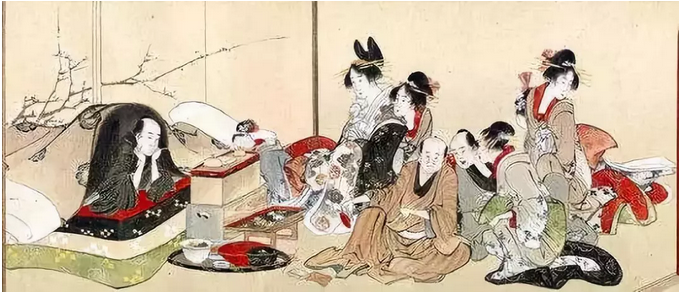
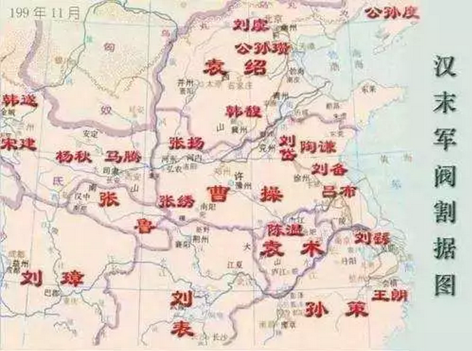
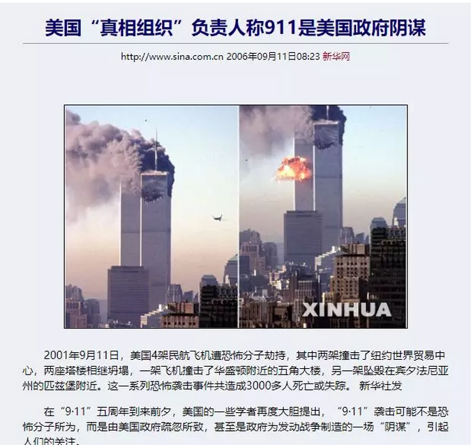
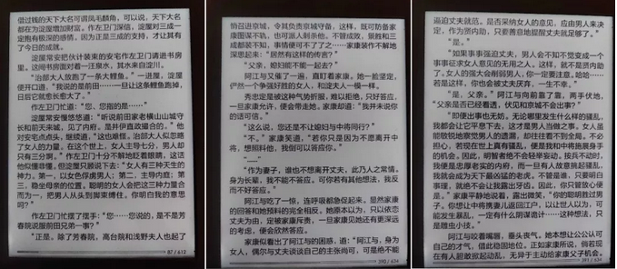

# 德川家族的女人 \#F2210

原创： yevon\_ou [水库论坛](/) 1月8日

**德川家族的女人 ~\#F2210~**

 

 

 

一）袁绍

 

二天前，"水库2019"小号又被封了。

这件事，一定是自媒体的错。是我们学习领悟不深，水平有限，痴呆愚钝。

 

因此哥哥近日闭门读书，慎言慎行。

最近又读了不少历史方面的资料，我们写写历史，或许更安全些。

 

 

第一个历史故事，是袁绍。

读过《三国演义》的朋友都知道，绍"谋而寡断"。一开始势力很大，但是在"官渡之战"被曹操击败。一落千丈。

而曹操呢，靠"挟天子以令诸侯"，最终获得天下。

 

而在正史中，完全不是这样的

 

我们读最初级，入门版的《三国演义》。总是拍腿称赞。

哎哟，荀彧真是太聪明了，曹操真是太走运了。一下子把汉献帝抢到手里了。以后四处顺利。

 

在AD196年的时候，袁绍的势力，远远比曹操强大。

而且袁绍是正经八百冀州牧，曹操只是小小的建德將軍。从伦理上说，曹操甚至还是袁绍的下属。

 

袁绍已经在河北站稳脚跟。吞并山西。兵强马壮，粮草充足。

曹操还在兖州和吕布，刘备，进行着艰苦的拉锯战。迎献帝完全是牙缝里挤出来的军粮。

 

问题是，袁绍为什么不迎接汉献帝？

 

 

我们看了很多现代高中生写的穿越小说，如果穿越回"三国时期"。而且恰好是袁绍的版子。

则几乎100%，全部象开了金手指一样。急吼吼地孟津渡过洛阳，抢接汉献帝"挟天子"天下归心。

 

真人问，假如让你穿越回去。

你能赢么？

 

正史中真正的答案，是不能。

 

 

历史看到后期，你才知道。真正的"正史"，和演义小说，和历史教科书，都很大不同。

有些东西，是不能教的。重度阉割版。

 

东汉末期的时局局面，主要是"皇帝"和"士族"之间的矛盾。

所谓的"东汉皇权"，和后代唐宋明清，明帝与汉帝极大不同。

 

 

举个例子，东汉的皇帝，更类似于"法国的君王"。

法王是贵族的领袖，是天下共主。但并不是真皇帝。

 

法兰西西欧的封建制，是层层分封。

每一个贵族，都在自己的骑士领土，享有绝对的权威。只不过再往上，对于法兰西国王，有着献兵和尽忠的义务罢了。

 

 

东汉的王权，与此类似。东汉其实是"贵族制"国家。

汉桓帝，汉灵帝垮台之后，整个社会制度并没有崩溃。而是由一个个"大豪强"控制。例如袁术家，孙策家，司马家......

 

但是这个并不是核心问题。

核心问题是：袁绍集团，他也是一个"贵族集团"。

 

 

袁绍崛起的速度非常快，袁绍刚刚逃到南皮的时候，手里只有1000兵马。

可是手握十万大军的邺城韩馥，却害怕他，怕得要命。

 

袁绍带了1000兵马，前来抢夺邺城。韩馥吓得直接跪在地上投降。

韩馥的手下，心腹将领：颜良，文丑等。都把头低低地蒙到土里，大汗淋漓，害怕得不敢抬头。头盔湿透。

 

这就是颜良、文丑。

第一次见袁绍主公的历史记载。

 

 

那么袁绍崛起的原因呢，因为他是袁家的庶子，"四世三公"。

袁绍的胜利，是政治上的胜利，而不是军事上的胜利。

 

你设想一下，赵构逃到南方，也是登高一呼，应着云集。

韩世忠，刘光世，即使是万军大将。也只能乖乖过来磕头。

因为他是徽宗最后的血脉，别人只能认他。

 

 

而袁绍的困境呢，在AD196年，也是一样的。

袁绍根本就不可以迎接汉帝。不是不能，而是不许。

 

袁绍本身只是一个贵族首领头子。手下的各大军团，自成一体。只不过暂时在"盟主"的号召下，集体行动。

 

可是如果袁绍迎接了汉献帝，献帝来到河北的大本营邺城。相当于赵构回到河北。

"你袁绍"还是什么东西。

 

 

 

而曹操呢。

各位不知有没有看过织田信长的传记。织田是完全打破"武士分封"制度。采用中央集权，募兵和酬金制度为主的天下布武。

 

曹操也是一样。曹操手下最主要的带兵大将，是曹仁，曹洪，夏侯惇，夏侯渊。

整个曹军，是"曹家军"。而不是贵族的联合。

 

因此曹操可以"挟天子以令诸侯"。甚至最后曹丕篡汉自立。

 

 

整个历史的典故，告诉我们的是：

有时候你自以为，无比精妙的良计。只不过因为，你不了解更深情况。

 

 

 

二）911

 

第二个故事，是美国911事件。

 

这件事被反反复复炒作，最近又重新翻了出来。"中央情报局，是否早知道911预警"。

有越来越多的信息，资料证明；在9月11日之前，CIA其实是知道本拉登，要进行恐怖袭击的。

但是，这份如此珍贵的重要情报，被CIA掩盖了起来。并最终造成数千人的伤亡，震惊全世界。

 

这件事，元芳你怎么看？

 

 

 

CIA最初的回答，是懒得回答。

后来媒体圣母小编，喋喋不休地追问。发言人终于出来，不痛不痒地回复了二句。

 

鉴于英文原文比较长，哥哥简单描述一下。

相当于在公众号留言中，直接回复了："SB"

 

 

这件事，不如我来解释一下。

如果你是CIA的老板，你也会回复二字套餐。

 

你以为你送来的"情报"很重要。白左圣母以为这是重大失职行为。错失了大好良机。

可是你知不知道，类似的"情报"，我每天要收到一万二千条。

 

更重要的是，这些情报还是"互相矛盾"的。

信息时代，重要的不是信息的"充沛度"，而是信息的"纯洁度"。

 

 

在一个情报分析人员面前，一会说马里兰州要炸了，一会说北卡罗纳州要炸了，一会说佛州要炸了。

你全部处理，是不可能的。也只能虚惊一场。

你要做的，只能是"筛选"。重点信任，那些"纯洁程度"最高的情报。

 

而一条《[三无谣言](http://mp.weixin.qq.com/s?__biz=MzAxNTMxMTc0MA==&mid=2651019113&idx=1&sn=4e28bb346c6a881b26551c87db7afa66&chksm=8072017ab705886cc82d08f5b250d02683caef102e57b06f966462d6b106f6fa5085dcb85fa2&scene=21#wechat_redirect)》，既没有证据，也没有证人。

这样的情报，优先级是很低的。被忽略也是正常的。不忽略才是圣母心的。

 

 

这个例子告诉我们的是：

哪怕你给出非常有价值的建议，不被重视也是正常的。

 

 

 

三）德川家康的女人

 

第三个例子，前二天看山冈庄八著《德川家康》。看到第十册时，有这样一段对话。

 

 

意思讲，德川家康的媳妇，想用计谋，做"疑兵之计"，忽悠敌人现身。

德川知道之后，微微一笑，回了句："女人还是回家生孩子去吧"。

 

象这样严重严重"政治不正确"，足够让女权婊三斤唾沫，喷到狗剩的观点。

但却是1945年之后，激励日本复兴，鼓舞了整整一代年轻人的名著。

那么，德川家康到底讲了什么呢。

 

德川家康的逻辑是这样的：

-   做为我身边的谋士，我亲信的人，你说出了你的谏议。我给了你10分钟时间，这很好。

-   你的意见我知道了。但是家族的谋略，是一整套系统，你并不了解，也不切中要害。

-   女人千万不要背着我，自作主张，采取什么行动。

-   你最好的工作，是什么小动作也别做，乖乖回家生孩子

 

 

这是一整套非常非常有道理的体系。

 

就好比沮授，田丰一样，他们并不了解老板"袁绍"的基本盘。身为谋士，给出建议，原是本份。

但是否要采纳，要看老板通盘考虑。很多信息，是只有老板才知道，独有的。

 

身为谋士，要谨守自己的角色。不能因为老板不"采纳"你的建议，而怨恨或者失望。

老板能做高位，自然有过人之处。伙计总觉得自己比老板聪明，u can u up.

 

自古以来"文死谏，武死战"。但其实死谏未必是正确的。因为这等于拿你的意志，强行覆盖老板的意志。

"[多言数穷，不如守中](http://mp.weixin.qq.com/s?__biz=MzI2MzAyMjAxMQ==&mid=2462107695&idx=1&sn=1e6ff8c4bf8e6a8c188334f0cba222da&chksm=fd765cfbca01d5ed6b3e9e2ee105eb0cade126025e29e5521fa520646c09694403112ff79194&scene=21#wechat_redirect)"，准确的估算彼此实力，本身已经是一种智慧。

 

 

 

四）结论

 

人类一思考，上帝就发笑。

 

目前民间的"国际战略大师"太多了。各个口沫飞溅，指点江山。

每一个都是诸葛再世，怀才不遇。

 

 

我倒不是阻止你们说话；而是提醒你们，别忘了回家生孩子。

 

 

 

(yevon\_ou\@163.com，2019年1月7日晚)
