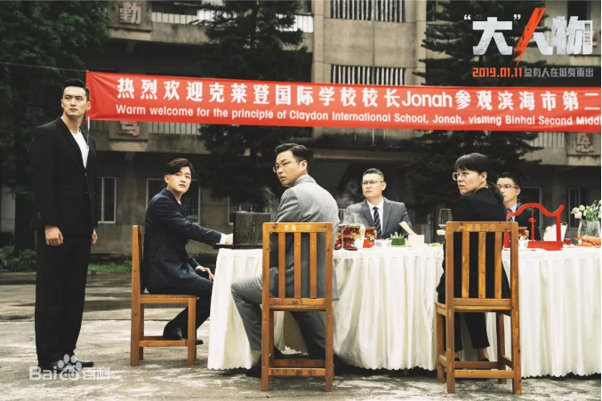
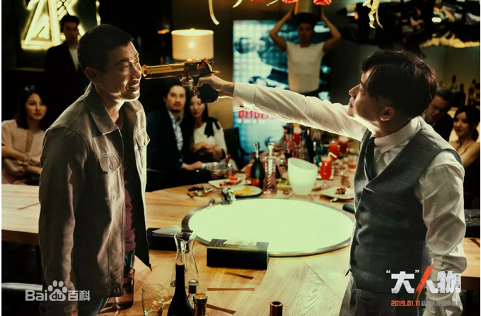
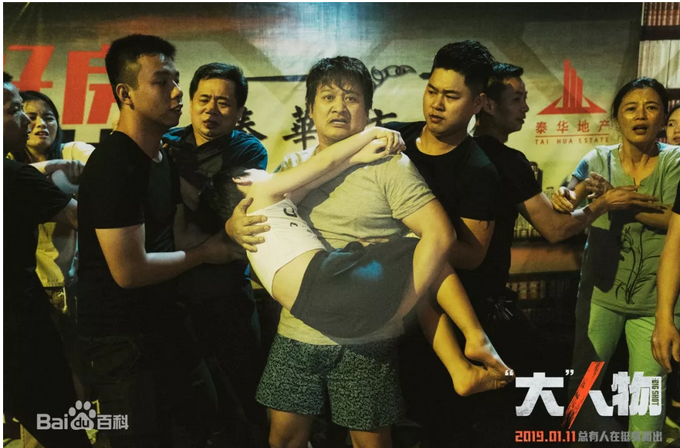
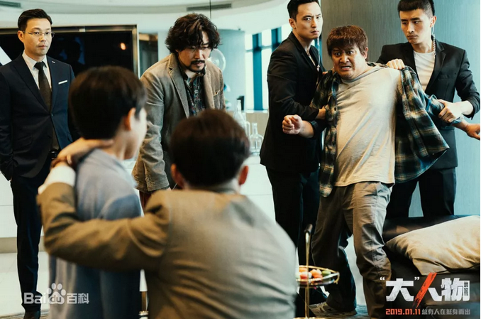
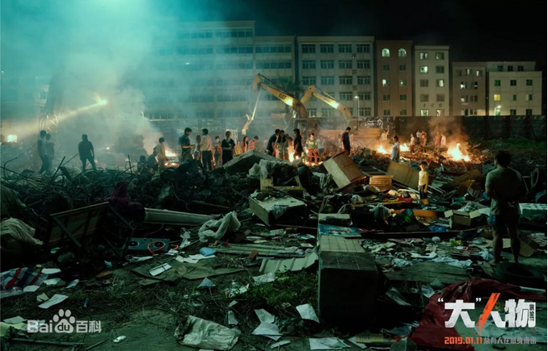
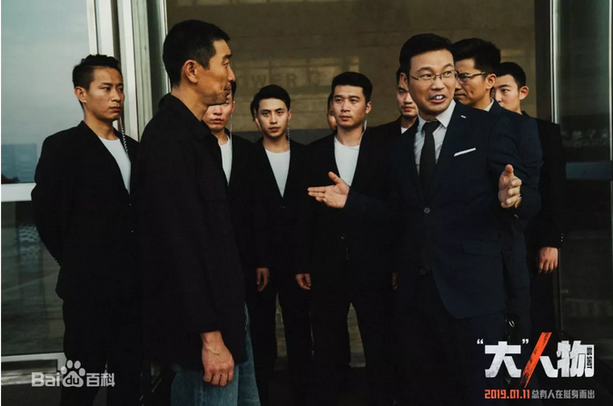
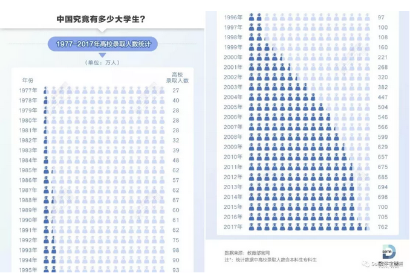

# 穷人有毒 \#F2220

yevon\_ou [水库论坛](/) 1月14日

**穷人有毒 ~\#F2220~**

 

 

一）影帝

 

这二天写不出文章。苦苦挣扎于惘奸与合规性的问题。

 

俺助理zm指着我的鼻子大骂："你写不出文章，那是你弱"。

"滚去市场上看看，满大街的高手如云"。

 

俺诚挚地检讨了员工比老板牛逼，谋士比主公nb，那是我弱。

于是俺决定去看电影。散散心。

看王千源的《大人物》

 

不知道有多少读者们，看过这部电影。

反正俺看了以后，倾佩得五体投地。人才，实在是影帝。演得太好了！

 

 

我说"演得好"，并不是指王千源。

王千源的巅峰之作，是《解救吾先生》。最经典的一幕，恶人终于被警察奇袭抓住。

 

和他同居的古惑女，拼命地踢他打他："混蛋，我怀孕了。你叫什么名字"。

"你叫什么名字，哪怕告诉我一个姓也好了，你姓什么"。

"混蛋，你姓什么"。

 

而悍匪王千源呢，他就咧着嘴笑，把嘴拉长到180°笑。

无论女友怎样踢他，打他，撕咬他，我就不告诉你。

 

这一幕实在太燃了，太经典了。

光这几分钟，拿个影帝也无愧。

 

可是在电影《'大'人物》中，王千源饰演的，是一个正面人物。刑警大队的孙队长。

这个角色真心不适合他。毫无感染力。演技平淡无奇。

 

在《大人物》电影中，真正的影帝，是这位： 

（陈勇强）

二）惹不起

 

影片讲述了一个简单不过的故事。

 

-   小贩陈勇强，租了一套待拆迁房。因为贪图年付便宜，一次性付了一年房租。

-   房东约定，"年付"有风险。如果提前拆迁，租金不退。

-   提前拆迁了。

-   陈勇强想拿回四个月的剩余房租，去赵氏集团大闹。

-   赵泰（包贝尔）接待了他。原来是马仔洪铁军，私吞了蝇头小利。

  

故事讲述到了这里，还属于一切正常。

富二代赵泰，每小时几万美元的消费。因为听从老爸教育，"要注重客户反馈"，要注重企业名誉。

因此花了一个小时，耐心地听陈勇强啰啰嗦嗦。

 

最后，你耗费了大老板一个小时。你应该提诉求了。

陈勇强伸出四根手指："三千八，我要三千八赔偿"。

 

包贝尔楞了一下，"三千八百万"。

穷人反驳说："三千八百元"。

 

 

富二代哈哈大笑。回去到屋里，取了四万人民币。十倍。

可是陈勇强目光闪烁，迟疑着不想要。

 

包贝尔奇怪说，"给钱还不够，还有心愿"。

"哦，马仔洪铁军是个恶人。你还要出气"。

 

没事，我给你一根棍子。你捅他二下好了。

洪铁军既然是喽啰讨饭吃，想必不会反抗。你揍他几下，这口气也消了。

 

 

没想到，陈勇强这时候却蔫了。"打人这种事，以188斤的体重，俺是万万不敢干的"。

面对如此弱鸡，赵泰也怒了。不受父亲宠爱，性格冲动，脆弱敏感的胆汁男，赵泰暴走了。

"四万你拿好。你不敢揍洪铁军。就让洪铁军揍你"。

@\#￥%......&\*（\~

 

半个小时以后，陈勇强眼泪啼哭地，从八楼跳了下去。

 

我看这部电影，一边看，一边叹息。

一边看，一边吃瓜。

顺便记录了一下编剧，名叫"杨苗"。

 

谁说中国没有人才的，真是人才。

谁说中国没有作家的，真是作家。

"杨苗"就是人才。凡是不许讲的，都让他讲了。凡是不许写的，都让他写了。

 

我们写公众号的。在如此才情面前，自叹弗如。

 

 

 

三）剥丝

 

为什么这么说；

因为我们在"陈勇强"这个小人物身上，剥丝抽茧。贪嗔痴慢疑，五毒全部都齐了，实在让人喜欢不起来。

怎么看怎么恶心。

 

 

 

首先，陈勇强根本就没有资格索取房租。

贪图"年付优惠"的时候，奋勇争先。真的遇见"商业风险"，便立刻推卸责任说"我哪看得懂，我哪看得清"。

 

脑袋长你脖子上，是猪脑袋么。

如果商业合同都得不到尊重，我们整个社会，还要契约干什么。

 

如果你对合同执行不满意，你和合同解释有异议，你可以找法院起诉。

如果你觉得自己没有能力读懂合同，你可以购买法律援助。甚至自己头悬梁，锥刺股，好好去读书。

 

动辄泼皮耍赖的作风，你让"勤恳守法"的市民们，如何自处。

我们每年认真地学习法律知识，是否毫无意义？

 

 

 

其次，陈勇强缺乏"沟通"能力。

这是非常可怕的事情，也注定了这一类人，永远沦于社会底层。几乎没有希望爬上来。

 

语言简洁精炼，既是对别人的尊重，也是对自己的尊重。

西方的传统，叫做电梯叙事法。从电梯一楼到20F的短暂瞬间，你要把诉求向董事长解释清楚。

《燃点》中的创业者，要在这短短的"电梯时间"内，把你的商业模式讲清楚，并立刻吸引到PE经理的兴趣。

 

 

但是陈勇强呢，影片中用了很长的篇幅，很大的特写镜头，来描述他毫无"沟通"能力。

即使让你坐下来了，提出你的意见。也是一通废话。

 

从三十万公里开外，一切不重要的细节讲起，绕地球七圈。

讲得关心你的领导哈欠连天，还没有说到核心诉求。

 

拜托，浪费时间就是谋杀生命。大家的心力都是很宝贵的。

你自己不懂得尊重人，你让别人怎样帮你。

 

 

 

"愚昧无知"+"不善沟通"，接下来的第三步，是不懂人情世故。

包贝尔给你RMB 40000元，十倍赔偿。

 

稍微有一点正常人智商的。立刻换上一副笑脸。"谢谢包少爷，您真是青天大老爷"。

"赵氏集团，就数您最英明，最能干"。

花花轿子人抬人，赵泰也高兴。赏赐也丰厚。

 

 

可是陈勇强呢，他是一付地球人都欠了他三千元的作风。

别人待他越好，他越是要显示自己的清高，"不受金钱腐蚀"。

腰板比铁板还硬。

 

行走江湖，哪能不懂人情世故。

你搞到自己没朋友。即使一时贵人，也不会有人持续帮你。

 

 

 

陈勇强第四个问题，遇见恶人时，"畏敌如虎"。

天底下的愣子犟子，大部分都这个德性。"内战内行，外战外行"。

 

遇见黑恶势力，畏敌如虎。驯顺得象绵羊一样。

遇见真心帮你的同志，心知没有风险，反而凶恶得要命，恨不得饱咬二口。

 

 

包贝尔在完全控场的情况下，让陈勇强打洪铁军。

世故圆滑一点的，韦小宝早就上去耳光扇扇，大出鸟气。

 

哪怕遇见一个正人君子，坦荡荡。"五好青年"不愿意打人。

那你把上衣一脱，188斤的修车汉子，大家进八角亭打一场。

肉搏到位，也算是对得起男子汉。

 

可是陈勇强不敢。他当时的表情，简直快哭出来了。

 

 

第五个阶段，包贝尔让洪铁军打陈勇强一顿。

让他醒醒，让他长长脑子。

 

这段按照"水库精神"是支持的。

但我就不敢展开了。免得惘奸说我三观不正。

 

 

 

第六个阶段，陈勇强被打了一顿，却拿到40000元钱。

然后他...就...跳...楼...了

扔下七岁的孩子老婆，一个人跳楼了。

 

哥哥看到此段时，忍不住击掌赞叹。

神曲！

高潮中的高潮。

 

 

陈勇强完美地刻画了一个小人物。

-   他贪小，无耻

-   法盲

-   闹事

-   缺乏沟通能力

-   不懂人情世故

-   怯懦

-   玻璃心

 

当他发了一笔横财，生活没有给他任何压力，没有房贷。他却觉得自尊尊严天塌下来了。

自愤自私地，不考虑子女幼小，跳楼撒手。

影帝，影帝，神片！

 

四）导演

 

我真心佩服中国的导演，讲故事，藏吐槽的手法；

远远超过我们八流自媒体之上。

 

 

虽然之后"编剧"用了重重的手法，来"包装"整个剧情。

例如，他借孙大圣之口，谈陈勇强是被谋杀的设想。

在影片的最后，也加入了：赵泰接受行凶杀人"指控"。

 

但是稍微具有法律常识的人都知道，这些都是"据称"。

在真正的法庭上，是不作数的。

也就是：猜想。

 

 

而且，即使不包括最后一步。陈勇强之前的一二三四五步骤，也足以让他的脸谱彻底黑化，避而远之。

 

 

整部电影，基调围绕着警察抓坏人，反贪权色勾结大案展开。

但是剥去这一层外壳，其核心因素，依然是存在的。也就是：

 

"一个楞的傻子，莫名其妙和赵泰缠上了"

"一个楞的傻子，莫名其妙为他复仇，死缠不休"。

 

 

五）穷人有毒

 

整部电影中，隐藏最深的一句台词，是王迅（崔京民）劝说包贝尔说的：

"这种穷人，您是万万沾染不得的"。

 

这种社会底层，包贝尔你千万不能和他们接触，也不要试着解决他们什么问题。

派一个中层干部，直接挡回去就行了。

您千万千万莫沾，穷人有毒。

 

因为穷人的思维，他是"扭曲而奇怪"的。他是楞的，傻的。

善恶颠倒，狂想偏执，愤怒暴躁。没法理性沟通。

 

 

中国只有8%的人口是大学生。

中产阶级及以上的社群中，他们有自己的对话方式，有中上社会一套社交礼仪。

 

您是体面人，是贵公子。

您不知道穷人，是不遵守那套礼仪的。你不知道一个偏执狂人，是有毒的。

 

想起了国家的某些upf制度建设，随便写写。

 

 

（yevon\_ou\@163.com，2019年1月13日晚）
