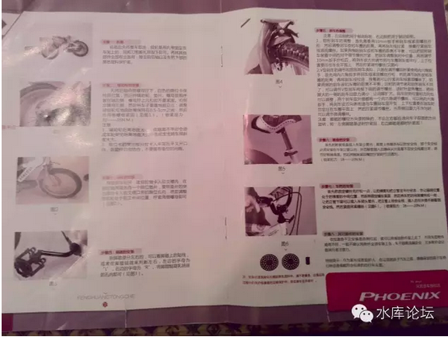
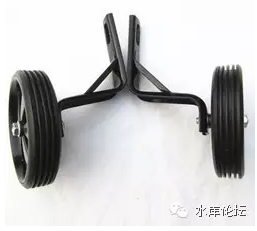
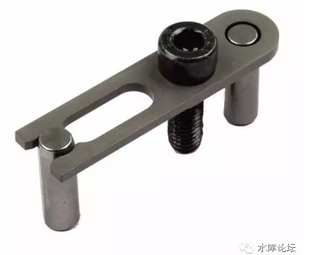

# 老婆喊我组装自行车 \#F390

yevon\_ou [水库论坛](/) 2016-05-06

老婆喊我组装自行车 ~\#F390~
======================================================================================================================

 

今天晚上本来要写文的，可是LP要我组装自行车。小孩子大了，买了辆童车。

反正这事逃避总是要被抓捕嗔压的，没有办法。装就装吧。

 

 

大伙都知道我以前是做Marketing产品经理的。现在就让我们来看看，整件事有多么地不靠谱。

 

首先，是零件。我已经不记得自己有多少年没有买过散件了。象电视机这么高精尖的东西，也是直接放在壁柜上，通了电源就能看。

这部自行车，他，分为四个部件。

 

我真心不明白，21世纪卖产品，为什么你还要DIY。如果说有篮子，踏板之类突出部件，特别占地方也就算了。占运输空间。

可是你车上的铃铛，握手，档泥板，这些小东西你都不装。都要客户一个个看说明书装。

你以为客户是来晚自习的么。

 

 

装着装着，更加是友邦诧异了。

DIY的事情我也做过，比较有代表性的。例如IKEA的家具。说明书绝大多数人都看过。

有A部件，形状如图，X2

有B部件，形状如图，X3

将A部件插入B部件小孔，插入后形状如图。

 

如果你安装IKEA的家具，或者安装LEGO的玩具，看说明书本身就是一种享受。

他的说明书，一般会有40\~60页。每一页都只讲一个步骤。

步骤⑩，需要哪些零件，三维立体图如何。写得清清楚楚。

好了，我们这辆自行车呢。他的说明书是怎样的。

它一共就一页纸！

它一共就一页纸！

它一共就一页纸！

 

这还不是最重要的，如果我们细看一下他的文字的话：

"步骤二：

 

轴助轮的安装

先将后轴二侧螺母拧下，白色的限位卡保持原位置，然后将辅助轮，垫片，螺母按顺序套在轴左侧，螺母拧上几扣但不要紧固。右侧步骤同左侧，然后将车子垂直地面立正；调整辅助轮与地面距离"

 

好了，现在请你告诉我，什么叫做"辅助轮"。

我承认，当时一看到这个字眼，我整个人就懵了。

 

这种专业术语，在工厂的老师傅眼里，或许就和三岁蒙童一样不言而喻。可是我们用户不懂啊。即使懂，我们也不敢试。你100%确认不会把硬盘格式化么。

 

即使你连蒙带卡，把"辅助轮"给猜出来了。可是第二句："限位卡"。

 

苍天啊！大地啊！

这个限位卡又是什么东西。

臣妾真不知道啊。

 

 

我们继续往后翻，看后面的更难：

 

"步骤5：刹车的调整

注意：左边刹把用于制动后轮，右边刹把用于制动前轮。

1.钳形刹车的调整，首先需要用10mm扳手将刹车线紧固螺丝拧松，然后调整刹车皮和车圈的距离。再将刹车线拉紧，接着拧紧刹车紧固螺丝。如果二侧的刹车皮和车圈的距离不平衡，可以把钳形刹车装置中间的对中调节螺丝拧紧。再把刹车调整到对中位置，再将调节10mm扳手拧松后，将刹车皮方向调节到与车圈刹车门平行。上下位置要压在车全平面上，然后拧紧调节螺丝（见图4）"

 

请问：

-   制动前轮

-   制动后轮

-   钳形刹车

-   刹车线紧固螺丝

-   刹车皮

-   对中调节螺丝

 

这些玩意又是什么东西！我是真心不知道啊。你让我拿着说明书，翻来覆去再看上20遍。我也不知道你指的什么。

还如图4呢，4你妈个鬼啊。你自己看看那图，上面什么也没有。

 

 

这些东西，对于几十年车场里的老师傅，或许就如空气喝水一样熟悉。

可是客户真的不懂呀。

你张口闭口都是专业术语。什么车架立管，前轮轴，前叉槽。您不可以这样写说明书的您懂么。

 

 

朋友们都知道我以前是做产品经理的。在我看来，整件事情就充满了一股"前工业时代"的味道。

首先你就不应该让客户组装。熟练工或许几分钟的事，但是客户第一次装，就要半小时甚至二小时。

客户购买的是你的服务，节省的是客户的小时。可想而知购买体验非常糟糕。

 

产品的设计，应该以尽量的人性化为主。

哪怕因为运输尺寸不得不分割。也应尽量做成完全制成品的几大块。

哪怕你不得不用一个折叠式的篮子，也比拿螺丝洋钉让客户自己装篮子好。

所有的拼接接口，应该有明显的颜色标记。或者特殊形状指示。

 

 

写说明书，应尽量做到"白居易"。老太太都看得懂。

印刷成本如此低廉的今天，说明书只有一页纸。那唯一的解释，就是你根本没有用心去做。

自行车厂的说明书，或许还是50年前的版本。我甚至怀疑50年都没变过。

现在已不是1950年代，青年人拥有一辆自行车是了不起的得意，自然会津津乐道每一个部件的名称。就如同EVA机动高达。

现在自行车就是纯消费品。谁有耐心学你的"刹车线紧固螺丝"。

 

 

说明书需要整本重新编写，重新安排。示例：

A：辅助轮

B：限位卡

}

将A插入B中，并用螺丝拧紧。诸如此类的说法。

 

中国货在国际市场上卖不到高端，Marketing缺乏指引是最主要的原因。

你这种档次的说明书拿到美国市场去，"价格足够低"恐怕只能是你唯一的卖点了。

 

你需要将所有的零件拆散了，重新拍照。拍一本约40页左右的完全"安装手册"。

这虽然会多一些手续，但却是一劳永逸的。

 

 

 

言归正传，话说哥哥以大无畏的探索精神和必应搜索，经过了一个小时的艰苦奋战之后，终于把"安装手册"中左右的术语都弄懂了。自行车也站起来了。

然后，稍后，且慢。

危险，这车不能开！

 

幸好哥哥还有一点机械常识，属于1%那种装好了自行车不掉入坑里的人。

为什么，因为你还要调试刹车！

 

这件事是如此之重要。重要到生命生死纠关。

可是在"安装手册"中提示了没有。没有！

如果你在美国售卖，你早就被人控告到倾家荡产了!!

 

 

朋友们，这辆车，他寄给我的四大组件，彻底全部安装之后。

默认的状态，刹车是坏的！

安装的时候我就隐隐觉得不安。等全部装完了以后，再检查一遍，才想起前刹车根本无法并拢。

后刹车有轻微阻力，但也不强。

 

 

那怎么办呢，再搜索厂家网站。搜微信公众号，然后看里面的教学视频。

根据教学视频的指导，和那本说明书做得一样烂，技师安装的时候手是被遮住的。

然后，你调整收紧刹车线。

 

 

对此，我非常非常地不满。

为什么要客户自己调整刹车线。难道我买个电视回家，还要自己焊二个三极管么?

 

客户们需要的是一个"成品"。是买回家就能用的东西。

而不是厂家提供的半成品。你已经耗费了我无数的时间和精力了。

 

如果你说，因为自行车的规则和设计。他注定了不可以在出厂时就把刹车调好。

那么你为什么不改设计？

 

目前自行车上采用的，是一种叫做"钳形刹车"的构造。其原理，有二根线连在把手上。拖着二条鱼须一般又丑又易坏的线，一直到轮子上，实现机械开关。

这个设计是有很大问题的。

 

1）人手的刹车，是一个信号。只有在前工业时代，纯机械时代，才需要以机械传动，将信号传到轮子上去。

2）有二根很长的刹车线，很不美观。而且有安全隐患

3）刹车的动力纯粹依靠牵线传递，人手需要很大的力量

4）整个系统十分复杂，易坏。

 

如果让我讲一句很不客气的话。自行车的设计，在过去50年内，就没有任何改动。

1950年时是怎样的框架结构，2016年还是怎样的框架结构。

唯一的区别，材料换成合成塑料。更轻便一些。

 

 

而我们知道，西方发达国家，绝对不是这样的。

以笔者科班出生的500强Marketing而言，讲究的是Continuous
Improvement.中文译为持续改进。

产品经理的责任，就是不断对产品加以改良。重新设计，使得产品本身越来越好。

 

任何一个产品，其背后都有持续的科技投入。每一代的产品都是不同的。5年，10年前的产品。和今天设计肯定有代差。R&D投入

更不要说50年前的产品。

 

总体来说，产品设计沿袭着以下几条路线。

1）简化结构，减少零件。

 

当产品刚出现时，也是象现在的自行车，瓶瓶罐罐，电线缠绕的。

但是，500强会让产品不断演化。结构越来越精简，越来越倾向整体铸造一体件。

就好比说BMW的车门，一开始是250个零件，后来是150个，最后是97个。

 

2）统一规格，增加复用性

尽量在不同的产品上用相同的配件。这事勿用赘言。

 

3）用户友善性

将接口尽量外移。使每一个部件都非常容易拆卸，非常容易安装。预留了充分空间考虑操作者友善性。

据说BMW的一个目标，是整辆汽车可以完全靠螺丝刀+手撕分解为可降解材料。从一开始人家就帮你把撕车门的角度给考虑好了。

 

目前自行车的钳式结构，是50年代的产品。典型的"前工业时代"技术。

结构非常复杂，零件众多，鲁棒性极差。

 

 

 

"好了，别闹情绪了，继续干活"。太君有指示。

然后，拧了，失败。

又失败。

再失败。

 

刹车居然安装不上去。他的刹车螺丝是坏的。

这一刻，俺的怒气再也无法压抑，终于彻底爆发了。

 

 

"什么垃圾破车，设计师都是猪头么"。

"这么重要的一个零部件，居然是螺丝刀卡在背后，伸不进去的位置"。

"而且你用旋转螺帽干什么，知道螺帽有多难拧么"。

"这个固定螺帽，根本固定不了啊。拆也拆不开，修也没法修"。

 

 

这车没法装。他最关键一个位置，刹车闭合度的调整，涉及到一个螺帽。

这个螺帽躲在二根铁杆后面，而且表面是完全光滑的。只能靠拧圆周转动。

螺帽卡不紧，刹车修不好。

 

这么重要的一个开关，每个人注定都会碰到的开关。

居然不是放在显眼，开放，易于操作的位置上。

 

 

所以就是修不好。

修不好还能怎么办，天猫退货咯。我从来没见过这么差的产品，这么烂的产品，这么渣的产品。

 

从头到脚，设计就是一团渣。管理就是一团渣。丝毫没有用户友善度。整个设计还停留在上世纪50年代，我怀疑五十年来就没有任何改进过。难怪有人忍无可忍，要搞小米自行车。

"退货，退货，差评，差评"。

"坚决搞个差评。快递再麻烦我也要把这车运回去"。

"耗了我二个小时，写文章的心情彻底没有了"。

"这是什么狗屁牌子，怎么会买这种垃圾货的"。

 

"凤凰啊，上海名牌啊"。

"凤凰牌自行车，几十年的名牌，最好的牌子，上海的骄傲啊。我还特意选了最贵一款"。

我无语，"你不知道凤凰是个国企么"。

 

国企啊，真的搞不好了。

 

 

 

（yevon\_ou\@163.com，2016年5月6日晚）
