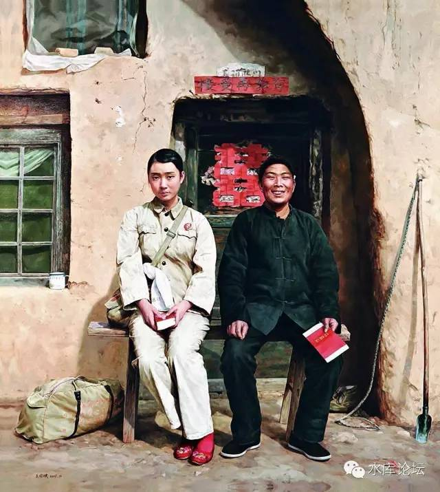
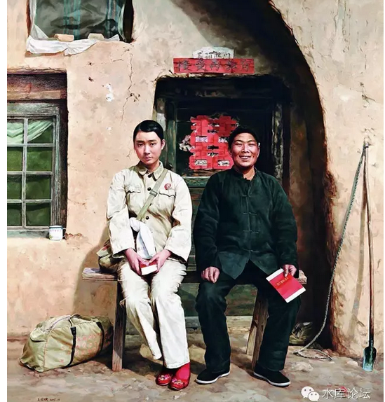

# 论一夫一妻多妾制，忠贞，及进步主义 \#F400

原创： yevon\_ou [水库论坛](/) 2016-05-07

论一夫一妻多妾制，忠贞，及进步主义 ~\#F400~

 

==
延续上篇《[降低人口质量，提高人口数量](http://mp.weixin.qq.com/s?__biz=MzAxNTMxMTc0MA==&mid=2651014601&idx=1&sn=3f23506d4914bdfdc33f676614f9e3d4&scene=21#wechat_redirect)》

 

 

僵化的婚姻制度，是低生育率的重要原因。

 

 

一）进步主义

 

 

在人类地球上，大致存在着几种婚姻制度：

-   中国人：一夫一妻多妾制

-   伊斯兰：四个老婆

-   黑人：三天换一个老婆

-   基督教：一夫一妻制

 

 

很多人以为"一夫一妻制"是我们国家的主流。它不仅是现行的法律制度，而且也是最常见天经地义的。

 

其实这是极大的误解。夫妻制度，绝对不是亘古之来的。

在中国的五千年文明史中，有4930年，实行的是"一夫一妻多妾制"。

而苏修意义上的"一夫一妻制"，是从1949年之后确立的。满打满算迄今也就70年。

 

"一夫一妻制"绝不是天道的，必然的，注定的！

 

 

 

中国老祖宗传下来的传统文化，那是极好的。中华民族是最优秀的民族，古老的传统智慧，蕴含着深刻的道理。勤劳朴实的实践。

而我们现在所行的乱七八糟的制度。绝大多数是"苏修"带来的，是苏联人硬塞给我们的。并且造成了血腥屠杀和大灾难。

"一夫一妻制"也并不是中华民族的传统，而是苏联殖入，其背后是东正教的思想。

 

苏联人的思想，来自于一种叫做"进步主义"。其根源来自于马克思主义。

马克思主义，根源于黑格尔哲学。再往上溯的话，根子是法国大革命。

所以，全部的根源，都来自于法国大革命。

 

 

 

"进步主义"基于这样一种思想。其认为，1949年的中国，全部都是愚昧的，落后的，野蛮的。

而中国的国力要尽快发展，要成为天朝帝国。自1840年来我们被欧洲白人揍得狠了，揍了一肚子气，所以我们要"弯道超车"。[\[1\]]

 

那怎么办，我们就要在社会上"推一把"。

那些古典的老旧的传统的中国社会，慢吞吞的，实在不能令热血青年们满意。所以我们要"推一把"。推动历史进程，尽量加快现代化改造。

陈独秀的"新青年"，胡适的"xxx",yyy的"zzz"，基本都属于这种类型。

 

 

在国际政坛上，左翼政党被称之为Liberal。这个词的中文翻译有很大错误。其正确的翻译，应该是"放纵派"。而不是自由派。

相应的，右翼称之为Conservative，或曰保守党。

 

左翼政党就是"进步主义"。他们认为应该快点，快点，再快点。尽量改变社会现状，提出了各种各样同性恋，堕胎，环保主义，劳动工会等观点。

而右翼政党Conservative，他们提议是"慢点，慢点，慢慢来"。右翼并不是拒绝改变，而是觉得要小心观察，摸着石头过河。

 

 

当1949年太祖当权时，他是绝对的左翼。好不容易获取了证券，要"改天换地，打造一个新中国"。

所以我们看到了非常多的"变革"。和5000年文明史完全不同。甚至是截断相反，违背人伦的。

 

但"进步主义"的缺点，和他迈的步子一样巨大。

任何偏方都是有缺陷的。

最快的方法有时候是不走捷径。

 

 

从历史上看，"大跃进"是彻底失败了。终m一生，他也没能够完成工业化。反倒是日韩老老实实搞进出口贸易，普遍建立起了钢铁厂。

"土改"则丧送了中国的缙绅阶级。使得人力资源普遍流氓化。所谓"老人变坏了，坏人变老了"。遗毒一直流传至今。

wenge就不谈了。

 

 

"进步主义"并不一定代表先进。有时候是巨大的错误。

任何一个偏方都会有后遗症。有时候就是弱国的一项巨大赌博罢了。

 

"进步主义"出名于苏联，起源于德国。根子是法国大革命。

18世纪工业化革命开始后，人类拥有了巨大的力量。生产力发展，必然导致生产关系重构。

这就是"进步主义"的根源。大机器给了人类极大的信心。新时代到临。

 

有人认为应该和旧的制度割别。19世纪欧洲各种革命思潮层出不穷。封建诸侯摇摇欲坠。

Conservative固然不对。但是"进步主义"并不一定是正确的。传统经验固有智慧。创新路很有可能跳进坑里。回顾历史就是几亿人流的鲜血。

 

 

扯得有点远了。我们回归正题。

"一夫一妻制"并不是随中国历史有生即来的。而是"苏联人"硬塞给我们的。

字面上是"进步主义"。

实际上没有经过实践的考验。有可能是个大坑，是毒药，是害死全中华民族的罪人。

 

 

二）生育率

 

在人类地球上，大致存在着几种婚姻制度：

-   中国人：一夫一妻多妾制

-   伊斯兰：四个老婆

-   黑人：三天换一个老婆

-   基督教：一夫一妻制

 

在所有的婚姻制度中，基督教的"一夫一妻制"，是生育率最弱的。

 

 

现代的前沿经济学，已经研究到了很深入的地步。并获得了一些基石般的结论。

譬如其中最主要一条："经济学第一定律dT\>0"。

其中T代表交易。

 

这句话的意思，哪里有自由，哪里就有繁荣。

多一寸自由，多一寸繁荣。

 

其字面的反义词，则可以反过来说："哪里有政府管制，哪里就有错误"。

"哪里有政府管制，哪里就有灭亡"。

 

 

"一夫一妻制"就是一种典型的政府管制。

这是完全没有道理的事。凭什么一个男人只能娶一个妻子。凭什么多个女伴就是重婚罪。凭什么婚姻还要政府批准。[\[2\]]

 

社会上每一个男性的生育欲望都是不同的。

如果我们将7亿男性的"生育欲望"按照从大到小排序的话。

则可能最前面一段，直男们想生20\~30个小孩。

而最后的一段，娘炮和基佬，他们的生育欲望是0个。

 

如果你强制性的"政府管制"。一个男人和一个女人，一对一成组搭配的话。

则必然最后面的约1/3段，基佬和娘炮。他们就没产出的。

最前面一段，直男想生，可是由于配偶生理限制。想生20个的最后只生了2个。

那生育率怎么会不低？

 

 

目前，全日本20%的男性，到了50岁仍未结婚。

35岁未结婚的男性，超过50%。更可怕的是，其中八成是处男。[\[3\]]  

有40%的女性表示终身不结婚。更可怕的是，其中八成是处女!!

在这样的情况下，生育率怎么可能上去。

 

上个月，知乎上有一个热帖《为什么很多女的宁可剩着，也不愿降低要求去嫁人？她们是真的有她们自己认为的那么优秀吗？》[\[4\]]

 

这事简直象日本人一样令人难以理解。

上海北京目前有大量"剩女"，数量之多，已经到了天天有人私信问我："亲，有没有什么青年俊杰介绍"的地步。

可是这些剩女，为什么不嫁屌丝？

 

 

你想象一下吧，找一个陕北农民。

脸上高原红，晒得就象黄土高原似的。

一张嘴，露出一口大黄牙。

抽着旱烟，随地吐痰。

这样的戴羊角帽农民，你让"京沪剩女"委屈下嫁。那是宁可跳河也不嫁呀。

 

（著名油画：我的前夫）

这个例子，可能举得极端了一点。

但是，["只有量的区别，没有质的区别"]。

你以为那些来京沪北漂的凤凰男，和陕北农民有区别么。你以为不让女人上桌，婆婆至高无上，农村亲戚不断的凤凰们；

在高知女白领面前，你们就是没有区别，没有区别，没有区别！

 

《为什么剩女宁可剩着》那篇知乎帖子讨论到最后，妇女们的呼声基本是:

"找个伴，是为了活得更好"。

"如果嫁给畜生，那还不如不嫁"。

 

 

那么，这件事情如何解决。

民国时期四川杨森，素以仪表堂堂，能征会战著称。

他领豫军入川，连战连胜，气势如虹。结果收到了大量各界名媛的求爱信。

杨森已婚，但是当他拆开信封时，写的就是"宁为英雄妾，不为庸人妻"。

 

 

如果俺说中国女性，可能会被人喷政治不正确。俺就说日本女性好了。

如何拯救40%未婚无性的日本女性，剩女难题。

其实大龄剩女有时候要求的并不是完整的婚姻。需求有二：

1）男人，兼暖脚的

2）配种机器

 

这二个问题都不难解决。只不过是[现实，风俗，舆论，限制了此类行为]罢了。中国男性完全应该自尊自强去当配种种猪。

再重复一次，"哪里有政府管制，哪里就有错误"。

 

 

 

三）消失的女婴

 

一听说40%的"京沪大龄剩女"宁可嫁给精英妾。打死也不做陕北农民，呃/凤凰屌丝作老婆。

屌丝们一听此种言论，顿时要跳起来了。找个汽油瓶砸玻璃窗。

 

"杀人父母，夺人妻子"，不共戴天之仇啊。

咦，你媳妇呢。你媳妇不是20年前就埋在土里了么。

 

 

前几个月有一篇文章《老天爷欠江西农村一个好儿媳？你家媳妇20年前就埋土里了》[\[5\]]

是指上海女逃离江西之后。央视"大爱无疆"令人恶心。

于是就有人冷冷贴了此篇。

 

文章数据翔实，后来百度发动了铺天盖地的洗地攻势。《反反埋土》写得又假又恶心，只能让人更加愤怒。

血淋林的愤怒。

 

 

一般认为中国在过去30年中，损失了5000
0000女婴。这五千万女婴本来是不用死的。

是因为"进步主义"。以及新青年知识分子带来的"先进的一夫一妻制度"，才杀死了女婴。

 

一般而言，父母溺死女婴，主要是二个原因；

1）家贫无力负担

2）在财务上不划算，生女儿是一个亏本买卖。

 

其实在"一夫一妻制多妾制"下，女人的地位大大改善。

有需求就会涨价。对女性的需求大大看涨，女婴自然就会变成一种"财务上有利"的行为。

 

 

"五千万打胎的女孩"，城里人根本不用抢屌丝们的女人。

现在不嫁的那些白富美，癞蛤蟆也不用指望天鹅肉。

女婴的数量根本就不是一个恒定值。如果当年这5000W女婴不被堕胎。今天就是5000W壮年人口；以及1.5亿个新baby。

这样什么人口问题都没有了。

 

 

更甚着，我们观察过往历史，"妾制"往往是沟通中下阶层。导致阶层流通的重要渠道。

所谓"娶妻娶德"。门阀之间联姻，一般配偶也都是高门望族。普通人要想嫁进豪门，难度是极大极大的。这是一个很小的圈子，也很容易形成泼水不进。

 

而另一方面，"娶妾娶色"，姨太太的门槛就远没有这么高了。

普通的底层人家，如果有一二个小姨嫁入了豪门。往往会带来整个家族的命运改善。

吃穿自然是不用愁了，门内稍微有希望的子弟，还可以靠姐姐的关系获得更好的教育。从而获得中上社会的入门槛。

如果湖南农村多生5000W女婴，我们完全遵循"女性自愿"的原则。你说会有多少女性愿意嫁给作妾。

她们的亲属，会有多少比例支持？

 

 

四）女性角色的僵化

 

自然法好于普通法

判例法好于大陆法

 

 

保守党被称之为Conservative，他们喜欢千百年来生产实践中总结出来的规律。

虽然工业化使得社会发生天翻地覆的变化。但是敬畏自然，"摸着石头过河"，步子千万不可以太大。

 

"一夫一妻多妾制"是中华民族几千年来实践总结出来的规律。

其生命力，远远比领导"一拍脑袋"想出来的"先进制度"要好。

就生育率而言，几乎直接可以用逻辑，判断"一夫一妻制"的死刑。

 

 

 

几乎所有的都市内女性，都在喊累。

"妇女能顶半边天"，你说累不累。

 

我们设想一下，一个大都市里的女性。首先她就是职场白领，商界精英。每天上班早9:00\~17:00

在"妇女上班"的基础上，我们还要要求女性抚养子女，孝敬老人，社交应酬，情趣逗笑。

"逗你妈个头啊"，老娘上了一天的班。肚子都气饱了。你还让我穿情趣内衣。滚一边死快去。

 

 

在"一夫一妻制"下，对女性的定位其实是"全功能"多面手。

任何一个女性，只要是正妻，就一定要承担起"上得了厅堂，下得了厨房"。

果断坚强，和温柔婉约，往往不能兼顾。

 

但在古代不是这样的。古代是严格地区分"妻与妾"的角色的。

妻子的社会地位往往较高。受高等教育，有赚钱能力。和丈夫是一样的地位。

而妾不一定是高等教育。可能仅仅是家庭妇女。以女性内务为主。

 

我们必须注意到，绝大多数的女性，是根本不具备"全功能多样手"的能力的。

"全功能多样手"，本身就是一个不合理的要求。

-   有些女性，或许特别有能力主外，高管赚钱。但是对带孩子完全没耐心。

-   有些女性，很擅长带孩子。但是学历不高。

-   还有些女性，除了美貌，一无所有。

 

在古代社会，她们是互构互补的。在一个大家庭里面，互相扶持，互相弥补。

术语说："社会分工"。

而在现代社会，这三个都不是合格的母亲。甚至可以预言她们的婚姻家庭都会是失败的。抱怨和不满，生育率也不会很高。

 

 

文明的竞争，是全方位的竞争。我们再看回世界四大婚姻模式：

-   中国人：一夫一妻多妾制

-   伊斯兰：四个老婆

-   黑人：三天换一个老婆

-   基督教：一夫一妻制

 

其中，传统中国的一夫一妻多妾制，是效率最高的婚姻制度。

伊斯兰和中国类似，毕竟很少有人吃得消老婆\>4。伊斯兰也是一种效率很高的模式。

 

关键是，伊斯兰的婚姻模式，一直保持到了21世纪的今天。而没有受法国大革命"进步主义"的毒害。

四个老婆，其生育率会大大高于四个"疲惫"的单婚家庭。

用术语说，分工带来效率，效率带来生产力。带10个孩子的边际成本较低。

 

 

而在所有的文明之中，基于基督教的"一夫一妻制"是效率最低的模式。

基督教曾经嘲笑说，所有文明的竞争，都是信仰的竞争。土著人不如天主教，天主教不如基督教。

一个民族的命运，从他们的"创世神话"，基本信仰那一天就已经决定。是谓"诸神之战"。

 

基督教的创世神话，是有很大的问题的。基督教的创世神话，是亚当和夏娃，在伊甸园里面。

因此，中世纪的神学发展，判定了"一夫一妻制"作为基督教的基本教义。

 

 

这是有巨大问题的。当西欧文明还处于农业时代，人类散居在大大小小的农场。每个农夫对着一个老太婆。

那时候问题还不大。啤酒桶的白人大妈，照例生八个九个。

 

可是一旦到"城市化"阶段。如果没有变革，没允许"自由搭配，资源重组"。

则欧洲人的"一夫一妻制"，被伊斯兰的"一夫四妻制"打得落花流水。

 

如果一个男人愿意和四个女人生孩子。而且那四个女人也愿意。

你就应该让他和四个女人生孩子。

有多少自由，就有多少繁荣。

任何政府管制，最终只能灭种亡国。

 

 

目前欧洲生育率仍然保持高位的，大概只有北欧，斯堪的纳维亚半岛。

维京Viking们的后代，还仍然保持着野蛮的习气。并不完全是基督教的势力。

 

北欧幸运的风气是，他们为"未婚生子"非常非常的宽容。

有着充分的自由，和尊重。

所以想生就生的人，在那里还能大生特生。

 

 

最后回答一下女权主义者的问题；

我既支持"一夫一妻多妾制"，同样也支持"一妻一夫多男宠制"。

只要你养得起。

只要你的男人也愿意。

OK.

 

 

(未完待续)

 

 

（yevon\_ou\@163.com，2016年5月7日暮）

[\[1\]]参考阅读《一个马基雅弗利主义者和自由主义的决裂 \#F20》

[\[2\]]参考文献《[我为什么支持同猪结婚 \#F75](http://mp.weixin.qq.com/s?__biz=MzAxNTMxMTc0MA==&mid=209657179&idx=1&sn=c629d1db0e512747b9d0f444a5ca3138&scene=21#wechat_redirect)》

[\[3\]] http://finance.sina.com.cn/zl/international/20131224/091317731612.shtml，此类文献极多。请专业人士进一步展开。

[\[4\]]《为什么很多女的宁可剩着，也不愿降低要求去嫁人？她们是真的有她们自己认为的那么优秀吗？》https://www.zhihu.com/question/45083427

[\[5\]]《老天爷欠江西农村一个好儿媳？你家媳妇20年前就埋土里了》http://card.weibo.com/article/h5/s\#cid=1001603941630611731255&vid=2315730790&extparam=&from=&wm=0&ip=222.70.61.255
