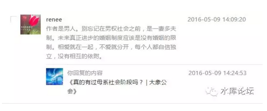
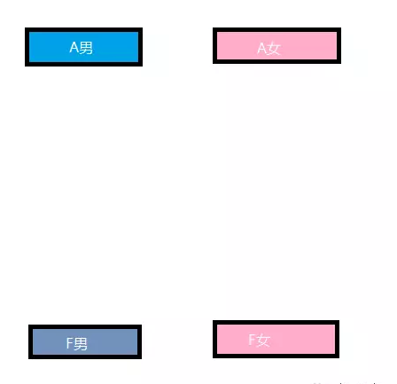
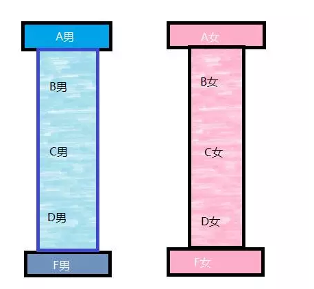
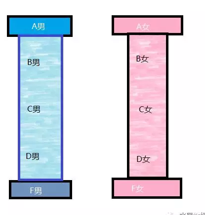
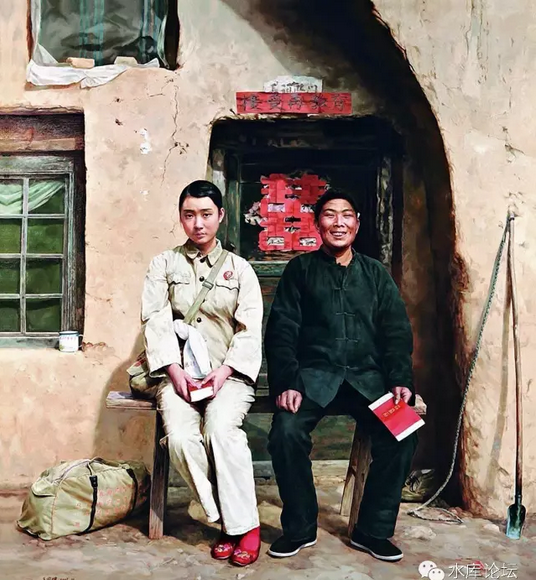
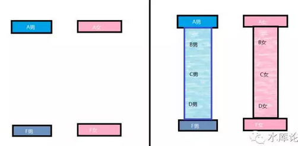

# 为什么我们需要非婚生子 \#F410

原创： yevon\_ou [水库论坛](/) 2016-05-10

为什么我们需要非婚生子 ~\#F410~

 

一夫一妻制就是限购。

限购的背后，是生物多样性的丧失。

 

 

一）论忠贞

 

人口三篇，本文为第三篇；

-   《[降低人口质量，提高人口数量
    \#380](http://mp.weixin.qq.com/s?__biz=MzAxNTMxMTc0MA==&mid=2651014601&idx=1&sn=3f23506d4914bdfdc33f676614f9e3d4&scene=21#wechat_redirect)》

-   《[论一夫一妻多妾制，忠贞，及进步主义\#400](http://mp.weixin.qq.com/s?__biz=MzAxNTMxMTc0MA==&mid=2651014609&idx=1&sn=c67a85d4cd1dc6520d0ef2de303cd713&scene=21#wechat_redirect)》

-   《为什么我们需要非婚生子 \#410》

 

 

在刘慈欣的《三体》之中，有这样一段话："失去人性，失去很多。失去兽性，失去一切"

 

兽性是什么。在自然界的大草原，兽性大致遵循这样一条规律：

-   雄性的利益，是在同一个时间段，和尽可能多的女性交配。

-   雌性的利益，是在不同的时间段，和该阶段最强的男性交配。

 

 

[女权主义者，大部分不读书]。她们高喊着"女权"，却对于什么是女权丝毫概念不清。

 

男性和女性的差异，最主要是"女性怀孕生孩子"。

无论是卵子还是子宫，这在生物学上都是绝大的资源付出。而男性仅仅是牛奶一般廉价的精液。在"生育"这件事上，男性和女性是1：100000倍的成本差异。

 

这是一条根本差异。在此差异基础上，再演化出了不同的生存策略。以及现实生活中千千万万的男女关系。

 

 

-   女性其实不在乎血统的纯净性。因为任何一个子嗣，都是她DNA的延续。所以女性倾向于在"[不同的时间段，更换不同的男性]"。但每一个都要是当时最强的。

-   而男性因为不承担怀孕责任。男性的博弈政策，就是"在同一个时间段，让尽可能多的女性怀孕"。但是对女性的质量并不讲究。因为他付出很少。

 

 

博弈的结果，就是男性普遍的"花心"。简直对18岁\~48岁的女性来者不拒。有一句俗话叫"男人长久而不专一，女人专一而不长久"。

相对而言，女人普遍的"绝情"。女人绝情起来，可以让男胞瞠目结舌。绝决断断，义无反顾。女性会在一个阶段歇斯底里的爱上一个人，而在另一个阶段歇斯底里地爱上另一个人。视ex如路人。

 

 

"女权主义者"请先看书，勿喷。这就是事实。

事实逻辑就是这样的。因为"女性怀孕"，以此作为大分裂前提。一步一步推演下来，必然是这个结果。

你找任何一篇生物学论文，都是这个观点。

 

 

这个事实意味着什么呢。意味着男/女都是天生"花心"的。

只不过一个在空间上不同。一个在时间上不同。

这就是规则。你必须要花心。不花心你就活不下来。你就会灭绝。

我们不和你讨论什么"人性，道德"，我们就和你讨论"兽性，规则"。不遵循规则你就灭绝。

 

所以，忠贞是反人类的！

 

"忠贞"这个词，也是进步主义强塞给我们的。

现代人以为天经地义的词，但却是仅有70年的寿命。你以为学校里学到的先进文明概念，但其实却是毒教育。

 

 

当年的文科生们，费尽心机。从文献累牍中，找出一些陆游"歌颂爱情"的诗篇。

"进步主义"，[知识青年]们认为1949年前的中国都是腐朽的，老迈的，错误的；所以他们要用"先进"的理念来改造社会。推动社会。

熟知民国史的人都知道，"新青年"是造假最厉害的一个党派，为达目的不惜吹牛的事就是他们搞出来的。

遗毒至今。

 

 

在1949年之后我们"改造"的社会，引进了"先进"的社会制度。全面仿制苏联的东正教传统。

"忠贞"作为"一夫一妻制"的配套产品。也在此时被引入中国。

 

"忠贞"直接导致了生育率的降低。

因为他违背的是"兽性"，违背的是规律，违背的是神的谕制！

 

 

当一个社会强调"忠贞"之后，男性就不可以四处撒草，广建后宫。

女性强调"从一而终"。

只有极少数极优秀极强大的女性，才可以在不同阶段，和三个老公生下三个不同的孩子。当然，我不是指的我们的Faye菲姐。

我指的是《飘》里面Scarlett O\'Hara

 

 

而在传统社会，传统社会不是这样的。

传统社会对男性"多妻妾"是宽容的。尤其当男性无子嗣时，更是社会正确。

传统社会"寡妇再嫁"也是一门大生意，鲁迅的《祥林嫂》。

真正丧偶不嫁的，极其稀少。以至于政府甚至要一个县立一块贞洁牌坊。

 

 

 

二）庶系

上一篇《[论一夫一妻多妾制](http://mp.weixin.qq.com/s?__biz=MzAxNTMxMTc0MA==&mid=2651014609&idx=1&sn=c67a85d4cd1dc6520d0ef2de303cd713&scene=21#wechat_redirect)》发出后，立刻有人回复，认为"一妻多夫"也很合理。

更进一步，其实M夫N妻也很合理。

更进一步，婚姻制度整体的瓦解。自由组合，你爱怎么干怎么干。岂不是更合理。

 

 

我知道你们说的都有道理，但我想说的，是另外一层意思。

\
如图。在黑人的生活关系中，基本是"三天换一个老婆"。

自己搜"5美金 草丛 黑女"。

 

黑人以对子嗣不管不问著称。有40%的美国籍非洲人，甚至不知道自己的生父是谁。

在这样的情况下，对子女的抚养，教育，人脉传承，显然无从谈起。

对于黑人的评价。我们可以概括为"F男"。评分为0分。

 

 

而另一方面，目前在中国京沪大城市对子女的培养。包括从胎教开始"无微不至"的关怀。小孩子长大了则是让她读幼教班，兴趣课，学区房，拼名校。成年了还要啃老买房子，老人还要保姆带孙子。

这样昂贵的一套流程。给予了小孩"全方位无微不至"的关怀。对孩子的教育也是100%到位的。

我们可以归类为"A男，A女"。评分为100分。

 

 

你仔细观察这个图表。看出问题来了么。

他当中是空的。缺少80分，70分，50分男女。

 

 

为什么我们之前要花费这么大的篇幅，来描写"一夫一妻多妾制"。

"妾制"其实是空话。

 

在21cn文明如此发达的今天，每一个现代女性，皆都是财政独立的小个体。

你是不可能委委屈屈，去找旧社会穿小鞋的"妾"的。

来去自由。自由是基石。女性可以随时离开你，也谈不上"做小"。

 

那么，21世纪的"一夫一妻多妾制"指的是什么呢。

指的是"非紧密性关系"。

好比如图中，你既有0%的完全不组成家庭。

也有100%的完全紧密家庭。

但你为什么没有80%，70%，50%的关系呢。

 

当一个董事长，拥有一个情人。他每周可以固定和情人见面，并给予情人情感上，财务上，生理上，社交上的各种支持。

情人或许有小孩。这个小孩可以继承董事长10%的财产，但不能和嫡系的70%相比。

 

这个孩子可以继承董事长一部分的"社会关系"。但因为是庶出，估计没什么希望继承整个万达集团。

这就是一种"庶系"关系。

 

 

换言之，在我们鼓吹的"一正妻多情人"关系中，他是最符合生物界"一雄多配偶"天道的。董事长没钱后，女人纷纷离去，也是符合天道的。

 

在这样的关系中，"情人后裔"收到的并不是100%全部资源。或许是80%,70%,50%,但也总比没有好。

屌丝男可以娶迎春，屌丝女可以嫁给李辉景。[\[1\]]

 

你要外出吼一吼，那么多剩女嫁不出去。你问她胡歌要不要，王思聪要不要。想给王思聪生孩子的女人，在微博留言栏下面有几十万。

 

 

 

三）数学题

 

篇幅有多，让我们赞美一下伊斯兰教。

 

对于生育率来说，如果"一夫一妻制"，一对夫妇抚养1一个，已经感觉吃力。养2个，那是非常吃力。

在一夫一妻制度下，你要"进2出3"。简直毫无可能。也就是计划生育取消，也看不到生育率反弹的可能。

 

但是如果你是组团式，象阿拉伯"一夫四妻制"，这时候问你，假如你生5个孩子。平均每个妇女1.25子嗣。

在这样情况下，女性完全没有肚皮压力。但你算算人口，"进5出5"，就已经打平。

 

"一夫四妻制"家庭，生6个是毫不费力的是。相当于每个女性1.5次生育。但人口增长率已经有+20%。

一般情况下，阿拉伯家庭甚至可以生到8\~10个。"进5出10"，这就是人口爆炸式增长。而且整个家庭和女性负担还不累。

 

为什么

为什么

为什么

 

为什么我们"进2出2"
连100%的替代率都觉得吃力，人家"进5出10"，200%的替代率表示毫无压力。

为什么，哪里出bug了。

 

呵呵，你自己算。数学问题。问题出在哪里？！算清了，你就想通了整个人口问题。

 

 

 

 

另外，评论里也有人问，"现在的董事长，也可以找4个情人，养一大堆孩子呀"。而且这样的事，已经在切实发生着。

咳咳，那我问你，你知不知道"重婚罪"。

 

合法的和非法的，还是差很多的。至少要差100倍。

别的不说，在座的各位，如果是非法的，至少就削了你99%的雄心豹子胆。

 

 

伊斯兰教的强大之处，就在于"一夫四妻制"，他是合法的。

我们这个社会要增加生育率，首先就需要废除"重婚罪"。

至少要废除"男性同一时间xx女性"这条。

 

同时，对非婚生子女要给予充分的理解和尊重。

要知道他们和婚内子女同样伟大，甚至更伟大，更不易。

 

 

 

四）中档 

\
为什么京沪的剩女这么难嫁。为什么日本的剩男剩女这么难嫁。

因为市场结构不合理，缺乏中档品供应。

 

 

举个例子，一个女性硕士，985毕业，168cm，在外企白领丽人，有着30W的年薪，和一定的生活修养品味。

这样的女人，是最最最最最难嫁的！

 

值得她们动心，值得她们"王子公主般的爱情"，就只有韩剧中的欧巴。

而我们在《[汉城就是上海的明天
\#90](http://mp.weixin.qq.com/s?__biz=MzAxNTMxMTc0MA==&mid=210009763&idx=1&sn=4c6655048bfe023db1720a9c5fd9adab&scene=21#wechat_redirect)》一文中就已经说到。因为年限原因，"欧巴"作为一个阶层。整体上在中国尚不存在。

 

 

大公司的继承人，年少多金，名车豪马。算来算去只有王思聪一个人。而王少三头六臂，也应付不过来。

寄希望于"童话般的爱情"，于是就剩下来了。

 

但是让你嫁屌丝呢。你又不肯。

为了增加我们的呕吐度，让我们再看一下这张油画。

这个时候怎么办呢。如果王思聪有N个堂兄弟；

这些表哥表弟堂哥堂弟，不需要继承万达集团100%的资产。哪怕仅给你继承一个旅行社，一个度假村。

 

他不需要是大公司的唯一继承人。只要能参加家族晚宴，UpClass入场券，其实也不错。

他不需要100%满分，哪怕有王思聪80%的实力，甚至40%，20%，2%，继承一个长白山滑雪场也不错了。

 

这就是"庶子"的意义。让我们再看回图表。

在原图中，你只有"满分男，满分女"。要配对十分不容易。

而在右侧图二中，因为存在着"B男，C男，D男"，觅偶因此容易得多。

 

许多京沪剩女，其实也不一定就要嫁给王思聪。

你哪怕找个男朋友，只有王思聪1/10身家。也不错嘛。

重要的不仅是"国民老公"。你有千千万的庶子，才是剩女希望。

 

 

同样道理，对于屌丝，也是成立的。

凤凰男屌丝，找LP一样是个大麻烦。京沪剩女，眼高于顶，即使嫁不出去。也不会考虑屌丝的。

这个时候，你需要的是"B女，C女，D女"。董事长和情人生的女儿。

 

这样的女儿，相对于"嫡女"100%的战力加成，自然是不足的。

但是也不错呀，至少是一种选择。

产品线丰富了之后，自然会增强凤凰男的选择面。所以一夫一妻多妾多育制，才是有利于屌丝的。

 

 

这个道理简单之极。尤其是对于Marketing科班出身的人。

当你走进一家超市，空空荡荡，完全没有购买欲望。逛了一圈就出来了，俗称"剩男剩女"。

为什么？结论只有一个。商品种类不够多！

你逛逛淘宝试试。

 

现代大城市社会，剩男剩女特别难以结婚。特别难找对象。

别以为大城市扩展了你的社交面。社交面永远是有限的，他受制于邓巴数，也就是148.

 

 

大城市找不到对象的主要原因，是因为"产品单一化"。换言之，全部都是高档货。

你见到的几乎每一个中产家庭，培养小孩都是钢琴芭蕾英语。直线目标，长大了要当名媛。

这样的小孩，自然看不起"凤凰男"。也不会下嫁。

 

 

 

后人评价"进步主义"。说xx相当于铡草机，所到之处，寸草不留。

 

传统的几千年社会，是充分的"生物多样性"的。有着嫡生，庶出，婢生，非婚生等各种各样人口结构。

而一旦"进步青年"强行推行"一夫一妻制"。则社会上只剩下100%的**完全培养**的"高档品"。

 

这导致一系列的问题。生育率降低，对伊斯兰狂潮毫无抵抗之力，老龄化社会，剩女恨嫁，以及屌丝们颤抖的怒吼。

 

苏联货是个坑，差评退货吧。

 

 

 

五）结语

 

"进步"是一件高度严肃的事。他通常需要皓首穷经的教授，诚实理性的辩论，限于极小圈子的精英社团，才能研究高等科学。

民国时期的"进步青年"，并不是正面角色。

 

 

1949\~1976年时期，中国人口的增长，主要来自于"预期寿命"的延伸。而不是"育龄男女"的增加。实质是毫无增长。关于这篇，可参阅《[我对人口学的粗浅理解
\#F85](http://mp.weixin.qq.com/s?__biz=MzAxNTMxMTc0MA==&mid=400672544&idx=1&sn=01f56167286a157dcdf2226c6a58573e&scene=21#wechat_redirect)》

 

此后，由于不合理的人口政策，中国"育龄人口"是以断崖式速度在下跌。"总人口"毫无意义，关键是"育龄人口"。

 

 

当一个国家地区，生育率一旦下跌。他是很难很难，几乎没有办法再恢复上来的。并埋下了灭种亡国的隐患。

这绝不是每个月补贴你几百元"光荣费"，就可以逆转的。

 

生育Dilemma的最主要原因，是**社会风气**。社会风气一日不扭转，生育率就不会上升。

-   儿孙满地，则文攻武略，帝国扩张。生机勃勃。

-   人口萧条，则现有领地也无法维持。沦为二脚羊。

所有的封建社会，从来都把"户口数"视为根本KPI。并不是为了税赋。

 

 

社会风气的主要bug有；

1）虚荣妇女把子女往"高质量"方向培养。而不愿意负重骂名生9个。

2）一夫一妻制使得高生育欲望群体无法生育，"重婚罪"应尽快废除。

3）"庶出"制度的瓦解，使得自由恋爱不可行。

 

 

（yevon\_ou\@163.com，2016年5月10日午）

 

 

 

\[1\] "元、迎、探、惜"，贾迎春是贾赦庶出。李辉景是"来自星星的你"二公子，朴海镇饰。
