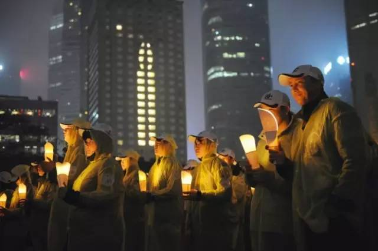
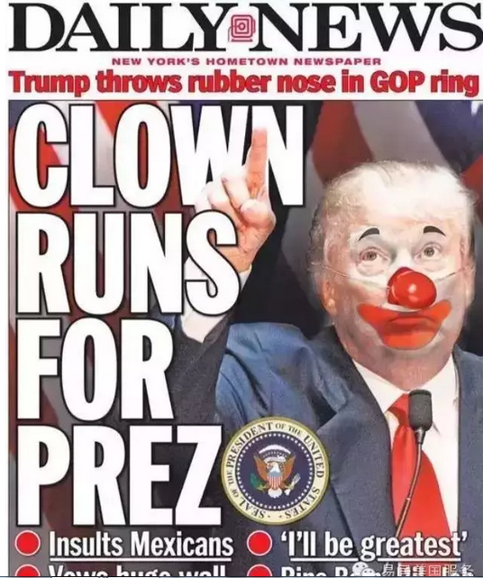
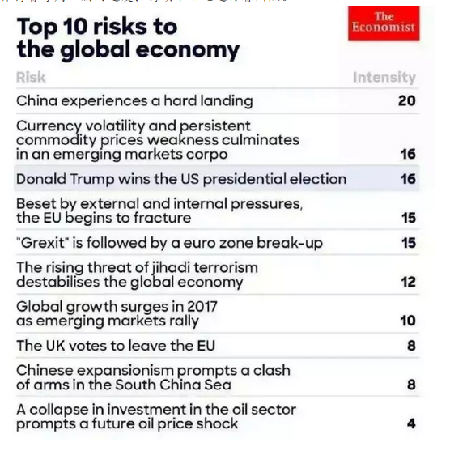
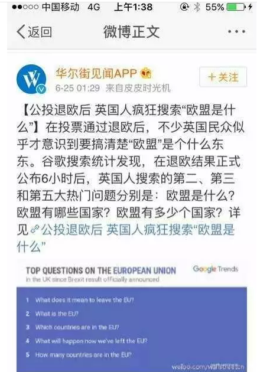
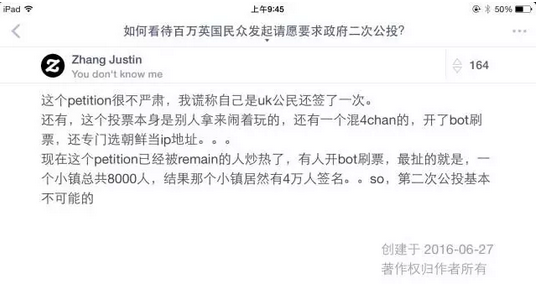
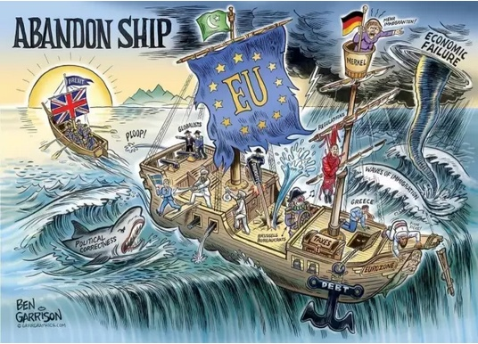
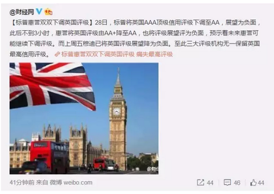
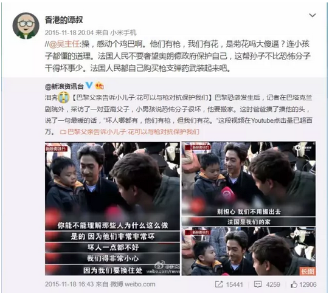
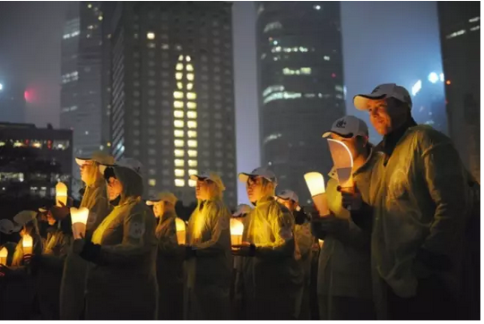
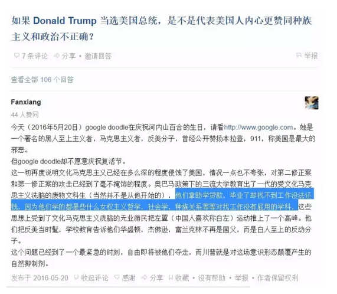

# 美国的大脑生病了（下） \#F500

原创： yevon\_ou [水库论坛](/) 2016-06-28

美国的大脑生病了（下） ~\#F500~

 

一）僵尸病毒

 

在神话传说中，有一种巨人，他双眼可以喷火，挥舞着五千斤的大锤，肩膀肌肉象座山，胸膛上可以跑马。

象这样"天下无敌"的巨人，要击败他，却只是轻轻一点。

 

击败巨人的，是一种叫做"噬心虫"的小虫。

这种小虫轻轻地，轻轻地飞进去。然后就寄宿在巨人的大脑中，控制着巨人的脑子。然后巨人就成了傀儡，任由吸干榨干。

 

 

在现实生活中，我们发现类似的比拟。

[美国是全世界最强大的国家]。美国拥有天下无敌的核武器，最庞大的航母编队，遮日的海陆空常规部队。无论数量还是质量，都是世界第一。

曾一度，人们认为美国是不可击败的。

 

而打倒巨人的，并不需要更多更强的肌肉力量。仅需要一个小小"噬心虫"。

天下万道，诛心最上。

信仰的腐败，是最大的腐败。

 

 

美国盛产僵尸片，Zombie基本是美国独创的一个文化符号，文化现象。

僵尸的设定，是控制着"被传染人"的脑部。使得对方失去自我意识，并继续啃咬下一个人。

"白左"就是僵尸病毒。

 

最糟糕的是，被"僵尸病毒"控制的人，他们是不知道自己中毒的。

你如果去医治，他们还要拼命的反抗。

 

 

有形的敌人最容易对付。好比你手足有病，无论是骨折还是烫伤。

只要医生在旁边好生安慰，你含笑打着麻醉手术针，配合着医生治疗。

战争洪水，地方糜烂，这也好治。无论再大的轰炸机地毯式Bomber。二战过后五六年，也基本重建了。

 

 

而一个人"头脑"的伤害，是最难最难医治的。

你如果去给一个"精神病"开刀，他会拼命地反抗。还以为你要害命。

*\* 而精神病是否真的"有病"，你的意志能否Override他的意志，这本身也是一个充满争议的话题。*

 

 

美国现在的问题，是美国的"大脑"生病了。

美国整体的学术界+新闻界，都生病了。

他们陷入了"政治正确"的不正确，而且靠自己的力量没法爬出来。

 

美国Founder Father国父们为他们预留了一支救兵。就是民间的"草根力量"。

当知识分子们集体发痴，还有"劳动人民"保留着勤劳朴素，基督教清教徒精神。

于是诞生了Trump，Trump就是那个精神病医生，试图去拯救美国的大脑。

 

 

四肢不会反抗，而大脑是会"反抗"的。

会手舞足蹈，会歇斯底里。会痛骂说"你想要害我"。

 

在Trump诊疗事件上，我们感受到了"浓浓的敌意"。

-   首先我们要知道，Trump是什么，Trump是"反政治正确"。

-   政治正确是什么，政治正确是学术圈搞出来的。

-   学术圈的态度是什么，态度是拼命的反抗。

 

 

（如图。小丑竞选总统）

从Trump高举"反政治正确"的第一天开始，他就遭到了几乎整个欧美学术界，媒体界的一致"抹黑"。

 

《FT》的语调，Trump的支持者全部都是：

-   社会底层的，缺乏文化的，没有教养的，种族主义的，失业的，被抢走饭碗的，没经过白左洗脑的，脑子烧坏短路的............

哥哥对着镜子左看右看，你看我象吗，你看我象嘛。

 

 

《Financial Times》《The economist》《Wall Street
Journal》几乎保持着每周一篇的速度，持续不断地进行着川黑。

其实想想，这事毫不出奇。如果不是这样，才叫出奇呢。

因为Trump革的就是"学术界"的命，他等于站出来说"你们学术界30年全错了，过去30年所有论文都要重写"。

如果学术界不集体跳起来，如果老教授还不箕张五指，鹰扑之势跃来，那才叫奇怪呢。

 

 

而事实的真相呢，是《FT》脑子烧坏掉了。

水库论坛，从非常早的编录号，就有了《[邪恶的媒体](http://mp.weixin.qq.com/s?__biz=MzAxNTMxMTc0MA==&mid=206647425&idx=1&sn=36e887ddec70c1492497d8febebbc7b3&scene=21#wechat_redirect)》\#80

我们从一开始就知道，媒体不可信。媒体的话有可能是假的。

《Financial Times》《The
economist》有可能整本书都是错的。是学术圈整体错了。

 

"怀疑精神"才是真正的大学教育。

能说出《经济学人》整本书都是放屁，才是真正读懂了经济学。那本来就是一本很Low的杂志。

 

 

 

二）邪恶的媒体

 

"英国脱欧"历史事件出来不到二个小时，"左翼媒体"已经迫不及待地抛出他们炮制的新闻了。

 

我们看到媒体报道，有众多英国人哭晕在厮所。

他们纷纷表示，"奴家本来是投Stay的，手贱投错了票啊"。

"去了趟厮所，回来悔死了"。

"我们要求重新投票"。

这有个JPG，因为竖版太长，污染版面，我就不贴了。

 

然后英国媒体又爆出，"脱欧"之后。

网民们搜索"什么是欧盟""欧盟有几个国家""欧盟有哪几个国家"。数量大幅增长。

精蝇们，教授们，痛心疾首，"这是平民暴民的胜利，民粹主义的悲剧"。

而在社交媒体上，那些受过"初等教育"，知道白左三斧子的人，立刻按照白左理论，发表大量感受。例如这篇；

《如何评价2016年6月23日英国脱欧公投，最终脱欧这个结果？》李轶睿的回答，获得3041
人赞同。知乎圆桌推荐。\[2\]

 

 

这些媒体，几乎一面倒地向你灌输这样一种看法；

我们常常说，白左的特点，就是比较蠢。智商比较低，脑容量只容得下一个转弯。

事情的真相呢，你才是SB。

褚明宇才是下等人。这是骗局中的骗局。

 

 

譬如说，在真正的"独立思考"人眼中。

当我们详细研究下去，200W人签名，要求重新公投一事。

"左翼媒体"没有告诉你的是，这个签名是网络签名。而且有近75%的ip地址，是来自英国境外的。

 

再譬如说，连google自己都跑出来辟谣了。

英国公民搜索"欧盟是什么"，不代表任何事。

任何一个历史事件，尤其是如此大新闻广泛关注的事件。

事后搜索量都会上升的。

请有心人士不要借题发挥。

 

 

你进一步用客观冷静的态度看下去，你会发现，妓者的报导，是高度倾向性，非中立的。

 

譬如说，相信各位都已经看到了铺天盖地的"流涕悔恨"。

后悔Leave的人一定会有，这也不是假新闻。

可是另外的51.5%呢？

 

你别忘了，投Leave票的人，才是人口的多数。占到总票仓的51.5%

可是现实生活中，你见到妓者采访"Leave"票的人么，见到他们发出自己的声音么。

在新闻报导中，比例可能是90%：10%，甚至是99%：1%

邪恶的媒体！

 

 

我们不要忘了，再强调一次。美国白左的主要阵营，是学术界+媒体界。

媒体，是一件强大的武器。

 

 

就好像《帝国时代》里的巫师，他可以不停地Convert你的民众，把你的部队变成他的人。插播僵尸病毒，病毒传播到全世界。

 

有时候，你明明是非正义的。明明是少数派。

可是到了媒体嘴里，歪曲扭曲事实，"悔恨流涕"就变成了多数派。听新闻好像全英国人民"民意"都要再投一次。

\
（欧洲的船快沉了）

 

\
（西方"政治正确"氛围中，对脱欧的态度）

 

 

 

"媒体"非常难以被击败，非常非常难以被击败。

类比传说中会不断生长的八歧大蛇，拥有无限的触手，再生的生命。

几乎没有一个美国总统，可以彻底铲除"邪恶的媒体"。

 

 

在目前，Trump面临的是一场"媒体的战争"。

因为美国的大脑生病了，真正的病菌，隐藏在"学术界+媒体界"的外衣下面。

而媒体无法被铲除。

媒体就像是"原位癌"，只要白左还控制着媒体一天，白左就可以扩大阵地，发展信徒。

白左就永远也不会灭亡。癌症永远也不会被切除。堡垒不失，白左永不亡。

 

 

这是一场令人绝望的战争。是孤身Trump战恶龙的故事。

直到有一个中国人，名叫张小龙。\[3\]

 

 

 

三）诛心

 

 

今天这篇文章，本来题目叫做《英国脱欧，骗局中的骗局》。

最初的原因，是在朋友圈看了一篇：

《英国退欧不是一个笑话，即使是，也是让我们所有人都感到苦涩的笑话》\[4\]

 

实在忍不住了，朋友是智障么。

明明是被人骗到沟里的SB，卖妻卖女喂养穆斯林的SB，偏偏还以为自己最聪明最崇高最伟大。

 

于是想写一篇文章反驳。

没想到写着写着脱纲了。前言太长，都足足有5000字了。以致独立成了一个（上）篇。

 

 

从一个《诛心》研究者的角度，让我告诉你；

 

-   千门从来都不是骗术。

-   千门是骗术中的骗术。

-   Liberal从来都不是骗术。

-   Liberal是先告诉你一件事很伟大，然后让你为伟大事业奉献终身。

 

也就是你绕一个弯是骗不了人的。你必须绕二个弯。

直接让英国出钱养穆斯林是不可能的。但是伪造"Stay"民意，你就顺从"民意"了。

这才叫千门。

 

 

对于白左来说，真正的骗局在于，"媒体灌输给你那套理论"就是错误的。

白左自以为"为了正义，为了进步，为了人类文明"而献身。

 

但其实你整个方向都是错的。

南辕北辙。你越是"奉献"，越是被剥削得更深。越是寄生虫入脑，血肉榨取干净。

岂不是曰"僵尸病毒"。

要剥削低层民众，诛心最上。

 

 

而对于"诛心"这种事，小白们几乎是没有抵抗力的。

顶天立地的魁梧巨人，对于"心灵控制"却是几乎没有抵抗力的。

 

为什么。

 

 

 

四）屌丝时代

 

在水库之前文章《[屌丝时代](http://mp.weixin.qq.com/s?__biz=MzAxNTMxMTc0MA==&mid=212053780&idx=1&sn=d6fe84c95640211847874ece3f9a246e&scene=21#wechat_redirect)》《迎接一个波澜壮阔的大时代》中，我们讲到了中国目前的"宏观大趋势"。

 

宏观大趋势是什么，大趋势就是"农民进城"，就是城市化。就是八亿农民要变成第二第三产业的人。

而GDP仅仅是一方面，除了GDP提升外。更有一方面是"人文"的提升。

 

 

英国人传统上把缙绅叫做"Gentleman"。

Gentleman的意思，是一个人有着充分的教养，有着充分的政治成熟度。理科可以研究天文地理，文科知道法律乡议。同时不乏上战场浴血奋斗的勇气。

而对于女子，则有相应的Lady。作为一个Lady的要求，是琴棋书画，得体大方。管家能理财，对外能坚强。

 

显然，Gentleman是一个非常高的要求，我们也从来不指望"农民"升级能升到绅士。

那么，正常的升级流程是什么。

《屌丝时代》中有写道：农民-\>屌丝-\>小市民-\>市民-\>绅士

这不是一蹴而就的。

 

 

尽管官方舆论对"农民"涂脂抹粉，但摊开明说，农民"狡诈，残忍，短视"。

有所谓的"农民式狡猾"。

擅占小便宜，而毫无信义。就人力资源而言，几乎是毫无价值。

 

现在问题来了，当农民进城，升级进化成"屌丝"，他们的素质会变好吗。

凤凰是一种烙刻在骨子里的印记。如果凤凰男考上了北京大学，他会不是凤凰么。

答案否定的。

"人口升级"是一个漫长而渐变的过程。8亿农民，绝不会一夜之间变成8亿圣人。

 

那么，农民升级成什么。答案是："屌丝"。

农民身上的不良习气，屌丝身上一样有。只不过是淡了一些。因为工业社会的洗礼，你必须现代化，才能跟上这个社会。

 

 

这就解释了我们一系列的问题。屌丝天然是Liberal。

屌丝天然是liberal

屌丝天然是liberal

屌丝天然是liberal

（Liberal就是白左）

在现代文明的面具下面，还藏留着古老农耕的记忆。

 

 

我们来回想一下，《屌丝的伟大，和伟大的屌丝》一文中，我们对屌丝特性的描写；

1）脑容量不足，只能接受很简单的道理

2）渴望出人头地

3）捷径

 

 

屌丝的特性，尤其在中国，特别喜欢"一步登天"。

屌丝们喜欢的是马云，马化腾的故事。对于马云十八罗汉吃方便面的故事，津津乐道。

 

因为mzd告诉大家"打破樊笼""王侯将相宁有种乎"。于是屌丝们的野望都吊起来了。

30岁之前就算做不到马云吧，好歹做个王思聪。

 

而另一方面，"脑容量不足"却始终深深困扰着屌丝人群。

"你只有奋斗过了，才知道天赋的差别有多大"。

 

屌丝们每天都渴望着"出人头地"。可是出人头地，谈何容易。

贵族们绝对不是顶着一个虚衔，无所事事。

每一个贵族的教育，都是家庭无数资源堆积出来的。所以贵族脑容量高，能掌握高深复杂的事情。

哪怕诸如做官，贪污，拍马屁之类的。都是技巧。

 

 

我们看屌丝三原则；

1）脑容量不足

2）渴望出人头地

3）捷径

 

三原则结合，屌丝最适合做的呢，是"某种宗教"的底层人士。

什么叫底层人士，就是"速成班"。

 

 

屌丝走上社会，就适合的路线，是作为一只"迷途的羔羊"。空有无限理想，却不知如何做。

然后，突然，他被小姐妹拉到群里。小姐妹塞给他一本小册子。

"这是什么"。

"圣经啊"

"有什么用"

"神书啊。只要念了就能得道成仙，就能长生不老，异教徒统统去死"。

 

 

各位，这整件事关键中的关键，是这本书一定要很"薄"。最多不能超过50页，象一个随身携带的小册子一样。

为什么，因为厚了屌丝记不住呀!

 

 

然后屌丝翻开小册子一看。

"爱护我们的地球，杜绝环境污染"。

"西藏，雪域高原"，净化心灵

"天然有机食品，无农害无污染。杜绝转基因食品"

"要民主，不要独哉。为民主事业抛头颅，洒热血"。

"打倒列强帝国主义"

"用爱发电""他们有枪，我们有花（菊花）"。

"恐怖主义最大的成功，是改变我们的生活。使得我们仇视穆斯林。不，我们绝不上当"。

 

这本册子从远古到迄今，变化了很多次。

在远古最早的时候，他叫做"耶稣记约"，后来叫做"古兰经节选"，再后来叫做"xxx语录"，到今天则是"用爱发电"。

 

但究其根本，其核心的一点，从未改变。

那就是薄，很薄，非常薄。

 

 

因为屌丝的脑容量非常有限。你不可能和他讲大道理。

更不可能和他讲"用辩证的眼光看世界"，"时刻存在怀疑精神"。

"独立思考""科学印证"。

难，真难，实在太难了。

对于屌丝实在太困难了。他们无法理解接受"对同时又错""集合论""抽象论""逻辑论"。看得懂这些，他还会是屌丝么。

 

屌丝们最容易接受的，是"小册子"般的口号式普及读物。

其中的每一段话，可能只有一二句。

没有上下文，没有应用环境限制，他就是一句口号。

 

 

台湾的"太阳花"运动为什么搞得这么大。

因为台湾的年轻人不读书。

他们整天打电动，把妹，玩职高。花在读书上的功力，连大陆学生的1/5都不到。

 

而年轻人渴望"出人头地"。

年轻人渴望投机从事一项"伟大的事业"，并迅速窜至高位。

 

 

所以年轻人特别容易被煽动。特别容易头脑一热，投身于"伟大的事业"。

抗击黑暗，争取光明。

"争取民主，反对服贸"口号是很伟大的。可他很可能只见过[一二句语录般]的民主宣传。

 

 

你要是问他，什么叫做"孔多赛陪审团定理"。\[5\]

什么叫做"阿罗不可能定理"。

请问服贸协议在国际法上有哪些管辖的权益以及物权法争议仲裁机制如何。

"对不起"

"Excuse me, I beg your pardon"?

 

 

 

无能肤浅的年轻人，最容易被"崇高"宗教所吸引。

这个道理是通用的。对于今天的"白左"Liberal也是适用。

你看回白左们的议题。

-   "我们不能只顾经济，也要注重环保"

-   "不能歧视黑人，人与人之间要平等"

-   "吃肉不健康，我们要吃素"

-   "纯天然土鸡好过肯德基"

-   "降低房贷利率，帮助Homeless"

-   "打击大公司垄断，维护消费者权益"

-   "对不同文明要包容，让爱创造奇迹"

 

 

你看，这就是一个典型的"不要......而要......"范式。

用逻辑上的话讲，转一次弯。

小粉红被感动得热泪盈眶。自以为找到了宇宙中的"奥秘"，转一个弯耶，多复杂的事情。

小粉红立刻高举圣母旗帜，并恶狠狠地准备去教训那些"顽冥不灵"人群了。

 

 

而事实的真相呢，"歧视是不对的，但歧视黑人不是歧视"。

这句话就是"绕二个弯"的。

这话就完全超出了小粉红的理解能力。让她们兜上半个小时也兜不出来了。

而这句话才是对的。要问为什么，你最好去买本《歧视经济学》看看。

 

"肯德基比土鸡更安全，更有营养"。

"转基因食品远远比有机食品更安全，更健康"。

"PX会减轻污染"

当小粉红上蹦下跳蹦跶地为民请命时，她们不知道，她们主张的才是SB。

（如图，这是环保愚昧者搞的"熄灯一小时"，摄于上海陆家嘴。

他们手中捧的蜡烛，燃烧的热量和排放的污染，超过了他们所节约的所有电力。

 

但是这些并不重要。关键是屌丝自以为"从事"了一件崇高伟大的事情。

你看他们"雀跃"的眼神）

 

 

 

继续回到我们的话题。"农民进城"，在中国被称为屌丝。

我们称之为升级版的农民，骨子里还是农民。

 

可是在国外呢。"农民升级"被称之为"白左"。

白左就是屌丝，屌丝就是白左。

为什么你以为欧洲就没有农民进城呢。人家人口也是往大城市集中。"欲望都市"四个女的全都是小城镇来的。

 

 

而一旦进城以后呢，大家跳的"坑"都是一模一样的。

白左也是一样的肤浅，毛躁，不靠谱。

白左也特别容易投身于一项"伟大"的事业。例如反越战，反核，反全球变暖。

这个事业正确不正确，并不重要。

人家就是要的"伟大"。要"出人头地""神圣崇高"的感觉。

https://www.zhihu.com/question/41546804/answer/101719336

 

因此，白左就是"某种宗教"底层人士的定位。

三个月"速成"用爱发电的角色。

 

而这个"邪恶宗教"是什么呢？

 

 

 

五）卖国贼

 

在经历了250年漫长岁月之后，民主党终于迈出了这一步。

 

"试问，假设有一个机会。对你的国家[极度不利]，但是对你的政党有利。请问你会不会去做"。

这种只有在《纸牌屋》中才会出现的故事情节，没想到却发生在美国社会中。

 

 

要知道，美国是二党制。二党制啊。

你不是欧洲那些国家，有十七八个政党。那么那些小党，很有可能沦为"带路党"。

例如说，日本人打进来的时候，去牵头做个伪军之类的。

 

可是美国是二党制啊。而且你获胜的几率还不低。

相当于整个天下，1/2是你的，你为什么要这么做。

 

 

目前，Barrack Obama执行的，是"扩大选民"策略。

奥巴马排除一切万难，抗拒一切质疑，在他的第二届任期，做成的最最最主要政策，就是为2700万西班牙裔"偷渡老墨"颁发了大赦令。

从这一天起，你们就是堂堂正正的美国公民。拥有投票权了。

 

从字面上讲，奥巴马的理由冠冕堂皇。人家大部分已经在美国境内生活定居了几十年。

你始终不给他正式身份，是很不人道，很不合理的一件事。

再说，这也仅是对既定现实的一种追认。

 

 

而从字底下讲，几乎每个人都知道，奥巴马玩的是"扩大选民"的策略。

Hispanic几乎全部都是投票给民主党的。因为民主党承诺刮"白人大富翁"的钱，然后分给他们当福利。

 

民主党的基本票仓，就是：

-   顶端，极少撮职业政客

-   中端，几乎全部的学术界，学生，新闻界

-   低端，少数民族，领福利的，新移民

奥巴马的作为，就是为民主党增加了2700万张选票。

 

 

选举这种事，本来就是势均力敌，双方才拉锯了几十上百年。

随着"2700W"拉丁选票的加入，胜利的天平一下子倾斜了。

 

而"墨西哥化"对于美利坚本身，却是非常有害的。

因为你追加了2700W人口，你等于追加了2700W份社会保险。

而这些，始终都要纳税人掏钱的。

相当于趴在美国白人身上猛吸血。

 

 

更为严重的是，美国目前的"黑绿黄"化已经非常严重了。

其中黑色是黑人，绿色是穆斯林，黄色是Hispanic。

 

而随着人口天平的进一步倾斜，以后"非白人"的人口比例越来越高。

这意味着白人翻盘的机会越来越难。

对黑绿黄的福利只能越来越增加，法案越发容易通过。

 

这样玩下去，是"灭种亡国"的风险啊。

民主党在美国被称之为"卖国贼"，不是没有道理的。

 

 

几乎所有的坏事，都是Liberal干的。

出卖祖国的利益，换取自己几十年执政，这么断子绝孙的事，美国绅士们250年都干不出来。

可是观海，圣母，三德子几个人一合计，居然就把"国"给卖了。

 

 

你设想一下，如果按照这个趋势发展下去。吸尽美国白人的血，供养黑绿黄人种。

终有一天，白人会完全灭绝。而美国会变成一个拉丁化的国家。

在这个过程中，民主党可以获得数十年乃至上百年的执政。

可是，真的值得么。

 

你这个卖国贼！为美利坚而哭泣。

 

 

最后，用一句话完结整篇。这是2013年著名汉学家Lucian Pye的话，流传甚广。

 

-   China is a civilization pretending to be a nation

-   US is a nation pretending to be a mission.

 

再见，灯塔国。

 

 

（yevon\_ou\@163.com，2016年6月27日晚）

 

 

 

 

\[1\]图片链接地址是：[http://mmbiz.qpic.cn/mmbiz/Ok4hZ0tV6r5v1y8jC0vAB4cRR0hJlUT68oydorN716yCzpfQE91HAjXk14pA8e3hzLcTartgzIsgrOib9KnGjHg/0?wx\_fmt=jpeg]

\[2\]《如何评价2016年6月23日英国脱欧公投，最终脱欧这个结果？李轶睿的回答，获得3041 人赞同》[https://www.zhihu.com/question/47704096/answer/107579686] 

\[3\]微博，微信之类的，被称之为"自媒体"。自媒体的盛行，才是真正摧毁了媒体界的巢穴。但还有很长的路要走。

\[4\]《英国退欧不是一个笑话，即使是，也是让我们所有人都感到苦涩的笑话》https://mp.weixin.qq.com/s?\_\_biz=MjM5MzA0NDA4MA==&mid=2654075767&idx=1&sn=2144d8bf6dad24007111122ba62122a9&scene=1&srcid=0627udDDaWxbBLPXJ4TYNGBh&pass\_ticket=iNPEu84dB38mPH2vKzuc%2BAlWXwZimo2z4Xs5jYwBaxXnbLnHzdrpG59Xfl6v6pOZ\#rd

\[5\]《孔多赛陪审团定理》https://www.zhihu.com/question/47819269/answer/107936660

《Arrow不可能定理》http://www.shuiku.net/forum.php?mod=viewthread&tid=31437
