# 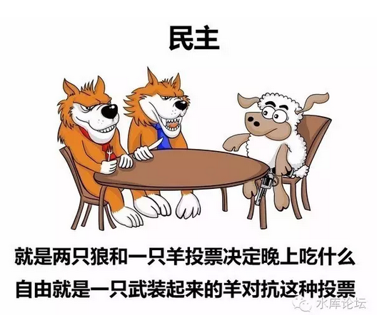

本文为随笔

 

 

一)蠢货

 

我们生活在一个SB环绕的时代。

 

我们身边99%的人是蠢货，低智商人群，单细胞生物。

这个比例，在任何时代，任何朝代，任何领导人治下，都是维持不变的。

 

 

昨天，在《[美国的大脑生病了](http://mp.weixin.qq.com/s?__biz=MzAxNTMxMTc0MA==&mid=2651014783&idx=2&sn=e65063240bcf30c7cfa3b75e4611747b&scene=21#wechat_redirect)》一文中，我们说道了SB的特色；

-   只受过非常肤浅的教育

-   却自以为掌握了宇宙真理

-   居高临下，别人都不懂就你最懂

 

我还刚想着怎么把这个概念写清楚。马上就有了"读者来信"。

活生生的一个大SB例子竖在眼前。

你知道，哥哥是个话痨。

今天我们无聊，就再写写\#F510，分析为什么SB。

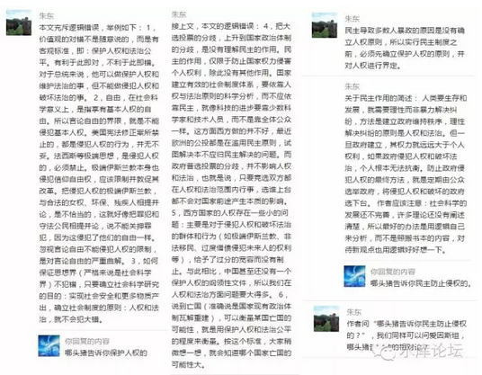

二)人权

 

我们来看朱东第一个错。他事实上第一句话就错了。因为第一句话是他全部的立论基础。以后的话就不用看下去了。

 

"本文充斥逻辑错误，举例如下：1，价值观的对错不是随意说的，而是有客观标准，即：[保护人权]和法治公平。"

 

哥哥的回复是：

"哪头猪告诉你保护人权的，第一句话就错了"

 

 

为什么要这么说，因为"第一句话"最重要。

二个人迎面辩论，第一句话最重要。因为第一句话是"共识"，是辩论的基础，是平台。

在共有的平台上，才有讨论展开的基础。

 

 

而平台是什么呢。平台就是"人权"。

圣母婊上来第一句话，"[保护人权]"

这个时候，你的回答绝对不可以是"对的对的，人权是一定要保护的。大家只不过方法策略不同罢了........."

 

这样说，你就输了。

以后无论你再怎么绕，你也绕不出"政治正确"这个大框架。唯一区别无非输多输少而已。

 

 

而哥哥的回答呢，"什么人权，俺们不承认人权！"

直接一记耳光縇回去。

请我们记住;

 

天赋零权

 

天赋零权，天赋零权，天赋零权，天赋零权，天赋零权，天赋零权，天赋零权，天赋零权，天赋零权，天赋零权，天赋零权，天赋零权，天赋零权，天赋零权，天赋零权，天赋零权

 

 

 

三)天赋零权

 

什么叫"人权"。人权就是"人的基本权利"。

 

 

你拿到美国社会去。如果一个人快要饿死在街头，他要二个馒头，这个就是"人权"。

朱东谈的"保护人权"，指的也是这个权力。

美国的圣母婊，癌肿瘤"政治正确"，说的也是这个权力。

 

 

美国已经如此强大，你可以造出核武器，一驾F22几亿美金。

可是一斤粮食，只要\$0.49cents

一个如此强大的国家，却让人民饿死，你觉得可耻吗。

 

 

当1950年代，如此"反战·人权"的言论出台时，它几乎是横扫的。

如果你出生在那个年代，你也会是忠实信徒。

 

这就确立了"人"的第一个权力，吃二个馒头的权力。

"勿以恶小而为之，勿以善小而不为"\-\-\-\-- 刘皇叔·玄德

 

 

西方的圣母们，是如此地自信，如此地有力量，美利坚是如此地富饶。

她们坚信，吃二个\$0.49的馒头，吃不穷她们。

 

可是，接着呢，"人权"是一系列的行为。

开了一个头，你就停不下来了。

 

纽约的街头，纬度很高，冬天特别地寒冷。遍地积雪。

如果是一个可怜的小孩子，睁着超大的眼睛。萌不萌，你会心疼么。

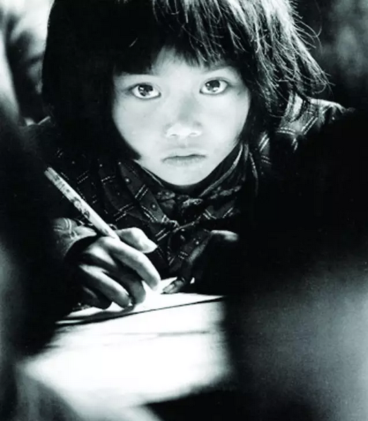
所以"人权"的第二步，就是号召大家捐衣物。

先是旧衣服，旧被子，旧棉袄。

以后新的也捐。

 

"人权"的第三步，如上图。你也看到了，就是"教育"。

上学是一件很重要的事。不仅可以帮助中低阶层摆脱贫穷，而且对于社会熔炉也很有效。

 

"人权"的第四步呢，是医疗。

第五步，是Homeless

第六步，是失业救济

第七步，是养老金

..................

 

中世纪有一个谚语，骆驼只要挤进来一个鼻子，他就会整个地冲进帐篷。

西方灾害的一切苦难，都来自于"人权"慈善。

 

 

所以我们对于"[保护人权]"这四个字，特别地敏感。

只要一看见这四个字，就一定要站出来反对。

 

不，我们不同意你的"共识"，连讨论辩论的前提都不存在。

我们根本不同意基于"保护人权，民主法治"的基础上，展开进一步讨论。

我们反对的就是人权。

 

 

我们信仰的是什么呢，天赋零权

 

你仔细看，"人生而拥有吃馒头的权利"，这是什么，这是一项\$0.49的权利。[\[1\]]

"人生而拥有取暖的权利"，这是一项\$99的权利。

"人生而拥有上学的权利"，这是一项\$49999的权利。

"人生而拥有医疗保险的权利"，这是一项\$199999的权利。

美利坚破产，那是你滥用权利。

 

我们认为，人生而拥有\$0的权利。

 

 

也就是[所有\$0]的权利，才是"人权"。

好比言论自由，宗教自由，集会自由，出版自由。

你可以在家里翻跟斗，练倒立，只要不妨碍到别人，随你大闹天宫。

 

 

"天赋人权"的概念，如果上溯，可以一直追溯到1789年"法国大革命"。

"天赋人权"他绝对不是一个负值。

 

-   从来都不存在皇帝，贵族。贵族要你卖命几十年才能获得自由。

-   也不存在"赎罪券"。

-   我们不是奴隶，不需要为奴隶主工作几十年才能赎回身契。

 

"天赋人权"绝对不是一个负值。生来不是奴隶。

但它也不能是正值。

他就是零，只能是零。天赋零权。

 

 

我们观察"吃馒头的权利"，吃馒头不是人权。

因为你馒头要\$0.49，这个四十九美分，不会是天上掉下来的。

千千万万个人一起吃馒头。馒头不会从天上掉下来。

 

"免费医疗"也不是人权。

"免费教育"也不是人权。

"养老金"也不是人权。

政府包办"从摇篮到坟墓"的所有福利，福利不是人权。

因为你是一个正值。一个巨大的正数。方程式配不平的。

 

千千万万的人一起享此大福，则福气从何而来。

欧洲废材一代，只用了40\~50年。就把他们祖先500年的残忍积累，全部都挥霍光了。

 

 

只有"零"，才可以无限扩展。

0才能给几千万人。

类似于宗教自由，言论自由，出版自由，集会自由。这些才是可以无限相加的。

 

法国大革命"天赋人权"，几乎从一开始就错了。

因为正确的说法，应该是"天赋零权"。

我们不是皇帝贵族的奴隶，权利不是负值。但也仅此而已。权利绝对不是正值。

 

 

Franklin·罗斯福提出了"四大自由"。

-   言论自由

-   信仰自由

-   免于恐惧的自由

-   免于贫困的自由

 

其中，前三条是对的。而最后一条是错的。因为他不符合"天赋零权"。

可见，理论界的错误，是早早扎根于美利坚的。

 

 

 

人和神有什么区别。区别在于"神"是会变戏法的。

耶经上说，仅凭五饼二鱼，就喂饱了几十万的人口。

 

而"人"不会。无论哪一个国家的领导人。你还是要受物理学，化学，能量守恒定律约束的。馅饼不会从天上掉下来。

你必须遵守"天赋零权"守则。

 

 

几乎在任何一个宗教伦理中，都说"不可僭越为神"，不可与神比拟。

西方圣母们自以为无所不能。

这个就是僭越了。违背了《十诫》的基本伦理。

 

 

 

四)天地不仁

 

笔者是道教徒。而且是虔信的道教徒。

道教的核心思想，是"天地不仁以万物为刍狗"。

 

 

这其中最关键的，是这个"仁"字。此仁不是形容词adj，而是动词vt.

 

很多小白读道藏，读到仁句都非常地疑惑。"天地不仁"，是不是指天地都是坏人呢。都是穷凶极恶杀人灭国。

不是的，此处的"仁"字，是动词vt

 

 

"天地不仁以万物为刍狗"的意思，是天地不会主动出手"拯救人类"。

你以为人类很NB，很特殊，要享"人权"。

 

不是的，在"天地"眼里，人类和恐龙也没什么区别。

恐龙灭亡了以后，哺乳动物才有机会发展。历史的偶然，人类战胜黑猩猩获得了进化。

但是在"天地"的眼里，如果黑猩猩胜了人类，那也没什么区别。

哪怕演变"人猿星球"，那也很正常。

人类很懒惰，就该被蚂蚁淘汰。

 

 

"人类不会获得任何优待"。神不眷爱人。你丫不就是灵长目的一个分支么。

所以道教是彻底反"人权"的。这是根本性地宗教分歧。

 

我们相信的是"天助自助者"。任何事都需要自己争取，不劳作者不得食。

我们相信的是"物竞天择，适者生存"。

我们相信穆斯林是会把基督徒干掉的。而圣母婊们，并不认同这一点。

 

 

 

五)邪恶的民主

 

朱东犯的第二个错误：民主并不能保障个人。

 

相反的，相对于独裁/君主制等[少数派统治]制度，Democratic制度更容易侵犯到公民。更充满了剥削。

这个道理实在太难了。那些只翻过"50页"速成班的粉红，是不能理解的。

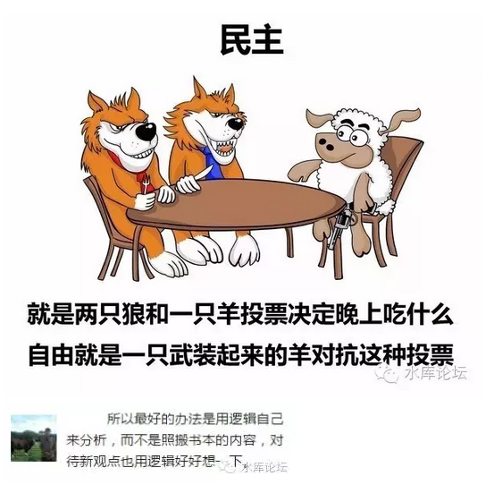
（火大。看到这样的读者评论，只有三个字：晒SB）

 

 

民主是什么，民主就是抢劫。

警告无知"50页"小白，见到新观点，最好也先用逻辑想一下。

 

民主是人类发明的最肮脏，最邪恶，最无耻的制度。

民主来到这个世界上，从头到脚，每一个毛孔都流淌着血污。

 

 

凡是实行了"民主制"的国家，无一不遭受到了混乱，迟滞，品德堕落。

你早一天民主，早一天贫穷。

晚一天民主，晚一天贫穷。

 

《论高等收入国家陷阱》~\#F480~，这其实是同一个坑。谁实行了民主，谁就掉入坑里去。

 

 

人类社会，并不是只有"民主"vs"独裁"这二种制度可以选择。

那些凡以为"除了A，就是B"，全部都是脑残。

全部都是50页的低脑容量蠢虫。

 

 

关于"邪恶的民主"，布尔费墨老师已经有了足够文献批判。只不过你没有拜过真神罢了。

哥哥急着出门吃饭去。民主这一节就不展开了。请关注布尔费墨订阅号。

 

 

六)灯塔

 

最后，解释一个众多读者问的问题。即昨天文章的最后一段话。

 

用一句话完结整篇。这是2013年著名汉学家Lucian Pye的话，流传甚广。

 

-   China is a civilizationpretending to be a nation

-   US is a nation pretendingto be a mission.

 

再见，灯塔国。

 

有人说，这段话每一个英文单词都认得。可是拼在了一起之后，偏偏就不认得。

 

 

这段话要解释清楚不容易。他其实包含了四层含义；

1）中国是一个文明，而不是一个国家。

2）中国正在学西方

3）"大脑病了"，西方不再值得学习

4）未来的路，"文明"级蠡虫知道如何走下去。而国家级不行。

 

 

首先，请大家关注一个词语。《人民日报》内经常出现。每一次外国领导人来访都会跳出来：推动了"中西方文化"交流云云。

 

这个词的重要之处。请大家再关注一下。用官方拆词方法，他是"中""西""方"。

 

 

 

这意味着什么呢。1840年之前，中国人是根本看不起英咭唎的。认为海外小岛，还不配当中国一个省。

后来鸦片战争被打疼了，终于意识到对方是一个同等的巨人，而且是大国。

 

但是在整体意识形态上面，一个是"东方文明"，一个是"西方文明"，这个是保留下来的。

 

 

也就是，地球上有二个同时产生的文明火源。只不过一个在东方，一个在西方。

在长达2000年的岁月里，双方从未碰面。也并不知道在地球的另一端，还存在着庞大帝国。

 

1840年第一次见面，大清朝是战败的。

这种概念和冲击，就像是遇见"外星人入侵"一般。

史书学术上的用语，则是"二千年未遇之变局"。

 

因为中国之前是一个文明，是自成体系的文明。而且已经达到了"可观察"的极限。

就好比现代地球也是一个文明，地球人互相交流，飞机飞来飞去的"地球村"。

 

可是遥远的冥王星，突然跑出来一堆碳基生物，拿着激光枪，"嘎吱嘎吱"叽叽。

你说地球人会怎么想？

 

 

中国人内心是骄傲的，而且我们的确是伟大。

在"中""西""方"字眼下掩盖的。我们认为:

 

-   与古汉朝相对应的，应该是整个的罗马帝国。200AD西方文明。

 

我们应该是和整个"西方文明"平起平坐的。

而不仅仅是一个"国家"。

 

中国的总统，不是和捷克斯洛伐克之类小国总理，平起平坐的。

找一个省长还差不多。

以上。

 

这种话，中国人只能藏在心里。但是却不能说。

汉学家Lucian Pye是个狡猾狡猾的白人，他看清楚了。并捅了出来。

 

 

其次的第二步，1840年第一次"中西方"文化碰撞。中国是战败了，而且惨败。

发现我们的武器，我们的科学，我们的思想，都落后整整一个时代。差距不是同代同位阶。

中国的国力，竟然和一个欧洲二流国家差不多。比利时都可以欺负我们。

 

 

马基雅弗利的精神，是渗入到每一个生物血统深处的。

落后就要挨打。

穷则变，变则通。通则久。

 

 

而"变革"，该怎么变呢。答案是，向"最强者"学习。

请注意，"学习"这种事，永远是向最强者学习的。不是第一，也是第二。

你要说Inca帝国，波斯帝国，这种"病夫"是没有人会去学习的。

 

 

在非常长的时间内，"灯塔"就是美国。

美国是全世界最强大的国家，无论是航母，还是好莱坞谷歌可口可乐。

 

我们注意到，80年代韩国有"学生"运动，追求民主卢泰愚下台。

2000年代台湾有风起云涌的"青年"思潮。民进党攫取了整一代人。

为什么年轻人不追循有钱有官做的GMD呢。

为什么要去参加又穷又没前途的珉进党呢。

 

因为其背后，是"灯塔"。

你以为学生懂民主啊，懂个屁。500页以上的厚书，他们一本也没看过。

学生们追循的，其实是"最强者"。

美国是最强的国家，那我们就学美国。无论是国体，政体，还是牛仔裤的样式，哼哈Hip。

 

 

值得解释的。这并不是孤立现象。反而在历史上是"主流"现象。

在1950\~1960年代，全球"赤化"得非常严重。

"亚非拉"独立运动。一块又一块地图涂成红色。绞尽脑汁也拦不住。

而到了70年代以后，"赤化"嘎然而止。

 

其背后的原因。绝对不是非洲人民崇拜Karl Marx。

真正的原因，是因为1950年时，苏联看起来"很牛"。

斯大林不仅仅打赢了卫国战争，而且还把坦克开进了东欧国家。华沙成了附庸国。

-   人们并不是信奉政治理念。

-   人是不可能被说服的。

-   人类真正崇拜信奉的是"强者"。

而1970年之后，苏联经济陷入严重困境。共铲主义立刻在全球流行中消失得无影无踪。

 

 

再往前说一点，1910年有一个"土耳其青年党"。凯末尔就是靠此起家的。

"土耳其青年党"是彻底的崇德。里里外外都是死忠德国粉。

你一个伊斯兰土耳其人，你崇拜德国干什么？

因为1910年代，德国才是全世界最强大的国家。"德式教官"就成了各个国家的效仿流行。

 

 

往后说，2010年之后，伊斯兰为什么阻挡不住呢。

因为伊斯兰看起来"有力量"。有活力，咄咄紧逼。

而西方文明总是挨打，总是挨炸。挨炸了你还要卖菊花，整一个娘炮。

 

你越是这样，伊斯兰的追随者越多。

要不你干脆灭了几个中东国家。把ISIS统统挂路灯。人家不会仇恨你，说不定还会崇拜你。

 

 

问题的第三步，是我们"又到了历史三岔口"。

韩国人并不信奉民主。没有任何理由认为，高丽棒骨子里流淌着民主的血液。

"民主政体"之所以能在韩国立足，因为世界的"主流"。美国和欧洲镇海神针。

 

现在问题来了，假如"灯塔灭了"。

那怎么办。

 

后发国家有所谓的"后发国家优势"。

哪怕你是很落后的国家，你只要照抄No.1，2的政体。记录他们的得失。

把前人走过的路再趟一遍就行了。

工业化的流程都是现成的。

 

但是，如果你自己已经达到了No 2,3

而且No.1生病了。病得不轻。那该怎么办呢。

 

 

今天美国的形势，简直就是亡国的前兆。

如果Hillary胜利的话；

（而且形势很不容乐观。仅从赌场盘口来看，是5/2）

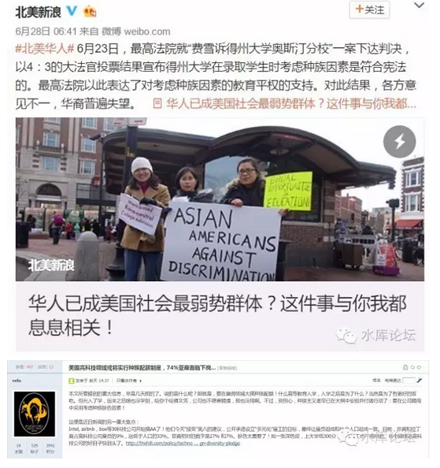
中国人一看，"亚裔下岗"。哇靠，这个可不能学。

 

 

七)王朝周期论

 

插播一句题外话。

"欧洲美国的衰弱"，穆斯林的入侵，美国不再是人类文明的灯塔。不再是最强大的国家，也不再是最有希望的国家。

 

这导致了"美式文明""美式政体""美式生活方式"，不再是吸引潮流的模仿方向。服装帽饰都会有改变。

而另一方面，还导致了对过去"定论"的讨伐清算。

 

 

布尔费墨曾提出了一个观点；

-   君主制好于独栽制

-   独栽制好于民主制

 

这个观点，是基于民主制实在太渣太烂的基础上。

但是，你再往前想一想。脑洞大开，"鸦片战争"要不要改写。

 

 

当"美国是全世界最强大的国家"，一切向美国学习时，我们对鸦片战争几乎有着压倒性的**盖棺定论**。

"政治制度的腐朽，使得清政府不适应工业社会。无法革新，最后连日本都打不过"。

 

所以要推翻帝制，推翻腐朽的清政府。走向共和。

人民并不信奉民主，人们信奉的是力量。

 

 

可是，今天布老师提出来说，"民主制不如君主制"。

脑洞大开，你整个理论是不是要重写。

 

我想，可能可以从"王朝周期论"来解释。

当1840年大清遇见了大英，大清已经有了220年寿命，正进入了一个证权的暮年。

而大英帝国，从1750年开始算，是第90年，旭日初升。

 

 

英国战胜清国，并不一定代表是政体的胜利。而有可能是"青年王朝"战胜了"暮年王朝"。

相比之下，隔壁的日本就表现很好。

 

"德川三百年"，德川庆喜交出了权力。

"大政奉还"这一年其实是德川政府的最后一年。也是"明治"元年。

 

 

而"明治维新"的表现，绝对是一流的。

日本一直到1915年之前，都没有任何意义上的民主。甚至连"代议制"都不存在。

所谓的国会，在法律上没有任何政治地位。最后依靠着"顾问"名义，才向天皇元老邀取一点面子。[\[2\]]

 

但是，这段时间，日本的发展绝对不慢的。不仅从一个农业国，一跃成为工业化国家。而且1894年击败中国，吞并朝鲜。1905和1908二次击败俄国。

到了1922年《限制五国海军吨位》，日本已经是不折不扣的列强。

 

 

英国人从1750年开始彗星般的崛起。引人注目。英国的崛起方式，也成了各国的学习模仿。

但是，同等速度规模的崛起，历史上并不是唯一次。

 

7世纪默罕默德统一阿拉伯半岛，伊斯兰文明崛起，一样的侵风略火。短短一百年，已经占领了3/4圈地中海。

11世纪成吉思汗的蒙古骑兵，更是横扫欧亚大陆。

大家是去学伊斯兰，还是学蒙古呢。

（中国唐代也不赖，征服大概可以排全球No.4）

 

 

1750年到现在不过250年。250年实在太短，甚至还不到一次王朝更迭的时间。

仅仅以250年表现，论证政体，难以令人信服。

或许我们也可以说，"大清输给大英"，不一定是君主制的失败。而仅仅是"暮年王朝"输给"朝气王朝"呢。

如果中国恰好是王朝早期。或许学习能力和建厂能力，和明治维修一样牛呢。

 

仅仅是一种猜想，猜想。是"怀疑主义"的无可救药，脑洞大开。

各位有板砖轻拍，勿拍。

 

 

顺手插播一个段子；

http://blog.sina.com.cn/s/blog\_4380b6170102vw5k.html

 

 

再插播一个野史:

 

近代日本史最令人困惑的，莫过于"大政奉还"。

江山是长洲·萨摩藩浴血苦战，拼死打下来的。

而战后的结果，却将政权上交"不视事"千年的天皇。这很不合理。

且日本的历史上，长州藩从未表现得如此"忠心"过。

 

而且这个权力是真的，不是纸糊的。

明治天皇杀伐果断，是真的拥有对属下的切腹权。绝对不是傀儡。

 

 

在网上看到一段信息。纯属野史，纯属野史啊。谢绝跨省。

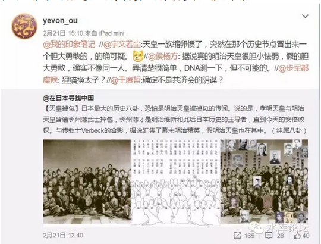

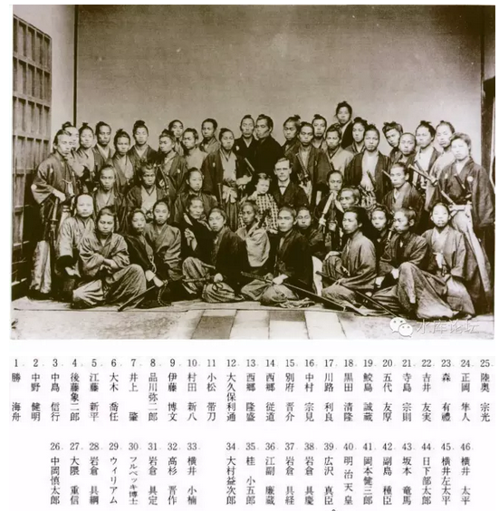

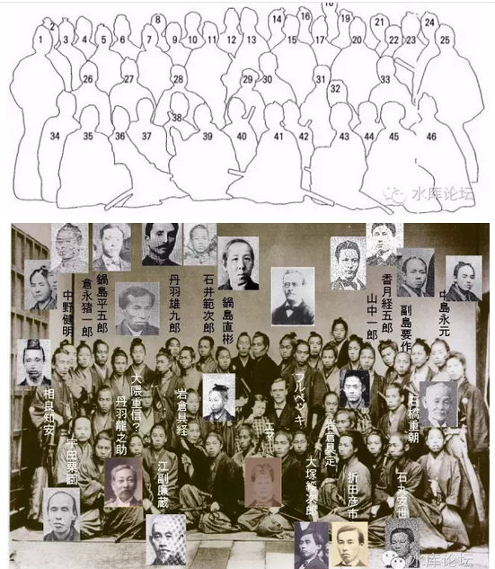

http://weibo.com/1853047530/DiRZ740wW?type=comment

 

 

 

八)Civilization

 

段子插播得太多了。我们回归正题：

1）中国是一个文明，而不是一个国家。

2）我们正在学西方

3）"大脑病了"，西方不再值得学习

4）原始富饶

 

现在到了第四步。美国病了，灯塔灭了。

接下来的路该怎么走。

在这个时候，你是Civilization，还是Nation。其差别就很大了。

 

 

打个比方，Civilization好比"原始森林"。原始富饶。

Nation好比"速生林"。

 

 

"原始森林"是一个高度复杂的生物系统。有数以万计的各种物种。有捕食，是细菌，有传染，有腐蚀。

有生有灭，有光有暗。

有带路党，有皇汉，有毛党，有工业党，有马列大姐，有满清遗老，有果粉，有黄皮白心，有五毛，有自甘五，有自拍，有绿茶婊，有圣母，有卖保健品的，还有房产中介............

 

而"速生林"，是一个非常简单的生态系统。

他几乎就是每隔80cm值一棵树。所有树的物种和生物学特性都是相同的。

你站在路口，都能数出他有多少棵树。

 

虽然从木材储量，林业面积，二氧化碳吞吐等各项指标上，同一块地块"原始森林"和"速生林"都是一样的。

但是二者却绝不是相同的物种。简直天差地远，天差地远。

 

 

中国，就是那个"原始森林"。原始富饶。

我们的文明，经历了太多的起落。经历了无数的王朝兴起，王朝灭亡。经历了王朝之间的战乱。和好几次洪水，人口大灭绝。

"二脚羊"的历史，在我们的记忆中，从未忘却。

 

所以中国体内的"疫苗"特别复杂。什么样的人都有。从带路党到自干五到蒸汽朋克到无政府主义，什么样的人都有。

我们有过"亡国"的记忆。知道苦难和血泪是什么日子。我们是复杂的Civilization。

 

 

而美国呢，美国真实的面目是Nation。

二战中晚期，英国特别地看不起美国。英国绅士们，从骨子底里蔑视美国人。

 

因为英国绅士觉得英国人是"睿智"的。英国玩的"外交平衡"那一套，堪称人类文明史上之前之后出现的最精巧，最极致的智慧。

所谓绅士，所谓外交智慧，只属于英国上院。

 

 

而美国人呢，在Gentlemen的眼中。美国人的形象就是"美国大兵"。

（这张图不够胖）

 

 

粗鲁的红脖子。大大咧咧，傻乎乎的。丫是个白痴。

 

可是你英国绅士再老练，你架不住美国人钱多呀。

二战美国大兵手一挥，"来500辆坦克"。

于是英国人就没话说了。回家咯血了。

 

 

美国庞大，却不复杂。

打个比方，美国就相当于把芬兰这个放大100倍。

美国的Size虽然大，但却不象中国这样横向纵向充满了复杂性。

美国单纯如Nation.

巨大型单细胞生物。

 

我曾有一篇文章，强烈地批评美剧。《韩剧高贵，美剧低贱》~\#F92~

在我们看来，美国人有三个字可以形容。

涂样，涂森破，拿衣服。

 

 

在我们看来，整个美国人就象是《老友记》一样。美国人的形象，就是没心没肺地玩着，没心没肺地玩着。

你怎么就不供楼呢，房价明年要涨啊！！

 

 

美国就是"巨婴症"。整个亚美利亚是神眷之地，二翼被大洋包围，没有天敌。

除了1861年的几年内战。美国历史上从未被外族入侵。

从来没有战火燃烧。

战争，苦难，死亡，屠杀，血腥，残忍，这些美国人从未曾经历过。

 

德川家康的忍耐，专诸的牺牲，织田信长的疯狂，田横的自刎，壮士潇潇易水寒。这些"东方智慧"对美国人宛如天书一样。他们既不知道，更无法理解。

你还说你不是巨婴是什么。

 

 

美国整天吹嘘美利坚的熔炉和"多元化"，声称美国可以包容各种各样的细菌。

我呸，你那不叫"多元化"，你那叫[过家家]。

无非是多几种配方的"奶粉"。

 

真正的多元化是什么。是发生战乱，杀死这片土地上90%的人群。

然后还有10%的人活下来。虾有虾路，蟹有蟹路。你去问他们活下来的方法，这才叫多元化。

 

中国这块文明，已经浴血重生了太多次，死去活来了太多次。

中国才是多元化的森林。

美国只是拿衣服。

 

 

因为太长久的和平，太长久的健康，使得美国的体内没有"抗体"。

好比一个长期生活在无菌环境中的人，一旦跑到中国这种充满"病毒"的地沟油电信诈骗，他一天也活不下去。

 

中华民族实在生了太多次的病。流了太多的血。所以我们体内有"抗体"。凶残，狡诈，冷酷，杀戮，皇汉，冷血，什么样的人都有。

而美国体内没有"抗体"。美国人太单纯，太善良，太拿衣服。

 

 

在《[美国的大脑生病了](http://mp.weixin.qq.com/s?__biz=MzAxNTMxMTc0MA==&mid=2651014783&idx=3&sn=cf5dc8f8d1377b482a3b7000ebc91897&scene=21#wechat_redirect)》文中，我们称白左为"僵尸病毒"。

同一种病毒，美国几乎直沉到底。丝毫没有反抗之力。

而中国的表现就要更好一些。天佑皇汉更幸运一些。

 

因为美国是一个Nation，而我们是一个Civilization。

老年国家虽然有种种弊端，但还是有一点[命运的反作用力的]。[\[3\]]

 

 

 

九)昭昭天命

 

-   China is a civilizationpretending to be a nation

-   US is a nation pretendingto be a mission.

 

这二句话，前半句是Lucian Pye说的。我们已经解释得很清楚了。

后半句是后人加上去的。2016年才有的。而我，是抄来的。

 

 

后半句说的是什么呢。是USA在西方人心中的复杂感情。

在昨天的微信留言中，有一个人说到了Manifest Destiny，诚斯言也。

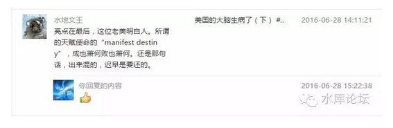
 

很多人不理解，对于美利坚，他最初的名字是叫做"New World"。

不是美利坚，不是灯塔国，而是New world。

 

 

你设想一下，现在我们生活在"社会主义的大家庭"。外面则是"三分之二水深火热的世界人民"。

你设想一下，假设没有中国。世界已经完全被默大妈和希大妈统一。形成了一个"地球联邦"。

 

在地球联邦治下，"政治正确"无所不在。希大妈的眼神无所不在。

政府管辖到你每一句"操你妈"，天天国税局来加税，你还要给穆斯林去擦屁股。

 

这样的日子，就真的一天也过不下去了。

今天，你还能躲在中文网络里骂SB。假设某一天政府变得如此之大，大得你无处可逃呢。

 

 

15世纪的清教徒，就面临这样的困境。

你如果看USA的建国史，看May Flower横渡大西洋时的情操。

当时的中世界欧洲，有很多事是做得"不对"的。

 

但是你又无能力改变这一切，你没有能力推翻宗教审判所和罗马教廷。

而当哥伦布发现美洲新大陆的消息传来，你可以想象，清教徒的喜悦之情。

"化外之地，王法不及"

这份感情，就象你可以开着飞船逃离默大妈逃亡火星。

就象杨威利带着一船流浪者，到银河的另一端开创自由的国度。（注:银河英雄传说）

 

 

所以纯正的清教徒，看美国的叫法是：New World。

这是一个新世界。区别于那个不自由，处处"政治正确"的Old World

所谓昭昭天命（Manifest Destiny），这是神赐予的土地。

 

哪怕今天他还是寒冷荒芜，终有一天，他会成为地上的天堂。

人间的灯塔，至善至美之地。

流淌着奶与蜜的土地。[\[4\]]

 

 

在非常长的时间，美国是"光荣孤立"。即美国和欧洲的作风，是完全不同的。

哪怕欧洲人指责美国"丛林资本主义"，可是自由的灯塔不曾熄灭。

当欧洲30年前就开始脑死亡，"高等收入陷阱"。而美国还保持着增长，保持着创新和活力。

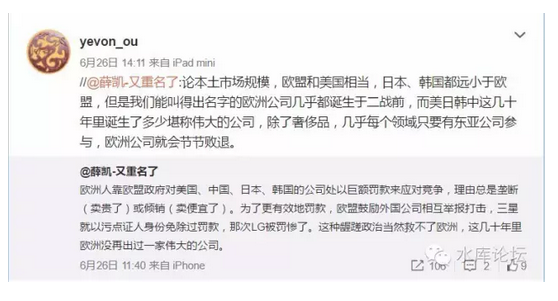
（英国脱欧的20大理由，八年增长1.9%）

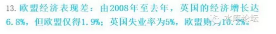
 

可是今天，人们失望了。

美国不再显得与众不同。美国正在变得越来越象欧洲"政治正确"

当New World不再拥有自由，他就变成了Old World，变成Old一部分。

 

 

US曾经是一个mission。

他pretend是一个mission，人们曾经以为他是上帝的喻意。带领人类通往地上的天堂。

 

可是现在人们失望了。美国不是一个Mission。

他仅仅是一个普通的nation.

 

 

你设想一下，如果"民主党"再执政下去。则黑绿黄的蝗虫趋势，将会彻底无法阻挡。

曾经如此繁荣富饶富强的美国，会因为"病毒感染"。而死于拿衣服。

 

 

白人终究会灭绝。美国会变成一个拉丁化的国家。

类似与今天的墨西哥，菲律宾，委内瑞拉。

哪怕你国土再大，资源再丰富。谁会在乎菲律宾有9500万人口？

 

 

上帝赐予的Manifest Destiny，是另一个种子。

 

 

 

（yevon\_ou\@163.com，2016年6月29日晚）

 

 

 

\[1\]严格地区分，"权利"和"权力"也该逐字解开。懒得析了。

[\[2\]]见《近代日本史》

[\[3\]]《命运带给人的反向作用力》http://www.shuiku.net/forum.php?mod=viewthread&tid=6625

[\[4\]]在基督教的经文之中，有一种译法，即认为美国是"隐形"的以色列。耶稣三月复活，赐予流淌着奶和蜜的土地。其实隐喻美国。
