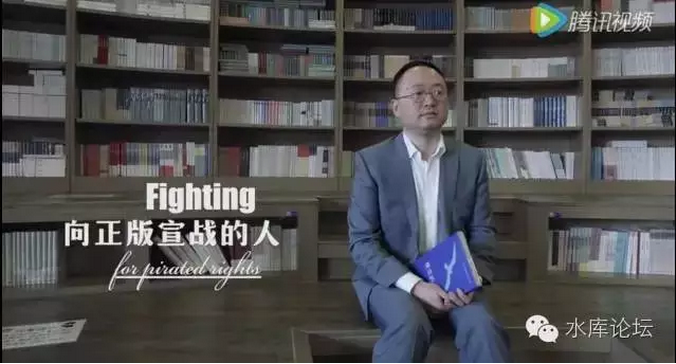

# 如是我观，知识产权 \#F520

yevon\_ou [水库论坛](/) 2016-07-02

如是我观，知识产权 ~\#F520~
===========================

-   盗版自由

-   知识收费

我同时支持这二点

 

 

一）知识产权

 

布尔费墨老师开始做视频节目了。

第一课开篇"反对知识产权"，选题颇为令人意外。

 

 

在铅笔社的所有学术中，铅笔社对"知识产权"的看法，是我唯一心存疑虑的。

不是说"反知识产权"不对。

而是说，铅笔社的其他诸多观点，例如反对政府养老金体系，反对政府管制，反对关税限制，反对操纵汇率，反对卫生标准............诸如此类，问题是不大的。

 

以上所有观点，逻辑上都已经通顺。绝对信服，如果我们写推介转手文章，是碾轧式的上帝视角。

但是，"知识产权"是一个例外。

 

 

铅笔社对于"知识产权"的态度。他们的原理是："财产具有排他性，可以无限复制的不是财产"。

对于这件事，我始终有一点疑虑，铅笔社并没有完全说服我。

 

凭什么"可以无限复制"的，就不是财产呢。

凭什么财产的定义是"复制"呢。

 

 

铅笔社说，"财产权"的意义是:"你多了一份，我就少了一份"。

可是我们知道，有许多软件，他们卖了10000000个拷贝。每一个单独拷贝，其在U盘上复制的成本是零。

可是帐不能这样算的。总体开发成本是要分摊的，你卖得越多，定价越低。卖少就亏。

你也不能说，"你没有干扰我"。

 

 

在铅笔社所有文献中，只有"知识产权"一环。我是没有被完全说服的。

所以本文讲的是，我对知识产权的一些领悟和心得。

用的不是上帝视角，纯属探讨和互相讨论。

毕竟这件事我也没完全想通。

 

 

二）外星人

 

在很久很久之前，就有一个问题，一直困扰着我。

 

"假如外星球月球轨道，有一艘外星飞船。他们接收到了地球信号，请问他们要不要付费"

 

 

譬如说，任何硬盘，都是电脉冲信号。如果你拷贝文件，电磁波就以光速C，向全宇宙扩散。

假设有一艘外星飞船，停在地球同步轨道。外星人的科技很先进，他们可以接收到微弱的硬盘颤动信号。

 

这样，外星人就把一整部Windows
8软件都抄到了。他们把他刻入DVD，高高兴兴地拿回去研究了。

顺带的，还拷贝了邓紫祺的二首歌，张学友的三张CD。以及一场S.E.S的演唱会。

请问，外星人要不要付费？

 

 

这个问题困扰了我很久，折磨得我废寝忘食。

从答案上来讲，首先我们是确信无疑的。答案一定是："**不付**"。

 

 

因为我们甚至根本都不知道外星人的存在。我们也不知道外星人是什么样的。

我们不知道外星人用哪一种科技，躲藏在虚空中的存在。

那我们又有什么权力，又有哪一条法律条文，可以约束外星人的Liability呢。

 

 

你再扩大想一想。好比一个阿米巴星球人，突然某一天，一群地球人哇呀呀地开着宇宙飞船冲过来了。

地球人架起了宇宙大炮。要求阿米巴星人交出10吨的蓝晶。否则就要开炮。

理由是，"偷听了Lady Gaga的歌曲"。

 

你说，阿米巴星球人，看见一群语言不通的四肢动物，跑过来想要抢你的蓝晶。他们会怎么反应。

这个毫无办法，只有等离子反质子炮侍候了。轰死你这个侵略者。

 

 

 

所以，你问"外星人"收取所谓的"版权费用"毫不可能。

我很担心，当我们第一次和外星文明接触时，会因为某一些圣母的神经病，而导致宇宙战争的发生。

 

"你好，地球人"。

"你好，阿米巴星球人"。

"很高兴初次见面"。

"请支付十亿亿亿美金"。

"为什么"。

"就在刚才的二分钟中，你已经被地球的无线电波扫描了无数次。你必须为10亿首歌支付版权费"。

"你等着，主炮充能"！

 

 

 

三）拷贝

 

在我的好友列表中，有一个是ipr专职律师。

布老师的首期"反对知识产权"专辑，简直就是砸了他的饭碗。他十分愤怒。

 

经律师提醒，我才知道，原来目前世界法律上，"接听"是不违法的。

我走在马路上，听到了十亿亿首歌，我也不违法。

而国际法定义"Copy"，才是违法侵犯产权行为。尤其是用于"商业目的"的拷贝。

 

 

好了，现在问题又来了。

假如阿米巴星球人，把Windows 8复制了一份。然后转手卖给猎户座外星人呢。

请问，阿米巴星球人"侵犯知识产权"了没有。

 

答案还是没有。因为我根本就不知道外星人的存在。

我根本就不知道虚空中有没有外星人的存在。不知道他们是躲在五维还是六维空间之中。

请问我怎么向他们收费。我有什么法律权属向他们收费。

Copy/Listen并无本质区别。

 

事实上，"知识产权"真正的bug，知识产权和自由主义是不兼容的。

 

 

你设想一下，"自由主义"的定义。

自由主义是说，人在不侵犯到他人的情况下，拥有最大化的自由。

 

也就是说，我关起门来，我在不侵犯他人的情况下。爱干什么干什么。

你高兴翻跟斗，练倒立，裸体性怪癖，全都是你的自由。

 

 

在这样的情况下，烧录光盘呢。当然不违法。

因为你首先"不可知"。不可知是比"侵害"更底层，更Strong的一个Reason。

[你首先要"可知"，然后才能说"侵犯"。]

[你如果不可知，别人又怎么会伤害到你的。]

外星人再怎么刻录光盘，外星人也没有伤害到你。

 

 

如果我"不可知"，我就没有"侵犯"到你。人在不侵犯到他人的情况下，拥有最大化的自由。

关起门来刻录光盘，就属于自由合法合理。

 

 

如果你把"家"的概念再外延一下呢。假设我住的房子很大，大到600平米，6000平米，60000平米。

如果六万平米的话，那就是一幢"万达写字楼"的体量了。

 

假设在一整幢写字楼里面，充斥着盗版贩子。你手下几千个员工，互相拷来拷去，全都是用的盗版软件。

请问，你侵犯到了Bill Gates的利益没有。

答案是没有。

 

因为"侵犯"的前提，是"可知"。

Bill
Gates都不知道你们这里有一整栋楼在做坏事，他又怎么会感到"被伤害"了呢。

 

所以一整个中国，关起了门来搞盗版，也是合乎正义的。

 

 

 

四）未实现的利润

 

或许还有人说，"盗版"侵犯了知识产权的收入。

云云如果一个人不能在家里盗刻光盘。没有盗版光盘的话，他就会去买正版。

盗版使得软件商损失了数百亿的利润。

 

朋友，最基础的一点，"没有兑现的利润不是利润"，没有兑现的利润不是财产。

 

 

你在火车站门口开了一个饭店，专卖沙县小吃。你看着人来人往的南北旅客，鸡汤辘辘，眼冒金星。就象是看到了一堆堆移动的"金币"。

可是"没有兑现的利润，不是利润"。

 

旁边又开了一家黄焖鸡米饭，客户就被分流了。

随着再开了一家永和豆浆，竞争被拉到了白热化。

眼睁睁的"座座金山"，到年底结算却没有赚到什么钱。

 

 

在这种情况下，你可以要求"索赔"，要求某些人某些机构，退还你"应得"的几百万么。

不是的。没有兑现的利润不是利润，没有收割的利润不是财产。

 

这不是财产权，也不需要保护。

任何一个注重"产权保护"的经济学理论，都不会保护"没赚到的钱"。

 

 

 

如果你心怀圣母地说："假设多几百万个付费用户，世界一定更美好，软件一定更便宜"。

对，我也想说，"如果地球多几个大油田，世界一定更美好"。问题是可能么。

 

 

既然飞机有空座位，电影院有空椅子，住房有空置，水果有腐烂。

那说明我们的生产力，不能尽善尽美。

 

你当然也想卖出尽量多的拷贝。

但是，航空公司也想减少空座率，也想卖出更多的票。大家都有困难。

你得自己解决这事。[改进收费模式]。

 

 

五）收费模式

 

我们的观点是：

 

1）盗版自由

2）知识收费

 

-   盗版是自由。既然你不知道我在干什么，我就没有伤害你。我就可以为所欲为。

-   收费也是你的自由。你想收多少钱，都可以。

二者的最大公约数，是"收费模式"。

 

 

我支持一切的收费模式。也支持一切的收费价格。哪怕你收天价，我也支持你。

我也支持你"卖出尽量多"的拷贝。支持正版交易越多越好，支持正版交易占主流。

前提是，不能侵犯"盗版"的自由。

 

在这个博弈的基础上，再设法设计最大化的收费方案。 

请问，你所说的"收费模式"。到底是怎么收费。

答案是：我不知道。

简直吓人一跳！你说你不知道。

对，我真不知道。

我把这个问题，留给"市场"。只要留给商人充分的自由，他们就一定可以发明出一种收费模式，完美地解决一切问题。

只要把这个问题留给微软，Microsoft就一定能想出一个比我脑子更聪明的办法。

 

 

-   我支持盗版者对买来的Windows安装盘DVD随意折腾；

-   也支持微软在Windows里面预植木马。使得它不能被拷贝。

-   还支持越狱和黑客之间的反复拉锯战。

-   大家斗法。

 只要有"利益"的驱使，人的发明创新能力是无穷的。

全心全意依赖市场。

 

 

比如说，网络游戏的盛行，单机游戏的衰弱。主要因为网络游戏容易收费。

游戏没死，只是进化。

 

当年单机游戏时代，游戏商奄奄一息。整个大陆游戏市场才几千万。

可是网络时代一来，"桌游""手游"行业顿时爆炸。腾讯刚用86亿美金收购了Supercell。

估值远超一家大型钢铁厂。

 

 

对于很多医药行业。研发一只新药，可能要耗资10亿美金。

可是如果你CopyCat，却只要微不足道的费用。

其实也不难解决。医药企业，完全可以兴建自己的"4S店"。

 

当你需要注射该种药品时，你只能去到"医药4S店"。

在专属医药代表的注视下，由厂家帮你注射。

我们完全相信，药厂有足够的保安和内控，使得这些4S店完全监控。

 

 

另外一方面，有需求就有供应。

我对目前医药界"逆向分析工程"假说嗤之以鼻。

"干扰剂"之所以不盛行，是因为市场没有需求。

 

一旦药企需要自己管理保密，则"干扰剂"的研究一定会突飞猛进，甚至有革命性的学术突破。

届时，药片中会掺入大量的误导成分，对人体无害，但是数量之多，使得逆向解析工程彻底不可行。

 

 

 

再譬如说，哥哥写了这么多的水库文章。最后落款"楼主不缺钱"，打赏随意。

有人说，你傻呀。

要赚钱的话，很容易，你写一半。写一个精彩的赚钱手法，或者某银行漏洞。

到了最关键步骤，突然............□□□□□此处省略三百字。

 

想知道答案，上分答去问吧。

哥哥忍住笑拍拍他肩膀。

朋友，你真是对哥哥有多少钱没概念..................

 

 

六）无法收费

 

最后，还剩下一个手尾。

即"知识产权"中，那些[无法收取费用]的部分。

 

 

最简单的例子，如文字，照片，音乐。

这些东西，创造不易。例如写10000字小说，差不多要一天时间，精疲力竭。

可是复制文字， 20K只要一秒钟。

 

更糟糕的是，几乎没有任何办法将文字加密。

哪怕你技术再先进。你也挡不住"暴力破解"。架一个照相机在电脑屏幕前。

 

同样道理，照片，音乐，也是非常非常难以版权保护的。

 

 

 

我的意思是，保护不了的，就不保护了。

什么，你再说一遍。简直惊世骇俗。保护不了的，就不保护了。

 

"天行有常，不以尧存,不以桀亡"。

一样东西，首先你想"收费模式"。我们充分相信市场的"万能"。一定总是能有创新方法的。

 

而如果实在实在实在没有呢。

那就是它不适合生存在这个星球上。不适应生产力的发展。

 

 

古代有专门替人送信的"信客"，有专门帮人割麦子的"麦客"。公用电话亭以前还有个阿姨到宿舍楼下狮子吼。

后来，这些职业都消失了。

 

"职业摄影师"如果照片卖不出价钱，这个行业就应该消亡。而不该强行挽留。更不该政府立法或者补贴。 

如果一个行业无论无论如何也赚不到钱；

那就让它去死好了。

 

 

（yevon\_ou\@163.com，2016年7月1日晚）

 

 

\* 近期情绪断崖式低落，本篇写完，停更一段时间。
