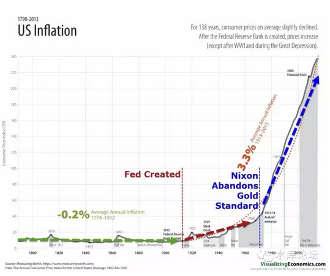

# 你认为天经地义的事；

 

太阳不会照常升起。

 

 

一）1970s

 

很久没有写中美贸易[\[1\]]方面的话题了。突然想起来，是因为看见布老师贴了一张图。

这张图痛斥了"美联储导致通货膨胀"，金本位废弃之后，更严重的通胀。

而我想说的是，其实，这还不是最坏的情况。

更严重的是，未来会更更糟糕。

为什么，听我们慢慢道来。

 

 

首先，我们要说1970s，美国的70年代。

这尘封的历史，许多人已经失去记忆。中国的年轻人甚至根本不知道70年代发生了什么。

 

USA在1970年代过得一点也不好。

70年代的前半段，是越战。随着嬉皮士的兴起，美国在越南战争撤退，国际意志遭受重大挫折。共铲主义踏上新高峰。

 

1971年布雷顿森林体系崩溃。美元丧失货币霸主。

1973年"石油危机"。汽油价格在一夜之间涨了3倍，州际公路几公里长龙。

 

 

1970年代西方世界是什么呢。按教科书的说法是"滞胀"。

因为经济实在太差，太差。政府一方面拼命地印钞票，另一方面经济无论如何也刺激不上去。

听起来是不是很耳熟？

 

 

更惨的，教科书没讲的，是华尔街"金融市场"熊一代。

美国的股市，1970s被誉为"黑暗年代"。十年内几乎没有涨幅。

若按"20类投资品排名"，No.1是Cow，No.2是Horse，No.20是股票。

 

比股市更惨的，是美国债市。

国债的收益率，跌到了11%。

连美国财政部都融不到钱。你想一想，还有什么企业可以生存。

 

 

二）1980s

 

1980年，一切都发生了改变。

 

股票从这个时间关头，踏上了前所未有的大牛市。众所周知，从3000点一路涨到10000点。甚至发生了科网股泡沫。

更加改变华尔街命运的，是"债市牛市"。美国国债利率，从1980年的11%，一口气狂泻到3%。任何一个稍微有Fix
Income常识的人，都会知道，这是多么惊天动地的一件事。

所有人都赚到盆满钵满。

 

 

相对于金融市场的大牛市。更重要的，是美国人精神面貌的振奋。

美国踏入了前所未有的"黄金时代"。

在整个1980年代，美国人的收入持续上涨，而物价保持稳定。

金融市场几十万，几百万地赚，而物价保持稳定。

 

 

"美苏争霸"这个重磅历史事件，终于在1980年代末分出了胜负。

就好像电影《猎杀红色十月》中拍摄的，苏联舰长弃舰叛逃美国。

为什么，因为美国意味着"美国梦"。

 

美国是如此地繁荣，富裕，欣欣向荣。

每个人都有机会赚钱，每个人都有机会成功。你只要轻微的努力，就能过上高质量的生活。

 

 

"美苏争霸"冷战的最终胜利，是美国人依靠繁荣富裕战胜了苏联。而不是靠导弹。

如果美国象今天这样衰样，估计就没有《猎杀红色十月》的号召力了。

 

 

那么，是什么导致了美国1970和1980分水岭式的区别。

飞机拉起般的起飞曲线。

 

 

 

三）滞胀时代

 

在过去十年，上海房价涨了10倍。

原本八千的房子，涨到了80000.

 

 

可是对于上海人民来说，这未必是一件好事。

因为随着房价的上涨，大排面爆鱼面也涨了。

对于房价上涨的原理，目前已经基本研究清楚了。那就是"纸币滥发"。

而纸币滥发，会优先涌入房地产市场。因为人们需要逃命，需要先抢筹码。

随着不动产的抢夺完毕，超发的货币最终会流入实体经济。并带来了物价同步上涨。

 

从长远看，如果滥发纸币10十倍，则房价涨十倍，物价也要涨十倍。

单纯的滥发纸币，你不会创造任何实体财富。

用俗话说叫做"白斩"。

 

上海人每到年尾都很兴奋，因为到了盘算家产的时刻。

每年算算房子又涨了大几百万，储蓄增加若干，理财回报若干。

"总资产"的数字每年都在上涨。兴奋得人脸红黝黑发光。

但其实都是白斩。

 

 

好了，现在有一个神，跟着我念咒语："嗡嘛呢呗咪吽"。

今天晚上，你的房价涨了200W。

可是你的物价，它没变！

 

等你一觉醒来，门口的大排面还是5元/碗。

猪肉还是3元/斤。

买六个凳子，一张桌子，100元您全拿走吧。

春节最新时装，不是3999。皮绒大衣，是399，299，199啊。

199买件皮草，您买不了吃亏，您买不了上当。全都是海狸皮真货啊。

 

您再探头一张望，马路上齐齐排着二列安徽阿姨。

请一个全职阿姨多少钱。5000元，您开玩笑呢。

只要800，只要800，八百元阿姨们抢破头来干。隔壁还有五六百的。湖南四川阿姨更便宜。

 

 

你想一想，上海人只要负责买房子，房子每年涨200W。

而你的物价不涨，不涨甚至下跌，800元雇个阿姨，5000元/月的生活费，全家过得象帝王一样。吃顿满汉全席79元，良子按脚三小时19元。

 

这样的日子，做梦也要笑出来:-D

 

 

可是，接着有人问，"她们为什么不涨价呢"。

众所周知，房价升值，房子本身并不会变新。只会折旧。

房价升值的本质，是货币在贬值。

政府正以每年+14%的速度在提供纸币。

 

 

可是货币贬值，钟点工阿姨们就该升值，该呼吁涨工资。劳动力永远是对等的，一个白领换三个蓝领。

你不可能一个白领换30个蓝领的。

为什么煎饼果子加双蛋，就死活非得卖你0.5元/套。这不符合逻辑呀，你一定是在梦里。

 

 

答案，就是这么不和逻辑。

就是这么在梦里。

这个梦，叫做US Dream。

 

1980年代发生的最不可思议一件事，无论美国人增发多少美金，我们坚持按8.27兑换给他。

 

 

 

四）鎏金时代

 

美国人一直在滥发纸币。从布尔费墨卷首那张图表可以看出，Fed美联储的历史，就是一部滥发纸币的历史。

 

当一个国家关起国门，滥发纸币，并不会造成额外财富。

因为纸就是纸。纸币多了，就是金圆券。通货膨胀数字游戏。

 

 

可是美国不同。美国在1980年代滥发纸币。这时候，跑出来一个人，非得哭着喊着，按照\$0.5一副煎饼果子加双蛋，把他的Dollar收过去。

-   美国人看不懂了。增发10%，应该是0.55了。该国还是0.5卖煎饼果子双蛋。

-   美国人再增发+10%，应该0.60了。该国还是\$0.5煎饼果子双蛋。

-   美国增发到+100%，应该1元了。该国还是\$0.5卖煎饼果子双蛋。

 

 

打个比方，就好像上海的房子卖300W，到500W，到800W。

可是门口有一个[巴基斯坦的面摊]，人家就是死心眼。就是死活卖5元/碗大排面。永远也不肯涨价。

 

这会导致什么情况。你的800W财富变成了"真"财富。真的可以换一百六十万碗大排面。

 

 

这个就是1980年代美国发生的真实情况。

从某一天，某一刻开始，美国政府惊讶地发现，无论他们怎样增发纸币，物价也不会上涨。

 

1979年末本来奥派已经取得胜利，数十年对于M1，M2的批评终于伸张正义。

可是一夜之间，Fed美联储发现增发再多的纸币，物价并不上涨。

于是奥派立即被清除出政府圈，凯恩斯再占主流。

 

 

"滥发纸币而不导致通胀"。这是一条神奇的魔咒。

在此魔咒下，立即引爆了美国金融市场的大繁荣。

 

你设想一下，你是一家地产公司。

你开发的楼盘，从300W，500W，800W，每一年都在涨价。

而你的成本永远不变，无论是土地还是土建。

那你的财务报表有多么好看。投资人岂不是要疯狂。

 

你设想一下，你是一家运动衣公司。

你的终端零售价格，每年都可以随着M2而上涨。但是你的亚洲采购价格永远不变。

那你的财务报表有多好看。投资人岂不是要疯狂。

 

你设想一下，你是一个私人健身教练。

你在健身房教贵妇瑜伽和肌肉拉伸。随着M2的增长，贵妇们的支付能力从每小时\$200，\$300，\$350。

而你拿完了工资，跑到超级市场。超市里的物价永远不变。永远是\$1.5买一件中国T恤。

那你的简单劳动，岂不是可以过上帝王般的生活。

 

 

1980年代的美国，是一个黄金时代。股市从3000点涨到了10000点。

利率从11%降到3%，触发了债市有史以来最大牛市。

而普通人只需要付出很小的努力。就可以获得很好的生活。[生活水平的提高，远远快于生产力的提高]。

健身教练的生产力提高了么，没有。

 

1980年代看美国，他就是一个"鎏金时代"。

股市债市金融市场是如此之发财，以致于普通人随随便便"投资"都可以赚很多钱。

而同时生活物价又在降低。你赚到的钱，是"真钱"。是真能带动生活质量提高。

这种大礼包，也就京沪十年楼市遇一次。人间少有。

 

 

而苏联最终被"美国式生活方式"击败。美国看起来是如此美好，如此幸福，如此富饶。

"美苏争霸"与其说是美国击败了苏联，其实是[中美联手]击败了苏联。

 

 

 

五）汇率诡计

 

整件事最重要的骗局，其实在于"汇率"。

 

 

"全球化"是可以降低成本，扩大分工，提高生产力。

但是，没有那么高。

1980年代美国的异乎寻常繁荣，是建立在额外的"汇率补贴"之上的。

 

 

众所周知，在一个非常长的时间段，人民币汇率是被严重低估的。

当时中国货的印象，就是"便宜"。不是一般般的便宜，而是异乎寻常的便宜。

常常仅有欧美货的一个零头，甚至十倍的价差。哪怕扣除了质量因素之后。

 

我们有一个PPP购买力图表，来自于2006年的联合国文献。我早期写在《我为什么说去Malaysia买房》一文中。

 

 

-   美国：     1

-   德国：     1.1

-   法国：     0.99

-   英国：     0.90

-   意大利：1.05

-   加拿大：1.01

-   丹麦：     0.90

-   日本：     0.79

-   沙特：     1.5

-   香港：     1.0

-   韩国：     0.95

-   巴西：     1.3

-   中国：     5.6

-   印度：     6

-   印尼：     6.4

 

你在襄樊吃一碗杂酱面5元RMB，你在美国街头买一个热狗\$2.99

从热量卡路里来说，二者是等价的。

唯一的区别或许是，中国杂酱面远远比热狗好吃二百倍。

 

而如果你算8.27汇率，则美国热狗要二十五元人民币。

这就是PPP差异。

美国的物价，远远高于中国。

 

 

中国政府，锚定了一个8.27的汇率。可是\$1真正能购买的东西，远没有这么多。

我估计在美国国内，\$1大致也就当￥2来用。

也就是汇率被低估六倍。

 

所谓的"全球化"，应该是所有要素充分流动下的完全市场化。

中国奉行的，是有管制的"全球化"。这样他仍然能分享到贸易的好处，可是资源[定价]是偏离的。

 

 

 

当1980年初中美开始建交。中国的领导人是太宗，美国的领导人是里根。

具体的文献文书，现在已不可考。我也没能力见到TG内部资料。

 

但是从事后实际发生的事情看，他达到了以下几点；

-   中国脱离华约经济圈，纳入英美经济圈

-   中国以一个低估6倍的汇率提供商品

-   作为回报，美国在中国设厂，向中国输入技术和资金

-   中国拿到了外交入场券和善意安全

 

 

对于美国，他拿到了如下好处；

-   在非常长的时间内，美国拿到了极廉价商品供应。降低了美国物价，提高美国人民富裕。引发金融市场大牛市。

-   富裕的美国面貌，最终打赢了冷战

-   里根连任

 

 

对于中国来说，他拿到了如下好处：

1）引进了美国的技术和资金

2）外交上的安全

3）国力开始腾飞

 

 

对于中国来说，他主要有以下坏处；

1）无数纺织女工14小时日夜，劳动成果被白白奉送

2）换回的美元其实是废纸

但是呢，屌丝不是人。反正在中国本来人就不值钱。所以这也是TG国家完全可以承受的损失。

让劳动人民加加班，换回国际利益。万岁耶!

 

 

可见，这是一场高度复杂，高度政治智慧的协议。双方都拿到了各自想要的东西。

中国拿到了改革开放。哪怕1/6的外汇收入，但是中国人勤劳呀。

 

美国人拿到了"富裕"。美国人过上了十年\~二十年鎏金镀金一般的日子。

资产价格涨涨涨，煎饼果子价格永不涨。

请别忘记，总统的任期只有八年。

 

 

 

六）生于忧患，死于安逸

 

说了这么多，美国的坏处是什么。

严格地说，美国没有坏处。"汇率低估6倍"，等于中国人白送钱，孝敬太爷：换取国际外交的和平与入场券。

 

美国唯一的坏处，或许是："生于忧患，死于安逸"。

 

 

因为一个很现实的问题：中国货如此便宜，是因为中国政府在补贴汇率。

可是，有一天不补贴了怎么办。

 

 

中国汇率从哪一天开始不补贴了？答案是2002年。

也就是朱相退休，秀相上台。

 

朱相交棒时，是中国"活力"最强的时代。是最市场化的时代。也是"人民币升值"呼声最强烈的时代。

可是秀相上台后呢，他大印纸币。

 

 

从2002\~2012年，你仔细观察中国货币史，有一个非常奇妙的现象。就是中国每年增发约23%的货币，9%增长，虚高14%

美国每年印5.5%，增长约1.5%，虚高4%

二者相差10%

 

秀相你大印特印纸币，四万亿都来了好几次了。可是"对外升值，对内贬值"，这二件事居然可以同时发生。

《人民币面临巨大的贬值压力》[\[2\]]（又名:大排面30元），这篇文章是我写的。大家还记得么。

 

 

"对外升值，对内贬值"，这二件事居然可以同时发生。升贬矛盾这是无论如何解释不了的。

答案是什么呢，答案就是朱相留下来的"6倍价差"。

在这6倍之内，你是既可以滥印许多RMB，RMB/USD同时也在升值的。

 

农业税，汇率，WTO，朱相实在留下了太多的好牌给秀相。

秀相留下的，只有坑。

 

 

 

各位，请记住，"对外升值，对内贬值"，这事并不会持续永恒一辈子的。

他的极限，就是6倍遗德。

 

近年时至2016之后，RMB/USD进入了一轮贬值通道。舆论也对人民币不利。

为什么呢。因为"6倍购买力差距"已经接近消失。

 

今时今日以2016.07为例，RMB的购买力依然比USD强。但强得有限。我估计还有1.5\~1.8倍的购买力优势。

但是，因为名誉口碑。这点倍数已经会导致外界对人民币的攻击，以及人民币贬值行为了。

 

 

言归正传，我们再看看，美国的2002\~2012年代。

美国的这十年，就典型的属于"抽去鸦片瘾"的过程。

 

80年代中国向美国提供大量的廉价货，基于中国政府对RMB汇率的巨大扭曲。以低估6倍的方式，换取西方世界的和平谅解，以及技术输入。

但是，这是不\~可\~持\~续的。

 

一方面，中国不需要长期给欧美做奴隶。不可能一个洋垃圾到北京来，就能像大款一样泡中国女人。

另一方面，中国也"没有能力"长期提供六倍汇率。随着双边贸易的进一步发展，进出口万亿级数量级。中国补贴不起，也亏不起。

 

 

因此，美国从1980年代开始吃了20年糖精片。里根的坟头也长草了。

终有一天，免费午餐是吃不下去的。

吃不下去怎么办，你还记得美国的70年代么？

 

 

-   举个例子，假设你是一家美国企业。原材料成本占售价的30%。

-   如果这些原料从中国进口，低估6倍，原材料成本就变成了5%。

-   这是什么，这是25%的毛利！

 

Margin净毛利增加25%是什么概念。任何一个企业财务手都要发抖了。

如果你把这一个过程拖长到25年，每年成本降低1%

则你这个CEO，会被华尔街尊为神。

美国股市1980年代冒出了一大批的"神级CEO"。

 

 

可是，如果你把这个过程逆一下。

在未来的25年内，你的成本每年上升1%。最终恢复到初级产品占30%成本的比例。

你想象一下，这个财务报表会有多难看！

 

所以，2002\~2012年的美国股市，是一场极大的熊市。

任何一家明星企业，都星光不再。越是老牌的公司，越是饱受泥潭。

相反一些新产业新公司还好。

 

 

更为严重的是，这个25%的"毛利润"，有时候并非落到资本家的手中去。

因为当全球化，中国制造降低成本时，欧美论坛最流行的是：

-   "资本家赚了大钱，而劳动人民还在辛苦贫穷"

-   "资本家越来越富，穷人越来越穷"

-   "全球化富了亿万富翁，却抢走了穷人的饭碗"

-   "要求增加再分配过程"。

 

 

所以，当英美的企业家，将生产基地搬到中国，降低成本时，他们往往并未赚到利润。

因为+25%的毛利率，全都被政府拿走了。

 

再多的钱，你也禁不住抢！

当商业扩张时，企业家并没有赚到利润。这些钱被以"均贫富"的口号，从国税局，劳动工会，福利主义拿走了。

还有女权主义，环保主义，猫狗怜爱党。既然你赚这么多钱，那多拿一点出来关怀地球，也是应该的吧............

 

 

好了，现在问题来了，当趋势逆转了呢？

当中国不再提供6倍低估汇率，当原材料成本由5%回升到30%呢。

答案是，并没有额外的25%可以还。全都被政府拿走了。

 

那怎么办，那就是大规模的破产潮！

 

 

欧美的社会，完全没做好"中国制造"涨价的准备。

国际入场券我们已经拿到，技术转让也进行了大半，2016年中国的国际形势，和1980年代完全不同。

假如有一天，中国不再提供廉价商品。而转而追求"均衡贸易"呢。

 

 

那么欧美整体的生活成本，要涨价很大一个台阶。

你再也不可能在商场里找到\$1.5的T恤了。请你买美国本国货。名牌，品牌哦，承惠\$150.

 

上一次我在Boston，民宿的房主指着茶几说\$2000。而且全波士顿都是这个价钱。因为家具行业比较"保守"，拒绝外国进口货的许可证。

哥哥痛苦地把头扭向一边去............美国梦，黄粱梦好么。

 

你出生于80年代，你以为生活应该永远如此甜蜜。

会二手扣腚就能享用豪宅，名车，保姆。

事实远非如此。

 

 

 

七）美国的下一步

 

以朱相卸任作为一个分水岭。此前是中国货越来越便宜，此后是中国货越来越贵。

 

 

"逆中国化"已经开始。成本每年都在上升。但是企业无力抗拒，因为钱已经被环保女权税赋合规给折腾光了。

在第一个10年2002\~2012，美国企业由暴利变为微利，由扩张变为削减成本。美股十年几乎毫无涨幅。

而下一个10年，美股会由微利变为亏损。破产潮不可避免。到时候你如何估值？

 

 

对于债市；

美国现行一代，被称之为Baby Boom，他们是人口洪峰最多的一代。

当Baby Boom七十岁，他们必须开始抛售资产。换回现金，用于生活开支。

 

谁会买？

美国白人已经没人了，黑人拉丁裔穷得要命。

十年期国债1.68%回报率，德国国债是-0.16%回报率，你玩我？上限下限完全不对称。

美国国债打三折还差不多。

 

 

如果你要Make American Great Again，你唯一的办法，是找到"另一个大国"。

-   这个大国，要比中国还大

-   必须愿以6倍的汇率折扣，向美国提供商品

-   愿意高位接盘美国1.68%利率的债券

-   拥有庞大的勤劳朴素的人口

-   拥有坚强意志的领导人

这些因素，可以说一个也找不到。

 

有人说或许是印度。可让我提醒你一下，今天再玩"出口导向型"。你要养活的就不仅是美国了。而是美国+中国。

如果哪个国家愿意廉价提供商品，十亿人民不介意买空几次货仓的。正好降低国内物价。

 

 

所以，这个时代结束了。

"美国梦"结束了，再也不会回来。

健身教练劣等智商，普通美国人也能过上帝王般的生活，这个时代结束了。

 

拿衣服的美国人民啊；

你别以为今天的日子差，未来会更差。

你别以为今天的Fed通胀高，未来会更高。

 

让我们回到正常态，想想1970年的美国吧。

Ready，Fight！

 

 

 

（yevon\_ou\@163.com，2016年7月14日午）

 

 

 

[\[1\]]参阅我有一篇旧文《全世界最大的剥削》[http://bbs.tianya.cn/post-develop-237776-1.shtml] 

[\[2\]]《人民币面临巨大的贬值压力》http://bbs.tianya.cn/post-develop-38712-1.shtml
