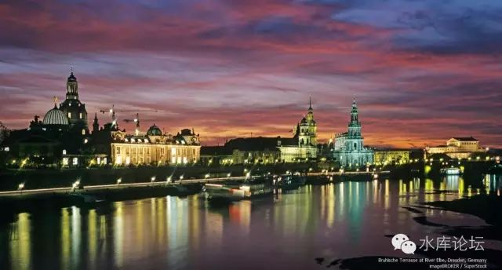
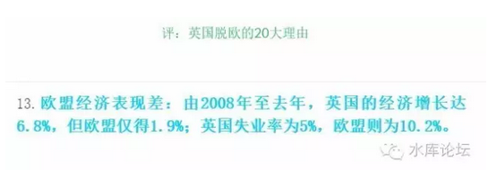
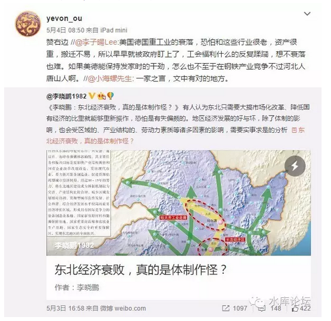

# 为什么是金融和IT \#F620

原创： yevon\_ou [水库论坛](/) 2016-08-28

为什么是金融和IT ~\#F620~

 

我们可能都低估了"政治正确"对经济的伤害。

 

 

 

一）停滞的时代

 

前二天在知乎上看了一个帖子，《为什么20世纪下半叶没有重大发明》[\[1\]]

其中的神回答是："因为脱纲了"。

 

 

莞尔一笑。不过总的来说，20世纪下半叶"发明"比较少，是不争的事实。

人类最主要的重大科技突破，例如化肥，铁路，电灯，电报，飞行，计算机等等。基本上都是在1950年二战之前。就已经有了雏形。

 

此后，无非是把事情做得更好，把效率做得更高。

好比铁路刚发明时，时速只有15KM。燃煤的拉力也很弱。

但这些并不重要。只要你"原型"有了，大家自然就懂得了努力的方向。一代代改善下去，从绿皮车，快车，动车，高铁。时速从40，60，120，300，一级级总能慢慢升级。

 

 

严格的说，20世纪能被称之为"发明"。而不是原有工艺上改进的。和日常生活关系重大的。可能只有；

-   电视

-   互联网

 

如果一个老爷爷，他生活在了1940年。在"沉睡舱"里面活了六十年。

则等他2000年醒来的时候，他不会觉得"太大"的不适应感。

 

不会有科幻小说一样《云图》，汽车都在天上飞。把地心打通了当隧道。

人类没事就去月球太空站，在火星度假。

更不用说逆转时空，光粒弹二向箔。宛如神迹。

 

 

所以，我们虽然不可否认20世纪下半叶在"质量"上取得的大量进步。

也必须要承认，在"格局"上，其实没有大的变化。

无非是精益求精而已。原创不足。

 

那么，为什么！

 

 

二）政治正确

 

我想，我们可能都低估了"政治正确"对经济的伤害。

 

 

什么叫"政治正确"。它包含一系列的含义；

-   环境保护

-   动物保护

-   劳动法案

-   少数族裔保护

-   社会责任

-   历史文化保护

-   ............

 

好比说，我在伦敦的街头，想新开一家裁缝店。

前店后厂，背后就是我的毛革作坊。无数的皮毛硝制堆放在后院。

 

 

如果我在伦敦做这件事。我就有麻烦了。

伦敦虽然不以税吏和城管闻名。但是他有"动物保护组织"。

 

我刚一开张，动物保护组织就上门了。

"你这个，用的是什么皮"。

"兔子皮"。

"兔兔那么可爱，你怎么可以忍心吃兔兔"。

"@\#￥%......&\*\*）"

 

"海狸皮"

"海狸那么可爱，怎么可以吃海狸"。

 

"狼皮"

"狼都快灭绝了，怎么可以用狼皮"。

 

"驴皮"

"东阿阿胶是世界上最残忍的东西，只有野蛮的中国人在制造它"。

 

"爷，我告诉您啊，我这用的是假货。其实我用的是人造革"。

"动物保护"主义份子心满意足的走掉了。

 

 

店主人抹试了一下满头大汗，一抬头，"环保主义"者又来了。

"你这个，后院堆的是什么"。

"硝石啊，制皮需要硝鞣制。否则皮会腐烂"。

"硝不行。多危险啊，再说有杂质气味"。

"我工商登记过的，保证合法没问题"。

"我说不行，就是不行"。

 

"咦，你谁呀，你是官府的不成"。

环保分子二言不发。转眼之间，明天早上，你的店铺门口就有五十个人抗议。拉着条幅反对你"环境污染"做法。

 

他们会阻扰你的顾客进门，会殴打你的顾客。会让你一整天一笔生意也做不成。

你试图报警，警察永远也不会出警。

于是你要么乖乖地遵守"环保"。要么关门大吉。

 

 

 

我们可能都低估了"政治正确"对经济的伤害。

在许多人的印象中，资本主义既然已经如此富有。为什么不"拿出一小块"，让世界更美好呢。

你已经赚了这么多的钱，为什么不拿出"一小块"来拯救猫猫狗狗，植物地球，金鱼企鹅。让圣母心得到安慰呢。

\
 

我们可能都低估了"政治正确"对经济的危害。

在很多人的心目中，他们大致以为**管制**是一种"减速"的行为。

经济本来增长+5%每一年，当我们"爱护环境""爱护小动物"之后，经济变成+4%每一年。

 

虽然减速了，但好歹还在增长。世界是美好且善良的。在赚钱的同时，分一点给别人。内心得到满足。

 

 

不是的。"政治正确"对经济的实质性影响，很可能是-50%

经济要跌到原有的50%，

倒退二十年

才可以站稳平衡。

 

 

 

三）崩盘与倒退

 

-50%，好夸张的数字！您不要耸人听闻。

 

没错，我并没有说错。

因为政治正确还有一个bug，"旧产业无罪论"。

 

 

 

好比我是一个裁缝。我家世世代代在KingSt伦敦街角给街坊缝衣服。

从亨利八世时代开始，生意做了几百年。

 

现在你要说我这个裁缝店"对环境有污染""对大众有危害"。这个是无论如何也说不过去的。

街坊们也不会同意。选票上也不可能通过的。

 

 

所以这是"政治正确"的一个bug，也就是当法案实施前"已存在""已运营"的企业。他没有办法责备。

哪怕我家世袭的是一个屠宰场。每天晚上要杀掉几百头牛，场面血腥不堪。但世世代代几百年办下来了。难道你还能说我"有害社区"。

 

 

但是呢，如果你"新开"一家屠宰场，那么问题就大了。

动物保护主义者会跳出来说，指责你不够爱心。

环境保护主义者会跳出来说，内脏和污血污染了周边环境。渗透进了地下水。

你赶紧关门走人大吉。

 

在"政治正确"的环境下，他有一个下限。下限就是0%

也就是"一切不变"。一切维持现状，一切按昨天做。欧洲陈旧不堪，三十年没有任何变化。

环保分子+猫狗份子+圣母婊无话可说。

 

 

但是他不支持任何新的企业设立。几乎没有任何一家新公司，能够满足苛刻的"环保"要求。

 

设想一下，假设巫师施展魔法。将某一个街道的所有"老裁缝店"全部都抹掉。

空白重建新的街区。

这个街区，要完全满足环保分子+圣母婊的"现代规格"企业道德。

则你的成本，可能要上去200%都不止。

总体生产力，只剩下原有GDP 50%

 

 

欧洲陈旧不堪，30年来没有任何变化。

欧洲陈旧不堪，再过30年，也不会有什么变化。

19世纪，美国的考古学家惊讶地发现，印第安人烧制的陶器和16世纪完全一模一样。300年来没有任何的变化。

美国人惊呼说，"这个民族完了，上帝也拯救不了印第安人"。

 

天道循环，今天轮到欧洲了。

 

 

 

四）停滞的欧洲

 

欧洲是什么。欧洲是"高等收入国家陷阱"。

 

在过去的五十年中，瑞典最富有的十三个豪门，还是这十三家豪门。

瑞士最富有的五十家公司，还是这五十家公司。

 

法国的经济接近停滞。几乎没有任何年轻人"创业"的故事。[\[2\]]

年轻人失业率40%

旧公司就熬到老员工老死。但是他们绝对不招人。

 

 

 

为什么，因为"政治正确"的危害，远远比我们想象中还要严重。

在政治正确的环境下，没有任何新公司可以设立。

 

欧洲的GDP增长率必须为零，只能为零，只可能为零。

不可能是正数，也不可能为负数。

 

因为你只要简单重复"昨天"的事。烤面包的师傅一辈子都在烤面包。

什么都没变，生产资源要素不流动。则环保主义分子无可指责。

他们不能批评百年老店。

 

但欧洲不可能有增长。增长来自于"新"生意。无论是新公司，还是旧公司跨入新领域。

欧洲不可能有任何增长。因为任何"新"的东西，都会受到指责。都会批评你不够环保，或者不够爱心动物。

 

 

 

美国的加利福尼亚州，50年之内没有兴建任何一座新的电厂。

老电厂因为是"百年老店"。所以无可指责。但是电网一年年老化。

 

而新电厂呢。

-   火电，污染。

-   水电，害鱼

-   核电，反核

-   风电，危害蒲公英

-   太阳能，征地拆迁

-   用爱发电，赞赞赞赞赞赞赞赞赞赞赞赞赞赞

 

有兴趣的人，可以去查一查"加州大断电"历史。

一个美国最富裕的州，人口最密集，经济最发达的州。却长期蒙受"断电"的苦恼。一半的公路路灯，晚上不开灯。

 

你这个国家完蛋了，罗马崩溃，就在眼前。

 

 

 

五）工业4.0

 

秀相十年，是左翼政府的十年。

旭日阳光的中国经济，被《劳动合同法》搞得奄奄一息。活力逐渐降低，"中国崩溃论"卷土重来。

 

 

有一种说法，叫做"工业4.0"。意思是随着物联网，机器人等"后工业时代"的高精尖技术发展，欧美国家将重新获得活力。工业会回归美国。

说这些话的人，根本不懂得"政治正确"的恐怖杀伤力。

也不明白美国劳动法案，平权法案，"奥巴马"式罚款的威力。

 

 

我想他们对于"美国制造"的成本测算，有着巨大的误解。

"美国制造"的成本，不是今天美国厂家的exf，不是你拿到的价格。

而是要X2，至少。

 

 

因为你在美国设厂，你就是"新企业"。

环保份子，动物保护主义，历史文化保护份子，都在那里虎视眈眈呢。

 

"百年老店"在那里，他们无可指责。加州原有的电厂，他们再嚣张，也不能把建成的电厂给拆了。

可是你"新建"一座电厂试试。

"新建"的成本，至少是百年老店的二倍。

 

 

欧洲法德，是"僵尸经济"。苛刻的劳动法和环保法规，不是使得经济增速5%降到4%，而是直接降到0%

而且是Max{-50%，0}，你要经历无数无数无数无数利好。才能超过零。

（此时随着人口的起伏，轻微有-0.3%\~0.3%变化。养活了无数财经新闻评论员）

你要看"工业4.0"，你首先要看欧美经济能不能起来。

你首先要看，欧美的年轻人能不能创业。

如果欧美社会一个"主流"的白人精英，父亲是议员，母亲是教会高层，连这样的白人，都不能克服"成本"去建电厂。

你一个外来人凑什么热闹嘛。

 

** **

**\
**

六）企业总部

 

我们知道，中国的企业，有一个特色。

"中心城市"，往往也是"产业城市"。

 

 

好比深圳有招商银行，平安保险，华为，中兴，万科。

上海有金山石化，宝山钢铁，通用汽车，张江药谷，中芯科技，所谓六大产业。

北京有完整的互联网，影视，文化产业。还有世界500强大大小小的总部。

 

对于中国来说，一家大公司，他的"总部"往往只能在北京，上海，深圳之中选一家。

特大城市，核心城市，往往也是"产业城市"。

 

不管什么电子芯片，医药，汽车，石油化工。招商引资冲在最前面的，往往是特大城市的市长。

而最有招商实力魅力的，也是这些大城市。

 

 

而在美国呢，美国是完全颠倒过来的。

几乎没有任何一家（非金融）大公司，总部是在大城市的。

 

美国一般的企业总部，总是喜欢放在小城镇。有时候甚至是村镇。

譬如说，GE的总部在Fairfield City, Connecticut

西门子医疗在德国西南部的Earl orchid

奥迪总部在巴伐利亚的Ingolstadt。

 

 

为什么，为什么会这样。

传统的解释，欧美的国家，更加"去特权化"。所以中心城市没有那么多的优惠促销政策。企业比较倾向于聚集在小城镇，有利于要素分配。体现了欧美社会优越性云云。

 

这只是一个说法。但是在我们[无可救药的怀疑论者疑癌晚期]心目中，"小城镇"是非常缺乏效率的。

众所周知，人是复杂的社会动物。

 

作为员工的一员。你不仅仅需要上班，你也需要社交，需要夜生活，需要逛店购物。需要娱乐夜宴。

生活在小城镇的话；好比西门子医疗那个总部，小镇上一共只有3000人居民。却有15000个西门子员工。

村镇居民们只能给员工提供最基本的生活服务。哪里还有能力提供五光十色的夜生活？

没有消费的话，要赚钱何用？

 

 

把总部设在这样的小镇，对员工的士气真是非常不利的。

对员工能力的增长，拜访客户或者接触客户，也是非常不利的。

而且你本身会导致招不到人。有多少人愿意去松山湖工业园区上班呢。

 

看似企业避开了"租金"昂贵的大城市。可是运营过企业的人都知道，现代服务业，房租和"人力工资"，基本不是一个数量级的。

房租：人力，往往是1：10

 

 

你把公司设在了恒隆，看似多付了几十万的房租。但是员工上班更方便，更便捷，更愉快。

员工宁愿少拿2000元工资。也不愿意去周浦。

全公司上百号人，你反而是赚的。

 

大城市本身就意味着竞争力。因为有竞争力，所以才抢出了高房价，高物价。

而不是反过来，高房价高物价阻碍了竞争力。

 

 

 

对于我们无可救药怀疑论晚癌患者，我们反而要问，为什么欧美500强，要把企业总部设在荒郊僻壤中，而不搬到闵行。

至少搬到青浦吧。青浦地价又不贵。

 

答案是，我如果是欧美500强CEO。

我也宁愿在乡下待着。

 

 

 

在美国，你要交联邦所得税。交完了之后，你要交纽约州的州税。再交完之后，还没了，你还要交纽约市的"市税"。

 

在美国大城市意味着什么，意味着无边无际的"企业责任""拯救弱势群体"。

今天有人在你企业门口讨饭了，明天有人过来化缘了，后天有人和你说拯救非洲斑马了。

 

哪怕你脸皮厚如城墙。过了二周，纽约市的市长来找你了。

一开口就说，"本市的财政目前比较困难"。

 

你看怎么办，还有那么多的穷人在领食品券，本市的医疗保险体系也有很大的亏空，养老金摇摇欲坠，还有许多黑人小孩无家可归。

你看怎么办，你这个万恶的资本家要不要拔一点血出来。

你要是不服气的话，要不要让IRS来查查你的合规性。

你若要是企业总部，你就必然有很多机器设备。

尤其是高端制造业，高端医疗器械，你可能还有极重要的"母机"。全世界就这么几台，达到了极高的精度。

这些机器搬迁不易，卡耐基也搬迁不易。留在市政府手里，就是最好的人质。

 

 

所以美国的CEO们，是想得极为明白的。

惹不起，我还躲不起么。

我就去人口最少最少的行政区小镇。3000人还太多，恨不得300人。

 

当镇长找上门来，要我支助年轻人学费。可以，一口答应。

老年人养老金。可以，一口答应。

医疗保险计划。可以，一口答应。

 

 

你撑死了也就3000人。我就算把你这3000人全部都喂饱，又如何。

但是我打死也不会去纽约。1400W人口的纽约新泽西，发起疯来；

那可真是把我抽干吸干也填不满呀。

 

 

 

七）IT和金融

 

言归正传，回到我们的标题《为什么是IT和金融》。

其实你举一反三。读到这里，自然已经明白了。

 

 

我们要感谢芬·布朗于1926年发明了火箭Rocket。否则这玩意放在今天，是无论如何不可能被发明的。

相应的，也就不会有气象卫星，铱星通讯，GPS指路。

 

 

在今天，"太空电梯"，"太空农场"，"磁悬浮城市"这些尝试，是永远永远也不可能发生了。

你想，火箭发射时，喷出了多少火焰气体。

这些气体，会不会污染环境，会不会破坏臭氧层[\[3\]]。要不要搞几千个人在门口抗议。

 

哪怕不污染环境，火焰喷死了某一个蝴蝶的亚种。火箭发射基地，导致了某一类鼹鼠亚亚亚亚种的灭绝，也是非常有可能的事。

 

 

环保份子永远存在。很多时候，环保是一门"收保护费"的行为。真正肥润养活的，是环保组织领袖。

"保护费"很高，封口费很高。如民主社会的毒瘤。

20世纪下半叶，任何大型的创新与探索行动。都不可能在欧美发生。

 

 

 

因此，我们可以回答标题《为什么是IT和金融》。

为什么百业萧条，人类文明缓慢。而只有IT和金融，还在创新不断，活力不断，生机不断。

 

因为这二个行业，环保分子管不到！

 

 

 

(yevon\_ou\@163.com，2016年8月28日午)

 

 

 

 

[\[1\] ]链接找不到了，抱歉。

[\[2\] ]法兰西谚语，"谁和你抢女朋友，你爷爷"。指的是法国受薪职位高度掌控在60岁老人一代人手中。且Sugar
Daddy盛行。

[\[3\] ]按照奥派经典，"臭氧阴谋"是伪科学。其实不存在南极上空臭氧洞。是一场政府扩权的阴谋。
