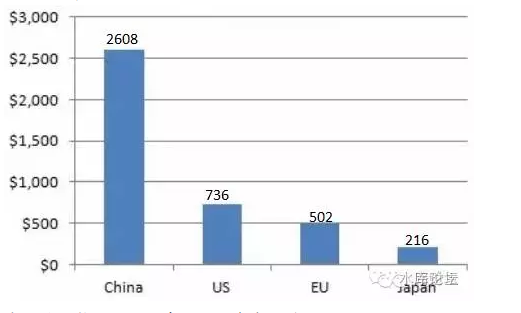

# 本文由吃饭时对话整理而成

 

 

一）中国泡沫

 

对于俺LP这样一个混"三观不正主流金融圈"的人来说，一惊一乍是难免的。

 

 

譬如吃饭的时候，她突然忧心忡忡地说，"明年RMB会不会贬到10:1"，外界传言。

再看看平时她转发给我的微信文章，无非是《深度好文·该持有资产还是货币》。

《墙裂推荐·面对泡沫，政府是保房价还是保汇率》

《是中国人就转·2017大败局》

 

俺细细地夹了一口北京大白菜，慢慢嚼了。回答说："当然是以上全错"。

 

 

 

众所周知，目前中国的"人民币泡沫"，已经到了非常严重的地步。

所谓"半年印出一个俄国，一年印出英国，1.5年印出日本"

 

去年一年，中国整个的新增M2，大概相当于全世界剩下的"外国"。

而且我告诉你，这个M2还是"伪造的"。还是相当程度写低的。

 

(2015新增M2，\$bn)

有一篇完整的批判文章，可以参考一看。

http://mt.sohu.com/20160804/n462518806.shtml

 

 

外界笑话说，按这个趋势，"如果你不贬值的话，你可以买下全世界"。

譬如上海中兴路一块地皮拍卖，就是一百多亿。无非二个红绿灯巴掌大的地皮。港珠澳大桥，也不过130亿。

 

东北振兴，动辄1.6W亿。

东三省的工业能量，人口，钢铁业总产出，和整个俄罗斯差不多。

你知道俄罗斯的财政缺口才多少。\$55b，已足以引发地缘政治动荡。

 

 

京沪一套普通居民，资产动辄1000W人民币。或者近200W美金。

这个数字，哪怕到了欧洲，美国，日本的主流社会。也是属于人上之人，绝对的富裕阶层。

汝何德何能，担当此福。

 

 

 

二）非贸易部门

 

但是要对中国"货币狂潮"的分析，毫无疑问，目前互联网上"三观不正主流媒体"的评析，就是一句话："以上全错"。

 

 

为什么，因为他们缺乏最基本的"架构知识"。

象牙塔里的书呆子。不知道实际社会是怎样运行的。

 

当我们拿到一篇"宏观经济"分析报告，讲美联储加息预期，讲投资和进出口数据，讲欧洲和日本GDP展望，讲消费周期的起伏，去库存和CPI指数。

这些都是好的。但是要拿这些报告去支持决策，是要输到倾家荡产的。

为什么，因为他们不懂Marketing，不懂Break down。

 

 

在中国的教育中，从中学到大学，从来不教"经销与营销"。

中国人并不是一个群体，而是要细分成"女人，男人，老人，小孩"。

 

消费者并不是一个整体。国民也并不是一个整体。国家要分成东部，中部，西部。

同样一个政策，对不同群体的效应截然不同。

这些Break Down的事情，马列主义教科书是从来不教的。

 

 

实战社会，我们要用"显微镜"去看。

在显微镜下，生物反应的效用并不相同。

"保汇率，还是保资产"这件事，是要严格地区分"贸易部门"和"非贸易部门"的。

 

 

让我们回想一下1985年左右的日本吧。当时的日本，和2015年中国有相当大的相似度。

 

当时的日本非常"强"。甚至有人说日本是一部"出口机器"。

只出口，不进口。创造了1000亿美金的"日本顺差"。引发了欧美内阁的极大恐慌，80年代几乎所有商务外交谈判，都围绕着"遏制日本顺差"。[\[1\]]

 

 

当时的日本出口，围绕着CD机，Walkman，照相机和摄像机。主要是各类精密电子产品。

电子产品价廉物美，小巧精致。当一个400元任天堂游戏机，极大地改变了你的人生同时，日本企业还能维持相当高的毛利。

 

 

而另一方面呢，如果你认为1985年的日本"物价"很便宜。

那你就大错特错了。

1985年的日本物价不仅仅是贵，而且是大贵特贵，惊人的贵。

 

你在日本国内的生活，吃碗面就几百日元，是中国内陆十倍。

葡萄是论个卖的，西瓜是论"片"卖的。

至于找人服务按摩，佣人月嫂，那根本不用想了，天价。中产阶级根本消费不起。

 

如果说"食，行"还算较贵的话，则1985年日本的"住房"。更是疯狂的天价。

一台打印机出口，如果值500元人民币的话。则一套日本住宅，可能要5000000人民币。

一小段街区的总价值，就超过整整一个国家的打印机出口！

 

 

 

这意味着什么呢。意味着如果你把日本经济分为"可贸易部门"和"不可贸易部门"二个Category的话，则他们是背道而驰的。 

 

-   日本出口，用于国际市场上倾销的产品。越来越便宜，顺差不断。

-   日本国内，国民内自用的产品。越来越贵，价格天价泡沫。

 

这就是所谓的"泡沫经济"。日本政府大肆地印发纸钞，分给国民。使得日元站上'00时代；

而另一方面，政府通过出口退税，出口补贴，工业区补贴等等各种方式。维持日元国际汇率。

 

 

这段时间，日本的国家报表非常好看。首相也很有面子。

因为汇率主要是看"贸易"。以可交易货物为准。从出口顺差上看，日元要涨。

而GDP看总产出。如果合肥，武汉，郑州的房价也50000元/平米的话，则国内GDP大大地高。[\[2\]]

 

每个日本人都觉得自己富可敌国。

 

 

三）败局

 

1）2016年的CNY/USD下跌，很大程度我甚至都怀疑是博士发急了，要"出口导向型"拉经济。

纯粹以顺差的角度看，人民币没有任何下跌空间。

 

2）以人民币计价的中国资产 \> 以美元计价的中国资产 \> 0

只要"贸易部门""非贸易部门"差异存在，房子就涨得比美元快。

 

 

四）结语

 

在显微镜下，"保汇率"和"保资产"并没有矛盾。

 

上亿人口的大国，一般进出口总贸易额占GDP 10%左右。

政府通过扶植出口，补贴出口，定向工业园区等等方法，要保住汇率，乃至创造大额顺差。并不是困难的事。

-   最典型的如北欧诸国，其国民贫穷，社会凋敝，仅是中等发达国家。而通过刷汇率，北欧五国竟然有全球最高人均GDP。

** **

 

"滥发纸币"会推高资产价格。但是"保资产"和"保汇率"之间，并没有直接联系。

要京沪房价贵到"农民工租不起房子"，并进一步导致制造业成本升高。[这其中的逻辑，还有无数无数链条要走。]

 

 

真正会导致"资产泡沫"崩溃的。是中国人一窝蜂的涌出去"抢购海外资产"。

所谓的"资本外流"。

为啥你不抛了法租界的老破小，搬到法国去住呢。普罗旺斯

资本外流一般都是千亿，万亿级别的。和贸易项目下数十亿，数百亿，完全不能相提并论。

一旦一个国家开始"资本外流"。那才是真正守不住汇率，守不住资产，守不住天朝体面。

 

很显然，庙堂在这方面聪明地紧。

 

 

 

（yevon\_ou\@163.com，2016年9月3日午）

 

\*
发现很多人看不懂。所谓蒙代尔三角形，当然是汇率和资产都可以保。只要"外汇管制"就行了。

这么多财经界人士天天"蒙代尔三角形"，真等实用时全忘了。

 

 

 

[\[1\]] 1960年代初，法国总统戴高乐提及池田勇人时还轻蔑地称之为"那个半导体推销员"，不出几年法国就被日本超过。到1968年，日本的GDP已超越西德，成为资本主义世界的二号强国，日本制造打遍西方无敌手，连美国媒体也开始担心。1971年5月10日，索尼公司创始人盛田昭夫登上了《时代》封面，标题是"如何应对日本的经济侵略？"

[\[2\]] 本段逻辑，在《人民币面临巨大的贬值压力》，2004年的文章中已经有所阐述。
