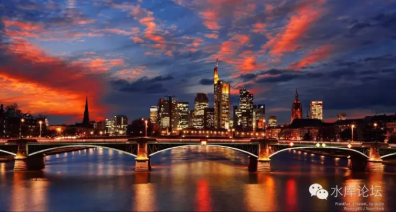
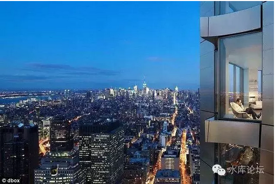
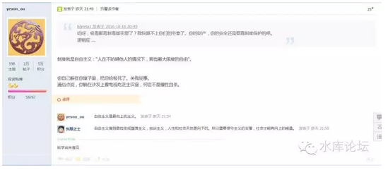
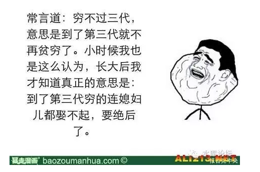

# 自由主义的吸毒观 \#F680

yevon\_ou [水库论坛](/) 2016-10-17

自由主义的吸毒观 ~\#F680~
=====================================================================================================================

 

长大以后，认清真相

 

 

一）Bob Dylan

 

莫名其妙，水库上关于"吸毒无罪化"的讨论一下子多起来了。难道是因为Bob
Dylan。

 

粗略地看，主版上就有如下帖子：

《为什么说吸毒无罪？》http://www.shuiku.net/forum.php?mod=viewthread&tid=49206

《有个水原发帖称吸毒无罪？各位版主，建议移动到垃圾版》http://www.shuiku.net/forum.php?mod=viewthread&tid=49238

《关于吸毒危害性》http://www.shuiku.net/forum.php?mod=viewthread&tid=49248

《惩治吸毒的经济学分析》http://www.shuiku.net/forum.php?mod=viewthread&tid=49263

《为"吸毒张目"背后的醉翁之意》http://www.shuiku.net/forum.php?mod=viewthread&tid=49264

 

 

本来今天续写2N的。

心血来潮，我们来讲讲"吸毒"这个话题。

展开分析中，前半段是抄铅笔社的。后半段是我原创的。

 

 

 

二）禁毒战争

 

2010年，美国7名参议员联名提出议案。要求在全美范围内"毒品合法化"。

考虑到全美国一共才100名参议员，这是一股惊人大的势力。

 

 

在嘲讽之前，我们先看看这一个基本事实；

-   在欧美国家，一克毒品的售价大约是2000元人民币。

-   成瘾者每天至少需要吸食1克毒品。

-   每个月60000元，每年12万美元。

-   在原产地，毒品的成本不到20元RMB/克。

 

 

让我们仔细观察一下这个数值。\$120000/年，其实并不是一个很大的数字。

在欧美上流社会，一个公开的秘密，大量的上流社会精英都在吸毒。

几乎每一个时尚界，娱乐界，乃至新闻界的人都在吸毒。[\[1\]]

 

 

因为他们负担得起。有钱人吸毒完全吸得起。12万美元对于那些生活在蓝调爵士风格中的贵族而言，无非是几瓶红酒的价格。他们也绝不会为了募集毒资不堪重负，走上犯罪的道路。

当然更不会因为无法负担每年几十万RMB，而卖房子卖儿卖女。搞得家破人亡。

 
长期吸毒是无大碍的。美国上流社会的人很清楚这一点。

因此构成了下一条政策的核心：

毒品太贵了！

 

 

吸毒的社会性危害，其危害"外溢"不在于对人体本身的摧残。

毒品危害的主要原因，在于毒品太贵。

 

如果你每天吸一克的话，哪怕在中国云南等比较靠近边境的地方。也要近千元费用。

一个月好几万，一年好几十万。

 

考虑到吸毒的人群众大，许多都是社会中下阶层。

所以吸毒很容易吸到倾家荡产。而接着发生的人伦惨剧，都是为了贩毒赚钱。

 

 

 

这件事情的讽刺之处在于，商品卖得那么贵，都是由消费者付款的。

因为政府一而再，再而三的扫毒。毒品价格才会那么贵。差不多比原材料产地贵了100倍的样子。

 

我们知道，商业社会，任何成本最终都是由消费者买单的。

吸毒的一年花上几十万，一克毒品八百元。纯粹是由政府搞出来的。

 

 

 

所以美国七位"务实"的参议员，秉着美利坚大陆没有历史包袱的精神，大胆地提出了"毒品合法化"。

毒品合法化，美国政府就是最大的毒贩。直接从金三角进货。

 

鸦片这个行业，基本符合"每过一道海关，涨300%价格"的规律。

在金三角老巢，罂粟并不贵。大约只有20元/克粗制品。金三角的农民，也从来没有任何人靠种植罂粟而成为富豪。

 

 

"七位参议员"提出的方案是，跳过中间人，直接从金三角进货。

甚至可以说，种植罂粟也不是什么技术活，直接在美国国内种好了。

 

这样做的结果，是"毒品"的价格，从每克\$300美金，一路猛跌到\$3美金。跌掉100倍价格。

"吸毒家庭"的消耗，从每年\$120000，降到每年\$1200，就和买套高档沙发差不多了。

 

 

这样做导致什么结果呢。再也没有家破人亡的家庭了。

毒品可以变得非常便宜。和吸烟也差不多。吸烟最多也就把你自己吸成肺癌，没什么社会病。

 

 

 

此外，"阳光化"的另一个好处。

则是可以用现代科技大规模生产，公开研发，杂交水稻。

这样，"成本"还可以进一步下降。

 

按照七位参议员的计算，哪怕全体美国人一起吸毒。也就需要很小的一块土地种植鸦片，很小的一个工厂。

其副作用，无非是大家更加头晕一点罢了。

 

 

至于说毒品的"上瘾"效应，其实各位不了解全球毒品市场的一个大趋势。

HEROIN正在无情地丧失市场份额。哪怕不扫毒，金三角也没几年好日子了。

目前全球的趋势，是"软性毒品"。

 

因为HEROIN太烈。它虽然可以给你至高无上无以伦比的享受。但是它的强度太大了。

吸食HEROIN的人，无论再怎么克制。最多也就二三年的寿命。

 

 

而毒品公司不要这样的客户。

对于毒品产业来说，"挖掘"开发一个新客户。其成本是非常非常高昂的。

如果新客户二三年就死了。对毒品公司是非常不划算的。

 

目前全球的趋势，是开发"软性毒品"。其代表作是Icy，K。

这种东西，可以吸很多年。有着持续不断的购买力。

它甚至还不会太损伤你的神经系统，使得你依然能上班，能赚钱。

 

 

 

铅笔社在谈到1910年美国"禁酒令"时，曾说过，是什么打败了那些桀骜不驯的私酒贩子。

并不是无私献身的警察们，而是"酒类合法化"后的甜酒生产。商人击败了商人。

 

因为既然"禁酒"了。则你无论贩卖什么酒，都是违法的。

同样偷运一卡车的禁酒。你是运啤酒，还是运最烈最烈的Vodka。

任何脑子正常的黑帮，都会贩伏特加。

 

 

所以"禁酒令"之后，最先消失的是"轻度酒"。啤酒，果酒，气泡酒。

整个市场迅速转为黑帮烈酒为主导。

就好像国际贩毒组织，主要卖的是海洛因。哪怕二三年吸死一个也在所不惜。

 

 

可是美国放开了"禁酒令"之后。

消费者无疑更喜欢的，是轻口味的啤酒。而不是天天老白干。

当正规的商家进入了酒类市场。"干爽劲爆"的喜力，嘉士伯，青岛崂山。

等等大品牌挟广告优势，煽情营销，迅速地击败了黑帮粗制滥造的劣酒。

 

 

 

对于"毒品市场"，它也遵循同样的道理。

现在的"地下市场"，使得毒贩们倾向于贩卖最烈，最难以戒除的烈性毒品。

 

但是，一旦"毒品合法化"，有几百家厂商公开叫卖各种致幻剂。

则最终胜出的，一定是"又便宜，又轻爽，对身体副作用小"的产品。

 

消费者也不是傻子。同样有爽三十年的，为什么要选爽三年的。

 

 

 

以上就是"铅笔社"的观点。版权属于光荣的铅笔社，以及铅笔社诸多主笔老师。

俺只不过是一个搬运工。

 

铅笔社从经济上证明了"毒品非法"不如"毒品合法化"。

下半节我再讲讲，从一个"自由主义"者的观点。我是怎样看待"吸毒"的。

 

 

 

三）自由主义的吸毒观

铅笔社一通巴拉巴拉。但是铅笔社最容易受人攻击，最无法回避的死穴是："吸毒导致的生理心理崩溃，你怎么不说了"。

 

你说扩大产能，使得三万万美国人每人都有毒吸，都有冰溜。可是吸毒最终导致神经系统崩溃，美利坚灭种亡国。你岂不是成了历史罪人？

 

铅笔社对此的回答是："随着市场的合法化，阳光商业竞争，会冒出来新型的无毒害性毒品"。

 

可是这个回答，是非常非常的软弱无力的。你怎么知道可以克服技术瓶颈？

万一存在技术壁垒，长期跨不过去呢。

 

 

 

退一万步讲，1960年时投入巨资研发的"无尼古丁"香烟，遭受了巨大的失败。几乎使得Philips
Morris公司丧失一半资产。

因为香烟的实质是"尼古丁"，消费者其实不是喜欢看你白棍燃烧的样子。消费者喜欢的就是"尼古丁伤害身体"。

 

你把尼古丁抽掉了。整个香烟就"淡而无味"了。缺乏神经系统的一股兴奋亢奋感。

所以这个根本就是逻辑悖论，不自洽的。

 

 

对于"毒品对人体的损害"关键质疑，站在铅笔社的立场，用"毒品合法化"搪塞，他们是没有办法张目，没有办法遮羞的。

这个时候，能给出"根本解释"的。唯有自由主义，唯有道教。

 

 

如上图。有人说，"自由主义是最堕落的宗教"。是放纵的宗教，是人性沦丧的宗教。最终导致劣根性向下，黄赌毒盛行。

我说不是，[自由主义是最高尚的宗教。是最文明向上的。]

 

 

为什么，因为自由主义几乎是所有宗教之中，唯一引入"淘汰"概念的。

你有权力犯错，你有义务被淘汰。

 

 

对于自由主义来说：有人吸毒，好呀，鼓掌。

有人吸得神智不清了，好呀，鼓掌！

有人躲在自己房间里吸毒，吸死掉了。好呀，鼓掌！！

 

 

自由主义秉承"自由不干预"的原则，[不代表我们没有对错]。

我们坚信，勤奋刻苦是对，懒惰散漫是错。

我们坚信，追求逻辑是对，违背科学是错。

我们坚信，清白守身是对，吸食毒品是错。

 

但是，自由主义的特征，这一切的审判，必须交给"天道"去执行。

而不是人在地面上执行。

 

 

人不可以僭越神的位置，不可以在地面上执行HALAL法。不可以狂妄地对异教徒宣扬升战。

所有这一切，都只能交给"天"来执行。

 

 

你吸毒把自己吸死了。好，很好，非常好呀。

这不正说明了你是一个劣等人种， 社会竞争的露瑟，心灵斗争的懦夫。

你这样的黑鬼，[死了才是上帝旨意的呈现]。活着反而是社会正义的扭曲。

 

 

如果你不吸毒把自己吸死掉。怎么能证明我们这些[清教徒]，洁身自好人品优秀的好处？

屌丝不是人。如果露瑟不蒙受更大的生活压力，怎样把露瑟从社会中淘汰掉。追求卓越还有何意义。

道教的核心教义是："天地不仁以万物为刍狗"。

和其他宗教不同，道教并不认为"人的生命是最宝贵，最珍贵的"。

因此，道教也并不要求去拯救每一个堕落的生命。

 

对于道教来说，道教徒认为"当死则死"。

你吸毒，说明你是人渣。你吸毒吸死了，活该，大快人心。不该象白左圣母婊一样娼行人道主义拯救。

这时候应该鼓掌。而不是流泪惋惜。

 

 

可见，道教徒和"白左"是水火不容的二种宗教。

-   白左名义上是最伪善向上的，其实整个社会是最堕落的。

-   道教名义上是放纵向下的，其实整个社会是最净化淘汰的。

 

 

道教是自由的，但自由的另一个反面，则是"责任"。

权力和义务是对等的。你既然享受了[选择的自由]，你自然需要承担[选择的后果]。

 

你有权力犯错，你有义务被淘汰。

 

 

 

四）结语

 

在道教徒眼中，整件事情清晰无比。

1）你有关起门来吸毒的自由

2）吸死了活该

3）我出5折买你的房子。

 

垃圾们把生存空间让出来。道教徒的血脉得以延续。

 

 

 

（yevon\_ou\@163.com，2016年10月17日午）

 

\*
利益披露：本人不抽烟，不喝酒，不嗑药。最喜欢做的事，是守在赌场门口买房子。

 

 

 

 

 

 

[\[1\]]主要是轻型毒品。他们有足够多的办法缓和毒症，不会呈指数形重度上瘾。
