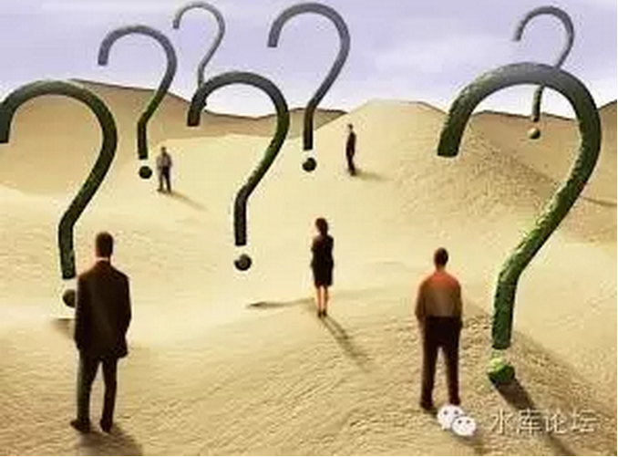

# "信息不对称"是伪科学 \#F750

原创： yevon\_ou [水库论坛](/) 2016-12-07

"信息不对称"是伪科学 ~\#F750~
=============================

信息就其本质，是一种商品。

 

作为商品，买多买少丰俭随意。

 

 

 

一）火炮

 

美国大兵梅杰躲在坦克里，闭着眼睛，默默地数着一枚火炮二枚火炮。[\[1\]]

 

突然，一行字显露在他面前的显示屏上。

"左方37.4度，主炮仰角23.6度，三级初速，榴弹准备"。

梅杰不敢怠慢，赶紧装好了弹药。按一下发射按钮。

 

"砰"，坦克主炮冒出一团火光。数十秒之后，视界之外的三公里处，一堆火光冲天而起。伴随着剧烈的连环爆炸声。

 

 

对于这件事，阿拉伯人是极其不服气的。

在阿拉伯人看来，美国人全都是奸诈的骗子和懦夫。

象《勇闯夺命岛》拍的一样，恐怖份子冲着尼古拉斯凯奇吼道，"你们永远不敢面对面地拿着刀剑对砍，只敢躲在遥远的海上发射导弹"。

 

对于阿拉伯人来说，美国人全部都是懦夫。

仅凭机械性能来说，阿拉伯人的苏制坦克并不差。各项性能都在同代产物。

可是阿拉伯人最郁闷的是，他们从来遇不到"面对面的厮杀"。

 

歌颂二辆坦克在旷野中大战，所有的对抗和偶遇都是不期而遇。

好似古代骑士穿着铠甲捉对厮杀。二军相争勇者胜，比的是勇气，无畏和牺牲。接近1：1的交换比。

 

 

而真实的战争呢。真实的战争，阿拉伯人甚至都没有"开炮"的机会。

美国大兵接受参谋本部的指示。过一段时间参谋部或者战术电脑，就会传来一道信息。"仰角xxx度，方向xxx度，初速xxx级"。

一炮发出，战无不胜。每一次都可以准确地摧毁目标。

 

 

对于阿拉伯人来说，这个"xxx度，xxx角，xxx位置"，简直就象是神谕一样。

他们也曾向自己的神灵祈祷，可是他们的神灵没有任何法力。

如果闭着眼睛开上一炮的话，其结果只能是落在沙漠里打石子。

 

 

于是阿拉伯人不干了。头巾们纷纷跳了出来，控诉这是"不公平"的行为。

这不公平，你利用了信息不对称！

 

 

 

二）信息不对称

 

为什么想写这个话题呢。因为\#F740我们写了"裸条"。

\#F740《旗帜鲜明的支持裸条》，其中最重要一个观点，就是dT\>0

只要是自由自愿的交易，都是合理的。任何交易，对社会都是好处。

 

 

这个时候，有一个蠢货跳了出来。回复原文如下；[\[2\]]

 

楼主说交易互利dT\>0未免太绝对了，是的，我不否认，假设A与B交易，A如果觉得这场交易他拿不到好处，就不会交易，B如果同样觉得他拿不到好处，也不会交易，交易之所以发生，只是因为A和B两人都觉得这场交易对自己有利。这就是楼主想要表达的东西吧？

 

但是，智商捉急的楼主忽略了以上逻辑的基本前提，那就是信息要对称和理性人，啥意思？也就是说A和B也两人是理性的，不会做像楼主这样一拍脑袋就发文的蠢事，也不会看到阳光就灿烂的要飞上天和太阳肩并肩。再者，这两个人掌握的信息要是相同的，也就是说A和B对于这场交易的认识要相同，并且必须都信守诺言。有了以上这两个前提，才是我们说的1+1＞2的交易，否则未必所有交易都是有利的。

 

 

之所以对这个话题感兴趣，主要是看见了"信息不对称"。

对这个话题，感觉刻骨铭心。

 

早在2003年，刚在上海热线讨论"炒房的正义性"时，就有人提出了"信息的不对称"来驳斥炒楼客。

 

他们的意思是：从理论上，商人是降低物价的。

但实质上，商人是赚了"信息不对称"的钱。好比A地的货物价格高于B地。商人其实在赚老实人的便宜。所以这种交易是不道德的。

 

 

 

对于这种质疑，我们一般是先骂一声SB，有妈生没妈养的文盲垃圾。

然后我们再慢慢告诉你一个道理：信息的本质也是一种商品，信息是要花钱买的。

 

信息从来不是免费的。信息是需要花钱的。

你丫的是不是买盗版光盘买出快感了。

 

 

回到我们之前"美国大兵"，对于C4ISR系统[\[3\]]的全控制，使得美国军队，宛如有神灵庇佑一样。

给你一段坐标，打出去就百发百中。

 

而这段坐标的背后，它真实有一整套系统在支持。

-   你首先要有卫星云图。

-   在卫星云图的基础上，要有地面SR-71高空侦察机航拍精度。

-   所有图像传回之后，经过大型电脑综合处理。

-   对方目标的伪装，要经过间谍和情报分析。

-   现代计算机的强大，甚至可以计算重力对炮管几毫米的弯曲影响。

-   开炮！百发百中

 

我们要说的是，这是一整套系统。要花很多很多钱的。

阿拉伯人抱怨美军炮手百发百中的同时，他们要看到，这套系统的背后，是几千亿美金的投入。[这其实是一场综合国力的竞争]。

 

 

现代战争，被称之为C4&I，在火力机动之外，对战场的信息传递，是和巨舰大炮一样重要的事情。每一次对抗，也都是从信息战开始。

这一切都说明，信息不是人权，绝对不是天赋零权之一。

 

 

回到商业分析之中，对于信息，他本身也是一种"商品"。也是成本之一。

掺入多少，使用多少，全凭个人心意。

你可以视为糖果盒的包装。

 

 

举个例子，假设你是一个果农。承包了200亩的苹果园。

每年秋天，会有专门的"果农贩子"上门收购苹果。

 

你也知道"商人"是要赚钱的。可能在陕西卖1元的苹果，到了北京上海就能卖3元一斤。

哪怕运到火车旁的供销站，也能卖上2元/斤。

 

 

这个时候，果农有二种选择。

1）直接卖给果农贩子，1元/斤。

2）派你儿子到山下转一圈，看看哪里有更好的收购渠道，更贵的卖价。

 

但是也有可能呢，是你儿子下山逛了三天，然后双手空空的回来了。

-   花了500元的差旅费

-   一无所获

-   还耽误了三天的工分

你把旱烟杆往地上一砸，"作孽呀，早知道就不让你出去"。

 

 

当然，这时候老农可以进一步"追加投资"，让你儿子再去到西安、郑州等城市碰碰运气。当然差旅费也级数上升了。

也可以选择"老实认亏"，1元/斤卖了。选一种[营运成本最低]的方法。

 

 

这个例子告诉我们的是什么；

1）信息是一种商品，你可以选购购买，也可以选择不购买。

2）决策有风险，购买信息有可能赚，也有可能赔钱。

3）最终选择利益最大化的做法。

 

所以，从来不存在"信息不对称"的说法。

当二个人进行交易，A了解很多，B了解不多。

你以为是吃亏了么。

不，不是。纯粹是A"购买了"很多信息，而B没有购买信息。

 

购买信息是有成本的。

用一句很恶俗的话来说，别人的爸在拼的时候，你爸在干什么。

别人在观察搜索信息时，你在干什么。

 

 

如果B觉得策略更佳，他随时随地可以购买信息。

就譬如山里上网成本下降了以后，土特产农民纷纷开起了淘宝店。

 

无论任何博弈策略，都是效益最大化的策略。

真正重要的是自由。只要有自由，就是效益最大化。购买多少信息不重要。

 

就好比你买一盒巧克力。需要多昂贵的外包装，比例如何。

答案是：因人而异。

 

 

 

全世界排名第一大的卫星网络，是美国军方。

全世界排名第二大的卫星网络，是Walmart商店。

 

为了掌握更及时的库存信息，即时掌握最低的全球采购价格，海量的物流控制，Walmart建立了全世界第二大的卫星通信网络。

这一整套的"信息获取，信息管理，信息检索"系统，美国人取了一个名字，叫做IT。

 

Information Technology，命名由此而来。

 

每年全球几万亿的IT系统支出。难道你以为"信息"应该白送给你么。

难道Walmart的库存管理水平，要和街边的杂货小店一样档次，你才觉得"公平合理"么。

 

信息的本质是一种商品，是一种付费制造的商品。

凡认为信息应该免费，和认为"资本家不应该分利润"一样无耻。人渣！

 

 

信息不对称才是常态，信息不对称才是应该。

否则你怎么对得起大力投资IT，为了信息花费几万亿的劳动者。

 

 

 

三）未来的后悔

 

今天早上，那个蠢货又跑到知乎上，屁颠屁颠地发了一个贴。[\[4\]]

在这里，他又提出了一个"非理性"的观点。原文引录如下；

 

第二，非理性。原文作者在回复中没有提到这一点，我就姑且认为原文作者根本找不出理由反驳我好了。你是个理性人，你做出的交易决策才会对你有好处，但是人在有些时候是非理性的，你我他很多很多的人，都有买了东西闲置放着最后后悔买了这件东西的经历，那么我们在买这件商品的时候，做出的决策就不一定是理性的，比如我就在某景点一时兴起买了条熊猫围巾，但是拿回家后一直闲置着，又不想围，就这么放着直到扔掉，比较后悔。我之所以后悔，是因为我在后来觉得我没有必要花那个钱买一个实际没有多少作用的东西，那么这个交易对我而言是一个"好的交易"吗？

 

这也是很常见的一个质疑。常见于马克思主义脑残对经济学的质疑。他们问的是："卖亏了么"。

 

 

例如有一支股票。A在10元的时候抛售，卖给了B。

没想到几个月一过，该股票目前价值30元了。

 

A那个心里悔啊，就象是连吃了99只苍蝇。

千万次，他回想着，如果当年没有"卖给B"的交易就好了。

 

如果能给自己找个理由，找个借口，譬如诬陷B为"奸商"。再主张交易取消。

这简直就完美吉祥了。

罗一笑的人渣是没有底线的。

 

 

关于这件事，也有一个经济学的解释："不确定性"。

当A抛售时，他其实面临一个"不确定性"的局面。

股票有可能涨，也有可能跌。

 

有可能涨到30元。

也有可能跌到2元。

对于B来说，他买入之后，同样是有可能赚钱，有可能亏钱。

 

 

对于人渣来说，他在"事后"回想这件事情，[当不确定性开盅明盘]，确立价格走势之后。

他会开始后悔，会捶胸顿足，要求取消交易。

而假如是股价下跌呢。你看好了，他立即会忘得干干净净。

 

 

我们本身就生活在一个"风险"的世界中，经营风险，组织风险，是企业家最基本的工作。

事物的发展，有可能好的一面，有可能坏的一面。

企业家从"不确定性"中获利，这正是他们的天性。也是他们最伟大的一面。

 

 

就公平正义而言，在交易那一刻，理性人就已经把未来各种"不确定性"走势都考虑到了。

既然他愿意以10元抛。无论之后概率如何；

那都是一笔公平的交易。

 

 

（yevon\_ou\@163.com，2016年12月5日午晚）

 

知乎是一个SB弱智的论坛

 

 

\[1\]这里面有一个梗，以前朝鲜战争时，美国人特别多的梅杰。往往击毙了一个梅杰，继任者也叫梅杰。还有一个名字开普敦，击毙了一打又一打。整部战争，几乎就是和美国人梅杰和开普敦的战斗。

一直到后来才知道，原来是中国人不懂英文，Major和Captain（上尉）

[\[2\]]《旗帜鲜明的支持裸条》http://www.shuiku.net/forum.php?mod=redirect&goto=findpost&ptid=52763&pid=1263961

[\[3\]]百度词条《C4ISR系统》http://baike.baidu.com/item/C4ISR%E7%B3%BB%E7%BB%9F

指的是战场指挥、控制、通信、计算机、情报及监视与侦察的英文单词的缩写。 

[\[4\]]《如何看待人文经济学会这篇关于"裸条"的文章？》[https://www.zhihu.com/question/53288315/answer/134426501]
