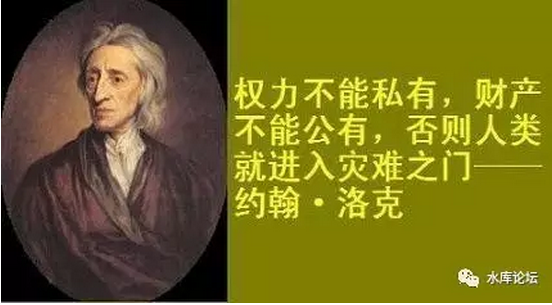
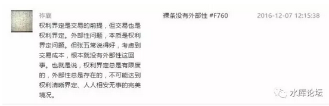
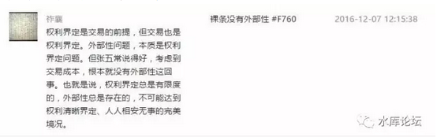
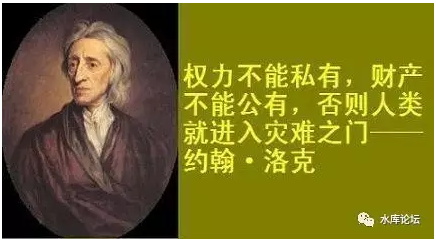

# 比交易更底层的东西 \#F780（文集标号是\#F770，排版更为合理）

原创： yevon\_ou [水库论坛](/) 2016-12-10

比交易更底层的东西 ~\#F780~
===========================

本文为《交易》第四篇

 

dT\>0，所有的交易都是好事。

等等等等，朋友，这是你的东西么！

 

 

一）产权

 

前天写完《[交易](http://mp.weixin.qq.com/s?__biz=MzAxNTMxMTc0MA==&mid=2651015322&idx=1&sn=6027fa0f7689bead527307cb7dc83316&chksm=80721e89b705979fabc60f3d8284abd5ca195b32c68d817b5f3ac9145f2c03e084dccfdfc7e7&scene=21#wechat_redirect)》系列三篇。在所有的评论留言中，唯有一条，让我想了20分钟。

高亮了，但没有回复。

因为这个道理很复杂。要说清楚不容易。

《交易》三篇发出之后，知乎那个蠢货，又跟着流窜到了水库。发了一个长贴。[\[1\]]

那个帖子很热，短短的半天，就盖了300多楼。其中超过千字的回复接近50条。

 

那个楼主本身不值一晒，初中高小文化水平。主贴又臭又长看得很累。

精彩回复都在回帖中，水库大神轮番上场，把他扁得象猪头一样。

 

 

可是，对方还是不服。

不服，不服，就不服。

 

不服的原因，他憋了一口气。可是却表达不出来。

我知道他的意思。他思绪混乱，我可以帮他表达出来。

 

所有的交易都是好事。甲方乙方都得益了。

可是，你们确定那是你们的东西么。你们有权力交易么？！

 

 

如图中，祈襄的那个留言。

对于"交易"，有比交易更加底层的东西。就是"产权"。

你确定你有处置的权力么。

 

 

好比一幢历史保护建筑。你有房产证，可是你不能交易。

"文物保护协会"会要求你不许卖给外国人。不许改建和经营酒店。

这事怎么说。

 

 

 

二）有限产权

 

对于这条留言，昨天我想了整整一夜。事情并不复杂，复杂的是怎样穿针引线，把整件事情说清楚。

我们先从最简单的开始。

 

 

在电视连续剧《创世纪》中，叶荣添的第三笔生意，是拍买了一块土地。

之前二单生意，叶荣添凭借着巨大的冒险和激进的手法获得了成功。一跃从一个穷困二白年轻人，变成了小有身家的地产老板。

 

可是第三笔生意，叶荣添赔了。

赔得干干净净，输光了倾家荡产。

 

 

那块地很好。地段不错，价格也便宜。

唯一的问题，叶荣添太心急毛躁了。他没有看清楚一行小字。

 

原本的业主，他的妻子葬在了海边。

业主思念妻子。虽然他迫于财务压力把土地出让，可是他留了一条附加条款。

"任何地上建筑，不能遮挡遥望妻子的视线"。

 

那个业主住在山上的小屋子里面。而他妻子的坟墓在海边。

二者连线，留给建筑物的高屋就很有限。

想要不遮挡视线的话，最多只能建8层的小屋。

而叶荣添原本的计划，是要建30层的高楼。这样才能大赚赚回本钱。

 

于是叶荣添破产了，抛下女主角一个人去街角卖盒饭。

过上了一段潦倒的日子。

 

 

 

这个故事告诉我们的是，世界上存在一种"部分产权"。

好比我拍卖这块地给你。其实你并不是100%为所欲为的，还有"附加条款"。

 

"附加条款"在商业上是很常见的。

如国内的网游公司，代理韩国的网游。往往都会加上"附加条款"，不可以修改游戏中的道具，不可以增设自己绘制的NPC。

中国进口苏联的Su-27发动机，则是写着"仿制可以，禁止出口"。

 

广汽本田在广州设个厂，明文约定了不许返销日本市场。

你看似一辆车。但他其实不是同一辆车。光附加的License就有几十种不同。

 

以上，均为"有限产权"的例子。

 

 

 

三）共有产权

 

比"有限产权"更进一步的。则是"共有产权"。亦即这项资产，有多人主张权利。

 

我们来回看一下张五常的话；

一个很典型的例子。譬如你要"卖祖宅"。

祖宗传下来的苏州园林院子，房产证是你长房长孙一个人名字。现在你缺钱花，准备卖了。

 

 

可是你卖的时候，七伯跳出来了。

"祖宗传下来的东西，不能卖啊"。

"虽然房产证是你的名字，可你也不能卖祖宅啊"。

 

在这个情况下，七伯就是一个"利益相关者"。

祖宅有很多利益相关者。

你胆子再大十倍，你也不敢卖祠堂。

 

 

对于今天的中国政府，他强制实行"不动产登记法"。

任何不动产，都必须有房产证。任何房产证，都必须有产权人。其他的事你们家族内部自己解决。

通过这种方法，强制达到了"确权"。

 

 

对于房地产系统，他的确是达到了"产权清晰"。

可是世界很大，世界非常非常大。还有大量的领域，达不到"确权"。

 

譬如说，我是一个苗族村寨。

现在有一个旅游开发公司，找上门来。说想开发俺们村，搞一个"风情民俗园"。

 

那么，你到底是同意还是不同意。

同意的话，收多少钱。收钱的话，钱如何分。

 

 

对于这件事，应该找谁负责。谁说了算。

理论上，是去找村长。

可是村长很多情况下，也不能一手遮天。村长还要找村子里的长老会，大家一起烤火开个会。

整件事的决策和流程，就非常地复杂了。

 

说不定还有几个泼皮和刺头，就是不同意就是捣蛋。非得要跳出来和村长对着干。

到时候，村长还得负责抹平这些事。

这种"民俗风情园"也是一种交易，企业和村民的交易。但难度大很多了。

 

 

 

四）多人产权

 

比"二三人共有产权"更进一步的，则是"N多人共有产权"。

一个典型的例子，是美国印第安人保留地。

目前的印第安保留地，已经没有任何发展可能。

 

 

1890年之后，残余的印第安人被赶入到密西西比河以西的河谷地区。

部落首领最终和美国人签订停战协议。保留了和平和自治权力。

此后，印第安领地并无大型战争。

 

印第安人依循黄种人的习俗。实行财产均分制。几个子女，均有财产继承权。

而因为领地很小，几乎也不流通。又没有战争，人口增长又快。

 

 

几代人之后，发生了非常严重的问题。即"土地不断细分"。

本来只有3亩土地的一个家庭，生了10个孩子，再生100个孙子。

而同一部落之间，互相通婚。外公和外甥之间，也有继承权。

 

 按照美国学者的研究，目前"印第安自治领"的土地上，平均每一块产权地，要有近10000个业权人。

最夸张的一个例子，某人继承的土地份额，要过107年，才能给他带来1美元的农业收益。

 

 

这导致了印第安自治领上，几乎任何的"工商业"都无法开展。

因为无论工业，商业，都需要大片拓展平整的土地。

 

工业，你一个钢铁厂，一圈就是几万亩的土地。

铁炉倒水，热轧板可能长达300米的流水线。到终点才慢慢裁剪成板材。

 

而在印第安领，你怎么办。

每一寸土地的应用，都需要10000个业权人每一个人的同意。

 

哪怕9999人签字了。剩下你一个，107年才能分\$1的家伙。你一开口就是3000万美金赔偿金。否则就是钉子户，就是强拆人权圣母。[\[2\]]

 

土地保护法案，就象《孕妇保护法案》《妇女产假法案》一样，看似是保护孕妇的，其实伤害的是女性权益。

 

 

在亚洲，霍英东1955年第一次想出"分层物业"产权时，当时最大的不动产怡和洋行叫住了他。

"老霍啊，这是潘多拉的盒子。盒子一开，后患无穷"。

 

为什么。因为你看英国，或者美国的房子。他们是没有"分层产权"的说法的。

美国的房子就二种，一种是独立屋：House

另一种是大城市公寓，Co-op

 

Co-op其实就是公司。你是通过公司持有，名下实际是一部分企业股权。

 

 

那么，为什么要这样制度设计呢。因为这涉及到一个"翻新改建"的问题。

独栋别墅的翻新，改建，重建，是最简单的。他只涉及到一户人家。

 

Co-op的制度特点在于，他其实是一家公司。

既然是公司，就要遵循董事会章程。简单地说："少数服从多数"。

譬如更换物业，譬如整体翻新，甚至炸掉了重造。

只要66%或者75%的赞成票就可以了。

 

 

而霍英东首创的"分层产权"，这在整个人类史上都是没有的。

是整个人类文明史第一次。

霍英东一生中有二件巨大的发明，震动地球。这足以使他载入史册，这么NB的人。[\[3\]]

 

"分层产权"的结果，是使得一幢建筑物，事实上有了100\~200个业主。

其中每一个业主，都是100%的产权。

这导致了很多很多的问题。

 

 

 

一个最核心的问题，就是"强拆"的问题。

现在闹得沸沸扬扬的社会拆迁，老上海七十二家房客。

原先的资本家被赶走了，房子平分给1949年的平民。

 

好了，现在七十一家都搬走了。就剩下你最后一户。

你铁了心要做钉子户。打死也不搬。一开口要三个亿。

或者象2008年"重庆最牛钉子户"一样，一开口要2000平米闹市区商铺。

你说该怎么办。

 

 

这事情没法推行下去了。

一幢有着100\~200户业主的物业。其实是一幢"死物业"。

这样的物业，既不可能改建，也不可能翻新。甚至连提升物业服务也非常困难。因为永远有小业主反对。你永远收集不齐100%支持。

 

四季雅苑从大业主自持，到拆散卖给小业主。物业品质一落千丈。

 

 

 

五）收缩产权

 

我们还是看回张五常的这段话。

张五常的意思，其实要"收缩产权"。

一亩土地上，有10000个业主。印第安自治领就完蛋了。

 

一幢房子，有200个业主，其实也不是好办法。

最终这样的物业，无法拆迁，无法改建，甚至无法翻新。损失的还是业主本身。

 

世界上最好的产权，只有2\~3个业主足矣。[\[4\]]

 

 

你说一幢"祖宅"，其实他有非常大的"产权相关者"。

你是长房长子。

爸爸的弟弟，还有七伯健在。

爷爷的弟弟，还有六叔公，和六叔公的子女。

曾爷爷的弟弟，还有曾五叔爷，和曾五叔爷的子女

玄爷爷的弟弟，还有玄四叔祖，和玄四叔祖的后裔.........

 

这个表列下去，"产权"相关者，可以说是没完没了。

 

 

而你要做的是，就是"截断"。

对的，截断，砍断得干干净净。

如张五常所说：权利的界定是有限度的。

太外延了耗不起。

 

 

最终，祖宅的产证上，就你，或者你和七伯二个人的名字。

"五服"之外，统统不要列上去。

 

我知道这里面会有利益损失，知道产证写一个名字是不精确的。

可是让二狗子给各位叔叔爷爷摆酒赔礼每人拿一个红包回去。

拜后产证还是只能写一二个人的名字。

即为"产权的砍断"。

 

 

 

六）产权碎片化

 

一般而言，战争被视为产权的格式化。

 

很多人分析中国和印度的差异。

中国在mao时代大规模地搞了一次。虽然wg有害无益，但他有一个副效用"产权的格式化"。

 

 

如果你视印度，印度的产权是高度"碎片化"的。

同一块土地，可能有五六批人，五六种法律，在对该土地宣示着主权。

 

而你哪怕拿到土地，你也是"有限产权"。

就如同叶荣添拍卖到那块限高的土地。他有"附加条款"。不可以做这个，不可以做那个。

也就是印度"产权碎片化"程度十分恶劣。

 

 

同样的道理，也适合于有着1000年历史的英国。甚至今天的美国。

英国的问题是，他的历史实在太长了。"传承"也实在太长了。

 

"产权"就其本身，存在着不断碎片化的倾向。

每一代产权的传承，肯定是越割越细的。各种"附加条款"，也肯定是越加越多的。

 

我今天把伦敦乡下House卖给你，但是留一条留言"外墙颜色不能动"。

你转手卖给下家，"屋顶十字架也不能动"

再下家，"水井有历史纪念意义，也不能动"。

日积月累，条款只能增加不会减少。规矩只会越来越多。

 

打一个IT男都能够理解的比方。

假如一个系统，内存管理总是申请，永不回收。

则总有一天会Memory Full

 

 

而中国目前的情况呢，是内存刚刚"格式化"过。还很干净。

你要申请大块成片的内存，OK，可以。

 

因此我们高铁铁路线一拉几千公里。从来没有沿途的居民过来闹事。

如果在美国想要兴建这样一条铁路，光沿途的环保，青草，小动物组织就够你喝十年了。

 

 

七）内存的回收

 

治乱自有秩序。

 

当一个王朝刚刚建立时，其内部的产权很"纯净"，干净得就如刚刚开机格式化完内存。

而一个王朝运行了几百年之后。其内部的条条框框，混乱得就象一部用了8个月的Android手机。

 

这个时候，会发生死机，内存崩溃。

死机的结果，是战争，秩序崩溃。全社会重新洗牌。千年秩序再也没有人遵守。

然后你惊讶地发现，重启了。[\[5\]]

 

 

一个王朝，若想要避免崩溃。则一定要增加"内存回收机制"。

即任何产权，都要有回收，有净化机制。

 

 

"土地七十年"远远比"土地永久制"要好得多的一个制度。

更理想的制度，应该是在每块土地拍卖之前，加上"2086地面建筑物回购条款"。

 

至于回购条款怎么写，定价怎么定。若想续约的话怎么续。

这些环节我还没有想好。这也是我迟迟没写这篇的原因。

 

 

 

八）无限产权人

 

老年人嗑唠的毛病真是闲话多，我们继续言归话题。

 

 

我们知道，当一个系统有2\~3名产权人时最佳，有100个产权人时，多半已经半死不活了。

有10000个产权人的印第安领，基本处于必死状态。[\[6\]]

 

但是比"N个产权人"更进一步的，是"无限多个产权人"

 

 

"无限多个产权人"，您是指公有制社会，共产主义么？

No，在列宁主义制度下，产权人其实是有限的。往往就1个，金胖胖胖。

 

这也使得社会主义国家"决策"十分之快。

其本身属于制度优越性之一。

 

 

真正的"无限多个产权人"，其实指的是美国。

圣母婊盘踞之地。

白左的"政治正确"大毒瘤。

 

目前白左的"政治正确"，已经到了无孔不入的地步。

任何一件事情都要管，任何一件事情都能管。

 

 

任何一件事，只要她们看不惯。不管你是开饭店，做科研，还是企业招聘员工。

她们说对你指手画脚，就能对你指手画脚。

她们说要增加产假，就能增加产假。

她们说增加黑人员工，就得增加黑人员工。

她们说不许购买中国原料，那就是不许购买中国原料。

 

 

长此以往，意味着"产权人"没有任何自己的主见了。

如果一套房子的买卖，贷款，抵押，租赁，翻新，装修，耗电，居住与空置；

如果每一件事政府都要管，那还是我的房子吗 :@:@  [\[7\]]

 

 

在民主社会，让人绝对印象深刻的，就是做一件事情特别特别慢。

特别特别慢，特别特别慢。

这不是今天的现象。早在田中芳树写《银河英雄传说》时，该类民主病，就已经深入骨髓。

 

 

在民主社会，修一座桥，拉一条公路，盖个体育场馆，特别特别地慢。

基本这届政府提出议案，等到10年后，等到15年后，下下下届政府时可以开工，那就算不错的了。

 

为什么，难道西方社会的工程师，建筑师，全部都是蠢材么。

不是的，关键是"产权人"太多了。太太太多了。

 

几乎任何一个人，都可以对你的基建提出意见。

打开电视台，天天晚上东森电视在骂捷运规划不合理。有改善余地。

 

 

当议员们骂完，于是又是"环保组织"上场。

环保组织只要有一点不高兴，立刻打回重做。

 

而哪怕环保组织通过了，后面还有动物保护组织。你惊吓到小狗小鹿撒尿了。

动物组织之后，有劳工组织。

动不动罢工，还不让你请外地工人。

 

哦，还忘了"公示"。以上所有的施政举措，都需要公示三个月。

任何人，只要你是公民。

都可以提出意见。

 

 

这样的话，就变成"千千万万"无穷多个产权人了。

我们知道，拆迁之中，最累的，其实是一家一家谈过去。

每一家谈话内容都是类似的。可是连谈200家，足够让你累趴下。

 

而"白左"国家，我要把这么多七七八八张大喇叭都安抚平了，没有十年八年怎能开工。

 

解决方案是什么：产权收缩化

 

 

 

九）结语

 

我用一个梨，换你一个苹果。

 

台下一群屌丝在叫，"哎哟哟，怎么可以换梨呢"。

"我最喜欢张静初吃苹果的样子了，静初姐吃苹果好漂亮啊"

"张静初不吃苹果，我的心都要碎了"

"我们只要求张静初吃苹果，坚决反对苹梨交易"。

 

你拿一把扫帚扫一扫，"滚滚滚，统统给我滚远点。关你屁事"。

 

 

 

一个社会要运转。基石在于"仲裁争议机制"[\[8\]]

一件你情我愿的交易。

而周边一群人喊着"反对，反对，反对"。

请问，如何仲裁？

 

奥派的答案是："以产权仲裁"。

如果这个苹果是我的，我就有权拿来交易。

 

 

而产权如何确立。

奥派的答案是："以劳动仲裁"。

 

好比这把木椅子是我亲手做的，我就拥有椅子的产权。

这件衣服是我亲手缝的，我就拥有织物的产权。

"劳动者拥有产权"，是最公平，最自然，也是激励最大的制度。

 

 

如果在劳动中，我使用到了其他人的帮助。譬如芸娘帮我织线。

那我就结工资给她。

工资结清。我们间的结算就干干净净。再不留任何手尾，也坚决反对桑德斯之流所谓的"付完工资后的企业责任"。

 

 

而社会上其他人，所有组织，所有个人，所有邪恶的灵魂。

他们宣称的，对我"劳动成果"的任何支配，任何使用指引，任何使用限制，任何社会责任。

我们全都不承认。其本质均为邪恶的抢劫。[\[9\]]

 

 

多年的事实与实践证明；

众多多名产权人的公有制制度，输给了；

清晰单一产权人的私有制制度

 

 

最后，我们只能用一句圣人先哲的话结束本文。望谨记；

（yevon\_ou\@163.com，2016年12月9日暮）

 

 

 

 

 

\[1\]长贴在《对未成年人yevon\_ou的教育（回应"信息不对称是伪科学"）》http://www.shuiku.net/forum.php?mod=viewthread&tid=53017

\[2\]和上文相反的是，目前印第安领经济极好。以人均收入论，甚至可以排入美国最富裕的几个地区之一。其主要收入来源是：赌场。

因为印第安属于"自治领"。既不用给美国政府交税，也不用受博彩业监管。而赌博拉几个大帐篷即可。

\[3\]霍英东二项发明是：分层产权和楼花预售

\[4\]《炒房客的流派（四）\-\-\-\--药单流 \#490》一文也说道，一套产证，如果有16个产权人，也足以称之为药单了。

\[5\]部分进程线程Process丢失。

\[6\]一直怀念《新宋》中的那句："军国大事，出二三人之口，入二三人之耳"。清流误国。

\[7\]这里指的不是中国。指的是美国Connecticut州。

《原创‖暗无天日，忍无可忍：一个康州房东的呐喊: 请加入抗争不公平法规》http://mp.weixin.qq.com/s?\_\_biz=MzAwMTkxNTQ0MA==&mid=2247484921&idx=1&sn=8ba684351d47b496341b2b8f4d9e7589&scene=1&srcid=09123i26OxBb1dsYX3axnchZ\#rd

[\[8\]]见[《论儒·法·禅宗·基督自治和道教的复兴》\#F10](http://mp.weixin.qq.com/s?__biz=MzAxNTMxMTc0MA==&mid=211128132&idx=1&sn=ca586ee1556e5e43c9949624294e49e6&scene=21#wechat_redirect)

[\[9\]]见《[生产与抢劫](http://mp.weixin.qq.com/s?__biz=MzAxNTMxMTc0MA==&mid=205886171&idx=1&sn=b33795f303ee3230f8a5888903e562c7&scene=21#wechat_redirect)》\#60，《经济学第二定律》\#72
