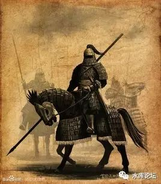
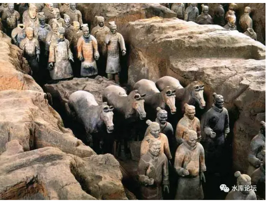
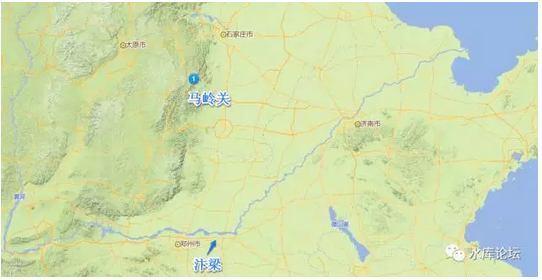
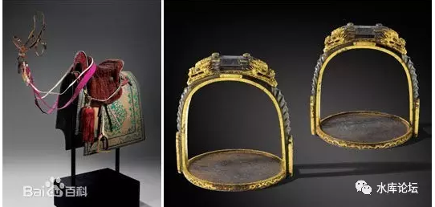
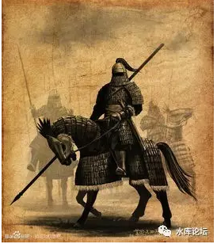

# 第二节 骑兵

原创： yevon\_ou [水库论坛](/) 2016-12-24

> 
> 

装备冷兵器的现代军队放在古代战场是什么水平？（2） ~\#F810~

 

> 一）科技

 

影响军事的第二个决定性因素，是科技。

有时候仅仅一个非常细小的科技突破，就极大地改变了帝国实力。并最终改写历史和政治。

 

 

在中原王朝的历史上，影响最大的，有二次。

-   匈奴时期：马鞍

-   女真时期：马镫

 

 

看过《三代之治》\#129系列文章的人都知道，华夏文明，起源于商洛之间。

最初时，神州大地遍地都是"蛮夷"。

华夏民族，其实在征战于蛮夷的汪洋大海。把野人都杀光了，周人才占据天下。

 

到了战国后期，燕赵秦等国，边境已经达到了"长城"边界。

齐，燕，赵，秦等国，都修筑有自己的"齐长城""燕长城"。

可是在那个时代，匈奴并不是一种很严重的外患。

一个普通的二流诸侯，例如燕国，中山国，赵国代郡部队，都可以把匈奴碾压屠杀。

 

你看战国史书的话，"征匈奴"根本都算不上军功。赵国骑兵杀的匈奴胆寒也没封几个将军，立的功还不如杀秦兵的一个偏将。

 

 

可是等汉代统一之后，匈奴"一跃"成为大患。甚至有白登之围，汉高祖倾全国之力仍然被分割包围。

吕后此后在外交国书中，低声下气"老奴姿色已衰，恐怕伺候不了单于。另行介绍汉地美女可好"说。

 

 

为什么，为什么匈奴的战斗力，一下子象是开挂一样。一跃成为可以国战的霸主。

冬川豆的解释，认为是"吏治国家的内生性腐化性"。

 

冬川豆认为，"大一统"的国家，内生性就具有腐败退化性。

一旦一个王朝达到"大一统"，英雄豪杰就会被皇帝杀掉，人渣太监才会掌握权力。

 

这导致"大一统"的王朝战斗力很差。正统王朝的军力，不仅仅打不过各个分部累加。

甚至就连一个旧的诸侯国都打不过。

具体的证明，就是"燕长城""赵长城"。在战国时期，对于任何一个小型诸侯国家，匈奴都是不上台面的骚扰级武力。

可是一到汉代"大一统"，倾全国之力都打不过匈奴。

 

 

他这个纯粹就是胡说八道！

秦末汉初发生的最重要一件事呢，是马鞍的发明。

 

马鞍这玩意，秦代是肯定没有的。兵马俑里面马是光溜溜的。

而到了汉代就肯定有。汉代有大量关于马鞍的记载。

马鞍的作用，可以参阅动物家族另一个远亲：鸵鸟

成鸟的鸵鸟，身高最高可以高达2.5米。

而且鸵鸟的奔跑速度极快，平均可以高达60KM/h，超过汽车。

相比之下，马的奔跑速度只有可怜的10KM/h。

 

另一方面，鸵鸟很容易养活。吃得也不多。

鸵鸟耐干旱，持久力长。

 

而马是一种很娇贵的动物。动不动生病。繁殖和交配也很苛刻。平均每三年才可以生一胎。

从费效比来说，鸵鸟远远高于骑马。

那么，历史上为什么有那么多的"骑兵"。可是从来都没有"骑鸵鸟兵"？

 

 

答案是，如果你去欧美国家，找个农业州农场看看。

买二张票进去到Ostrich Farm，提供"鸵鸟骑乘"游戏。

 

一般非专业的人才，在鸵鸟背上，最多只能坚持3\~5秒。就一定会被颠下来。

而农场的专业人员，久经考验的职业表演人员，在鸵鸟的背上，也只能待2\~3分钟。

 

鸵鸟的确是非常能够负重。背个人完全不是问题。

但是鸵鸟奔跑时，背部的起伏实在是太大了。太过于颠簸，以至于根本不能做任何骑乘。

 

 

同样道理，在秦末汉初"马鞍"发明之前。这是一个跨时代的发明。

光秃秃的马背，原是没有办法"长途骑乘"的。

郭靖驯服汗血宝马，杨过驯服野马，都要武林高手紧紧挂靠在马背身上，奔跑一天一夜，当做传奇来书写的。

 

 

 

马鞍的发明，使得人类第一次可以紧紧地夹在了马身上。

人和马几乎连成了一体。不用担心摩擦力，不用刻苦训练，长途骑一天也不累。

 

在"马鞍"被发明之前，根本不存在军事意义上的"骑兵"。

而仅仅只有"侦察兵""通信兵"。

"马鞍"的发明，使得匈奴民族第一次获得了他们的特色兵种："轻骑兵"。

历史的车轮，轰隆隆转动了。

 

 

参考阅读《武器发展史上有哪些潮流是全世界一起都看错了？》

https://www.zhihu.com/question/44275359/answer/132087518

 

 

 

> 二）长城

 

所谓的"军事"，其实并不是英雄人物的挥舞大刀。

也不是拳头，刀法，枪法，甚至于兵法。

 

"军事"，是政治的延伸。

一个人的命运啊。当然要靠自我的不断奋斗,但也要考虑历史的进程。

 

 

"马鞍"的发明，一下子使得匈奴获得了野战无双。

华夏民族被迫只能围城自守，围城被打援。

而中原王朝对于匈奴的反击，是修建了长城。

 

和一般人想象的不同。长城并非一项军事武器。

长城其实是一项经济武器。

 

 

参考阅读：

-   《长城这么矮究竟能拦住什么？》[\[1\]]

-   黄晋章《长城：恐惧的纪念碑》[\[2\]]

 

 

如果你仔细阅读这二篇文章的话，长城其实起到了二个作用；

1）隔绝了野蛮人小规模的侵扰掠夺

2）隔绝走私。将贸易口岸压缩到几个都市

 

 

我们看黄晋章原文；

 

黄仁宇、吴思先生都曾以明代为例计算过长城的成本。吴思先生的计算是，大致修建1英里的长城花费白银7542两，而大军出征，八万人马一年的耗费是979万两白银，它足够修建1300英里的长城。

 

在今天看来，中国北方有些地段的长城简陋不堪，但对缺少工具的游牧人来说，依然难于翻越------这足以打消那些小部落头领的小规模随意入侵念头。

 

即使草原上的较大政权，在大规模犯边入寇时，也只能选择最容易突破的地段，以硬拆城墙的笨办法打开一个缺口。这使得游牧人的入侵在地点和时间上有规律可循：多半选择在天气转凉的时节。

 

 

中国学生曾经发出哀鸣，秦始皇花费巨大力气修筑的长城。却没有避免草原民族的一次又一次灭国型入侵。

"长城防线"也从来没发生过激烈的攻防战。

 

这些话说得很文科，完全没有科普常识。

首先，长城的造价并不贵。相对于远征而言，更是便宜得厉害。

其次，长城的作用，从来不是军事堡垒。他其实是一条经济堡垒。

 

和Trump修建墨西哥的"隔离墙"一样。墙本身并没有多少高科技。

他只不过给你制造困难。使得你翻阅的难度极大增加罢了。

 

 

 

对于中原王朝来说，长城相当于"圈地"。

长城的位置，远远超出农业灌溉区300公里。圈占了牧区一大片草地，削弱对手。

 

而长城的效果，使得野蛮民族的"小股入侵"打草谷等劫掠行为不可行。

进一步从经济上削弱对手。

 

 

另外一方面，长城还有一个效果"隔绝走私"。

长城虽然不算坚固。可是对于走私商人，就是一道巨大的天堑。

哪怕只有几个哨兵，穿越的成本也几倍增加。

 

长城的结果，使中原王朝最终可以控制"茶马交易"。

仅在雁门关，居庸关，张家口等少数几个口岸，开展贸易，赚取关税。

 

 

 

这里面很大一个原因：匈奴缺铁，极度缺铁。

匈奴是一个极度落后的民族。其生产力之差距，和汉王朝是全方面的，几乎不可弥补。

 

匈奴缺铁，缺铁到什么程度呢。有一个成语，叫做"凹石沸水"。[\[3\]]

指的是匈奴人没有铁锅。

如果匈奴人想要烧一盆热水，他们怎么办呢。

 

匈奴先去找一块有凹陷的大石头。在石槽中放满水。

然后他们在旁边开始烧一堆篝火，把各种小石子扔到篝火中去。

等到石子逐渐发红，发烫以后。把石子捡起来，扔进石头凹塘中去。

通过这样的方法，获取一锅热水。

烧个蔬菜或者炒个萝卜的话，就在水里烫吧。

 

 

匈奴缺铁，极度缺铁。对于匈奴来说，最需要也最有价值的战略物资：是铁锅。

每个部落的抢手货。

 

"铁器"在每个时代都是高科技。

秦汉之际，一般认为是青铜武器逐渐过渡到铁质武器的过程。

 

 

可是匈奴根本没有"炼铁业"。他们首先缺乏定居挖掘的大铁矿。

铁矿石挖出来以后，也没有大规模的冶炼场。

这些，都需要定居文明。需要一整个城市和工坊才可以制造。

而匈奴任何时期，都没有定居挖矿的特征。

 

 

因此汉代修建了长城。长城的一个重要军事作用，是"隔断"了贸易。

匈奴再也没有办法输入铁器。久而久之，就不是汉国的对手了。

到了窦宪击破北匈奴时，这个花花公子二世祖，一口气也打到了燕然山。

匈奴和汉室，已经完全不是一个数量级的对手。

 

 

最后插播一句话，电影《长城》中，饕餮突破了长城防线，骑兵快马二天跑到汴梁报信。本段被人嘲得体无完肤。

 

后来看了"温体仁"一段回复，说在北宋，内山西一带也存在长城。

宋长城：马岭关长城。

所以张艺谋访谈录，这一段是经过严格考证，符合历史事实的。

顿时感觉山外有山，学无止境啊。[\[4\]]

 

 

 

> 三）重骑兵

 

"中原缺马，草原缺铁"这样的局面，维系了近一千年。

相对来说，还是缺铁比缺马更严重一点。

所以在中原王朝和漠北的对抗之中，呈现着"一面倒"的压制态势。

 

铁制铠甲和骨簇箭头的对抗，其差距是代际的。

班超曾经得意地说，在征服西域的战斗中，一个汉族骑兵可以对抗五个西域武士。

如果西域人经汉族人军阵训练的话，一个还能对抗三个。

 

 

其中，哪怕经历了几次中原王朝"内战"内乱。八王之乱，五胡乱华趁虚而入。

但是，一旦游牧民族在中原站稳了脚跟。他们回过头来，虐草原上留下的远亲和邻居。

顿时又如同切西瓜一般，随意砍杀。

 

-   拓跋焘征柔然，九次远征，几乎全胜。

-   高澄征突厥

-   李世民灭突厥，薛延陀汗国

-   杨广征吐谷浑

 

 

轻骑兵是一种"攻击力极弱，防御力极弱，移动力还行"的兵种。

我们看历代史书，从来都是匈奴，突厥骚扰雁门关。侵袭雁门关。

可是有没有"攻破"雁门呢，一次也没有。

 

突厥的攻城能力极弱。他们只有在草原上和你兜圈子，这是最擅长的事。

可一旦进入正面攻城，则一无是处。

 

 

所有的事情，要经过一千年左右。才又发生了一次"质"的变化。

AD1000左右，"铁器"突然变得不稀缺了。

 

"炼铁"在很长的一段时间内，都是高科技黑科技，纳米巴星球不可思议。

但是，再复杂的技术，经过足够长的时间洗礼，终究会被人类掌握。

 

 

 

到了唐代末期，五代和宋朝初创。生产力终于发展到了如此阶段。

"炼铁"再也不是很难的技术。铁产量足够高，百炼精钢也开始登上历史舞台。

 

"中原缺马，草原缺铁"。现在草原不缺铁了。

中原还是缺马。北宋甚至因为李继岌的叛变，丢失了灵州河谷。银川最大的养马基地。

那会发生什么事？

 

 

在这一个阶段，偏偏游牧民族又天启了第二个革命性突破："马镫"。

1965年，考古人员从北燕王族冯素弗的墓里面，出土了一套："木芯长直柄包铜皮马镫"。

被认为人类文明史上最早的马镫。[\[5\]]

马镫在马鞍的基础上，对骑兵的改进是革命性的。

马镫使得骑兵第一次可以承受"沉重的撞击"。

 

骑兵至少可以分为三种。

-   轻骑兵

-   弓骑兵

-   重骑兵

 

匈奴轻骑兵时代，十分搞笑。他其实是"下马步战"的。

也就是轻骑兵唯一提供的是"机动性"。他可以越过战场，快速投放到敌人的军阵背后。

 

但是一旦到达了指定作战位置。所有的人下马，拿着手里的刀枪冲上去。

轻骑兵其实是步兵。[\[6\]]

一种移动很迅速的步兵。

 

 

到了中古时期，随着马鞍和铠甲技术的发展，逐渐出现了"中型骑兵"。

中型骑兵可以骑在马上"冲锋"，但是依然不能"陷阵"。

可以守在二翼，趁缺口，趁虚而入。

但不能正面撕开缺口。

 

 

因为马匹不能用于冲阵。

马鞍虽然解决了"长途奔驰颠簸"的问题。但是骑马的稳固性依然不够。

如果马上骑士手持龙枪，和对面骑士发生剧烈碰撞的话。

毫无疑问唯一的结局，就是二个人都摔下马来。

在混乱的战场，重铠骑兵摔落马匹就意味着死亡。

 

 

 

而马镫的发明，使得"重骑兵"成为了可能。

偏偏在这个时候，"铁器"科技树解锁。四边的野蛮游牧民族，第一次获得了无限制的铁器供应。

这些因素的合力，便是女真的崛起。

 

 

完颜氏"金国"，其核心武力是猛安谋克部族武士。

让人闻风色变的，是金国无敌的"铁浮屠"。

 

铁浮屠纯以重甲制成，有时候甚至以铁链左右互联。虽死不堕，只进不退。

马上骑士脚踏马镫，手持长枪。

一经冲锋，锐不可当。

相当于现代战争中坦克的地位。

"马镫"传入欧洲之后，形成了今日无人不知的"重骑兵"部队。

甚至有人说，马镫改变了欧洲，改变了历史。

 

因为重骑兵无可阻挡。在欧洲，逐渐形成了一个"骑士"阶层。

贵族，骑士和城堡，构成了欧洲中世纪最主要的元素。

 

 

 

> 四）弓骑兵

 

和欧洲不同。在中国"重骑兵"的风光仅持续了不到一百年的时间。

为什么，因为有一个新的兵种，也是骑兵的终极兵种："弓骑兵"登场了。

 

 

金国是"铁浮屠"重装骑兵，冲锋无敌。

可是成吉思汗的主力，是"弓骑兵"。

 

 

因为和本文关系不大，就不展开了。

 

 

（未完待续）

 

 

（yevon\_ou\@163.com，2016年12月19日午）

 

 

 

 

[\[1\]]《长城这么矮究竟能拦住什么？》https://www.zhihu.com/question/25528331/answer/76404492

[\[2\]]黄晋章《长城：恐惧的纪念碑》http://chuansong.me/n/318553

[\[3\]]好像不是这四个字拼法，忘了。

[\[4\]]《如何评价电影《长城》（TheGreat
Wall）？》https://www.zhihu.com/question/51453506/answer/136302500 

[\[5\]] http://baike.baidu.com/item/马镫 

[\[6\]]一直到拿破仑战争时期，Dragon龙骑兵的作战方式，依然是骑马抵达指定战场之后，下马步战。
