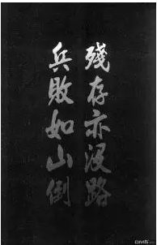
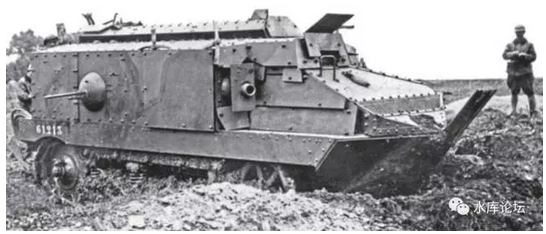
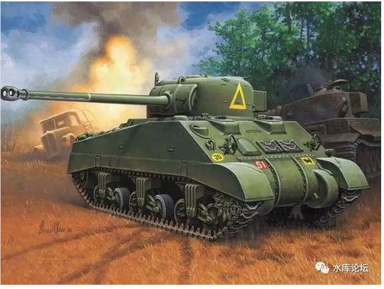
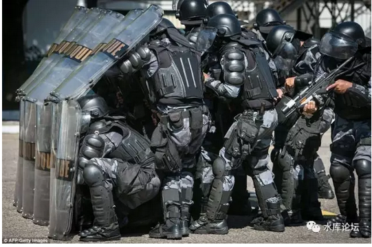
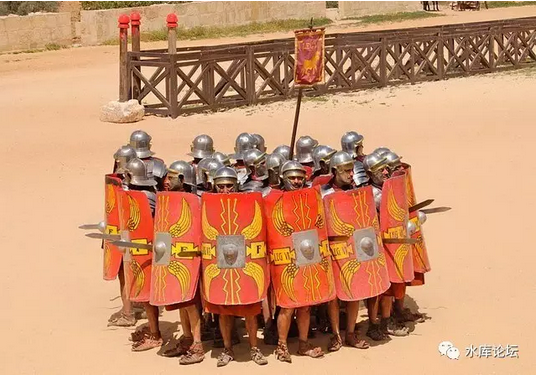
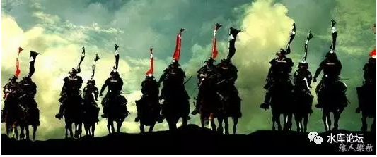

# 士气决定胜负

 

 

> 一）陆军

 

首先，一个清晰的问题：陆军是什么。

绝大多数的人，对于军事毫无概念。

 

甚至可以说，他们玩《三国志》游戏。他们认为陆军的战斗，是二个绿色的方块。

我有20000人，你有10000人。

战斗结果，你全灭，我损失5000。

所谓"杀敌一万，自损三千"。

 

 

这是彻底错误的三观。

真正的陆军战斗（WWii之前），根本不是那么回事。

真正的陆军战斗，其实分为二个阶段："相持"和"崩溃"。

 

 

在战场上，当二只部队相逢。你20000人，我10000人。

但并不一定是20000人的那只部队胜。

 

具体的做法，是接触之后，就开始"伤血"。开始"阵亡"。

而最关键的，是有一个"阈值"。

这个阈值，对于A来说很可能是19000，对于B来说，很可能是6000.

 

 

当达到"阈值"时，整个军团会崩溃！

一旦崩溃，整支军团的战斗力会迅速下降到0.

士兵们会争先恐后地扔下手中的兵器，对于死亡的恐惧笼罩了他们的心头。

失败，象一种瘟疫。会传遍整个军团。

 

指挥官们再也无力聚拢失控的士兵。士兵们转身开始逃走。

而一个逃跑的士兵，是没有任何火力输出的。

 

因此陆军的战斗，往往是1:10的战斗。

战损比从来不是1:1.2或者1:1.5，而是1:10

 

其中的1，发生在双方"僵持"阶段。二方各死10%的人。

此后的9，发生在"崩溃"。一旦军阵崩溃，那就是一面倒的屠杀了。

 

 

从棋语来说，最符合陆军规律的其实是"军棋"。

司令克军长，军长克师长，师长克旅长。

 

陆军之间的较量，就是一种"比大小"的游戏。

看看哪只部队更加精锐，哪只部队更加强悍。一旦分出胜负，就是赢者通吃的局面。

所以司令吃军长，司令本身是没有任何损伤的。

 

 

 

> 二）骑克步

 

另外一种战法，则是根本连"10%的杀伤"也不需要。

我直接搞到你混乱，只要你"军阵崩溃"了。战术目的就达到了。

 

 

其具体的做法，是"骑克步"。

骑克步经历了三个阶段。

-   轻骑兵

-   中型骑兵

-   重骑兵

 

最早的时候，是轻骑兵。

轻骑兵的使用限制很大。他必须"绕"到敌人的背后去。

 

 

在知乎上，看过一个很有趣的帖子。

《现役的坦克，为什么都只有一根炮管？》[\[1\]]

在最初的时候，坦克是"多炮塔"的。正所谓多镏炮塔，是一种信仰。

 

因为最初的时候，坦克的设计，是为了碾压步兵。

步兵通常没有太强的火力。更糟糕没有钢铁防护。

因此坦克常装备多管小炮。主要是虐步兵用。

 

但是，随着坦克的深入。"坦克克坦克"，越发成为主流。

坦克战，成为了最重要的主力决战。

 

 

而同一艘舰艇上，炮管的总负重是恒定的。同一辆车辆上，炮管的总负担也是恒定的。

"坦克战"的约束，使得坦克设计迅速抛弃了诸多小炮。

而把全部的"火力,射程"堆积到一枚主炮上面。

主炮射得远，射得猛。就是最强坦克。

同样道理，对于步兵的"防御阵型"，也是成立的。

最早的时候，人类出现的第一个步兵阵型，恐怕是"圆形阵"。

结成一个大圆，前后左右防护力一样。

 

但随着战争的发展，"阵型"迅速地演变，进化。

人类很快就发现，把"防护力"全部堆在正前方。是一种更有效的方法。

与其四面均匀的防护力。不如加强正面，薄弱侧面，放弃背面。

\
 

如图。在大型的战场中。横面往往会长达几公里。

每一个小型的方阵，由80\~100人组成。面宽只有几十米。

 

你根本就不需要"自己"防守侧面。

因为你的侧面，是战友。

侧面的侧面，还是战友。

侧面的侧面的侧面，还是战友。

 

所以战阵的一般设计，都是集中一切力量，加强正面防御。

而把侧翼和后背，交给友僚负责。

（现代坦克设计，也是这种思路）

 

 

 

在最早的"骑克步"战争中，骑兵要克制步兵，需要非常高超的指挥能力。

因为轻骑兵的战斗力很弱。有的时候甚至就是骑步兵。

骑兵唯一奇袭般的做法，就是绕一个"很大很大"的圈子。

一直到绕到敌军背后。从正后面攻击。

 

另外一种杀伤力"极其巨大"的战法。则是"伏击"。

你想象一下，二军僵持正在最火烈的时候。

突然你的背后，冒出来一群辫子兵。准备开始冲阵。

李自成魂飞魄散。

"伏兵"需要非常强的计谋能力。

 

 

 

而到了"中型骑兵"的阶段。局面就有了极大的改观。

中型骑兵除了步战之外，本身也具有一定的冲击力。可以坐在马上，挥舞马刀或者长枪进行冲锋。

 

因此"中型骑兵"不必完全绕到敌军背后。等待稀少的战机进行出击。

中型骑兵一般配置在本阵二翼。战争开始后，他们就以强破巧，强行从侧翼突入。

 

（如图，更防护侧翼的布阵。但依然会被撕碎）

中型骑兵具有非常强的撕碎能力。步兵方阵稍一不小心，就会被撕裂。

在骑兵史诗中，涌现了无数"英雄"人物。

 

 

而到了第三级，"重骑兵"。重骑兵的冲击力又升了一级。

其最终的威力，"重骑兵"可以正面冲锋。

 

不管你正面防御是什么，我就堂堂正正猛冲过来，堂堂正正把你碾压粉碎。

重骑兵因为其狂猛的冲击力，几乎无视一切防御。

完全无法抵挡。

 

在封建时代，只有一种兵种可以正面和重骑兵对冲。

并且把重骑兵撕得粉碎。

那就是象兵。

 

 

就杀伤力本身而言，"骑兵"直接杀死的人数并不多。

譬如欧洲一支典型的军团配置，"勇敢的心"20000人的混编军团，重骑兵仅只有300骑。

 

骑兵碾压一遍之后，关键是让你"混乱"。整个步兵的编制不复存在了。

军队"炸营"了。所有的人大喊大叫，满脸是血。

惊慌的农夫抛下武器，四散开始逃命。

重骑兵撕碎战场，再让其他兵种尾随追杀。99%的敌兵死于追杀途中。

 

 

 

骑兵对于步兵的碾压式优势，在北宋"好水川"之战后，甚至都引发了一场讨论。

当时认为，唯有骑兵才可以克制骑兵。

于是就有士大夫研究，在二湖或者关中地区，隔开一大块区域，辟为牧场。专门为培养马匹，骑兵，专业骑士使用。

 

然而，如果你本来是大片的"农田"。

这些农田原本是可以出产农夫，出产步兵的。

 

 

计算的结果，大约是每一个骑兵，成本相当于25个步兵。

造400个骑兵，就会少造10000步兵兵团。

在4000骑兵，就会少造100000步兵兵团。

 

这事还没完。北宋的士大夫们，居然又认认真真地讨论了一会。

用25个步兵，换一个骑兵，到底值得不值得。

可见骑兵之宝贵。

 

 

 

> 三）杂牌部队

 

步兵战争"僵持\-\--崩溃"的游戏规律。导致另一个结果，就是很多名将，往往不喜欢"增兵"。

 

如果我自己带一个主力兵团30000人。

你非硬塞给我10000人杂牌军团，要求一起带上战场。

很多名将是拒绝的。因为反而会拖低战斗力。

兵并不是越多越好。

 

 

因为任何一个战场，其"正面"都是有限的。

只能投入几千兵力。在一个几公里的侧面进行拼杀。

 

而陆军"僵持\-\--崩溃"的规律决定了。一旦炸营，那就是兵败如山倒。你再多三千五千，差别也不大。一样是炮灰。

如果打赢了。打赢了更不需要你了。

 

 

更糟糕的是，对于无数名将梦魇般的一个可能。"猪队友"。

也就是出于某些政治原因，你不得不将一个很"渣"的盟军放在了阵线第一排。

 

等到战争开始时，这个"猪队友"死掉了5%的人群，抵挡二三个回合。

然后就哭爹叫娘崩溃了。整队人溃散着向你本阵奔来。

这时候你是管好呢，还是不管好呢。

 

 

如果你不管的话，"崩溃"这种事是带有传染性的。漫山遍野跑来的"败了，逃命啊"的溃兵。很有可能把你本阵也带坏了。让你跟着一起炸营。

如果你管的话，你就要用强弓硬弩，把他们全部都"射杀"在营寨门前。

-   一方面，哪怕几千头猪，\"射住阵角\"也不是那么容易。

-   另一方面，再怎么说也是盟军。回去以后政治上的麻烦肯定无穷无尽。

 

 

在历史上，凡是拼凑了各个"部族"兵团。到最后凑成十万，几十万大军的。下场都不怎么好。

远的，有大流士迎战亚历山大。五十万野战部队一昼而亡。

 

 

近的，则有苻坚兄弟"淝水之战"。

晋军的战斗力，真心怎么都不能说强。

苻坚的错误在于，他带了无数无数的"杂牌部队"。而且那些新被征服者心还不齐。

 

前方一接仗，"猪友军"顿时就崩溃了。漫山遍野的往回跑。

往回跑的时候，冲散了苻坚的本阵。

前秦大军草木皆兵烟消云散。

 

 

 

> 四）风林火山

 

对于陆军[游戏规则]"僵持\-\--崩溃"，也不是没有明眼人。

古往今来，有无数研究兵书的人。力图避开这个陷阱。

 

 

其中最典型的，是武田信玄。

武田信玄的用兵信仰，称之为"风林火山"。

疾如风，徐如林，侵略如火，不动如山。

 

武田信玄的用兵理念，其实是"永远不要让部队崩溃"。

好比我有15000人。但我永远永远也不会把15000人都投入战场。永远只派1500人。

 

以一个标准的武田军制设计：

-   风二部，合计2500人

-   林二部，合计2500人

-   火二部，合计3000人

-   山一部，合计6000人

 

 

在每一次战斗中，武田信玄会派出他的爪牙。或者风部，或者林部。

轻骑兵，或者长枪兵。

侵略如火，剽悍如林。

 

但是，你回过头呢。

"山"在山上。山是永远不动的。

 

 

对于武田军来说，每一部各有胜负。世上没有不败的军队。

但是对于"风，林，火"来说，他们都很清楚。他们只是小股外围部队。

 

每一次战斗"风，林，火"都竭尽全力。

使尽勇气和谋略去战斗。

 

可是他们从未绝望，从未失望。

每当他们感到疲惫，对胜利感到疑惑，对战斗感到困扰时。他们就抬头看看上方。

 

 "山"在那里，那个魔神一般的男人，他就坐在那里。

跟在他身边的，是黑压压的，数之不尽的战友和同袍。我们的"主力"在那里。

 

于是将士们就释怀了。"不是我打不过你"。

"我们还有90%的士兵在背后"

"换一批人上，肯定揍死你"。\

 

 武田信玄兵法的奥义，其实在于最后一句："不动如山"。

山是不动的。永远也不能动。

他虽然带了14000士兵上战场，可是能投入战斗的，永远只有8000人。

 

剩下的6000人是他的"主阵"。

"山"字阵是用来压阵的。他永远也不能亲自上场。

 

只要"山"还在，地面上还在战斗的部队，就能保持很高的士气，也不容易崩溃。

"风林火山"可以保证每一次投入战斗的部队，都是最佳状态。

 

"山"如果下场，难保连底裤都输掉。

 

 

 

武田信玄死了以后，他的儿子（孙子他爸）继位。

在年轻人的眼里，老头子总是愚蠢的。凡事都不如他聪明。

 

长筱之战，武田家倾巢而出。4小时之内战死所有骑兵。

武田家丧失全部野战兵力。

从此积尸待宰。

八年后武田胜赖切腹。

 

 

（未完待续）

 

 

（yevon\_ou\@163.com，2016年12月20日晚）

 

 

\[1\]《现役的坦克，为什么都只有一根炮管？》https://www.zhihu.com/question/44238659/answer/133901977
