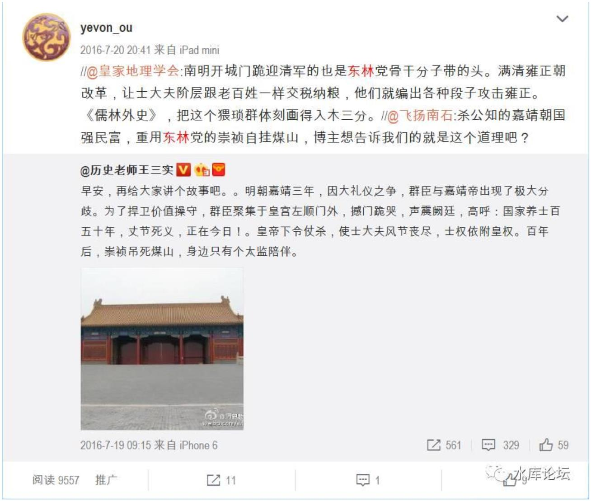
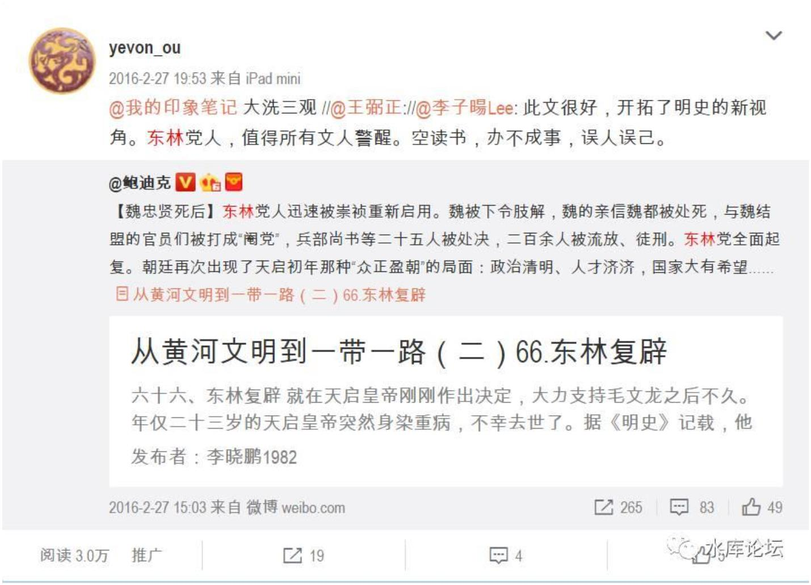
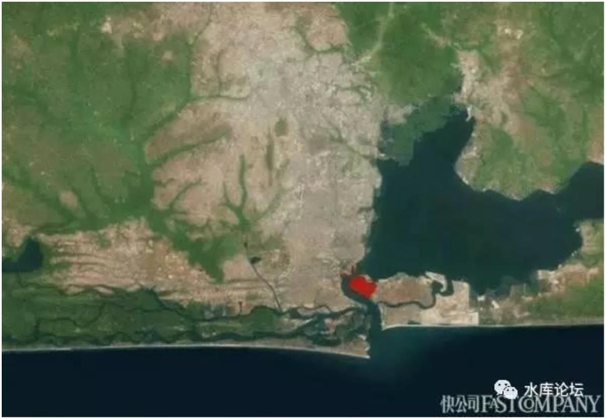
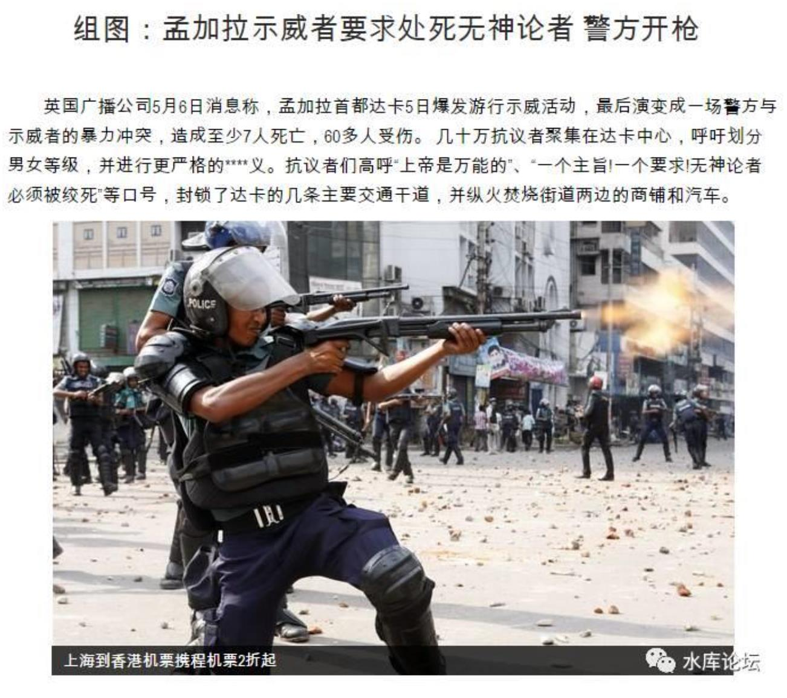
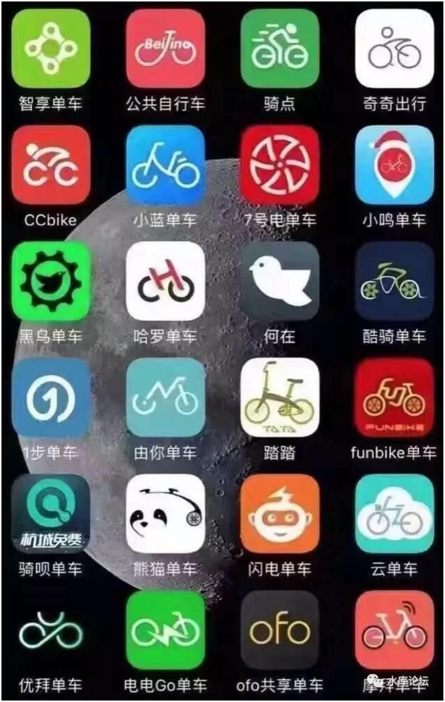

# （三）恒纪元与乱纪元 \#F840

菁城子：几位同道朋友，在群里互致新年祝福。一位老师的祝语是四个字，国泰民安。挺宏大的，不知他是

否别有深意（我感觉是有）。我读到这一句，很感慨。

我们这一代人，很多人都在突破身世际遇的限制，达到前人不敢想的成功（这种成功的普遍性，国外也不多

见）。如果有一个叫"中国梦"的时代，我觉得只有这时候了。

个人成功，要看个人奋斗，也要看历史进程。在时代浪潮面前，个人力量往往又轻微得可怜。我们很幸运，这

二三十年所乘的浪头，基本是狂飙突进。以后二三十年呢？我个人并不很乐观。

当然，我不是说要打仗，生灵涂炭。而是说，经济快速发展的很多有利因素，从人力资本、改革进取，到社会

观念，今不如昔。经济发展变得缓慢沉重。

科技还在发展，拉动经济增长的能力，却越来越疲软。想想看，日本人就眼睁睁看着科技浪潮呼啸而过，经济

几乎没有增长。美国人也感慨，这一代美国人的日子，比他们的父辈难过。于是，有了川普变革。欧洲就更不

用说，很多人甚至在预言欧洲文明的沉沦。

谁还能相信，中国会是例外呢？

> 3030

我们这一代人，将见证国家经济从高速发展到放缓，停滞。也许，情形会更差。到时，还会发生什么呢？不知

道。我只是确信，暴富神话会减少，"中国梦"会成为历史，很多悲剧会丛生。我们会亲历，更多是由后辈承

担。

我们不是生活在孤岛，大环境的晴转阴，确实与我们息息相关。希望这一天能迟一点来，并且能尽快好转。

第一次如此真诚地祝福，这个国家，国泰民安。

一）抗药性

首先，我们要讲一个故事："有没有一种药物，可以彻底地杀灭所有的病菌"。

人类只需要一枚仙丹，包治百病。

答案是：没有。

人类历史上最成功的奇遇，是一次偶然的情况，发现了"青霉素"。

青霉素刚刚面世时，可杀死世面上 99.9999%的细菌。

这也就意味着，无论战场上多严重的流脓化肿，一针青霉素下去，保证所有的

病菌杀得干干净净。

> 3031

肺炎，肺结核，脑膜炎，话唠，无论什么样的炎症，一针下去，保证霉到病

除。

青霉素的原理，似乎是它的分子式，含有一个巨大的突出部："磺"。

如果它和别的分子反应的话，则把这个大分子也带过去了。分子太重，细胞爬不动。于是就饿死了。(?)

可是，在人类享受了五十年"青霉素"的馈赠之后。

目前，对于青霉素的"抗药性"已经越来越强。越来越多的"超级病毒"是青霉素杀不死的。

科学家们很担心，再过二十年，我们可能没有抗生素可以用。

这背后的道理，遵循这样一个逻辑。

青霉素是可以杀死 99.9999%细菌不假。可还有 0.0001%的细菌活下来。

对于这 0.0001%细菌来说，它们就是经历了"白垩纪大灾难"之后的幸存者。

大灾难之后，生灵荒芜，百万者幸存不到一个。

可是对于这"唯一"幸存者来说，反过来\~也意味着他享受到了 100%的土地资

源。

它抬头望去，蛋白质，营养，脂肪，这些 Nutrition 全部都在呀。

> 3032

宛如战乱平息后的大地，幸存者找到了无穷无尽的农庄。

幸福快乐地大肆繁衍。

于是那 0.0001%的"青霉素幸存者"，他们获得了"加速进化"。

比平时高千百倍的子孙后代。繁衍速度和进化速度。

知乎上有个贴，脑洞大开。

"能否改造 AIDS病毒，使之可以在空气中传输"。\[1\]

答案是不可能 。

因为当 AIDS在空气中传播时，它其实是在和花粉，孢子，真菌，感冒病毒等等

在争夺生存空间。

生物之间的竞争，是异端惨烈的。

每一分力量都要用到最尽。

艾滋病病毒的特点，是他在"人体"中特别适合生存。怎么杀也杀不起。和血液混在一起，特别有隐蔽性。

而这样的"特性"，在旷野中毫无用处。

一阵狂风吹来，AIDS病菌就先被冻死了。超过 43度又被热死了。

> 3033

过一会沙尘暴又被干死了。

再举一个例子。中国史书上，中原王朝对于"漠北"草原的征伐不遗余力。

从汉代伐匈奴，北魏击柔然，唐代伐突厥，明初灭北元。

几乎每一代，都把草原王庭连根拔掉。

可是结果如何。

"野火烧不尽，春风吹又生"。

王朝的征伐，就如同青霉素。大规模灭绝的结果，是剩下了一片片肥沃的土

地，宽广的牧场。

匈奴崩溃之后，鲜卑人逐渐生息。最终形成了"五胡乱华"的西晋入侵。

突厥崩溃之后，契丹在其故土兴起。

后来又冒出了蒙古民族。

新锐一个比一个厉害。

这关节，最后还是清王朝学乖了。

> 3034

清王朝不再征伐蒙古。反之，却是扶植一批"腐败透顶"的蒙古王爷。

草原反正总是要有主人的。

与其出成吉思汗，不如培养一批胖得象猪一样的成吉思汗的子孙。

于是草原太平。

普通细菌，才是灭绝艾滋病细菌的最好竞争对手。

这些例子告诉我们的是什么呢。

对于一个超大型的，复杂的，混沌的有机体。Lift find it's way.

物竞天择，适者进化。

总是能产生抗药性的。

二）政体

天下有没有"万世不移之基业"。

朱元璋整天烦恼这个问题。

作为开国皇帝，朱重八拥有"设计制度"的权力。

他可以设计游戏规则。然后在他死后，看着整个帝国象滚保龄球一样，滚到哪里算哪里。

> 3035

可是如何设计制度，才能"江山永固，铁打的江山万年红"呢。

朱重八为此操透了心。

野史上说，朱元璋问相士，大明可有四百年气数。

相士掐指算后，说哪有四百年，连三百年都不到。

朱元璋做了中国政史上最重要的几个改变。

> • 他废除了宰相制度
>
> • 他废除了门阀制度
>
> • 他建立了特务制度

后人评论大明王朝，说大明"对文官也不放心，对武官也不放心"

"对谁都不放心，最后只能依靠特务"。

武官过盛，则容易产生藩镇作乱。

文官过盛，则容易产生王莽司马懿。

大明于是重用宦官和厂卫。

可是，历史是很有趣的。

> 3036

朱元璋这种没读过书的文盲是不懂的。

历史是具有"反作用力"的。任何政策，都是会产生"抗药性"的。

一些大一统的王朝，如周汉唐宋清，他们采取了看似"愚蠢"的政策。

但是持身以正，待人以诚。

王朝的寿命反而比明代更长。

大明"不信文武，偏袒厂卫"的宦官文化，最终则是"适者生存"。

在明末，大家都搞清楚了游戏规则。

在这样的情况下，只有一种人可以活得下去"抗药性"。

这种人，就是："清流"。

东林党人。

http://weibo.com/1853047530/DFIfToi3V?from=page\_1005051853047530

> 3037

"清流"的意思，就是他们不干活。

他们专负责"喷"。

干活多累啊。

而且干活有一个坏处。你越是积累功劳，皇帝越是怀疑你。

朱家帝室中人，刻薄寡恩。臣子们没一个好下场。

> 3038

你越是用力干活，不但没有奖赏。而且还要想想刘基李善长蓝玉于谦王阳明张

居正袁崇焕。

但是"喷子"就不一样了。

首先，喷子不干活。动动嘴肯定比跑断腿舒服。

其次，喷子没有政治风险。

你既然没有贡献，就没有威望。对皇帝也没有威胁。

获得个人声誉的同时，搭着大明的小船不会沉。

久而久之，大明的庙堂之上，就全部都是"清流"。

噢，用今天的话说，叫"公蜘"。

说起大道理来说，公蜘们一个比一个义愤填膺。

你干得再好，贡献再多。有没有破坏环保啊，有没有碾压花花草草啊。

喏，我就说你人品不好吧。

"多做多错，少做少错。不做不错"。

唯一不犯错的，只有不干活的人。

帝王既然刻薄寡恩，就不要怪臣子们产生抗药性。

> 3039

参考阅读《澳洲警察被舆论缴械 如今自食恶果 中国圣母婊在哪里》\[2\]

15年前，澳洲瘾君子嗑药后，在市区横冲直撞。被警察当场击毙。圣母婊们大发雷霆，举街哀悼。警察

被迫停职检讨。

今天，瘾君子横冲直撞 5个小时，撞 5死 37伤。

"清流"的结果，明末庙堂上，全部都是东林党人。

打仗他们不行。捧上去一个杨镐，被咔嚓了。捧上去一个史可法，又被咔嚓

了。

可是咬人他们在行。咬死了一个李成烈，又再咬死了杨嗣昌。

最后还咬死了"迁都，议和，太子"三大决议。把崇祯皇帝坑到沟里。

现在史家总结明末。一般就六个字：明实亡于东林。

张居正敬谏："只用循吏，不用清流"。

http://weibo.com/1853047530/DjOoQr0sZ?from=page\_1005051853047530

> 3040

我们没事突然扯开了讲"明史"干什么呢。

因为在今天的中国，面临着一模一样的问题。

在新中国，有一个词叫做"精致的利己主义者"。

据说主要的盛产出产于北大。

"精致的利己主义者"就是完美的"抗药性"病毒！

他们熟悉游戏规则。

在马克思主义，在太祖列宗建立起的话语体系内，游刃有余。

> 3041

"精致的利己主义者"不是利他。

他们对于利国利民的事情，毫不上心。

对于启发民智，万民福祉，民脂民膏的事情，毫不上心。

"精致的利己主义者"唯一关心的，是自己的小九九。

是在官场中能否升迁。整风运动会不会伤害到自身。

而且他们最擅长伪装，最擅长慷慨激扬，表现得最为"进步"的就是他们。

"精致的利己主义者"是组织的毒瘤。是社团的癌细胞。

最终能摧毁这座大厦的，不是美帝帝国主义。不是农奴和农民。

任何一个大一统王朝，最终都是被"自身的腐败官吏"所压垮的。

而青霉素能否杀灭"精致的利己主义者"呢。

答案是不能。

人家本身就是"抗药性"结局。

> 3042

三）恒纪元

我们把视野再放得大一点。放到"地球地图"这一个超级大的大地图。

按照葛剑雄的说法，中国 3000 年文明史。从周武王牧野之战算起。

三千年中，"恒纪元"和平年代 1500 年。

"乱纪元"战乱分裂 1500 年。\[3\]

差不多正好是一半一半。

恒纪元并非永恒。

如果我们看"世界地图"的话，则战乱频繁的情况，更为严重。

在 1800 年之前，严格地说，全世界是没有任何一年，没有一场战争的。

拿破仑战争（1803\~1815）可以说是"第 0 次世界大战"。

拿破仑战争之后，欧洲享有了近一个世纪的和平。

当中虽然有普法战争的插曲（1870），但总体是和平的。

1914\~1918 是一战。

> 3043

1939\~1945 是二战。

也有一种说法，认为"一战二战"是停战期比较长的同一场战斗。因为其政治缘由是连统的。

那么，各位发现问题所在了么。

又一个 100 年过去了！

在过去的 70 年中（1945\~2015），世界经历了一个"奇迹"般的年代。

在这个七十年中，马放南山，兵革不兴。

世界各大国虽然有冲突，有冷战，但都处于政治处理的层面。

因为长久的和平，商业得以发展，科技得以进步。

始发于英国的工业革命，可以逐渐向全世界扩散。

先是日韩，亚洲四小龙，亚洲四小虎，最后来到了中国。

若没有这漫长的和平，是断断赶不急让你安心建设内政的。

各位是吃不到粮食和肉的。

但是，当你享受着丰厚的"和平红利"时，你有没有想过。

> 3044
>
> • 和平是必然的么
>
> • 和平可持续么
>
> • 和平是正义的么！

很多人"忘了，忽略了"一件最最最最重要的事：

目前的全球和平，是极其不自然的。甚至是反常态的。

目前的"全球和平"，或曰"二战之后的国际秩序"。他是建立于一个非常狭

窄的基础上；

1\) 美国是世界警察

2\) 美国愿意当世界警察

这个伦理要求，是非常非常非常高的。

1）首先，美国要有压倒性的绝对实力。

二战结束时，美国占全球 GDP 的 50%。时至今日，美国依然是单一经济体的绝

对头领。

> 3045

http://baike.baidu.com/item/世界各国
GDP排名

> 排名 国家或地区名称 GDP 总量(亿美元) 所属洲
>
> 1 美国 174979.6 美洲
>
> 2 中国 103856.6 亚洲
>
> 3 日本 48175.2 亚洲
>
> 4 德国 38682.9 欧洲
>
> 5 法国 25656.2 欧洲
>
> 6 英国 25320.5 欧洲
>
> 7 巴西 25038.7 美洲
>
> 8 印度 21172.8 亚洲
>
> 9 俄罗斯 21090.2 欧洲
>
> 10 意大利 19538.2 欧洲

如图。美国依然符合"二强定理"。美国的实力，超过第二名+第三名总和。

更强调下，美国的军费比例非常高。堪称"穷兵黩武"。

单单以军费论，美军占全世界的 50%

2）美国有"世界警察"的实力，还要有"世界警察"的意愿。

做好人，不一定有好报的。

世界警察，尤其是一件得罪人不讨好的事情。

过去十五年，USA 依次在伊阿叙利埃打了几场仗。

耗费军费无数。

结下仇子无数。

> 3046

这种"吃力不讨好"的行为，源于美国是基督教国家。骨子里的信仰：

Manifest Destiny

美利坚人生来就是拯救世界的。传播人类的正义。

战斗为了信仰，而不是利益。

所以"世界警察"的出现，是极其偶然的事情。非正常态。

否则的话，你换成世界第一大国是苏联。

苏联美国实力比 10:6

你想象世界会成什么样。

四）白左

从任何一个标准来看，盛世不可持续。

二战之后，以美国为主导的，1945\~2015的长久和平。

"世界警察"的和平秩序，从任何一个角度来看；

都-不-可-持-续。

> 3047

这其中有很多因素，有中国的崛起，有亚洲的工业化。甚至还有拉美的工业

化。

但最核心重要的因素，还是："抗药性"。

当一种秩序持续久了，适应于这种秩序的病菌就会应运而生。

没有例外。

美国"长久和平"世界警察的"病菌"是什么。

是白左。

白左是这样一种奇葩生物。既然从她们生出来那一刻起，世界已经如此和平，美国已经如此强大。

物资已经如此富裕，遗产已经如此丰富。

那么，为什么不肆意妄为呢。

在白左的人生中，他们拥有一切，除了危机。

> 3048

因为生产力已经如此发达，我们为什么不拨出一点生产力，用于保护环保呢。

因为食物已经如此富裕，我们为什么不保护猫猫狗狗。

金鱼，象牙，鲨鱼，非洲金丝猴呢。

既然我们生活在"无忧无虑"的天堂。

为什么街头还有人露宿，黑人小孩还要挨饿呢。

既然物资已经丰富到"享用不尽"。

为什么还要有血汗工厂。为什么还有人辛勤工作。为什么有人大年夜还要加班

呢。

为什么女性不能有产假。

为什么企业没有心理牧师，崩个指甲算不算工伤。

为什么歧视同性恋呢。

环境是怎样的，菌种就是怎样的。

美国长期的和平，伴生了长期的白左。

象 Trump 的努力，其实是白费的。

因为环境决定菌种，只要环境不改变，白左就是最适合生长的植物。

> 3049

而我们知道，白左生长的结果呢，则是大灾难。

明实亡于东林

美帝亡于白左

白左的结果，先是窒息了美利坚的工商业。

工业革命的始发地，大英帝国去年关闭了最后一个煤矿。发电只用天然气和重油。钢铁业，化工，也削减到几乎零。

然并卵，伦敦继续有雾。因为二氧化碳的排放 90%来自于海洋，小清新的反工

业纯属庸人自扰。

《重度雾霾突袭伦敦 市长警告:空气\"毒\"到令人羞愧》\[4\]

白左的结果，次是荒废了美国的财政。

奥巴马八年，等他卸任的时候，已经几乎把科技研究，基础建设，市政维护砍

到了砍无可砍。\[5\]

美国不再为未来投资了。

相比之下，美利坚政府的支出前三位是：

> • 福利：60%
>
> • 利息：25%
>
> 3050
>
> • 军费：25%

三项相加，已经超过了 100%。各位，这是自杀的节奏啊。

白左的第三个问题，是虫族问题。

玩《星际争霸》的人都知道，部落分三种；

> • 神族：注重质量，数量稀少
>
> • 虫族：数量庞大，质量很低
>
> • 人族：均衡二者之间

"长久的和平"造成的一项扭曲，即：

如果没有屠杀，那还要质量何用

好比《StarCraft》里面，如果规定了某些时段不许开战。

则虫族自然占据非常大的便宜。

如果再规定"一人一票"，按人数分配福利。

那神族真的要哭晕在厮所了。

> 3051

生物界的进化，"质量"的本身，就包含了"屠杀"的意义。

如果没有屠杀，还要质量干什么。

因为鱼群需要撕杀，需要争夺食物。

所以才进化出了牙齿。

如果人工喂养。则膘肥体壮最擅长生育的鱼种就会获得优势。

"长久的世界和平"世界警察，本身就是对"自然秩序"的一种扭曲。\[6\]

在这种被扭曲的秩序下，某些物种就会过渡生长。

所谓"黑墨绿"，在乱纪元是不会有那么多垃圾的。

五）乱纪元

我们继续看一些文献。

首先是美军的衰弱。

> 3052

美国目前，是典型的"帝国晚期"。

对于一个帝国来说，先有人民，后有财政，最后则有军事。

秩序绝对不可颠倒。

而美国的财政已经瓦解。"基建投资"趋向于零。财税收入枯竭。

唯独军事还保持着强大。

这是不可持续的！

参阅《美国空军先进到什么程度？》

www.zhihu.com/question/38337451/answer/141952025

另一方面，因为"长久的和平"。诸多生物都变成了扭曲。

推荐阅读，马前卒的文章：

《在我们有生之年可能发生哪些巨变？》

www.zhihu.com/question/28176394/answer/139342070

埃及正常的人口是 4500W，目前因为西方援助，已经膨胀到了 9000W。

动荡不安，是注定的结局。

> 3053

更为糟糕的，是非洲（霸主）尼日利亚。

这样小小的土地上，聚集了 2500W 人口。

基础设施几乎为零。

犯罪，瘟疫，战争，随时可能发生。

这种地区如果若要"稳态"，那才是见鬼了呢。

只要你"世界和平"，虫族流就一定会大生特生。

这样的情况下，西方白左小清新还要"珍惜每一条人命""让世界充满爱"。

任何有稍微智商的人都知道，"长稳态"不可持续。

而且你还不能拯救他。

> 3054

2500W 人口的时候你去救，它只会继续增长为
4500W 野人。

引用马前卒的原话：

"所以，我觉得这一代人很有可能看到有史以来最惊人的非正常死亡事件，分布之广、规

模之大会让 20
世纪的世界大战相形见绌，让纳粹党的集中营自愧不如。在不使用核武器甚

至没有重武器参战的情况下，十几亿人，上万座城市依然会在短期内变成灰烬。21
世纪绝

不是一个轻松的世纪"。

> 3055

好吧，还有偷偷放一个喝咖啡的链接。

《怎么看兰德公司的报告，以及未来中国国运，以及中美冲突的可能性？》\[7\]

六）结语

去年三月，我们曾经写过一列文章。是讲经济危机的。

> • [论生产过剩 \#F320]
>
> 3056
>
> 
> • [论买不起 \#F330]

在真正的经济学，在奥派学者看来。

"经济危机"并不是坏事。

甚至可以说是好事。

因为生产的过程中，肯定有很多"错误"。

譬如在没有人的地方，大规模营建"鬼城"。

譬如高得吓死人得钢产量。

譬如遍地补贴烧钱的互联网单车。

所谓"经济危机"，其实是一种惩罚。

把那些"无效，浪费"的企业罚破产。让他们退出市场。资源重新配置。

单车公司，就应该死掉 9/10.

> 3057

如果经济领域，我们有"经济繁荣"和"经济危机"。二者皆为好事。地球进化。

> 3058

则 zz 领域，我们有"恒纪元"与"乱纪元"。二者皆为好事。

对于政治和历史，长期以来，国人一直有一种思想。

"宁做太平犬，不为乱世人"。

最好是太平盛世，永久恒常的延续下去。

大家躲在家里看连续剧。为了办公室一点鸡毛蒜皮的事，追剧 40\~50 集。

很遗憾，"恒纪元"不可持续。

因为"长久的和平"在延续同时，毒素也在积聚。

任何一种制度都有缺陷。最终总是有一种"抗药性"细菌活下来。

浑身化脓，头顶生疮，恶臭扑鼻。

长久的和平，使得人类变得懦弱，懒惰，伪善。

娘炮充斥着白左，真汉子反被剥削。劳动者缴纳重税，政府管制无所不在。

和平的本身，杀死了和平。

> 3059

我们站在一个波澜壮阔的大时代的入口。

恒元不再，黑夜降临。

站在永夜的入口，乱纪元已在招手。

（yevon\_ou\@163.com，2017 年 1 月 27 日初一）\[8\]

\[1\]《有哪些医学知识概念已经更新或改变，但不为大众所知？》https://www.zhihu.com/question/29785376

\[2\]《澳洲警察被舆论缴械 如今自食恶果
中国圣母婊在哪里》http://mt.sohu.com/20170124/n479517961.shtml

\[3\]大分裂由东晋"八王之乱"，至隋一统。AD291\~589，共 298年。

小分裂由 AD907\~960，五代十国至北宋

\[4\]《重度雾霾突袭伦敦
市长警告:空气\"毒\"到令人羞愧》http://news.163.com/17/0124/14/CBI6HCTR000187VE\_mobile.html

\[5\]《奥巴马：一个技艺精湛的政治演员》http://www.ljzforum.com/article/453371.html

\[6\]自然秩序也称为上帝秩序。人不可僭越神。

\[7\]《怎么看兰德公司的报告，以及未来中国国运，以及中美冲突的可能性？》

https://www.zhihu.com/question/53936074/answer/137617930

\[8\]最后补充一下，对菁城子我写的是"国泰安康"，而不是"国泰民康"。乱纪元对国家是正面有利的。

而民众无需保护。甚至说，《但丁密码》本身就是乱纪元的部分。

[阅读原文]
