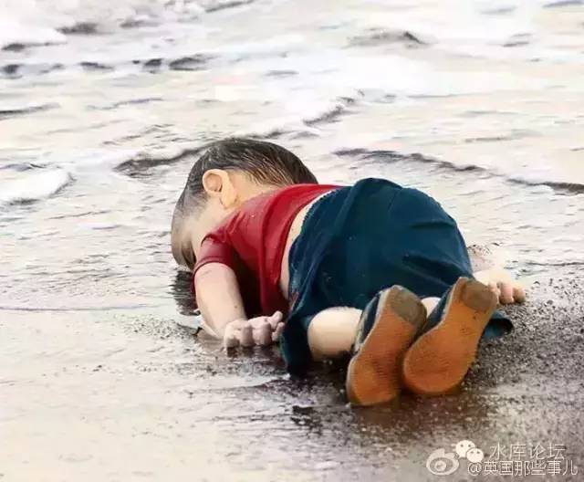

# 我对人口学的粗浅理解 \#F85

原创： yevon\_ou [水库论坛](/) 2015-11-21

我对人口学的粗浅理解 ~\#F85~

2000W成年男子，差一点征服了全世界。

\-\-\-\-\-\-\-\-- 后世对日耳曼人的评语

一）人口学

大约一年之前，我开始对人口学感了兴趣。

于是就在当当上买了几本书，如《人口学概率》《人口统计学》，把能搜到的全买了。

看书的结果，却是十分地失败。

象这种"团结在mzd思想下的无产阶级人口学"

"假设地主500人，工人9500人，求地主人口比例"

"男性104人，女性96人，求男女人口比"。

显然，在这几本书中我没有学到任何知识。再说我事情也多，后来就没机会继续求书。

所以，以下几条，都是我坐公车的时候自己想出来的。贾语村言，读之一笑，不必当真。

二）人口模型

假设一个国家，"适龄男女"的人数是2000W人。

当这个国家人均寿命45岁的时候，他的总人口就是4500W人。

为什么这么说，因为20岁一代人。

45岁预期寿命的话，大约相当于二代半，相当于古人看见外孙出生不久就死掉了。

好了，现在我们把这个模型拉升。

一个民族，"适龄男女"2000W人口，但是他的人均预期寿命，不是45岁，而是90岁。

这会发生什么情况呢。他的"全国总人口"会增长到9000W，成为一个象日本一样的国家。

这就是"二战"之后发生的实际情况。

二战之后，全球基本和平，再也没有大的战争。

我D于1949年获取政劝，如果你看看人口学文档的话，都会写着"生育率不变，而死亡率急剧下降"。

另一方面，1840年鸦片战争使西方文明，现代科学被带到了东方。

虽然因为大清昏庸，连续战争动荡等种种原因，中国始终没开始真正意义上的"工业化""现代化"进程。

可一直到1953年韩战尘埃落定，工业化开始起步。青霉素逐渐普及，卫生消毒免疫等医学意识扫盲教育，西医普及，中国的人均预期寿命，开始急剧提高。

飞快地由人均45，上升到人均65。再升到改革开放之后的今天约75岁。

这就是今天这个世界，现实发生的事情。

假设你每一年新出生的人口都是100W，这个数字恒定不变。

15\~35岁间能生育的"适龄"人口是2000W，这个数字也永远恒定不变。

则你这个国家预期寿命是45岁，你国家就只有4500W人口。是个中型国家。

如果你的预期寿命是90岁，你国家就有9000W人口。是"5020俱乐部"的大国。

而这二个国家的新增婴儿人口呢，其实是一样的！

换一个词，这二个国家的"生命力"呢，其实是一样的。

三）世界大格局

全球人口，从二战后的25亿，一路增长，到1999年突破60亿，到2011年突破70亿。被誉为"人口爆炸"，甚至有人忧心忡忡马尔萨斯陷阱。

但我要说，全球人口并无半分增长，甚至还下降了，你相信么？

理由很简单，"全球人口"突破70亿，靠的并不是"适龄男女"的增长。

而是靠的人均寿命的增加。

也就是人类，作为一个物种，繁殖力生命力并没有增加。

仅仅是"世代"多了。由二代同堂，变成了今天随处可见的四代同堂。

但是，这个效力，这个现象，是不可持续的。

人类的预期寿命，由30岁增长到45岁是很容易的。只要不打仗，全球和平。

由45岁增长到65岁也很容易，只需要一些非常廉价的药物，如抗生素，青霉素。

由65岁增长到85岁相对困难。需要一整套的医疗系统，攻克癌症炎症。平时也要吃好住好，过富贵闲人的生活。

由85岁增长到115岁几乎不可能。需要生物学上大规模全面的突破，海量医疗资源，以及大规模资金投入。

所以，如果人类"适龄男女"数量不增加，仅仅是依靠预期寿命增加，这条路几乎要走到尽头了。

如果你读一些学术文章，地球人口突破70亿后，速度已经放慢了下来。和平潜力渐渐挖尽，呈现明显的减速。

有分析认为，地球人口的总数很可能维持在100亿左右。随着"100岁生命线"不可突破，人类人口也不会再增加。

四）日本

日本几乎是人口学上最典型的例子。

因为传统的妖魔化教育，中国学生对日本的印象有非常大的误差。

最简单一点，1853年日本开埠之前，全日本的人口是多少？

答案是4500W人口。

这绝对不是一个小数字，更不是中国人印象中的几百万人小部落。

当时蒙古50W人口，西藏150W，满州大约300W。你想一想，一个4500W人口的邻国是什么概念。

4500W人口就在卧榻旁边，而你还对这个国家这个民族几乎一无所知。不得不说，大清昏庸是要负点责任的。

英国在发动鸦片战争的时候大约3000W人口，今天也不过6200W人口。

当日本"开化"之后，现代医学逐渐传入日本。同时，日本的人均寿命也在不断增长。

到今天，日本大约有1.26亿人口。比明治时期增长三倍。

而人均寿命84岁，还以每年0.5岁的速度在增长。

这是一个非常非常恐怖的数据。恐怖到什么地步呢，如果每年"预期寿命"增长1岁的话，那就意味着日本人永远不死！

可是，如果我们仔细观察日本，就会发现日本的国力，并没有比"明治"时期增长多少。

因为今天的1.26亿人口，但是预期寿命也增长了一倍。由"二代同堂"变成了"四代同堂"

真正的"适龄男女"，15\~35岁之间的可生育男性女性，并没有增长多少。一百五十年，一共仅增长了+50%

从文明的长河而言，"日本"真正的人口增长是50%，而不是300%。

五）老龄化的后果

如果一个民族"适龄男女"并没有增加，仅仅是和平医学美食使得"预期寿命"增加。

则这个国家，一开始会表现得人口增加。

这个人口增加的趋势，会达到一个顶峰。譬如日本就是1.26亿。然后在平台期徘徊，甚至小幅下降。这就是"老龄化"现状。

更为恶劣的，老龄化其实会排挤"适龄男女"数量的。

因为社会总量的资源是一定的，日本的国土面积就这么一点。人口密度是全球平均的七倍。

老人太多，反而使得年轻人觉得生存空间被压迫。住房和活动空间太过于拥挤。这反而会减少年轻人的数量。

也就是说，在"老龄化"的同时，当日本预期寿命从84岁向100岁迈进，随着更多的老人挤占空间。

"适龄男女"会被挤占压缩，连2000W都维持不了，甚至只有1900W，1800W.........

这就是日本的现状。随着老人越来越不死，年轻人越来越少，而且越来越不肯生婴一代。你可以看到他的总人口在1.26亿附近徘徊，但摊开了放大镜看，细微结构则不停地在调整。

直到日益恶化，恶化到生产力赶不上老人数。

六）战乱地区的人口学

有一些地区，他们的人口结构非常旺盛。

典型的譬如中东，伊斯兰国家，以及非洲一些地区。

在这一些地区，首先他们的"预期寿命"非常低。通常不超过45岁。

因为无休无止的打仗，这些国家也非常地贫穷。连稳定的自来水，电，煤气供应都不可得。

战争是老人的噩梦。战争一来，老人都死了。

不要以为上海，北京，东京，纽约，如何的富裕繁华。

一旦面临战争，几乎所有的80岁以上老人，都没有活下去的希望。史书甚至都不会记载他们如何死去。譬如全家逃难，被抛弃在老宅。又或者逃难途中，象电影《1942》般匆匆消陨。

中东国家，他们没有老人。因为战争中老人活不下去。

另一方面，他们却很有多很多的孩子。

这是一件非常非常讽刺的事情，虽然十分地政治不正确，但我们还是要说："一旦你没有老人需要抚养，你就会拼命地生孩子"。

二战几乎是人类死亡最严重的战争，大约死掉了5500\~6000W人口。

但是如果把冷酷无情地把人类视为一个生物学物种，则二战对人类丝毫没有损伤。

二战使得老人大量死亡。老人死光之后，人类就开始拼命地生，仅仅是1946\~1964年的美国Baby
Boom，美国人就生了7000万个婴儿。要知道，当时这个国家一共不过才2亿人口。

如果从冷酷无情的生态学角度，二战之后，人类文明开始进入了极度繁荣。

因为光吃饭不生产的老人都死光了，换上的都是婴儿。

七）老人的经济学价值

插播一句题外话："要不要杀光老人"。

如果把人类人口分为几个组：

A.  0\~15岁

B.  15\~35岁

C.  35\~55岁

D.  55\~75岁

E.  75\~95岁

则B组即我们所谓的"适龄男女"，B组决定生育率。

B组和C组创造财富。C组虽然不生育，仍然在创造财富。

D和E组是纯消费。

这55岁不是随便划的。如果你看过西方一些非常"政治不正确"的学术文章的话，就会知道55岁是实际数字，根据大量数据统计出来的。

因为六十岁退休，人虽然55岁还在工作，但是他的"医疗开支"已经开始增加。

如果算上他的医疗开支，从这一年起，他的收入和他的消费已经开始相抵，净储蓄不再增加。

换言之，作者说道"*如果把55岁以上的人统统杀光，则我们国家的国力会达到鼎盛强盛。虽然政治正确我不能说这话，但我们可以假设小行星撞地球，撞到哪些人比较划算*"。

如果我们稍微逾越一下边界，并冒着帖子会被删掉的危险的话，我们可以试探地探讨一下，"要不要把老人杀光"。

幸好，严肃的答案是"不可以"。

"把老人杀光"和"把富人的钱分掉"一样，经济学是保护无辜的人群的，因为反馈反应。

如果你把富人的钱都分掉的话，就不会有人辛勤工作，富人会预先负反馈。全社会没有财富，反而使得穷人更贫穷。

同样道理，如果老人一到55岁就杀光的话，就不会有人辛勤工作，不会有人省吃俭用为自己积攒养老金。

所以，"80岁的老人"并没有浪费社会的资源。他们所消耗的，是他们年轻时多拼命劳动积攒的财富。

如果预期把老人杀光，这笔财富也就不会有了。

所以，如果老人花的是他自己的积蓄（包括养儿恩），那他靠这笔积蓄活到80岁，100岁，120岁，天天用ICU高成本二十万一天吊命。

以上都是正义的，有效率的，合理的。

八）再回日本

再次说回日本。"日本病"的症结在哪里。

曾经的"坂上之云"，进取的，野蛮的，生机勃勃的，创新无止境的日本民族，到哪里去了。

"日本病"的关键，是老年人，是百岁老人。

老年人对全社会都是一种负担，用最直观的经济学思想，用大腿想，你都会知道一个奄奄一息的日本老人，除了消耗食品医疗之外，对全社会别无半份贡献。

"日本病"的药方，是把老年人杀光，把55岁以上的日本人统统杀光。

杀到全社会只剩4500W人口。

从1\~45岁，每一个年龄段各100W。

于是，日本立刻又恢复到生机勃勃的野蛮大和民族。积蓄和投资立刻可以洪流激进。

宽敞了许多的日本年轻人，也会开始生孩子。

日本，会再次变成那个令人生畏的对手。

可是，为什么不能把老年人都杀光呢？

如我们前一节所写的。人生而自由，人有权利活过85岁，任何强权都无权砍我的脑袋。

唯一的区别，我必须使用**自己**的"养老金"。

养老金[是界限也是衡量]。你所赚到的工资，是你对社会的"贡献"。

你所花费的医药费，是你对社会的"索取"。

当医药费超过总积蓄，当索取超过贡献，你就应该去死。氰化钾是个完美的标的。

这个才是天道，这个才是道教的教义。

"天地不仁以万物为刍狗"

而日本政府正在做的事呢，他们在"干扰"养老金系统。

社会养老保险，养老金统筹保障，这是极度邪恶的事情。

这些85岁的日本人，生于1930年，一辈子最高的文化可能就是个矿工，几乎没有贡献过社会价值。

而他们活到今天，政府每个月定期给他们"高额"养老金，补贴医疗，补贴利率，补贴食物，补贴年金，每年亏空高达数十万亿元。

这些人于是快快乐乐地活下来了，于是日本死了。

有无数的圣母婊，力脖儒，天天在那里斥责中国农村的老人，得了病从来不去看医生。时间到了，就买一瓶农药喝下去。

圣母婊声泪俱下地控诉如此"人间惨剧"，讴歌美日国家的幸福生活。

No, No，No，No，No，既然你付不起医药费，为什么要你活下来。

你如果获得治疗，这一笔费用是谁支付的。是不是剥削无辜的纳税人？

因为日本政府的养老系统，所以日本人人均寿命84。

你的爷爷，爷爷的爸爸，爷爷的爷爷，全部都不干活。却还都活着，靠你养着。

于是你死了。

日本死了。

一个能让农妇喝农药"去死"的国家，才是伟大的国家，才是优秀的民族，才是最仁慈的精神。

中华民族，才是全世界最智慧，最勇敢，最仁慈的国度。

如果你玩过《文明五》你就知道，中国之伟大，就在于中国兴建了世界第八大奇迹"丽春苑"，然后把圣母婊统统都关进去。

"日本病"表相是百岁老人太多，内地里是政府养老系统圣母婊，更深层则是民主制度的弊病。

（未完待续）

（yevon\_ou\@163.com，2015年11月21日）

我对人口学的粗浅理解（二）\-\-\-\-- 蛮族的崛起 ~\#F86~

当杀虫剂杀掉99.999%的细菌，不到十分钟，细菌又开始疯狂生长。

人口从来不重要，重要的是"生存空间"。

一）人力

当4000W阿拉伯人在中东三角洲亡命厮杀。屠戮，死亡，暴虐，无处不见每时每刻都在发生。

另一方面，则是繁荣稳定的日本，GDP高达4.9万亿美元。

请问，这二个文明，孰强孰弱。

答案当然是日本强。只不过要加一个修饰词，"并不是那么强"。

为什么，因为在文明的竞争中，更重要的是"适龄男女"。

以适龄男女而论，今天的日本和叙利亚阿富汗伊拉克三国累加，相差并不大，都是2000万人左右。

适龄男女决定生育，决定你这个族群未来的规模潜力。

中东打来打去，把老人都死光了。反而留出了空间给年轻人。

二）物力

其次，哪个体育老师告诉你，国力=GDP的。

我们听过最莫名其妙的话，就是整天有网络小白传1840年大清GDP占全人类一半。因为没有GCD的英明领导，所以才会输了鸦片战争。

我倒是奇怪了，哪个体育老师告诉你，国力=GDP的？

大清的国力虽然高，可是扣除了"消费"之后的可用国力并不高。

好比一个人，一年生产了1000斤粮食，可是他自己要吃饭，自己就吃掉了990斤。

另一个人，一年生产了800斤。可是他吃得少，只吃了600斤，还剩200斤。

请问，当A村庄和B村庄发生矛盾。大家要买武器，买枪炮，买炸药，请武林高手，请雇佣兵，挖战壕，驻城堡，研攀科技，A和B哪个会赢。

答案当然是B赢。

国力从来都不正比于GDP。

国力正比于"GDP减去消费"，即1000斤粮食吃饭消耗后还剩多少。

大清的人口虽多，可全部都是农民。每个人都挣扎在生存贫困线上，也就是"剩余"非常少。

英国虽然人少，可已经实现了能源革命。填饱肚子不再是问题。每个人还有余力去造大炮黄油。

如果这还不足以让你痛殴体育老师，那我告诉你：GDP=消费+投资+进出口。

而国力等于什么，国力=投资！

一个国家，扣掉了消费之后的力量，才是国力。

中国为什么令列强敬畏，因为在2014年GDP中，中国扣掉了居民消费，投资比重高达50%以上！

这在人类文明历史上，任何一个朝代任何一个时代都从未发生过。

-   你想造大桥造大桥，想造高铁造高铁。

-   你想研究大飞机研究大飞机，想研究卫星卫星上天。

-   你想填南海填南海，想填东海填东海。

-   你想买航母买航母，想造潜艇造潜艇。

每年10点行动力，随便你加哪个技能点。

美国人吓得尿了，所以派了二个汉奸，派了二个国际奸细，来喂中国政府吃药。

譬如谢国忠，譬如史蒂芬·林奇。

所谓"拉动内需"，"以投资拉动的经济是不可持续的"。

放你妈的狗屁，以消费拉动的经济才是不可持续的！

说回日本的故事。日本虽然名义上有4.9万亿美元的GDP。可是这其中，99%是要被"消费"掉的。

想象一下，一个99岁的日本老人躺在床上。用一种极其先进的药丸，极其昂贵的仪器医疗方式，神迹般的维持着老人的生命。

这在GDP统计上，当然算是\$\$\$\$\$。可是这是国力么，他创造了任何武勇和力量么？

我们曾经开玩笑说过，要弄跨美国很容易。只要发明一种抗癌药丸，极其昂贵，极其有效。80岁以上美国人10000美金多活一年。

然后你把它公开药方，推销给美国人。

美国人一定炸了，选民们纷纷要求此项福利。美国医疗系统增加万亿赤字负担，最终把整个国家拖垮。

而这样的药丸，除了让80岁人活到81岁。对美国国力毫无任何用处。

对于日本来说，虽然"适龄男女"日本和阿拉伯都是2000W男女。

可是日本的老人，对于这个国家来说，是一笔负资产。

75\~100岁的老人，是净吞噬这个国家的精血。没有任何生产的。

这使得日本人的力量被进一步削弱。1.26亿的日本人，并不一定比4000W阿拉伯人强多少。

三）蛮族的力量

汉时匈奴是大患，可是匈奴汗国鼎盛时期，人口也绝对不超过200W人。

与此相比，汉武帝拥有5500\~6000W的人口。

中国历史书写到这一段时，往往会说游牧民族"全民皆兵"，而且骑兵对步兵也有一定优势。

其实这还是低估了蛮族的力量。

从人口结构上讲，因为残酷的自然环境，以及蛮族内部的战斗。使得蛮族部落几乎没有"老人"。几任单于死得都不老。

匈奴虽然只有200W人，可他们全都是"适龄男女"。

相比之下，汉族虽然有5500W人口，可是如果你仅仅截取"适龄男女"，仅仅取15\~35岁这一段，老年人一律不算人。

则汉族的人口统计，大大被减少。并不是30倍人口。

再加上骑步兵，主客场，优势自然被大大削弱了。

这同时也可以解释，为什么有一些国家，一些地区，是越打越强的。

譬如中世纪的立陶宛，被屡屡入侵，最后打出一个区域性的强国。

太平天国时期湖南，湖北二省，被太平军蹂躏，最后打出了湘军。

二战时的苏联。

这里面当然有国家动员的关系，但另一个解释，则是战乱之后，老年人大大死光。

剩下年轻人和中年人，没有老人的拘拌，生产力大大提高。

譬如今天的日本。假如你入侵日本，但第一轮没有打死，陷入了持久战。

日本老人纷纷死亡，剩下了4500W年轻人和中年人。

则猛虎势不可挡啊。

四）生态位

最近热门的话题是伊斯兰。

网络上主流的观点，是伊斯兰势不可挡的生育能力。忧心忡忡"子宫攻击"会用人口将西方文明淹没。

其实真正可以遏制伊斯兰"生育率"的，反而是伊斯兰的老人。

一块土地可以承载的人口是有限的，真正遏制人口生育的，正是长久的和平。

想象一下，假如中东地区实现了永久的和平。甚至实现了"中产阶级"社会，每个家庭可以获得基础但不高档的医疗服务。

则中东人的"预期寿命"，很有可能达到65\~75岁。

这时候，中东的恐怖份子们，会痛苦地发现，他爷爷的，爷爷的爸爸，爷爷的爷爷，全部都还活着。

每天砍柴种地，打猎回家的食物，先要给长辈吃掉大半。

政府ISIS或许还有"养老令"，再征收一笔税收给老人发生果金。

这样的情况下，恐怖分子就精疲力竭了。养家糊口都不够了。也来不及生孩子。

老人人口挤占了孩子们的生态位。

事实总是如此，一块土地总量承载5000W人口，战乱老人都死光了，则孩子拼命地生。

如果老人都活着，则这块土地暮气沉沉。

五）龙的土地

有人问，你对近期的"二胎政策"怎么看。

说实在的，我不关心。

结合"伊斯兰"的新闻来说，朋友更要大惊小怪了。你看，伊斯兰都在拼命地生，中华民族再不赶紧促进三胎，都快要灭种亡国了。

如果你真的读懂"经济学"，你就不会有以上担心。

"生育率"并不是玄之又玄的东西。一般而言，生育率是完全可以预测的。

"生育率"和舒适程度有关。

部落如果迁徙到水草丰美，牛羊遍地的地方，自然就会大生特生。好比西周迁到洛阳，欧洲人初次踏上澳大利亚，美洲。

如果生活在穷山恶水，或者房价10万元/平米的地方，自然丁克少生。

全美国生育率最低的就是纽约。

学者易富贤最反对"大城市化"，理由就是国际性大都会的平均生育率只有1.1，如果中国人全部都生活在北京上海，则中国人就会种族灭绝。

这些人的意见，都是不懂经济学。

经济学是一门"阴阳"的科学。当阳的力量增长时，阴的力量也在悄悄增长，最终会达成平衡。

如果中国人长期实行"计划生育"，全国人口不断下降，甚至降到4\~5亿的时候。

这时候宣布取消计划生育，会发生什么事?

答案是因为4\~5亿，在全中国已经属于"空旷"。所以这时候人口生育率会很高。甚至飞快地填满"水草丰满"之地。

如果人口大量迁徙到北京上海，会发生什么。

实验表明，如果把15只小白鼠关在50cm的笼子里，非常局促，小白鼠会拒绝交配。

可如果把他们关在10平米的小屋子里，过二月就会有一堆的白鼠。

在北京上海100000元/平米房价压迫下，小白鼠们会觉得局促。就象实验室一样拒绝交配，交配了也拒绝产崽。

可是这时候，"广阔天地，大有可为"的农村，就会显得更空旷。更有诗情画意，农村的人会更加多生。

甚至会发生城里的大户搬到农村去居住，大生特生，像今天London郊外发生的事情一样。

"人口总数"只和我们这块土地有关。中华民族占据了多大的土地，这块土地有多富饶，决定了中国人口的上限。

接近上限时，生育率会象"笼子里的小白鼠"一样自动地降下来。

当土地上人口很少显得空旷时，生育率又会自动上升。

但我们真正担心的是什么呢，是"鸠占鹊巢"。

这960W土地是中国人的土地，是汉人的土地，是我们祖先千年打拼下来的土地。

汉人的生育率下降，并不可怕。到了一定程度自然会反弹，均衡在平衡点附近。

最近生得少，或许只代表前几十年生得多了。

真正令人担心的，是在汉人生育率减少的同时，侵来了"外来物种"。

因为生态位是有限的。960W平方公里或许最适宜的人口是12亿。

但汉人一旦进入生育低谷期，来了"外来物种"，在汉人的土地上大生特生。则汉人的生育率就不会反弹。最终这才是灭种亡国的危险。

就好比现在的中东伊斯兰人拼命地生。

你让他们生好了。只要把他们关在中东这片土地上，最终土地的限制会让他们的人口停下来。最终伊斯兰人会维持在5000W的水准。

最怕，怕的是欧洲的圣母病。只要是小孩，就动了婊子心。

于是，你就把伊斯兰小孩接到了欧洲。

于是，你就占用了你自己小孩的生态位。

你如果生育率低，你就必须把"外来物种"拦在国门之外。

这样，你的后代才能获得960W生存空间。

如果外来精英想要移民你的国度，如欧美白人，则他们必须要付费。付很高很高的费用，才能分享你这960W平方公里土地。

如果外来难民想要移民你的国度，我们对难民的态度向来明确，"先把他们阉了"，再付很高很高的费用。

六）适龄人口的增长

目前，美国"黑人与拉丁裔"出生的孩子人口，已经超过了白人孩子，达到53%。

也就是说，如果不出意外的话，60年以后，现有所有人口死光，美国将是一个黑人占50%以上的国家。若考虑加速度，可能黑人70%

所谓的"美利坚帝国"将不复存在。目前以美国主导的国际秩序，也不复存在。

想要移民，经商，求学的朋友们，可注意紧了。

今天的国际统计，主要是以"总人口"和总GDP来排序的。

其实这样的排序毫无意义。真正有价值的排序，应该是以"适龄男女"和"投资GDP"来排。

这才是国力的秩序。

在"新国力"排序中，排名会有很大不同。西方国家没有看上去的那么强，而中东非洲国家，则没有看上去的那么弱。

在这个排名下，"国力"大致和领土更成正比。这也符合文明竞争的规律。

显然，我们要说，"适龄男女"数目。才是重中之重，这个指标才决定中华人口的未来，才决定孩子的未来。

从1949年迄今，中国的人口增长了四倍。而15\~35岁适龄男女数目，增长远远没有四倍。

这就更需要我们呵护"适龄男女"，这个指标才是我们核心利益。

"适龄男女"数是很难增长的。象日本这么成功的国家，150年内经历了工业化和长期的和平，繁荣稳定，"适龄男女"也就增加了+50%

增加"适龄男女"，不是增加人口数。

增加人口，主要靠医疗寿命延长。

增加"适龄男女"，则主要靠生育率，必须远超2.1才行。

一对夫妻，占用了2个人口。

如果一对夫妻生2个孩子，则他们刚刚补回了2个人口。看似整个国家人口在增长，其实是老人未死。整个民族人口实质并未增长。

因为总是有一点意外死亡，所以人类世代更迭阈值是一对夫妻生2.1个孩子。

显然，我们目前的"计划生育"完全走错了方向。国家混淆了"总人口"和"适龄人口"这二个关键概念。

部分夫妻生1个孩子，部分夫妻生2个孩子，这是绝对不够的。

因为这样平均下来，国民生育率1.x，肯定不到2.1个。

我们再换一个算法，假设"只生三个好"。

政策永远不可能绝对贯彻。假设1/3家庭生一个，1/3家庭生二个，1/3家庭生三个。

平均下来，也仅仅生了2个。

还是不够。

每多一个孩子，对于父亲来说只多了0.5个血脉。生二个刚刚够本，还没赚。

所以，孩子数小于2个的，一律拉入大牢，抽50皮鞭再放出来。

我们的口号是："每对汉人家庭生4个，低于2个可耻"。

（yevon\_ou\@163.com，2015年11月21日晚）
