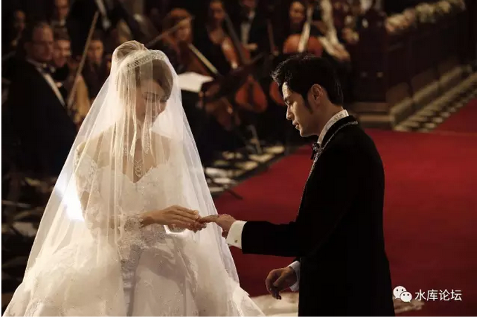
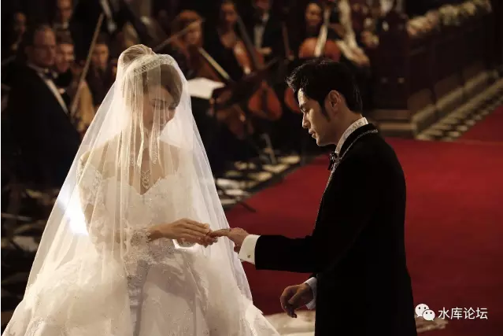
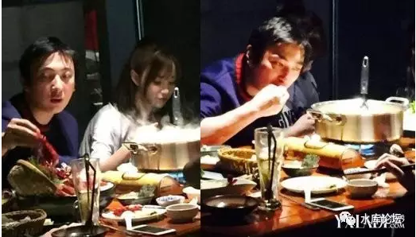
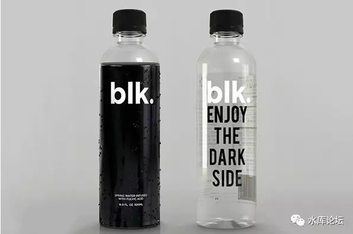
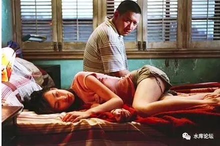
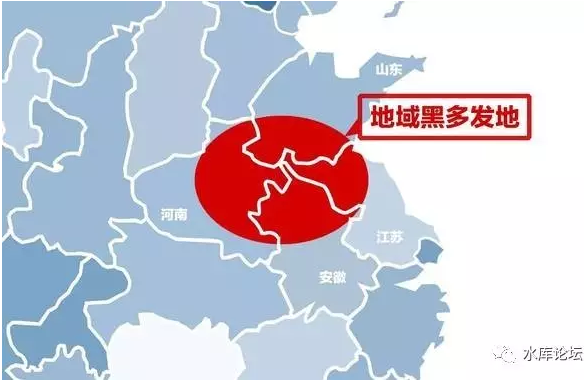

# 格调（上） \#F870

原创： yevon\_ou [水库论坛](/) 2017-02-11

格调（上） ~\#F870~

 

所有的生物，都在竭尽所能，以最高的效率活下去。

 

 

一）包厢

 

假设有一个人，晚餐开了一瓶红酒2700元。

抽的烟1000元/包。

加上吃饭和包厢，三人餐花了五六千元。

 

等到他回到家里，住的是40平米的老公房。

月收入不过八千一万。父母都是下岗工人，社会底层。

那么，他就有麻烦了。

 

（图片来源，你懂的）

 

你一顿饭吃掉了半个月的工资；

而你还有其他的"生活必需"需要开支。

 

譬如说，你要买房子么。

上海的房子那么贵，动辄五六百万。所有的人都在勒紧裤腰带存首付还月供。

譬如说，你要生孩子么。

要存养老金么。

要准备医疗开支么。

要应付通货膨胀么。

 

假设你在"开支"上疏忽大意，你就会遭遇麻烦。

会为你未来的买房，养老，生育，医疗等一系列的人生带来大麻烦。

 

 

所以呢，我们得出一个[简单之极]的结论：

月薪八千一万的人，不会一个晚上挥霍五六千。

 

 

 

二）小开

 

每一个生物活在这个星球，都在竭尽所能地活下去。

46亿年的竞争，残酷无比。每一个生物，都被压榨出了最后一份潜力。 

 

我们必须清楚地意识到，生存资源，对任何人都是非常紧迫的。

八千一万的小白领，仅能够刚刚维持温饱。

年薪50\~60W的高收入金领，在房价面前也被虐得不轻。

哪怕年赚500\~600W的钻石领，他们依然面临通货膨胀和社会阶层洗牌的威胁。

再往上，百亿级富豪，也要躲酒店。

 

"竞争，紧迫，钱不够用"导致的结果是什么呢。

结果是每一个人，都必须非常高效打他们手中的牌。

 

 

 

为什么会有上流社会，为什么会有奢侈品品牌。

-   上流社会，有上流社会的花钱模式。手法三观。

-   中产阶级，有中产阶级的花钱模式。手法三观。

-   下流社会，有下流社会的花钱模式。手法三观。

 

 

好比说，弄堂里的老奶奶。会把每一个收集到的废弃玻璃瓶，全部都堆积起来。直到把家里塞得满满当当。臃积不堪。

是她们的"品味"差么。不是的。

 

这是她们的"生存技巧"。

因为对于老奶奶来说，她们几乎没有其他的收入来源。收集废旧玻璃瓶是她唯一的外快。

老奶奶把废用品堆积如山，其实是一种生存策略。是物资和收入极度稀缺下的生存技巧。只有攒废物越多的老太，才能够活得下来。

和非洲森林里的蜗牛没什么二样。

 

而同样的年龄，对于上流社会的贵妇。就绝对不会如此处理。

贵妇会"断离舍"。

把房间收拾得干净宽敞有品味。

 

社会阶层决定品味。

假如你让一个贵妇破产，彻底没钱。不到十年，要不去死，要不她也会搜集玻璃瓶的。

 

 

 

再譬如说，中产阶级的一个很经典印记，是Coupon。

饭店吃饭之前，先查查优惠券。例如大众点评满100减12元。

某信用卡可以九折。

去吃康师傅牛肉面，每次都能从皮夹里掏出会员卡。

 

这些的行为，都是典型"中产阶级标签"。

因为你的时间不值钱。

如果你在吃饭前，花上5分钟研究一下优惠券，可以省下20元。何乐而不为呢。

 

 

同样的行为，在A8A9富人身上，就比较难以体现。

你想吃什么，直接走进去好了。

关键是吃得畅快爽意。

为了下午茶优惠，门口踱十五分钟等14:00开门，是愚不可及的行为。

 

 

 

三）社会阶层之判断

 

社会上大致90%的人，是严格按照"上流，中产，下流"的行为模式，来指导自己的人生的。

我们往往可以观察一个人的"格调、品味"，就可以判断他的社会阶级。

 

 

例如说，周杰伦和昆凌结婚之前，签了一份巨长的"婚前协议"。

对此哥哥的评价是："如果你35岁结婚后能赚的钱，是35岁之前的20倍。那你需要婚前协议何用"。

"只有事业走下坡路，未来收入可堪的过气歌星，才需要保护自己的婚前财富"。

 

（昆凌，被誉为最幸福的新娘）

 

 

再譬如说，巴菲特和你，都喜爱吃垃圾食品。

超级油腻的双层汉堡，食物本身是没有区别的。

 

但是，你见过在KFC点餐五分钟的妇女么。想砸死她的心都有。

如果一个人为了套餐，礼券，支付宝折扣踌躇再三。必属屌丝无疑。

  

 

 

王思聪爱吃火锅，人均也就一百多。

有时候中国人的阶层升得太快，喜好是没几十年改不过来的。

 

 

真正的奥秘，在他喝的矿泉水。财富出自于细节。

上次在新天地王思聪办公室拿了一瓶。如图。

矿泉水不是透明的，是黑色的。[\[1\]]

 

 

 

 

四）阶层之伪装

 

社会上90%的人口，是精确地按照自己的"阶层"在生活的。

-   上流就该有上流的生活，省事省力

-   中产就该有中产的生活，追求性价比

-   底层就该有底层的生活，省钱第一

 

 

但是，还有9%的人群，不采取如此规则。而是尽量使得自己的阶层，看起来"不同"。

主要是伪装得更高一阶。

 

我们必须清楚地划出重点：

伪装阶层，本身是不经济的！

 

你本来是一个中产阶级。可偏偏要伪装模仿上流社会的生活方式。

你本来是个月薪3000元/月的前台，偏偏省吃俭用买个LV包包。

你本来是个民工，卖肾去买一个iPhone7.

皆是乱阶。

 

 

为什么，为什么会这样。

因为你想想，人类社会的游戏规则，其实和动物世界生存竞争没什么二样。

如《二性关系梳理》~\#F770~一文所说的，有堂堂正正积累资源的。也有偷袭，匿生，伪装。

以正合，以奇胜。

 

 

通过伪装更高阶的生活方式，混入更高阶层的社交圈。获得利益，婚姻和金钱好处。

月薪菲薄的女前台，最喜欢买LV包包。

姿色平平的女白领，最喜欢化妆品涂到脖子。

 

我喜欢你\-\-\--为你洗了头吹了发型，喷了迪奥的香水用了ysl明彩笔口红，蜜粉也换成chanel用了nars还打了pk107，带了日抛隐形，为了见你还用了化妆品涂到脖子的这种高级礼节，我已经不是我了，这时候我是个会呼吸的人民币。

 

 

当她们以"这么高成本"出街的时候，干嘛去了。

当然是约会呀！

 

人在特殊的场景时刻，会刻意地伪装。使用远超于平时生活水准的配置。

女白领全身武装，去参加富二代的约会。

你的司机，家里穷揭不开锅了。每天同一身西装，浆得笔挺，准时上班。

有一些小老板，生意没做多少。一定要买辆豪车。

 

 

香港金像奖电影《伊莎贝拉》，杜汶择解释当年抛弃梁洛施母女时说；

"当年我们出来行，一定要戴一只大金表"。

"如果你没有金表，别人不是看不起你，是看不见你"。[\[2\]]

 

 

这些，都是强行拔高社会阶层的例子。   

 

 

 

五）伪装之后果

 

我们需要重点指出的是，"拔高"是非效率的。

 

你本身是中产阶级，非要模仿上流社会，或者中上阶级的生活，会对你生活造成非常大的支出负担。

 

你本身是月薪5000元的白领。非得象月薪50000一样生活，买她们穿的衣服，拿她们拎的包包。其代价，也只能餐餐泡面了。

 

总而言之，"伪装"是一种[无效率]的行为。全社会90%的人，依照效率最大化"本阶层"的生活方式活着。仅少数人口，伪装地活着。

 

 

 

《史记·高祖本纪》

单父人吕公善沛令，避仇从之客，因家沛焉。沛中豪桀吏闻令有重客，皆往贺。萧何为主吏，主进，令诸大夫曰："进不满千钱，坐之堂下。"高祖为亭长，素易诸吏，乃绐为谒曰"贺钱万"，实不持一钱。谒入，吕公大惊，起，迎之门。 

 

说吕公有一天摆宴，别人都送1000元的礼金。

刘邦双手空空地跑了过来，大喊一声"礼金一万"。

 

门卫们不敢怠慢。把他当VIP贵宾迎了进来。

坐上首席，大摇大摆骗吃骗喝。

 

吕公知道这件事情之后，反应也十分奇特。他不是生气发火，而是非得把自己期望[奇高]的女儿"吕雉"嫁给刘邦。就是后来的吕皇后。

 

  

这段故事的解释，其实是"豪杰气"。

当诈骗犯也是需要优秀人杰的。你这种废材你做得到么。

 

一分钱没带，敢大喝"礼金一万"面不改色。

这样的人，逢到了乱世，自然会脱颖而出。

和老实巴交的农民不一样。[\[3\]]

 

 

 

同样道理，虽然没有高祖的伟额。同样二个3000元月薪的女孩；

-   一个省吃俭用，和家乡来的农民工男友，尽快结婚。住出租屋。

-   一个放手一搏，买包包化妆品美瞳，争取嫁一个月薪三万的正式员工。或许失败。

 

 

同样二个月薪30000元的女白领；

-   一个女汉子存余额宝做理财，找个程序猿男朋友按部就班过一生。

-   一个ysl，chanel，狐狸精。争取嫁给月薪30W更高阶钻石领。或许失败。

 

 

以正合，以奇胜。

这二种人生态度，生活方式，哪一种更好更先进。

还真不好说。

 

 

（未完待续）

 

 

 

（yevon\_ou\@163.com，2017年2月11日午）

 

 

 

 

[\[1\]] 也不贵，大约40元/瓶。关键是一般人不知道。

[\[2\]] 他后来去抢银行，因而坐了好几年牢。

[\[3\]] 参考阅读，极佳的一篇文章《为什么总是河南、安徽、苏北人被歧视｜大象公会》http://mt.sohu.com/20161220/n476466408.shtml
