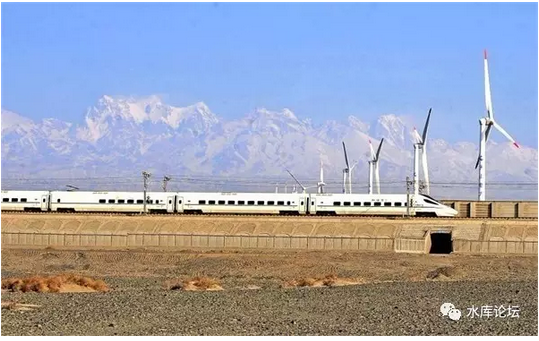
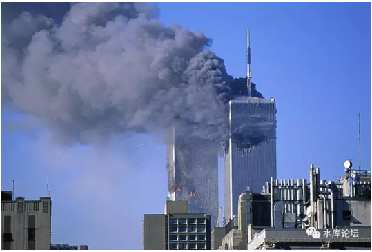
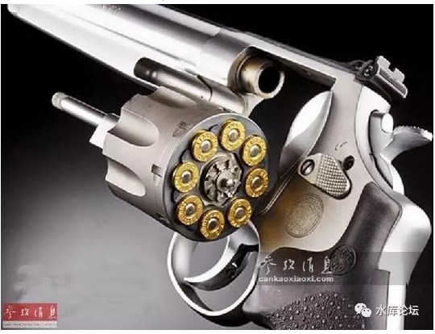

# 别让农民活着；

但也别让他们饿死。

\-\-\-\-\-- 德川家康AD1616

 

五百年后，竟见大神原训重现人间。怎不令人泪流满面。

 

 

一）缘由

 

昨天打《文明2》一直到晚上三点，早上睡得迷迷糊糊的。

本来想继续几回合，无意中刷知乎，看到一个帖子。

 

《看现代反游击作战的个人感受》~https://zhuanlan.zhihu.com/p/25184598~

《川普批准的也门军事行动杀死恐怖份子14人，却造成平民死亡30人以上，为什么他却说这次行动「大获成功」？》[\[1\]]

 

惊讶地差点从凳子上摔了下去。

赶紧存盘，存档。存了六七八个档。

这样的国之重宝《天书》居然也会闻名于世。

 

 

我紧接着再翻翻下面评论，果然不出所料。

评论之中，无非一些"看不懂""有点乱""答主是个流氓""好长"。

知乎是一个SB弱智的论坛。中国的"毒教育"大学文凭都是一些低素质的文盲。果不其然。

 

 

这样的文章，你翻遍网络，再也找不到第二篇。

往往要很长的时间，才会出世一篇。珠玉在前。

 

如我们在《[军事六篇](http://mp.weixin.qq.com/s?__biz=MzAxNTMxMTc0MA==&mid=2651015373&idx=1&sn=062c25d3b376c18dbd397686cea7dbe9&chksm=80721edeb70597c845b5da37935b2e4acba2c3411f5a205f5ce8f8d932206d8ed8d6488aba57&scene=21#wechat_redirect)》~\#F810~系列中说的，"军事"一科，是高度管制的。

网络上不乏军迷。但你所能找到的一切资料，当当上买得到"军事"科目下一切书籍。

无论"第三帝国兴亡史""太平洋战争史"，这些都是历史，不是军事。

 

 

真正的军事，是高度隔离的。对老百姓严格保密的。

终你一生，你不知道金融房地产是如何"剥削"百姓的。你也不知道"真正"的军事是怎么回事。

 

而这篇《看现代反游击作战的个人感受》，是真正的军事文。真正的干货。

且作者难得地秉承极端"马基雅弗利"立场，更是让人看得心旷神怡。

 

 

 

可是，一般人还是看不懂。

作者写得很晦涩。在专家内行里，宛如神启天书。短短8000个字，却是开启了一篇全新的大门。

"真经二三行"，有些事我本不明白。但你只要一启导，顿如明镜似的，大脑自动瞬间从8000字演化到200000字。

 

 

可是，一般的小白，没那个悟性。无字天书。

"看不懂""有点乱""好长"。

因此，就让俺写一个白话解释版。解释得清清楚楚。

 

 

 

二）恐怖

 

要解释这一系列的缘由，首先要从另一个帖子看起。

 

**【ZT】马平：没什么能防住恐怖主义，除了进攻 ****\[2\]**

 

这是马督公写的少有几篇有理有据，让人拍案叫绝的文章。

文中说，他坐在兰州到迪化的漫长铁路上。戈壁是如此地广袤，天地是如此地宽阔。

 

在这么大一个地理基数上，防止恐怖主义。

这是不可能的事！

 

"攻"永远比守容易。搞破坏永远比建设容易。

所以，面对咄咄逼人的恐怖主义。靠警察严防死守，地铁机场安检，这是行不通的。

 

 

你正确的做法，应该是象以色列总理梅厄学习。

谁是恐怖主义，我就杀你全家。

不仅仅杀你全家，而且要把你的上线，下线，领导和部下。学生和同伙，全部都连根拔掉。株连九族！

 

**没什么能防住恐怖主义，除了进攻**

 

 

 

当然，株连，连坐，推房子这种事[\[3\]]，显然十分地"政治不正确"。

现在人文政府，怎么还会有中世纪这种野蛮做法。

任何人都应该得到"公正的审判"。没有律师团几百万美金砸下去，判不了一件罪案。

 

只不过"恒纪元终结"。所谓的现代政府，人权和无辜，这些都是法国大革命的产物。

而我们正处于"反思法国大革命"的一个关键关头。现代国家形态这一切东西都有可能被推翻。

（民族国家，人权，平等，这一些可能是伪科学）

此为岔话，暂且不提。

 

 

 

言归正传。从广义的角度，来审视马督工这篇文章。

我的解释：我们的人类文明，目前正处于一个"恒纪元"。

甚至有可能是"恒纪元的巅峰"。

 

 

其具体的哲学表象，在于我们目前这个社会，需要极极高的"和平土壤"浓度。

就像水稻需要大量的水，人参需要大量的肥力[\[4\]]

目前的工业，农业，商业，都需要极浓的"和平土壤"。

 

我们目前几乎整个的人类社会，接近于"不设防"的。

一个巨大的电厂，保安队才多少人。100名精练的手持AK47恐怖分子，够不够炸毁主机。

 

哪怕炸不了你的核心车间。我锯断你几条管道。

搞一些泄露，爆炸，火光冲天应该不难。你几乎"不设防"。

 

 

 

我们目前的"恒纪元巅峰期"。和平的浓度极大丰富，而安保力量几乎为零。

如果真正到了乱世，到了"乱纪元"，情况会怎么样。

 

最好的图景，是Assimov在1970年代写的《心灵历史学家》。

《基地》系列，科幻史上无法跨越的巅峰。[\[5\]]

 

在"心灵历史学家"中，每一个电厂都有上千人的保安队。

警卫的人数，比工人还要多。

想要炸毁一个电厂，甚至比攻克一个城市更难。

 

 

毫无疑问，任何人都看出了"和平"的好处。尤其是极大浓度的和平。

在和平的状态下，3000人都可以是工人。

在"乱世"状态下，1000个工人，2000个保安。生产力遭遇极大破坏。

 

今天我们的生活水准，到了乱纪元，可能下降2/3都不止。

因为社会的大量资源，被用于了警察和防卫。

 

 

 

三）游击队

 

讲完了"和平"。我们再来看"游击队"。

 

游击队的真正力量，是使得社会无法进入"和平"的状态。

你哪怕只有一支1000人的武装。也可以搞得整个社会鸡犬不宁。

 

 

 

假设一下，在你生活的150KM半径之内，一个晚上的交通距离。有一支1000人的敌对武装。

山寨，马匪，游击队。

人数不需要很多。但你晚上睡得着觉么。

 

 

如果你是一个企业主，为了防止你昂贵的机器被砸坏，珍贵的产品被抢夺。

你肯定要招200人的保安队吧。

 

而这还仅仅是一个厂，一个镇，一个民团。

从全社会而言，这个"安保"支出要多少。只有千日做贼，哪有千日防贼。

 

 

针对飞机的恐怖袭击，全球平均每10年才有一起。

可是由于机场安检，浪费的人力，尤其是最重要"旅客的滞留"。按人力时间算全美每年500亿美刀。

 

911的恐怖袭击，美国直接损失不过千亿美金。

可是之后Bush成立国土资源部。美国防恐级别大大提高。之后十几年，在防控和"安检"上的开支，已经超过了13000亿。

过安检半小时真心恼火。 

 

这些例子告诉我们的是什么呢。

只要有细微的"恐怖"威胁。社会的和平指数就会大大降低。生产力极大受损。

富裕繁荣的文明社会本身，是经不得折腾的。

 

 

 

四）欧洲的游击队

 

人类历史上最NB的游击队，是二战时法国游击队。

他们是全球第一，也是唯一一家，游击队捣鼓出轻型坦克来的。

 

当然，二战法国的工业基础比较浓厚。

最关键的是，当时驻守南部法国的，是意大利占领军。

一个意大利人到法国来撩妹，是可忍孰不可忍。[\[6\]]

 

 

冷战时期的巴尔干游击队，区区几千人。

NATO不惜出动几十万的军队，战舰封锁海上，空军不间断巡航。耗资无数。

为什么，值得么。

 

因为欧洲要追求"彻底的和平"。

要求让这片土地上"绝对安全"。一支机枪都没有。

 

这样工商业才可以展开。

才可以在"高和平"水准下重建欧洲。

 

 

 

五）第三世界的游击队

 

欧洲大陆的战争较少。二战之后，主要的游击队和战乱。都发生在"非洲/中东"地区。

作者写的《反游击》作战，也是主要基于"非洲/中东"。

 

这二者有什么区别呢。最主要的区别是；

一个是人类

一个是猴子

 

 

在经过了正常的3000字论述之后，到了这一段，作者开始发了疯。

人肉磨盘三两三，来了一个大拐弯。

 

 

欧洲是精致的，是雅致的。欧洲都是自己人。

对于欧洲来说，哪怕砸坏了花花草草，也是令人惋惜的。

一支最精锐的部队，可以击溃神一般的敌军。可却是对"人民"下不了手。[\[7\]]

 

所以，当对待欧洲游击队时，NATO不惜以极大的代价。数十万人画地为牢。

一步步缩小包围圈。最终把游击队收网成擒。

在整个过程中，尽量避免伤及无辜群众。

 

 

而到了非洲，他们用的是对付猴子的办法。

以下内容，可能会触伤圣母婊的神经。请力脖儒，小清醒，小粉红，玻璃心，草莓婊，LGBTQIA份子自动离开本贴。

 

 

在非洲，他们用的是"对付猴子"的办法。

人是分内圈，外圈的。

孔子说"亲疏远近"，这是绝对的大道理。不随"普世博爱"圣母们YY影响。

 

欧洲人就是近支。就应该用"自己人"的方法，享受人的待遇。

而也门，越南，叙利亚是"远支"。享受的人权打三折，逼急了当猴子处理。

 

列强们对于第三世界，是彻彻底底的马基雅弗利主义。人权尚未普及。

 

 

 

很多人打过《文明》系列游戏。

在游戏中，假设我攻占一个印度人的城市，但是城市的位置很不理想。我想移开二格。

 

一个正常的做法，是不停地造"移民团"。譬如城市等级13，你就造13个移民团。慢慢搬家。

 

但是，更极端的做法。是"困城"。

你把城外所有的粮草全部都剥夺光。然后让他们挨饿。

印度人吃光粮仓储备后，就会开始饿死。从13人口，一直降到9，8......3，2，1

最后只剩一二个人口时，你造个移民团。就把城废弃掉了。

 

其中，第一种做法，是对"欧洲上等人"的。这是同胞。

第二种做法，是对付"猴子"的。

 

游击队的策略，是让你正常的生产和繁荣无法实现。

征服者在"非洲/中东"的策略，我[压根就不想]帮你发展生产。

 

 

六）猴子

 

在《看现代反游击作战的个人感受》一文中，作者提出了一个场景假设；

-   假设你是一个侵略者，要抢占一座城市。类似日本入侵中国。

-   或者你是一个侵略者，要扶植傀儡政权。类似日本入侵中国。

 

1937年，日本入侵中国。要怎样扶植傀儡政权，培养汉奸。

杀光游击队，让有血性的中国人都跪倒在皇日旗下？

 

我们坚定的相信，中国人民是不屈的，是英勇的，是爱国的。是民族主义的，是风起云涌的，汉奸是要统统杀光的。

游击队不断骚扰，被占领区无法展开生产。

 

 

 

日本人要怎么做？

按照今天正统的"西方圣母"说法，它应该采取"王道"。

 

具体的做法，围剿3000人的游击队，也要出动几十万大军。

先把交通线条框拦住。然后一层层往内收网。

 

每一个人，都经过精确的盘问。保证不会误伤无辜。

如果在行动过程中，炮火不小心震碎了居民的玻璃窗。司令官是要吃责罚的。

 

最后，每一个战犯，还要经过律师和公开的审判。

如果他说他心理有所受伤，神智不清。还要找专门的心理医生给罪犯辅导，收费500美元/小时。

 

可见，这样一场"文明"的流程走下来。没几万亿美金是办不完的。

平均每一个敌人，至少要消耗1亿美金。

 

 

 

而在《看现代反游击作战的个人感受》一文中，作者完全提出另外一套手法了。

"王霸之道"，不择手段的诡计之道。

 

战争，让女人走开。

圣母婊统统滚吧。这是帝国之间的国战。是生死拼命男人的事。

圣母，是人类的梅毒。

 

这是国战，国战，国战！

一切，等胜利之后再说。

为了胜利，不择手段。

 

 

 

首先，你不能让人民吃饱。

"别让农民活着"

"也别让他们饿死"

 

"王霸之道"就是邪恶，军事之道，就是邪恶。别和我讲什么大道理。这里只有马基雅弗利。

第一件事，不能让人民吃饱。

 

 

因为温饱思淫欲。（被占领区）人民为什么反你，因为你是侵略者，人民自然反你。

哪怕你让人民餐餐山珍海味，福利发到手软。人民照样反你。

 

"王霸之道"的做法。首先是"饿民"。

占领军的第一件事，先是炸水厂，然后炸食品工厂，或许还要炸电厂。

 

 

怎样控制一个人。

先把他打瘸了，再给他一副拐杖。

 

"饿民"有很多好处。

首先，"顺我者昌，逆我者忘"。只有紧密团结在"伪政府"周边投诚的人，才可以获得粮食药物。这就塑造了你的天然支持者。

 

其次，你必需把食物压缩到如此稀缺的地步。以至于"游击队"也拿不到食物。

和天底下所有的恐龙一样，游击队最终是饿死的。

1870年纵横山东的捻军，曾击毙僧格林沁。最终是被活活饿死的。

 

任何军事单位，都是一个"消耗大户"。

现代战争，平均一个人每天要消耗半吨补给。

游击队虽然是轻装武力，可是吃饭，弹药，燃料，一样是花花流水的。

 

 

"老百姓"是一定支持游击队的。

怎样让老百姓不给游击队送粮食。最佳的办法，是让老百姓也没有粮食。

通过极端残酷的办法，压迫老百姓的"食品，药物"。

 

军队基于人民。

杀游击队宛如"放疗"。

老百姓都快被饿晕了。癌细胞自然也被杀掉。

 

 

 

七）屠民

 

扶植傀儡政权的第二个步骤。是"杀人"。

如果你把人口分为"伪军，中立，游击队"三类。极端穆斯林不可怕，可怕的是温和穆斯林。

 

你必需把"温和派"杀光，极端派才没有土壤。

看到这一段的时候，哥哥从沙发上跌落下来。

赶紧存盘............

 

 

在文中，作者提出了一个"左轮手枪"转盘的方法。

中心，是伪傀儡政府。亲善份子需要保护。

周围一圈，八个孔膛。是中立分子。

外圈，游击队。

 

作者极度冷酷而又客观地说，"一格格杀过去"。

 
其具体的做法是，提供"人道主义援助"。

在周围一圈，城乡结合部乡镇，定期地发放"人道主义援助"。

 

这样你就可以吸引人口过来。

而人只要有了念想，一线生路。就不容易落草为寇。

 

但是，这些地方，基础设施被破坏得极其厉害。没有农业。往返交通也很远。

几乎就是一块"死地"。

如果你为了觅食。跑去这些"人道主义援助"发放点。你迟早会死于各种疾病和意外。

这是一种变相杀人。

 

 

作者极其冷静地提出了一个目标：50%

灭绝你50%的人口。

 

到最后，就是让"中立派"完全死光。

"伪军，中立，游击队"。几个月几年耗时到最后，只剩下首都圈一小撮伪政府。

和野外"野人"一般的躲藏者。

 

 

先有人民，后有物资，后有游击队。

你把人杀光了，游击队就失去了最根基的土壤。

好毒辣的计谋。

 

这段要顺着参考一：《川普批准的也门军事行动杀死恐怖份子14人，却造成平民死亡30人以上，为什么他却说这次行动「大获成功」？》一起看。领会会更深刻。

 

 

 

八）民心

 

中国网络文学最高峰，毫无疑问是《亵渎》。

亵渎，平定紫荆蝴蝶一章。

 

==\> 罗格用很不光彩的方式，打下来二块新的领地。

他先派了二个最贪污，最卑鄙的税官，去当行政官。大肆搜刮。

然后"英明的罗格大人"处死税官，用搜刮来的金银免除三年税赋。

民心大悦。

 

 

 

如何获得（被征服）人民的拥戴。

如何使得人民不支持游击队，而是支持你。

打断他的腿，再送他一副拐杖。

 

收服民心的第一件事，是破坏他们的生活水准。把他们推入万劫不复的悲惨地狱之中。

只不过现代文明很复杂。老百姓不一定知道谁是罪魁祸首。

 

例如说，作者再三推荐美军"轰炸自来水厂"。

并认为破坏供水网络。是效果最大，性价比最佳之举。

 

 

 

更深入的做法，其实有很多。

设立关口，限制某一些物质的入境。

人类的文明，依赖很多重要元素。最简单的，你只要限制石油，煤，药品的输入。

掐断任何一个大宗基础物资，整个地区的社群就会彻底奔溃。

人们还不知道是你干的。

 

把人民推入万劫不复的地狱。让他们没有水喝，没有粮食，天天生病死人。

直到时机成熟，你再去当"救世主"。

 

 

文中再三说到，"轰炸游击队控制的区域"，尽一切可能压低"敌占区"的生活水准。

然后你再以"王师"的面目出现。

想起了历史上，日本兵向来以派水果糖闻名。迄今内陆有很多人怀念"日本兵并不残暴"。令人叹息。

 

 

 

九）棋局

 

"人肉多少钱一碗"

"三块三"

 

 

伟大领袖Stalin告诉我们，"死一个人是一场悲剧"

"死1000000人是一个统计数据"。[\[8\]]

 

在真正的"马基雅弗利"世界里，凡事都是算计。

人命是算计。

国局也是算计。

 

美军最喜欢的是，扔下一大堆"美国饼干"，让记者们拍照。

三分钟后，放飞机过去投下灭绝燃烧弹。

 

 

我很累，不想深入探讨是非对错。

神启写下一个入口，你自己悟道吧。

 

 

\[注1\]：写了一半，咖啡稠度已高浓，不敢写了。

\[注2\]：有人问，\#F880不应该是《格调》（下）么。怎么红酒牛排写着改人肉排了。还有\#F820的《论马尔萨斯陷阱》拖稿填坑。

呸，哥哥高兴写哪篇，要你管。

 

 

（yevon\_ou\@163.com，2017年2月12日暮）[\[9\]]

 

 

 

 

[\[1\]]《看现代反游击作战的个人感受》https://zhuanlan.zhihu.com/p/25184598

《川普批准的也门军事行动杀死恐怖份子14人，却造成平民死亡30人以上，为什么他却说这次行动「大获成功」？》https://www.zhihu.com/question/55571623/answer/145604324

[\[2\]]《马前卒：没什么能防住恐怖主义，除了进攻》http://www.guancha.cn/MaPing/2014\_12\_10\_302927\_s.shtml

[\[3\]]以色列一般不杀妇女妇孺。对付恐怖份子规矩是，谁家出大胡子，就推倒你家房子，让你居无住所。妇孺们嚎哭的镜头有一阵子长期霸占西方电视机镜头。

[\[4\]]种植人参，对于土壤肥力的汲取是摧毁性的。一般只有毁林烧山，刚刚开辟出来的新田才可以种二三年人参。中国人在明代之前并不吃参，并视之为"妖草"。

[\[5\]] https://item.jd.com/11759614.html，《基地》系列一共有7本。只有《心灵历史学家》前后六篇是好看的。其他都是垃圾。可以不看。

[\[6\]]推荐阅读《"主战坦克度余生"这种说法靠谱吗？》https://www.zhihu.com/question/55239825/answer/143658236

[\[7\]]推荐阅读，极佳文章：王陶陶《暴民面前，军队为何不堪一击？》https://zhuanlan.zhihu.com/p/21633893

[\[8\]]小布什有一个笑话，"我们要杀死400万伊拉克人，和一个踩单车的"。

"为什么要杀踩单车的"。

"我就说吧，没有人关心400W伊拉克人"。

[\[9\]]凡是说m游击战的，就不要提了。那只是个笑料。
