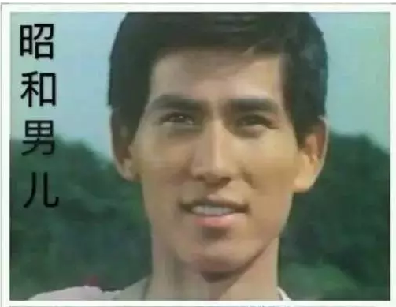
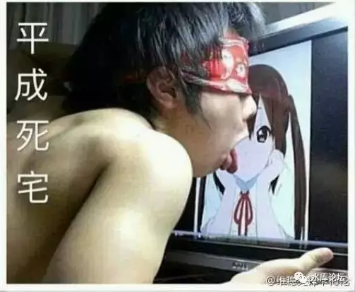
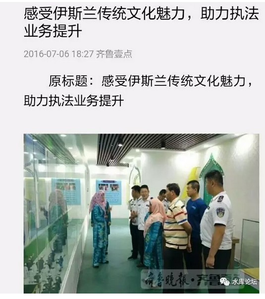
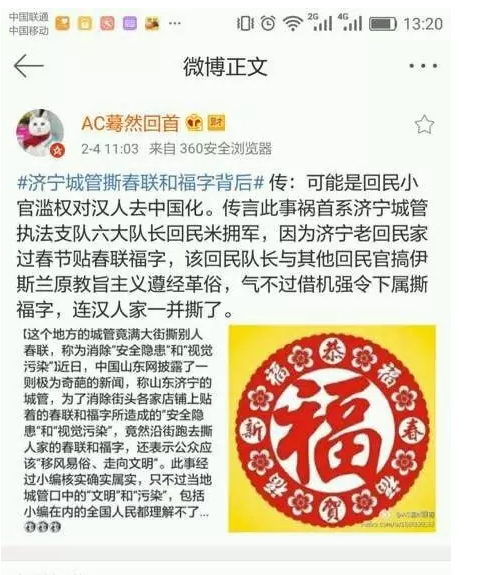
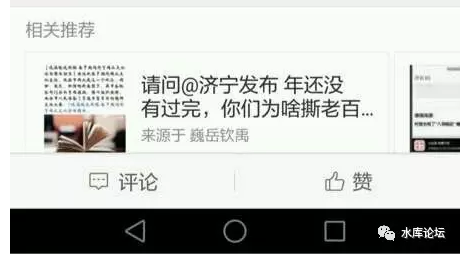
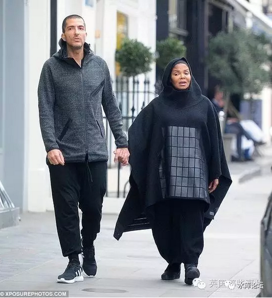

# 我们会信奉邪魔么 ~\#F900~

 

 

布尔费墨：他们矫枉过正，走向了献祭正义的另一个极端。这是今天白左思潮的根源。这种思想，使得他们看到杀人犯就泪流满面，而对被杀人犯杀死的遇害者悲痛的家属们，却视而不见。这也是一系列政治正确的思想根源。对他者与弱者的同情与爱，使他们也可以去神那里，去兑换天堂券。这是一种把同情置换成金钱和上帝做交易的，另一种献祭正义。------这一段说的好。白左的本质就是救赎，是一种深重的宗教情结。别看白左表面上反对基督教，实际上他们比右派还有宗教情结。我打算过一阵子写文章讲讲这件事。

 

在美国人看来，中国这种完全非基督教文明的国家，如果有一天比美国还伟大，那么这种历史后果，对于美国人的献祭正义来说，就是非正义的。而美国人，如果能遏制了这种异质性的文明崛起，再次维护了他们神的颜面和尊严，那么，他们也就可以向他们的神，献祭的更多。他们认为，他们才是正义的。------完全就是这样的。美国的对外干预和侵略本质上是基督教圣战。

 

美国行为的根源

http://weibo.com/ttarticle/p/show?id=2309404077204232341716

 

 

前二天在"慕道社"私聊，布老师讲到了"白左"心理的本质。深以为然。

 

行家一出手，大师一句话。翻译成白话文，往往就可以写一整本书。

今天我们有闲，详细展开论述一下。

 

 

 

一）狂热

 

这二天的新闻，金正男88年中年妇女，香港7名警察因殴打而入狱[\[1\]]。领结叔被收监。潘基文退出韩国大选。[\[2\]]

 

当然，香港韩国还算好的。真正的大灾难，发生在台湾。

有一篇台湾文章，一定要看：

 

《台湾大学生在薪水低至22k新台币情况下，为何一周休一天都成问题？台湾如何从宝岛沦为低薪鬼岛的？》

https://www.zhihu.com/question/50561872/answer/121808112

 

台湾正在闹蚊革！

台湾正在闹蚊革！

台湾正在闹蚊革！

重要的事情讲三遍。

 

所谓"失去的十年"，以蔡英纹上台为契机，台湾正走入[万劫不复]的深渊。国家沦丧，社会动荡。人民沸腾。

台湾死了。

 

 

这些事情的背后呢。是一群极端的狂热分子。例如这一位。

 

还有这一位：

 

 

虽然她们的人品和风骨都一塌糊涂，而且也只值10万台币。[\[3\]]

但是，并不妨碍她们大红。

被一大群人，捧为"精神喇叭"。

 

 

这样的一股思潮，通常称之为"民主"青年。

官方对何韵诗的评论是，"她能够站出来，说明她代表的思潮，代表的看法，已经是[一大批人]。蔚为潮流"。

单反一个"何韵诗"是没用的。

 

 

好了，那我们的麻烦，是不是何韵诗，蔡英纹，热那娅之流呢。

头痛医头，民主的涌动，是否从民主根上医治呢。

 

 

 

二）历史

 

我们要给出的评语，照例是四个字：

以上全错

 

 

香港台湾，可以说没有任何一个人是追求"民主"的。

一个也没有。

 

对于南棒，或许还有几个棒槌被忽悠得"真信"。拿了汽油往身上浇。

台湾这种滑头，连"绝食"都只有24小时。[\[4\]]

 

 

 

有人说，怎么可能。你看见那些哭红的眼睛么。

你看见学生的呼喊，那滔天的口号，那一波又一波汹涌的民意。

无数仁人义士抛头颅，洒热血。难道你说他们都是假的。

 

对的，都是假的。假的不能再假。

台湾专员嘲笑说，凡是反"服贸"的，绝大多数并没有看过服贸条款。

对于自由贸易理论一无所知。

 

香港"港灿"追求民主的，绝大多数不知道罗伯特议事原则，对"Arrow不可能定理"一无所知。[\[5\]]

台湾人还停留在大陆吃茶叶蛋，没电视机。香港人还停留在"英国先进"的错误时代。

 

那么，他们到底在喊什么。

 

 

 

我们写微信公众号，常常有人问"干货"。恨不得学二手"不传之秘"，转手就发大财。

马前卒笑谑说，"你的一生中，能接触到最干的干货。单位字数含金量最高的，是你的初中数理化课本"。

 

-   你想象一下，牛顿三大定律，F=ma

-   燃烧是靠氧气，而不是燃素。元素周期表。

-   三角函数，二元二次方程。

这些东西，拿到14世纪去，绝对就可以推动人类文明进程。形成一个大帝国啊。

 

 

呵呵，如果说"初中数理化"是你能够接触的"低价"干货中，干得不能再干的宝藏。

那么，高阶"干货"是什么。

 

"高阶干货"也是免费的。

它的名字叫"历史"。但不是你在课堂中读的历史。而是"真历史"。

 

 

 

历史是真正的"屠龙之术"，帝王之学。

凡是居高位的，没有不治史的。

 

"数理化，文史哲"历史这种绝对冷门的偏门学科，历史老师在社会上，向来以穷得揭不开锅为名。

100万个学历史的，999999都是穷的。

 

 

历史是真正的"宰辅之学"。象野球拳一样。

一级，二级，三级，四级，象渣一样，一点用处都没有。

 

无论你是当科长，处长，局长，厅长，"历史"学得好，对你一点帮助都没有。

等你当了部长呢，还是一点帮助都没有。

 

进了国家管理层，25个国务委员了。"历史"有一点用处，也才一点点。

"历史"真正学得好，要当你进了Board，成为1/7.

 

 

"历史"是给共和国[最顶层]的几个人看的。

几个人，决定了军国的命运。

象野球拳，1234567级都是渣。可是"野球拳"练到了10级，就是绝世神功。

 

"历史"要有用，至少得是宰辅，仆射的位置。

越高越好，越往上越有用。

或King's hand，班农这样的角色。[\[6\]]

 

 

 

扯得远了。老年人真是嗑叨。

让我们回归话题。2017年发生的这些事，放在历史上，则一点都不稀奇。

 

我们回顾50年前，1970年代发生的事。

1968年，法国发生"五月风暴"。学生们冲击校园。要求以"毛泽东思想"治理国家。

1969年，美国发生"嬉皮士"事件。喇叭裤嗑药大麻变成主流文化。

1971年，日本赤军成立。

1967年，香港炸弹事件。

1966\~1976年，中国文ge.

 

这些事的主线轴呢："社会主义"。

只不过学校没教这段历史。

 

 

如果说"内政动荡"，还仅仅是一些发达国家关起门不流血的事。

而在亚非拉，南美和非洲地区，则是赤裸裸的"民族独立""改朝换代"。

 

 

1943年，庇隆在阿根廷上台。他信奉苏联，一心一意在阿根廷推行"社会主义改造"。不到30年时间，阿根廷成为全球唯一一个"发达国家跌入发展中国家"的范例。[\[7\]]

 

1951年，卡斯特罗获得古巴。从此以后，古巴录得人类历史上最长期的衰退。平均每年增长负-1.2%，而这个数字持续了六十年。

古巴一跃从一个类似于南非的，拉丁美洲第一富国，沦为全球倒数第十穷国。

 

1958年，委内瑞拉新选总统。哎呀呀，这个国家实在太有名，就不用我再多重述一次了。

 

（因为价格管制，委内瑞拉几乎什么也买不到。图为消费者抢光空空如也的超市）

 

 

这些事情的共同点是什么呢。

哭着喊着，要求实行计划经济！

 

 

你没看错，1970年的法国青年人，日本青年人，美国青年人。

巴西，墨西哥，阿根廷，委内瑞拉，刚果，乌干达，坦桑尼亚，埃塞俄比亚，津巴布韦............从南到北，全世界的"青年运动"此起彼伏。

要求实行苏联的制度。

 

 

听着是不是很好笑。今天如果你让人学1990年的苏联，肯定会被人耻笑。觉得你脑子有毛病。

但是当年，事实就是这样的。

 

年轻人的"奋斗""上街"一波接着一波。头上缠着布条。腥红了眼睛可以跟你缠斗三天三夜。

 

但是他们的诉求，绝对不是"民主"。

而是要反民主。反美国。美式生产关系全部都是错的。

全心全意学苏联的那一套。

 

 

 

好了，我们把时针再往前拨50年。回到1920年代。

1920年代，全世界的"风潮"是什么。历史真是件再有趣不过的事了。

在1920年，全世界的流行是"学德国"。

 

很多人都知道土耳其的国父"凯末尔"。

但有几个人深入了解一下，凯末尔的崛起，以及"德意志青年团"的故事。

 

 

当时，在整个"西亚病夫"奥斯曼帝国内部，"救亡图存"的气氛也是非常非常浓厚的。

学习的方向呢，毫无疑问是德国。

 

从服装，到军训，到组织，甚至到个人谈吐。

土耳其的青年们发疯一样地模仿德国，学德文，留德式胡子。

这群人"德意志青年团"，构成了一战前后土耳其诸次政权转折的关键。

 

 

"德意志"的粉丝，可不止凯末尔国父一名。

比凯末尔更死忠粉的，当然是党卫军常校长。

 

抗战之前，国军最重要的主力，就是三四个德械师。"黄金十年"砸了血本拼凑出的。

而国军几乎整套征兵，训练，作战指挥体系，全是靠德国军事顾问建立起来的。

 

 

再往前，不要说校长。袁世凯"小站练兵"就是全盘Copy德国编制。

德国人怎么走正步，我们也怎么走正步。

 

中国人都知道，有一首军歌《三大纪律八项注意》

经历过"军训"的中国学生，甚至还有一大半还能哼唱。

 

这首歌的旋律，和袁世凯的"小镇练兵歌"是完全一样的。

只不过经历了重新填词。原文是"大清万岁，皇恩浩荡"。

 

再往前，这旋律就是德皇威廉二世的"威廉练兵歌"。始创于1890年。

原文是德文的。俺就不会哼唱了。

 

所以整个1920年，是一个"向德国看"，向德国学习的年代。

 

 

 

我们把时针再往前拨50年，来到1870年代。

1853年黑船访问日本。日本迅速开化。

到了1864年，已经打倒幕府政权。日本开始"明治维新"。

 

当时，在"明治三杰"面前。他们面临二个任务；

1）打造新日本

2）打造新日本人

 

 

 

但是"开化"这种事，可是一代伟人才干得了的。

上下五千年，无比崇敬邓小平。

当日本人站在1870年的关口，他们自然没有邓公这样的伟略。

 

日本人采取了一个再"笨"不过的办法。

-   全盘西化

-   除了一件事外，彻底的西化

 

 

什么叫全盘西化，就是"体，用，术"彻底都西化。要学就学100%

从制度，器物，文化，全部都彻底100%西化。[\[8\]]

 

当1840年鸦片战争之后，中国接触西方文明，其实要比日本还早几十年。

但是中国不肯"全盘西化"。

因为中国是一个大国，是一个文明，是世界中心。

 

中国要搞"中学为体，西学为用"。

试图把西方哲学，控制在"洋枪利炮"的范围。而对中国本身的阶层和制度不予触动。

因此中国在"转型"中特别迟缓慢，浪费了足足100年的时间。直到1979年后才迈上工业化正轨。

近代打不过日本。

 

 

日本人的西化做到了什么程度呢。

日本传统的服装是"和服"，武士们则是宽袍大袖的武士装。

 

最迟到1870年，短短几年的工夫。日本的报纸上"绅士们"穿的衣服，就全部都是西装了。戴着和英国人一模一样的海狸礼帽。

 

"服装"本身是小道。是最不重要的事情。[\[9\]]

可是日本人既然无法分辨"体，用，术"；

不知道哪些该学，哪些不该学。干脆就通盘全抄，学100%象。[\[10\]]

 

 

 

我们讲一个真实的故事。记录在《钢铁，枪炮和细菌》上。

"英日"同盟确立后，1895年，日本皇太子访问英国。[\[11\]]

 

英国人十分高兴。便让自己的王子接待。

二个王子一起玩，那能玩什么呢。便说好了去逛街。

 

英国王子带着日本皇太子，去了Harrods百货。

英王和外交大臣坐着，听流水阶传回来的回报。

 

 

"报......英国皇子买了8件西装"。

"报......日本皇子什么也没买，也买了8件西装"。

"报告.........日本皇子买的8件西装，和英国皇子是同一款式的"。

"报告.........日本皇子买的8件西装，和英国皇子是同一款式的，同一尺码的"。

 

 

这个并不是笑话！

这是历史上真实发生的事。

 

日本太子陪英国皇子去逛街，英国人买8件西装，他也买8件西装。

英国人买什么款式，他也买什么款式。

英国人买什么尺码，他也买什么尺码。

 

 

拜托，大正天皇的身高只有166cm。

人家鬼佬什么身高，你凑啥热闹。

 

但是这不重要。

关键是日本人的态度。

-   英国人为什么强大，因为他们做得好。

-   他们做得好，我就抄他们。

-   谁知道"穿西装"有什么秘密，万一有用呢。

-   谁知道"西装尺码"有什么奥秘，万一有用呢。

 

 

 

三）力量

 

我们花费了漫长的4000字，来讲这样一个故事。

 

-   1870年学英国

-   1920年学德国

-   1970年学苏联

-   2017年学美国

 

我们想要讲述的，难道是"英国制度"的优越性么。还是德国制度的优越性。

别开玩笑了。

 

我们真正模仿的，是最强的那个国家！

 

世界文明的竞赛，宛如一场永不落幕的长跑。

你追我赶。"跑落后者"的惩罚，是非常非常严重的。

动辄被人屠杀当成虫子。看"抗战片"日本鬼子烧杀掳掠，任何中国人都熊熊怒火。

 

而你不想落后，你就需要改革。要奋发图强。

改革怎么该，变法怎么学。

当然是向最强的那个学习。

 

 

在任何一个时代，世界上最强大的一个国家。[\[12\]]

该国家是如何组织的，政体是如何运转的。

那就是"灯塔国"。

 

当各国青年嘴上喊着"民主，人权，平等"。其实他们既不信奉民主，也不信奉平等，更不信奉人权。

他们真正信奉的，是美国。

 

 

2017年，美国是地球上最强大的国家。所以美国就是样板。

学美国，抄美国，而且[要比美国更美国]。

 

你不是说美国的强大是因为"民主"么。

那我就要"比民主更民主"。搞更纯净的民主，搞更极端的民主。这样我才能"赶超"。[\[13\]]

 

 

用"强大"才能解释历史上的谜团。

-   1870年，英国是全世界最强大的国家。日本人绝不会抄辫子服。

-   1920年，德国是全世界最强大的工业国，欧洲霸主。

-   1970年，苏联在全世界都采取"进攻"态势。共产主义旭日初升。

 

 

因为苏联显得"强大"而"悍然"。所以他才成为诸多国家的模板。

亚非拉国家成立，70%学习的是苏联政体。选美国阵营的不到20%

 

但是，1980年之后，苏联的内政遭遇很大困难。阿富汗泥足深陷。

国内的民众穷苦，轻工业短缺。排长龙。

苏联在国际地位，也由扩张转为收缩。

 

 

一下子，苏联"招牌"的吸引力大减。

再也看不见风起云涌的"学生"运动，要求学习苏联模式。

亚非拉的独栽者们，也纷纷表示"民主"才是大义的名分。

 

其实什么叫"大义"，地球人根本不相信大义。地球人只相信强大。

 

 

 

四）结语

 

话说新疆有一个叫库尔班的阿訇，当上了济宁城管大队副队长。

这个副队长干的第一件事，就是带领一帮人，去老百姓家门口撕春联。

 

去汉人家门口撕春联

美其名曰：破除不良文化习俗！

 

 

 

任何一个邪教，他的手法一定是相同的。

你要吸引"会员"入会，你要生长和膨胀。

 

靠什么，靠"宣传"教义么，靠传播神的仁慈和伟大么。

别开玩笑了。从来没有人真正关心你的"教义"是什么。

 

任何一个黑社会要长大，首先要秀你的拳头。

秀你的强大，秀你的牛逼，跟着老大有饭吃。

 

 

 

任何一个黑社会崛起于街头，他真正要干的，是去踢翻你的虾篓。

派几个小弟，扛着木棍。从街头走到街尾，再从街尾走到街头。

踢倒几个摊贩，掀翻几个饭台。挥舞着木棒，吓到女人哭。

 

这样做的目的，不是为了讹诈你的钱财。其实也不求财。

他主要是显示"组织"的强大。

组织要凝聚，首在于忠诚。而忠诚直接[等同于]强大。

有奔头的事业，才能凝聚人心。

 

 

伊斯兰为什么要实行HALAL法。

今天撕你春联，明天不许你吃猪肉，后来不许你信佛教。

HALAL法也是一点点循序渐进的。

"防微杜渐"从撕春联开始。

 

因为任何一个"违法"的行为，其实都在显示着邪教的"肌肉"。

他今天撕你春联，你无法反抗。

明天科隆大教堂，1200名德国妇女被集体强奸。德国人也没什么反抗。

 

这是最好的宣传。

违法而不受惩罚，彰显了组织的特权。自然就可以吸引信徒们源源不断的加入。而且特别忠心。

 

 

 

整个1970年代，美国为"共产主义"运动焦头烂额。亚非拉此起彼伏，压也压不下去。

伊朗，越南，南美，一连串的外交失败。使得让人怀疑USSR不可战胜。

 

可是到了1980年代之后，"苏维埃的旗帜"一夜之间倒塌。

不击自溃。

 

为什么，因为大家觉得苏联不再咄咄逼人了，采取守势了。小弟们站队顿时一夜之间该换门厅。

"信仰"比翻书还快。

 

 

珍妮·杰克逊曾经是表现得最"激烈"的基督教徒。她不仅仅信基督教，而且践行的是强调苦修的基本教义派Jehovah's
Witnesses（耶和华见证人）。[\[14\]]

可就是这样一个人，一夜之间转变成了穆斯林。而且还是穿黑袍的。

其实不难理解。原理都是相通的。最虔诚的人最容易背叛。

 

 

同样道理，今天欧美觉得伊斯兰气势如虹，步步紧逼。

荷兰天主教濒临崩溃，教堂空空无人。而伊斯兰教徒增长迅猛。

 

其实都是你自己给惯的。

是你让伊斯兰秀出了肌肉，在德国境内横行枉法，也不用坐监狱。

大家一看，"这个组织有奔头"。

实力是最好的广告。

 

 

你连续逮着阿訇，无差别的枪毙几万个。

你看看还有没有人信伊斯兰教。

会激起的不是愤怒，而是屈服。

 

 

（上篇完）

 

 

写到这里，全部都是引子。其实正文的话题，布老师说的："基督教和伊斯兰的同源性"根本还没展开。

突然发现已经可以独立成篇了。那也就先发吧。下篇可写可不写，视咖啡。

 

 

（yevon\_ou\@163.com，2017年2月27日晚）

 

 

 

 

 

[\[1\]]视频在这里：http://www.miaopai.com/show/2VKuWXgYxBpNJHrpBYISnQ\_\_.htm

我对这个视频的评语是："罚酒三杯"。

因为打人这种事，分"真打"和"假打"。用力和挥拳的姿势完全不一样。真打是真的往死里打。

视频中，固然是打人。但还是算"阶级朋友"的打法。揍揍小流氓而已。

这种程度算犯罪的话，中国基层公安局。每天至少发生2000万起。

你难道没有接触过基层，知道中国流氓进号子是怎样流程么。

[\[2\]]《如何看待潘基文宣布不竞选下届韩国总统？》https://www.zhihu.com/question/55294614/answer/144109599

[\[3\]]《台湾反服贸走红女星被曝高价援交(组图)》http://news.sina.com.cn/c/2014-12-10/162031269636.shtml

[\[4\]]《反军购联盟绝食24小时：军购将使台湾走上不归路》http://news.xinhuanet.com/taiwan/2004-11/09/content\_2193763.htm

[\[5\]]《论Arrow不可能性定理》http://www.shuiku.net/forum.php?mod=viewthread&tid=31437

[\[6\]] 微信公众号："保守主义评论"有Steve
Bannon的系列分析。太晦涩了，不推荐。

[\[7\]]《南美洲避开了两次世界大战，为什么现在没有发达国家？》https://www.zhihu.com/question/24573379/answer/28323577

[\[8\]]有选择性的"西化"，必须深入到"体"。从最基本的角度，把"工业革命"全部拆散。拆出工业化的奥秘。

然后在"体"的基础上，逐步上推，按照中国特色，走出一条中国特色的道路。

这是一项巨大的工程，集百年智慧也未完工。1870年日本根本不可能有如此人文思想资源。

[\[9\]]服装在某些意义上，也是有意义的。譬如"宽袍大袖"往往适合热带区域。穿的人比较懒散，也不适合工业活动。而"窄服紧袖"是典型的精干型服装。

拉链取代纽扣，源于英国军队在印度驻军时，要求半夜里急速醒来。用最快的速度穿好衣服，投入夜袭。

[\[10\]]中国刚刚开始造原子弹时，要砍树。砍树用的斧子，要专门从苏联进口过来，白桦木斧柄。很贵，浪费宝贵的外汇，还要等很长的供货时间。

可是中国人不敢改，战战兢兢地保持100%抄袭。谁知道有什么玄机呢。

N年后终于问苏联专家，砍树为何还有专用斧子。专家回答说："无他，手感好"。

[\[11\]]我这人老毛病，年份记不清。

[\[12\]]一般70%学No.1，还有20%因为基础条件差异太大历史渊源文化，会选择学习No.2，而No.3几乎就没人学了。

[\[13\]]因此红色高棉杀人比斯大林还多。

[\[14\]]《从性感天后到伊斯兰罩袍，珍妮杰克逊竟成了这样》http://news.163.com/16/1103/10/C4ULIJ22000181N1.html
