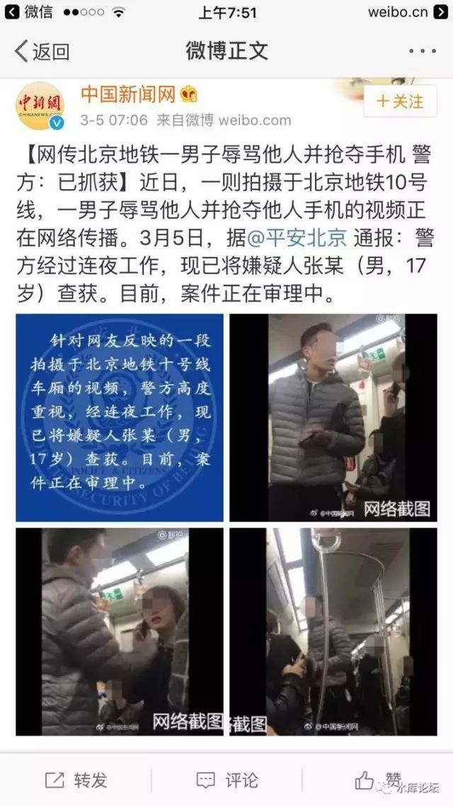

# 谁是罪犯圣母婊 \#F910

原创： yevon\_ou [水库论坛](/) 2017-03-05

好了，我们先看一段新闻；

 谁是罪犯圣母婊 ~\#F910~
========================

 

 

完整的视频链接，可以参阅这个：https://v.qq.com/x/page/b0381lo6579.html

 

 

听说执法部门迅速出动，抓捕罪犯。我们感到十分高兴。

可是遗憾的是，二位犯罪嫌疑人迄今仍未落网。正义仍未得到伸张。

 

犯罪嫌疑人，哪二位？

当然是那二位女士咯。

 

？？那么，犯的什么罪名呢。

-   流氓罪

-   寻衅滋事罪

按照中华人民共和国刑法，可以处7年以下有期徒刑。

 

 

 

分析这整件事件，我们首先要搞清楚，谁是"进攻方"。

我好好地在地铁上看手机，刷微信。是你二个女人，主动过来骚扰男性小伙。

 

打断你看手机的好心情，干扰你看连续剧的宁静。

来干什么呢，"推销关注二维码"。

 

对于整个社会"秩序"来说，毫无疑问该二个女士，是破坏的一方。

其情节之恶劣，和入室盗窃并没有二样。

 

 

 

而面对犯罪分子（嫌疑人）的骚扰，该无辜男性同胞并没有警察援助。

也就是说，在案发现场，属于警察缺位的状态。他是没有法律援助的。

因此他只能自卫。

 

 

该男性同胞义正言辞地提出了自己的主张"离我远一点"。

"圣母婊闭嘴"。

"烦死了"。

 

显然，这是一个绝对正当而且应当的理由。

按照自由主义的原则，"每一个人都有不受打扰"的权力。地铁乞讨，实在扰民。

 

 

 

令人遗憾的是，该二位人品卑劣的犯罪（嫌疑人），没有受过良好的道德教育。素质十分低下。

当别人指出她们的行为不妥之时，毫无羞耻怜悯之心，反而变本加厉，加倍骚扰男性当事人。使得他根本无法安静看欣赏连续剧。

 

 

在警察缺位的情况下，男性同胞进行了自卫，并且没收了罪犯（嫌疑人）的犯罪工具。

我们必须指出的是，在这个事件中，男性同胞并没有贪图财物的事实和意愿。

 

他最后是把手机塞在衣帽里，一起还给中年女子的。

他既没有吞没手机的行为，也没有吞没手机的意图。

因此他是完全无辜的。

 

 

在这整个事件中，男性同胞处于彻底无辜自卫的状态。

他原本宁静的"个人"空间被强行插入，打扰。

二位罪犯（嫌疑人）对她进行了长达2:22的卑劣骚扰。

 

最后他行使他的合法权力，要求"地铁骚扰者"退出民用运输领域。还乘客们一个清白。

请注意，这一段行为是有法可依的。

 

2015.5.1开始实行的《北京市轨道交通运营安全条例》明文规定：

北京地铁禁止乞讨，卖艺，发传单等行为。

 

各位同胞，当你发现地铁中有乞讨，推销小广告之类行为。

请第一时间将她们推出车厢，不要污染公共空间。

爱护公益，从你我做起。

 

 

 

另一方面，如果我们关注这二位女性罪犯（嫌疑人）的话，显然她们犯了十分严重的罪行。

首先，是流氓罪，性骚扰，诬告罪。

 

我和你非亲非故，我在地铁上看手机，你凭什么骚扰我。

为了钱。

 

而且骚扰的程度十分严重，长达2:22秒。无论如何呵斥，都死死纠缠不放。

各位，难道你希望你的人生中，也有二个丑陋中年妇女纠缠么。

 

 

作为民事关系判断，最基本的原则"进攻\-\--自卫"。

毫无疑问，该二个女子是犯罪方。侵犯了中国公民的自由权力。

 

 

其次，第二条罪行，是"寻衅滋事罪"。

地铁国之重器，公共场合。国家法律明文规定，不得用于乞讨，卖艺，派发小广告。

 

该女子堂而皇之地进行违法行为，事后又大肆传播。造成的影响极坏。

应予严惩。

 

 

建议判处女性犯罪（嫌疑人）七年以下有期徒刑。

 

 

 

（yevon\_ou\@163.com，2017年3月5日晨）
